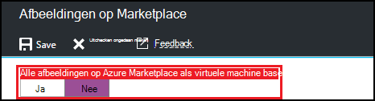
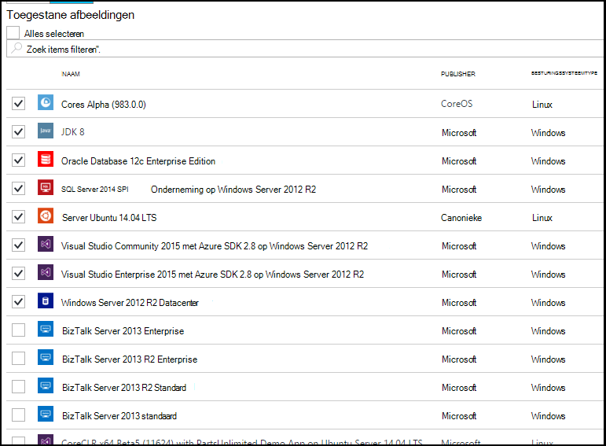

<properties
    pageTitle="Azure Marketplace-afbeelding-instellingen configureren in Azure DevTest Labs | Microsoft Azure"
    description="Welke Azure Marketplace-afbeeldingen kunnen worden gebruikt bij het maken van een VM in Azure DevTest Labs configureren"
    services="devtest-lab,virtual-machines"
    documentationCenter="na"
    authors="tomarcher"
    manager="douge"
    editor=""/>

<tags
    ms.service="devtest-lab"
    ms.workload="na"
    ms.tgt_pltfrm="na"
    ms.devlang="na"
    ms.topic="article"
    ms.date="09/06/2016"
    ms.author="tarcher"/>

# Azure Marketplace-afbeelding-instellingen configureren in Azure DevTest Labs

DevTest Labs ondersteunt maken VMs op basis van Azure Marketplace afbeeldingen, afhankelijk van hoe u afbeeldingen op Marketplace Azure hebt geconfigureerd in uw testomgeving. Dit artikel ziet u hoe u kunt aangeven welke eventuele Azure Marketplace kan worden gebruikt bij het maken van VMs in een testomgeving.

## Selecteren welke afbeeldingen Azure Marketplace zijn toegestaan bij het maken van een VM

1. Log in om de [Azure portal](http://go.microsoft.com/fwlink/p/?LinkID=525040).

1. Selecteer **Meer Services**en **DevTest Labs** selecteert in de lijst.

1. Selecteer in de lijst van labs, de gewenste lab. 

1. Selecteer de **configuratie**op van het lab-blade.
    
1. Selecteer op het lab **configuratie** blade, **afbeeldingen op Marketplace**

1. Geef op of de gekwalificeerde Azure Marketplace afbeeldingen beschikbaar zijn voor gebruik als basis van een nieuwe VM. Als u **Ja**selecteert, worden alle afbeeldingen Azure Marketplace die voldoen aan de volgende criteria toegestaan in het lab:

    - De afbeelding wordt gemaakt van een enkele VM, **en**
    - De afbeelding gebruikt Azure Resource Manager aan voorziening VMs, **en**
    - De afbeelding nodig niet een plan voor extra licenties kopen
    
    Als u geen afbeeldingen moet worden toegestaan, of u wilt opgeven welke afbeeldingen kunnen worden gebruikt, selecteert u **Nee**.
 
    
 
1. Als u **Nee** met de vorige stap selecteert, is het selectievakje **Toegestaan afbeeldingen/Alles selecteren** ingeschakeld. Gebruik deze optie samen met het zoekvak om snel te selecteren of hef de selectie van alle items in de lijst weergegeven.
U kunt ook de Azure Marketplace afbeeldingen die u wilt toestaan voor het maken van VM afzonderlijk door te controleren van elke afbeelding in de bijbehorende checkbox selecteren.
Selecteer niets in de lijst als u niet wilt dat alle afbeeldingen Marketplace Azure worden gebruikt in een testomgeving.

    

[AZURE.INCLUDE [devtest-lab-try-it-out](../../includes/devtest-lab-try-it-out.md)]

## Volgende stappen

Wanneer u de hoe afbeeldingen op Marketplace Azure zijn toegestaan bij het maken van een VM hebt geconfigureerd, wordt de volgende stap [een VM met uw lab](./devtest-lab-add-vm-with-artifacts.md).