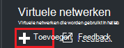
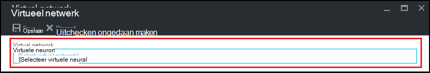
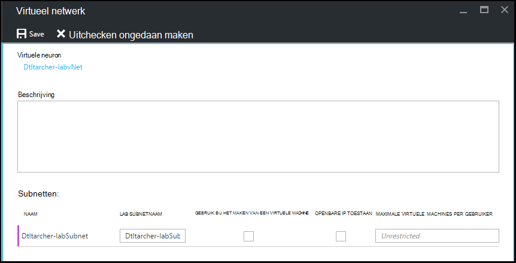

<properties
    pageTitle="Configureren van een virtueel netwerk in Azure DevTest Labs | Microsoft Azure"
    description="Informatie over het configureren van een bestaande virtuele netwerk en subnet en deze gebruiken in een VM met Azure DevTest Labs"
    services="devtest-lab,virtual-machines"
    documentationCenter="na"
    authors="tomarcher"
    manager="douge"
    editor=""/>

<tags
    ms.service="devtest-lab"
    ms.workload="na"
    ms.tgt_pltfrm="na"
    ms.devlang="na"
    ms.topic="article"
    ms.date="09/06/2016"
    ms.author="tarcher"/>

# Configureren van een virtueel netwerk in Azure DevTest Labs

Zoals uiteengezet in artikel [toevoegen een VM met artefacten naar een lab](devtest-lab-add-vm-with-artifacts.md), bij het maken van een VM in een testomgeving, kunt u een geconfigureerde virtuele netwerk. Eén scenario om dit te doen is als u toegang wilt tot uw corpnet resources uit de VMs met behulp van het virtuele netwerk die is geconfigureerd met ExpressRoute of site naar site VPN. In de volgende secties illustreren hoe u uw bestaande virtuele netwerk in een lab van virtueel netwerk instellingen toevoegen, zodat deze beschikbaar is om te kiezen bij het maken van VMs.

## Een virtueel netwerk configureren voor een testomgeving met behulp van de portal Azure
De volgende stappen doorlopen u een bestaande virtuele netwerk (en subnet) met een lab toevoegen zodat deze kan worden gebruikt bij het maken van een VM in het lab hetzelfde. 

1. Log in om de [Azure portal](http://go.microsoft.com/fwlink/p/?LinkID=525040).

1. Selecteer **Meer Services**en **DevTest Labs** selecteert in de lijst.

1. Selecteer in de lijst van labs, de gewenste lab. 

1. Selecteer de **configuratie**op van het lab-blade.

1. Selecteer op het lab van **configuratie** blade, **virtuele netwerken**.

1. In de blade **virtuele netwerken** ziet u een lijst met virtuele netwerken zijn geconfigureerd voor de huidige lab als de standaard virtuele netwerk die is gemaakt voor uw testomgeving. 

1. **+ Toevoegen**selecteert.

    
    
1. Op de blade **virtuele netwerk** selecteren **[virtueel netwerk]**.

    
    
1. Selecteer de gewenste virtuele netwerk op de bladeserver **virtueel netwerk kiezen** . Het blad bevat de virtuele netwerken die onder hetzelfde gebied in het abonnement op het lab.  

1. Na het selecteren van een virtueel netwerk, gaat u terug naar de blade **virtuele netwerk** en verschillende velden zijn ingeschakeld.  

    

1. Geef een beschrijving op voor het virtuele netwerk / lab combinatie.

1. Als u een subnet worden gebruikt in een lab VM maken, selecteer **Gebruik IN virtuele MACHINE maken**.

1. Als u openbare IP-adressen in een subnet, selecteert u **Openbare IP toestaan**.

1. Geef in het veld **Maximale virtuele MACHINES PER gebruiker** het maximum VMs per gebruiker voor elk subnet. Als u een onbeperkt aantal VMs, laat u dit veld leeg.

1. Selecteer **Opslaan**.

1. Nu dat het virtuele netwerk is geconfigureerd, kunnen worden geselecteerd bij het maken van een VM. Raadpleeg het artikel, [een VM met artefacten naar een lab toevoegen](devtest-lab-add-vm-with-artifacts.md)om te zien hoe een VM maken en geef een virtueel netwerk. 

[AZURE.INCLUDE [devtest-lab-try-it-out](../../includes/devtest-lab-try-it-out.md)]

## Volgende stappen

Nadat u de gewenste virtuele netwerk hebt toegevoegd aan uw testomgeving, wordt de volgende stap [een VM met uw lab](devtest-lab-add-vm-with-artifacts.md).