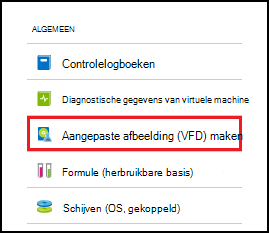

<properties
    pageTitle="Aangepaste installatiekopieën maken van VMs Azure DevTest Labs | Microsoft Azure"
    description="Informatie over het maken van een aangepaste installatiekopie van een VHD-bestand of vanuit een bestaande VM in Azure DevTest Labs"
    services="devtest-lab,virtual-machines"
    documentationCenter="na"
    authors="tomarcher"
    manager="douge"
    editor=""/>

<tags
    ms.service="devtest-lab"
    ms.workload="na"
    ms.tgt_pltfrm="na"
    ms.devlang="na"
    ms.topic="article"
    ms.date="09/07/2016"
    ms.author="tarcher"/>

# Beheren van aangepaste installatiekopieën maken van VMs Azure DevTest Labs

In Azure DevTest Labs kunnen aangepaste afbeeldingen u snel VMs maken zonder te wachten totdat de vereiste software worden geïnstalleerd op de doelcomputer. Aangepaste afbeeldingen kunnen u de software die u nodig hebt in het VHD-bestand vooraf te installeren en gebruiken voor het VHD-bestand een VM. Omdat de software al is geïnstalleerd, wordt het tijdstip van de VM werkt veel sneller. Aangepaste afbeeldingen worden bovendien gebruikt VMs door een aangepaste afbeelding maken vanuit een VM en vervolgens VMs maken die aangepaste afbeelding klonen.

In dit artikel leert u hoe:

- [Een aangepaste installatiekopie van een VHD-bestand maken](#create-a-custom-image-from-a-vhd-file) dat u vervolgens een VM uit die aangepaste afbeelding kunt maken. 
- [Een aangepaste installatiekopie van een VM maken](#create-a-custom-image-from-a-vm) voor snelle VM klonen.

## Een aangepaste afbeelding maken van een VHD-bestand

In dit gedeelte ziet u hoe u een aangepaste afbeelding maken van een VHD-bestand.
U moet een geldige VHD-bestand voor het uitvoeren van alle stappen in deze sectie.   

1. Log in om de [Azure portal](http://go.microsoft.com/fwlink/p/?LinkID=525040).

1. Selecteer **meer services**en **DevTest Labs** selecteert in de lijst.

1. Selecteer in de lijst van labs, de gewenste lab.  

1. Selecteer de **configuratie**op van het lab-blade. 

1. Selecteer **aangepaste afbeeldingen**op de bladeserver lab- **configuratie** .

1. Selecteer op het blad **aangepaste afbeeldingen** **+ aangepaste afbeelding**.

    

1. Voer de naam van de aangepaste afbeelding. Deze naam wordt weergegeven in de lijst met afbeeldingen basis bij het maken van een VM.

1. Voer een omschrijving van de afbeelding aangepast. Deze beschrijving wordt weergegeven in de lijst met afbeeldingen basis bij het maken van een VM.

1. Selecteer de **VHD-bestand**.

1. Als u toegang tot een VHD-bestand dat niet wordt vermeld hebt, toe te voegen door de instructies in de sectie [een VHD-bestand uploaden](#upload-a-vhd-file) en terugkeren wanneer u klaar bent.

1. Selecteer de gewenste VHD-bestand.

1. Selecteer **OK** om de bladeserver **VHD-bestand** sluiten.

1. Selecteer de **configuratie van het besturingssysteem**.

1. Selecteer op het tabblad **Configuratie van het besturingssysteem** **Windows** of **Linux**.

1. Als **Windows** is ingeschakeld, geeft u via het selectievakje of *Sysprep* is uitgevoerd op de computer.

1. Selecteer **OK** om de **Configuratie van het besturingssysteem** blade sluiten.

1. Klik op **OK** om de aangepaste afbeelding te maken.

1. Ga naar de [Volgende stappen](#next-steps) .

###Een VHD-bestand uploaden

Als u een aangepaste afbeelding toevoegen, moet u toegang hebben tot een VHD-bestand.

1. Selecteer op de bladeserver **VHD-bestand** **uploaden van een VHD-bestand met PowerShell**.

    

1. Instructies voor het wijzigen en een VHD-bestand kunnen naar uw abonnement Azure uploaden PowerShell script uitvoeren weergegeven het volgende blad. 
**Opmerking:** Dit proces is afhankelijk van de grootte van het VHD-bestand en de snelheid van uw lange.

## Een aangepaste afbeelding maken vanuit een VM
Als u een VM die al is geconfigureerd hebt, kunt u een aangepaste afbeelding maken vanuit deze VM en daarna die aangepaste afbeelding gebruiken voor het maken van andere identieke VMs. De volgende stappen illustreren hoe u een aangepaste afbeelding maken vanuit een VM:

1. Log in om de [Azure portal](http://go.microsoft.com/fwlink/p/?LinkID=525040).

1. Selecteer **meer services**en **DevTest Labs** selecteert in de lijst.

1. Selecteer in de lijst van labs, de gewenste lab.  

1. Selecteer **de virtuele machines**op van het lab-blade.
 
1. Selecteer de VM waarvan u wilt dat de aangepaste afbeelding maken op de bladeserver **Mijn virtuele machines** .

1. Selecteer **aangepaste afbeelding maken (VHD)**op van de VM-blade.

    

1. Voer een naam en beschrijving voor de aangepaste installatiekopie op de bladeserver **afbeelding maken** . Deze informatie wordt weergegeven in de lijst met databases bij het maken van een VM.

    

1. Selecteer of sysprep is uitgevoerd op de VM. Als u de sysprep is niet uitgevoerd op de VM, aangeven of u sysprep uitvoeren wanneer een VM is gemaakt op basis van deze aangepaste afbeelding.

1. Selecteer **OK** als u klaar bent om de aangepaste afbeelding te maken.

[AZURE.INCLUDE [devtest-lab-try-it-out](../../includes/devtest-lab-try-it-out.md)]

## Verwante blogberichten

- [Aangepaste afbeeldingen of formules?](https://blogs.msdn.microsoft.com/devtestlab/2016/04/06/custom-images-or-formulas/)
- [Aangepaste afbeeldingen tussen Azure DevTest Labs kopiëren](http://www.visualstudiogeeks.com/blog/DevOps/How-To-Move-CustomImages-VHD-Between-AzureDevTestLabs#copying-custom-images-between-azure-devtest-labs)

##Volgende stappen

Toegevoegd een aangepaste afbeelding voor gebruik bij het maken van een VM, is de volgende stap om toe te [voegen een VM met uw lab](./devtest-lab-add-vm-with-artifacts.md).