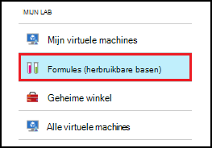
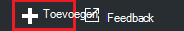
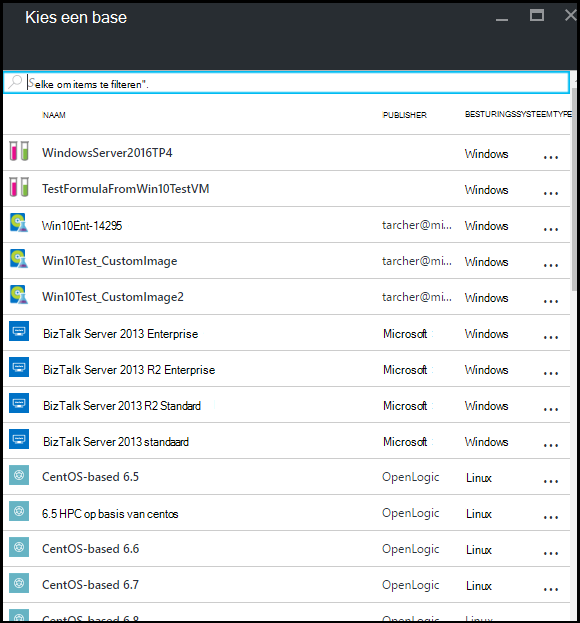
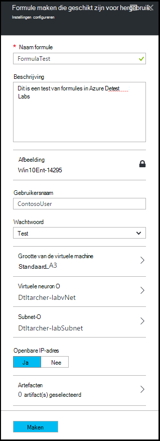
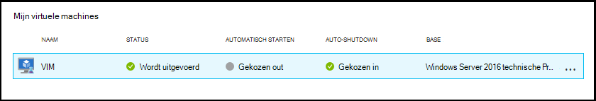
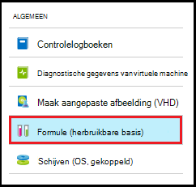
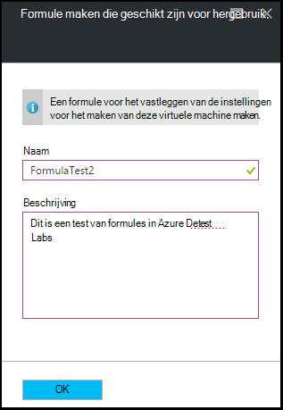
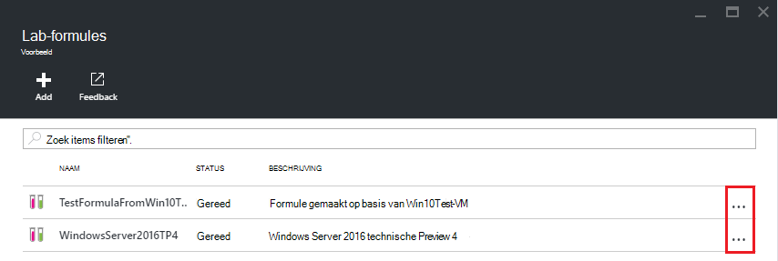
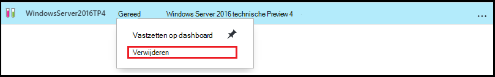

<properties
    pageTitle="Beheren van formules in Azure DevTest Labs VMs maken | Microsoft Azure"
    description="Informatie over het maken, bijwerken, Azure DevTest Labs formules verwijderen en nieuwe VMs maken."
    services="devtest-lab,virtual-machines"
    documentationCenter="na"
    authors="tomarcher"
    manager="douge"
    editor=""/>

<tags
    ms.service="devtest-lab"
    ms.workload="na"
    ms.tgt_pltfrm="na"
    ms.devlang="na"
    ms.topic="article"
    ms.date="08/30/2016"
    ms.author="tarcher"/>

# DevTest Labs formules voor het maken van VMs beheren

Een formule in Azure DevTest Labs is een lijst van de eigenschap standaardwaarden gebruikt voor het maken van een virtuele machine (VM). Wanneer een formule een VM maken, kunnen de standaardwaarden worden gebruikt als-is of gewijzigd. Formules bieden net als [aangepaste afbeeldingen](./devtest-lab-create-template.md) en [afbeeldingen op Marketplace](./devtest-lab-configure-marketplace-images.md), een mechanisme voor snelle VM inrichten.  

In dit artikel leert u hoe u de volgende taken uitvoeren:

- [Een formule maken](#create-a-formula)
- [Een formule gebruiken om in te stellen een VM](#use-a-formula-to-provision-a-vm)
- [Een formule wijzigen](#modify-a-formula)
- [Een formule verwijderen](#delete-a-formula)

> [AZURE.NOTE] Formules - zoals [aangepaste images](./devtest-lab-create-template.md) - kunnen u een afbeelding maken van een VHD-bestand. De afbeelding kan vervolgens worden gebruikt voor het inrichten van een nieuwe VM. Om te bepalen welke geschikt is voor uw specifieke omgeving, verwijzen naar het artikel, [Comparing aangepaste afbeeldingen en formules in de DevTest Labs](./devtest-lab-comparing-vm-base-image-types.md).

## Een formule maken
Iedereen met DevTest Labs *gebruikers* machtigingen kan maken met een formule als basis VMs. Er zijn twee manieren om formules te maken: 

- Gebruik van een basis - als u wilt definiëren de kenmerken van de formule.
- Vanuit een bestaande lab VM - gebruik wanneer u een formule maken op basis van instellingen van een bestaande VM.

### Een formule maken van een basis
De volgende stappen begeleiden u bij het proces van het maken van een formule van een aangepaste installatiekopie, Marketplace-afbeelding of een andere formule.

1. Log in om de [Azure portal](http://go.microsoft.com/fwlink/p/?LinkID=525040).

1. Selecteer **Meer Services**en **DevTest Labs** selecteert in de lijst.

1. Selecteer in de lijst van labs, de gewenste lab.  

1. Selecteer op van het lab-blade **formules (herbruikbare basen)**.

    

1. Selecteer op het blad **Lab formules** **+ toevoegen**.

    

1. Selecteer op het blad **kiezen een base** de base (aangepaste afbeelding, Marketplace-afbeelding of een formule) waaruit u de formule wilt.

    

1. Geef de volgende waarden op het blad **formule maken** :

    - **Naam formule** - Voer een naam voor de formule. Deze waarde verschijnt in de lijst met afbeeldingen basis bij het maken van een VM. De naam wordt gevalideerd terwijl u typt en de vereisten voor een geldige naam geeft aan een bericht als niet geldig.
    - **Beschrijving** - Voer een beschrijving voor de formule. Deze waarde is beschikbaar in het contextmenu van de formule als u een VM maakt.
    - **Gebruikersnaam** - Voer een naam van de gebruiker die administrator-bevoegdheden worden toegekend.
    - **Wachtwoord** - Voer - of Selecteer in de vervolgkeuzelijst - een waarde die is gekoppeld aan het geheim (wachtwoord) dat u wilt gebruiken voor de opgegeven gebruiker.  
    - **Image** - dit veld bevat de naam van de geselecteerde afbeelding op het vorige blad. 
    - **Grootte van de virtuele machine** - Selecteer een van de vooraf gedefinieerde items die de processorcores, RAM-geheugen en de grootte van de vaste schijf van de VM te maken.
    - **Virtueel netwerk** - Geef de gewenste virtuele netwerk.
    - **Subnet** - het gewenste subnet opgeven.
    - **Openbare IP-adres** - als het lab-beleid is ingesteld op het openbare IP-adressen voor het geselecteerde subnet toestaan, geef aan of u het IP-adres als public door **Ja** of **Nee**te selecteren. Anders is deze optie uitgeschakeld en geselecteerd als **Nee**.
    - **Artefacten** - selecteren en configureren van de onderdelen die u wilt toevoegen aan de installatiekopie. Veilige string-waarden niet met de formule opgeslagen worden. Artefact-parameters die beveiligd tekenreeksen zijn worden niet weergegeven. 

        

1. Selecteer **maken** om de formule te maken.

### Een formule maken in een VM
De volgende stappen begeleiden u bij het proces van het maken van een formule op basis van een bestaande VM. 

> [AZURE.NOTE] Als u een formule maken in een VM, moet VM zijn gemaakt na 30 maart 2016. 

1. Log in om de [Azure portal](http://go.microsoft.com/fwlink/p/?LinkID=525040).

1. Selecteer **Meer Services**en **DevTest Labs** selecteert in de lijst.

1. Selecteer in de lijst van labs, de gewenste lab.  

1. Selecteer op het lab van **Overzicht** blade, VM waaruit u de formule wilt.

    

1. Selecteer **formule (herbruikbare basis)**op van de VM-blade.

    

1. Voer een **naam** en een **Beschrijving** voor de nieuwe formule op de bladeserver **formule maken** .

    

1. Klik op **OK** om de formule te maken.

## Een formule gebruiken om in te stellen een VM
Als u een formule hebt gemaakt, kunt u een VM op basis van die formule. De sectie [toevoegen een VM met artefacten](devtest-lab-add-vm-with-artifacts.md#add-a-vm-with-artifacts) begeleidt u bij het proces.

## Een formule wijzigen
U kunt een formule wijzigen, als volgt te werk:

1. Log in om de [Azure portal](http://go.microsoft.com/fwlink/p/?LinkID=525040).

1. Selecteer **Meer Services**en **DevTest Labs** selecteert in de lijst.

1. Selecteer in de lijst van labs, de gewenste lab.  

1. Selecteer op van het lab-blade **formules (herbruikbare basen)**.

    

1. Selecteer de formule die u wilt wijzigen op de bladeserver **Lab formules** .

1. Breng de gewenste wijzigingen op de bladeserver **formule bijwerken** en selecteer **Update**.

## Een formule verwijderen 
Als u een formule verwijdert, wilt u deze stappen volgen:

1. Log in om de [Azure portal](http://go.microsoft.com/fwlink/p/?LinkID=525040).

1. Selecteer **Meer Services**en **DevTest Labs** selecteert in de lijst.

1. Selecteer in de lijst van labs, de gewenste lab.  

1. Selecteer **formules**op het blad lab- **Instellingen** .

    

1. Selecteer de drie puntjes rechts van de formule die u wilt verwijderen op het blad **Lab formules** .

    

1. In het contextmenu van de formule, selecteert u **verwijderen**.

    

1. Selecteer **Ja** in het dialoogvenster voor bevestigen van verwijderen.

[AZURE.INCLUDE [devtest-lab-try-it-out](../../includes/devtest-lab-try-it-out.md)]

## Verwante blogberichten

- [Aangepaste afbeeldingen of formules?](https://blogs.msdn.microsoft.com/devtestlab/2016/04/06/custom-images-or-formulas/)

## Volgende stappen
Nadat u een formule voor gebruik gemaakt hebt bij het maken van een VM, is de volgende stap om toe te [voegen een VM met uw lab](./devtest-lab-add-vm-with-artifacts.md).