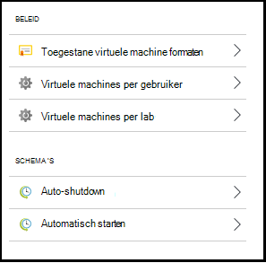
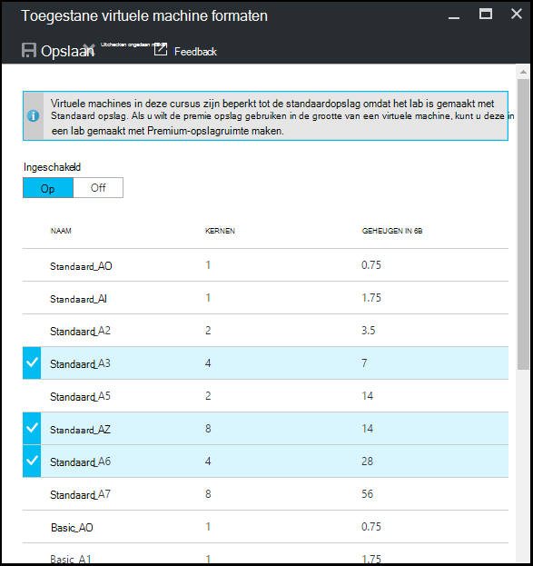
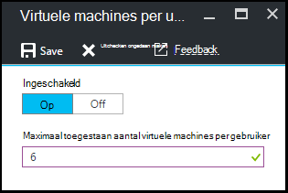
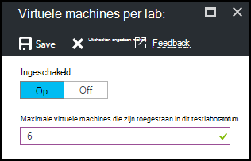
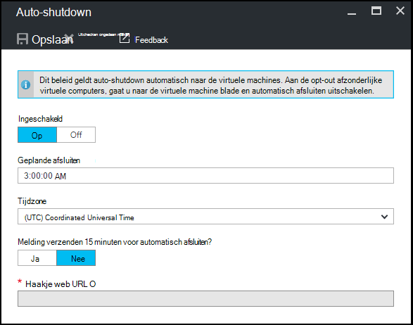
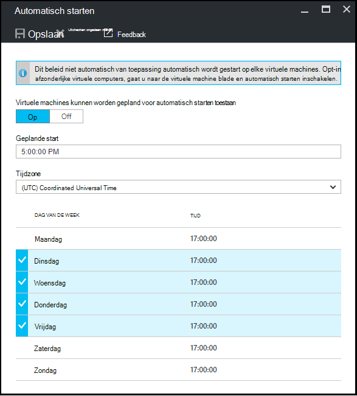

<properties
    pageTitle="Lab-beleid definiëren in Azure DevTest Labs | Microsoft Azure"
    description="Informatie over het definiëren van beleid zoals VM grootte, maximale VMs per gebruiker en automatisering afsluiten lab."
    services="devtest-lab,virtual-machines"
    documentationCenter="na"
    authors="tomarcher"
    manager="douge"
    editor=""/>

<tags
    ms.service="devtest-lab"
    ms.workload="na"
    ms.tgt_pltfrm="na"
    ms.devlang="na"
    ms.topic="article"
    ms.date="09/12/2016"
    ms.author="tarcher"/>

# Lab-beleid definiëren in Azure DevTest Labs

> [AZURE.VIDEO how-to-set-vm-policies-in-a-devtest-lab]

Azure DevTest Labs kunt u beleid voor sleutels die u helpen bij het bepalen van de kosten en het minimaliseren van afval in de labs. Deze beleidsregels lab omvatten het maximum aantal VMs per gebruiker en per lab en verschillende opties voor automatisch afsluiten en start automatisch gemaakt. 

## Toegang tot een lab van beleid in Azure DevTest Labs

De volgende stappen begeleiden u bij het instellen van beleid voor een lab in Azure DevTest Labs:

Als u wilt weergeven (en wijzigen) op het beleid voor een lab, volg deze stappen:

1. Log in om de [Azure portal](http://go.microsoft.com/fwlink/p/?LinkID=525040).

1. Selecteer **meer services**en **DevTest Labs** selecteert in de lijst.

1. Selecteer in de lijst van labs, de gewenste lab.   

1. Selecteer **Instellingen voor Groepsbeleid**.

1. De blade **beleidsinstellingen** bevat een menu met instellingen die u kunt opgeven: 

    

    Voor meer informatie over het instellen van een beleid, selecteert u deze in de volgende lijst:

    - [Grootte van de virtuele machine toegestaan](#set-allowed-virtual-machine-sizes) - Selecteer de lijst met formaten VM toegestaan in het lab. Een gebruiker kan maken van VMs alleen uit deze lijst.

    - [Virtuele machines per gebruiker](#set-virtual-machines-per-user) - VMs die kunnen worden gemaakt door een gebruiker het maximum aantal opgeven. 

    - [Virtuele machines per lab](#set-virtual-machines-per-lab) - Geef het maximum aantal VMs die kunnen worden gemaakt voor een lab. 

    - [Auto shutdown](#set-auto-shutdown) - Geef de tijd waarop de huidige lab van VMs automatisch wordt afgesloten.

    - [Automatisch starten](#set-auto-start) - Geef de tijd waarop het lab VMs automatisch opgestart.

## Set toegestane grootte van de virtuele machine

Het beleid voor het instellen van de grootte van de toegestane VM helpt lab afval minimaliseren doordat u kunt opgeven welke VM formaten zijn toegestaan in het lab. Als dit beleid is ingeschakeld, kunnen alleen VM formaten in deze lijst worden gebruikt voor het maken van VMs.

1. Selecteer op het lab van **beleidsinstellingen** blade, **toegestaan virtuele machines formaten**.

    
 
1. Selecteer **in** dit beleid inschakelen en **uit** te schakelen.

1. Als u dit beleid inschakelt, selecteert u een of meer VM-formaten die kunnen worden gemaakt in uw testomgeving.

1. Selecteer **Opslaan**.

## Virtuele machines instellen per gebruiker

Het beleid voor **virtuele machines per gebruiker** kunt u het maximum aantal VMs die kunnen worden gemaakt door een individuele gebruiker opgeven. Als een gebruiker probeert een VM maken wanneer de gebruikerslimiet is bereikt, wordt er een foutbericht aangeeft dat de VM kan niet worden gemaakt. 

1. Selecteer op het lab van **beleidsinstellingen** blade, **virtuele machines per gebruiker**.

    

1. Selecteer **in** dit beleid inschakelen en **uit** te schakelen.

1. Als u dit beleid inschakelt, voert u een numerieke waarde die aangeeft hoeveel VMs die kunnen worden gemaakt door een gebruiker. Als u een nummer dat niet geldig is invoeren, wordt het maximumaantal voor dit veld is toegestaan in de gebruikersinterface weergegeven.

1. Selecteer **Opslaan**.

## Set virtuele machines per lab

Het beleid voor **virtuele machines per lab** kunt u opgeven hoeveel VMs die kunnen worden gemaakt voor de huidige lab. Als een gebruiker probeert een VM maken wanneer de lab-limiet is bereikt, wordt er een foutbericht aangeeft dat de VM kan niet worden gemaakt. 

1. Selecteer op het lab van **beleidsinstellingen** blade, **virtuele machines per lab**.

    

1. Selecteer **in** dit beleid inschakelen en **uit** te schakelen.

1. Als u dit beleid inschakelt, voert u een numerieke waarde die aangeeft hoeveel VMs die kunnen worden gemaakt voor de huidige lab. Als u een nummer dat niet geldig is invoeren, wordt het maximumaantal voor dit veld is toegestaan in de gebruikersinterface weergegeven.

1. Selecteer **Opslaan**.

## Set auto-shutdown

De auto-shutdown-beleid helpt lab afval minimaliseren door te geven wanneer het VMs van deze cursus afgesloten.

1. Selecteer op het lab van **beleidsinstellingen** blade, **Auto-shutdown**.

    

1. Selecteer **in** dit beleid inschakelen en **uit** te schakelen.

1. Als u dit beleid inschakelt, geeft u de lokale tijd alle VMs in de huidige lab afsluiten.

1. Selecteer **Opslaan**.

1. Eenmaal is ingeschakeld, geldt dit beleid voor alle VMs in de huidige lab. Als deze instelling uit een specifieke VM verwijderen, openen van de VM blade en wijzigt de instelling **Auto-shutdown** 

## Automatisch starten instellen

Het beleid automatisch wordt gestart, kunt u opgeven wanneer het VMs in de huidige lab moeten worden gestart.  

1. Selecteer op het lab van **beleidsinstellingen** blade, **automatisch wordt gestart**.

    

1. Selecteer **in** dit beleid inschakelen en **uit** te schakelen.

1. Als u dit beleid inschakelt, geeft u de lokale geplande start tijd en de dagen van de week waarop de tijd van toepassing is. 

1. Selecteer **Opslaan**.

1. Eenmaal is ingeschakeld, wordt dit beleid niet automatisch toegepast op alle VMs in de huidige lab. Als deze instelling voor een specifieke VM geldt, van de VM blade opent en wijzigt de instelling voor **automatisch starten** 

[AZURE.INCLUDE [devtest-lab-try-it-out](../../includes/devtest-lab-try-it-out.md)]

## Volgende stappen

Nadat u hebt gedefinieerd en de verschillende VM beleidsinstellingen toegepast voor uw lab, zijn hier volgende proberen:

- [Kostenbeheer configureren](./devtest-lab-configure-cost-management.md) - ziet u hoe u de grafiek **Maandelijkse Trend van de geschatte kosten**  
Als u wilt weergeven van de huidige maand de geschatte kosten tot heden en de geraamde kosten voor einde van de maand.
- [Aangepaste afbeelding maken](./devtest-lab-create-template.md) - bij het maken van een VM, u een basis die een aangepaste afbeelding of een afbeelding Marketplace kan zijn. In dit artikel ziet u hoe u een aangepaste afbeelding maken van een VHD-bestand.
- [Afbeeldingen op Marketplace configureren](./devtest-lab-configure-marketplace-images.md) - Azure DevTest Labs ondersteunt maken op basis van afbeeldingen op Marketplace Azure VMs. In dit artikel ziet u hoe u bepaalt welke eventuele Azure Marketplace kan worden gebruikt bij het maken van VMs in een testomgeving.
- [Maken een VM in een lab](./devtest-lab-add-vm-with-artifacts.md) - ziet u hoe u een VM maken van een installatiekopie (een aangepaste of marktplaats), en het werken met artefacten in de VM.
