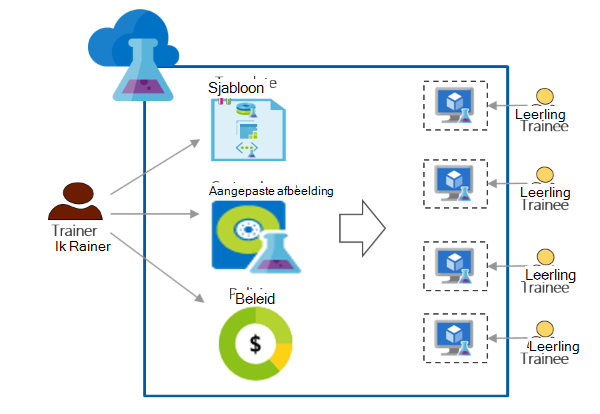

<properties
    pageTitle="Azure DevTest Labs gebruiken voor opleiding | Microsoft Azure"
    description="Leren werken met Azure DevTest Labs voor training scenario's."
    services="devtest-lab,virtual-machines"
    documentationCenter="na"
    authors="steved0x"
    manager="douge"
    editor=""/>

<tags
    ms.service="devtest-lab"
    ms.workload="na"
    ms.tgt_pltfrm="na"
    ms.devlang="na"
    ms.topic="article"
    ms.date="09/12/2016"
    ms.author="sdanie"/>

# Azure DevTest Labs gebruiken voor training

Azure DevTest Labs kan worden gebruikt voor het implementeren van veel belangrijke scenario's naast dev/test. Een van de scenario's is voor het instellen van een testlab voor training. Azure DevTest Labs kunt u een lab waar kunt u aangepaste sjablonen die elke leerling kunt maken van identieke en geïsoleerde omgevingen voor training bieden maken. U kunt ervoor zorgen dat training omgevingen beschikbaar voor elke leerling zijn wanneer zij deze nodig en voldoende bronnen - zoals virtuele machines - die nodig zijn voor de opleiding bevatten. Ten slotte kunt u gemakkelijk het lab delen met stagiairs die ze in één klik kunnen openen.   

Azure DevTest Labs voldoet aan de volgende vereisten die nodig zijn voor het trainen in een virtuele omgeving: 

-   Stagiairs zien VMs gemaakt door andere stagiairs niet
-   Elke machine opleiding moeten identiek zijn
-   Stagiairs kunnen snel hun training omgevingen inrichten
-   Kosten beheren door ervoor te zorgen dat stagiairs meer VMs dan ze nodig hebben om de opleiding en ook de VMs afsluiten wanneer ze niet gebruikt kunnen niet ophalen
-   Het training lab eenvoudig delen met elke leerling
-   Het training lab opnieuw gebruiken

In dit artikel leert u over verschillende Azure DevTest Labs-functies die kunnen worden gebruikt om te voldoen aan de hierboven beschreven training vereisten en gedetailleerde stappen die u volgen kunt om een lab voor training in te stellen.  

## Uitvoering van de opleiding met Azure DevTest Labs

1. **In het lab maken** 

    Labs zijn het startpunt in Azure DevTest Labs. Als u een lab hebt gemaakt, kunt u taken uitvoeren, zoals het toevoegen van gebruikers (stagiairs) naar het lab, beleid instellen voor beheersing van de kosten en geef VM afbeeldingen die snel kunnen maken en nog veel meer.   

    Meer informatie door te klikken op de koppelingen in de volgende tabel:

  	| Taak                                                            | Wat u leert                                                    |
|-----------------------------------------------------------------|----------------------------------------------------------------------|
| [Maak een lab in Azure DevTest Labs](devtest-lab-create-lab.md) | Informatie over het maken van een lab in Azure DevTest Labs in Azure portal. |

2. **Training VMs in minuten met behulp van kant-en-marktplaats afbeeldingen en aangepaste images maken** 
    
    U kunt kant-en-afbeeldingen uit een groot aantal afbeeldingen ophalen op de markt Azure en beschikbaar maken voor de deelnemers in een testomgeving. Als de kant-en-afbeeldingen niet aan uw eisen voldoen, kunt u een aangepaste afbeelding maken door het maken van een lab VM met behulp van een kant-en-afbeelding van Azure Marketplace, installeren van de software die u nodig hebt voor de opleiding en de VM op te slaan als een aangepaste afbeelding in het lab. 

    Meer informatie door te klikken op de koppelingen in de volgende tabel:

  	| Taak                                                                              | Wat u leert                                                                                                                                  |
|-----------------------------------------------------------------------------------|-------------------------------------------------------------------------------------------------------------------------------------------------|
| [Afbeeldingen op Marketplace Azure configureren](devtest-lab-configure-marketplace-images.md) | Meer informatie over hoe u kunt afbeeldingen op "witte" lijst Azure Marketplace; beschikbaar maken voor selectie alleen de afbeeldingen die u wilt voor de opleiding.                 |
| [Een aangepaste afbeelding maken](devtest-lab-create-template.md)                           | Een aangepaste afbeelding maken door het vooraf installeren van de software die u nodig hebt voor de opleiding dat stagiairs snel een VM met behulp van de aangepaste afbeelding kunnen maken. |

3. **Herbruikbare sjablonen maken voor training machines** 

    Een formule in Azure DevTest Labs is een lijst van de eigenschap standaardwaarden gebruikt voor het maken van een VM. Door het verzamelen van een afbeelding, een VM-grootte (een combinatie van processor en RAM-geheugen) en een virtueel netwerk kunt u een formule maken in een testomgeving. Elke leerling kan de formule zien in het lab en een VM maken. 

    Meer informatie door te klikken op de koppelingen in de volgende tabel:

  	| Taak                                                                         | Wat u leert                                                                                                          |
|------------------------------------------------------------------------------|-------------------------------------------------------------------------------------------------------------------------|
| [DevTest Labs formules voor het maken van VMs beheren](devtest-lab-manage-formulas.md) | Informatie over hoe u een formule kunt maken met een afbeelding, de grootte van de VM (combinatie van processor en RAM-geheugen) en een virtueel netwerk ophalen. |

4. **Kosten voor beheer**

    Azure DevTest Labs kunt u een beleid instellen in een testomgeving om het maximum aantal VMs die kunnen worden gemaakt door een leerling in het lab. 

    Als u bent bezig met meerdaagse training en alle VMs stoppen op een bepaald moment van de dag en vervolgens automatisch opnieuw de volgende dag, kunt u gemakkelijk bereiken die door auto-shutdown en start automatisch beleid in een testomgeving. 

    Ten slotte, als training voltooid is kunt u verwijderen alle VMs in één keer door een enkele PowerShell-script uit te voeren. 

    Meer informatie door te klikken op de koppelingen in de volgende tabel:

  	| Taak                                                                                                                                    | Wat u leert                                                      |
|-----------------------------------------------------------------------------------------------------------------------------------------|---------------------------------------------------------------------|
| [Lab-beleid definiëren](devtest-lab-set-lab-policy.md)                                                                                    | Beheersing van de kosten door het instellen van beleid in een testomgeving.                       |
| [Alle lab VMs met een PowerShell script verwijderen](devtest-lab-faq.md#how-can-i-automate-the-process-of-deleting-all-the-vms-in-my-lab) | De labs in één bewerking verwijderen wanneer de opleiding voltooid is. |

5. **Delen van het lab met elke leerling**

    Labs kunnen rechtstreeks worden benaderd via een koppeling die u met uw stagiairs deelt. De stagiairs hebt zelfs een Azure account hebben als ze beschikken over een [Microsoft-account](devtest-lab-faq.md#what-is-a-microsoft-account). Gemaakt door andere stagiairs VMs stagiairs niet wordt weergegeven.  

    Meer informatie door te klikken op de koppelingen in de volgende tabel:

  	| Taak                                                                                                                                | Wat u leert                                                   |
|-------------------------------------------------------------------------------------------------------------------------------------|------------------------------------------------------------------|
| [Een leerling toevoegen aan een lab in Azure DevTest Labs](devtest-lab-add-devtest-user.md)                                                     | Via de portal Azure stagiairs toevoegen aan uw training lab.       |
| [Stagiairs aan het lab met een PowerShell script toevoegen](devtest-lab-add-devtest-user.md#add-an-external-user-to-a-lab-using-powershell) | Met PowerShell kunt automatiseren toevoegen stagiairs met uw training lab. |
| [Een koppeling naar het lab](devtest-lab-faq.md#how-do-i-share-a-direct-link-to-my-lab)                                                  | Informatie over hoe een lab kan rechtstreeks worden benaderd via een hyperlink.        |

6. **Het lab opnieuw gebruiken** 

    Lab maken, met inbegrip van aangepaste instellingen door een Resource Manager-sjabloon maken en deze opnieuw maken van identieke labs, kunt u automatiseren. 

    Meer informatie door te klikken op de koppelingen in de volgende tabel:

  	| Taak                                                                                                                               | Wat u leert                                                      |
|------------------------------------------------------------------------------------------------------------------------------------|---------------------------------------------------------------------|
| [Maak een testomgeving met behulp van de sjabloon voor een Resource Manager](devtest-lab-faq.md#how-do-i-create-a-lab-from-an-azure-resource-manager-template) | Labs in Azure DevTest Labs met behulp van bronbeheer sjablonen maken. |

[AZURE.INCLUDE [devtest-lab-try-it-out](../../includes/devtest-lab-try-it-out.md)]  

