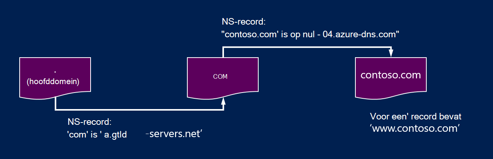
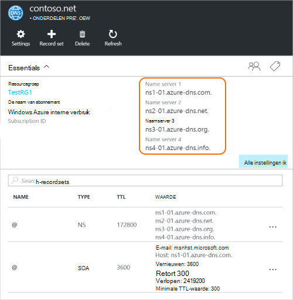

<properties
   pageTitle="Azure-DNS-domein delegeren | Microsoft Azure"
   description="Overdracht domein wijzigen en gebruiken van Azure DNS-naamservers waarmee domein hosting begrijpen."
   services="dns"
   documentationCenter="na"
   authors="sdwheeler"
   manager="carmonm"
   editor=""/>

<tags
   ms.service="dns"
   ms.devlang="na"
   ms.topic="get-started-article"
   ms.tgt_pltfrm="na"
   ms.workload="infrastructure-services"
   ms.date="06/30/2016"
   ms.author="sewhee"/>

# Een Azure-DNS-domein delegeren

Azure DNS kunt u een DNS-zone hosten en beheren van de DNS-records voor een domein in Azure. Om DNS-query's voor een domein Azure DNS bereiken, is het domein van het bovenliggende domein worden overgedragen aan DNS Azure. Houd er rekening mee Azure DNS is niet de domeinregistratieservice. In dit artikel wordt uitgelegd hoe overdracht domein werkt en het overdragen van Azure DNS-domeinen.

## De werking van DNS-overdracht

### Domeinen en zones

Het Domain Name System is een hiërarchie van domeinen. De hiërarchie wordt gestart vanaf het domein 'wortel', waarvan de naam gewoon is**.**.  Daaronder komen domeinen op hoogste niveau, bijvoorbeeld com, "netto", "organisatie", "uk" of "jp".  Zijn onder de tweede niveau domeinen, zoals 'org.uk' of 'co.jp'.  Enzovoort. De domeinen in de DNS-hiërarchie worden gehost met afzonderlijke DNS-zones. Deze zones zijn wereldwijd verspreid, gehost door een DNS-naamservers over de hele wereld.

**DNS-zone**

Een domein is een unieke naam in het Domain Name System, bijvoorbeeld contoso.com. Een DNS-zone wordt gebruikt voor het hosten van de DNS-records voor een bepaald domein. Het domein 'contoso.com' kan bijvoorbeeld een aantal van de DNS-records, zoals 'mail.contoso.com' (voor een e-mailserver) en 'www.contoso.com' (voor een website) bevatten.

**Domeinregistratieservice**

Een domeinregistratieservice is een bedrijf die Internet-domeinnamen. Zij controleert of als het Internet-domein dat u wilt gebruiken beschikbaar is en kunt u dit product aanschaft. Zodra de domeinnaam wordt geregistreerd, zult u de rechtmatige eigenaar van de domeinnaam. Als u al een internetdomein, gebruikt u de huidige domeinregistratieservice overdragen naar Azure DNS.

>[AZURE.NOTE] Voor meer informatie over wie de eigenaar van een bepaalde domeinnaam of voor informatie over het kopen van een domein, Zie [Internet domain management in Azure AD](https://msdn.microsoft.com/library/azure/hh969248.aspx).

### Resolutie en overdracht

Er zijn twee soorten DNS-servers:

- Een _Gezaghebbende_ DNS-server fungeert als host voor DNS-zones. Deze antwoorden op DNS-query's voor records in deze gebieden alleen.
- Een _recursieve_ DNS-server host geen DNS-zones. Deze antwoorden op alle DNS-query's door het aanroepen van gezaghebbende DNS-servers om de benodigde gegevens te verzamelen.

>[AZURE.NOTE] Azure DNS biedt een gezaghebbende DNS-service.  Een recursieve DNS-service biedt niet.

> Cloud Services en VMs in Azure worden automatisch geconfigureerd voor afzonderlijk gebruik van een recursieve DNS-services die beschikbaar is als onderdeel van de infrastructuur van Azure.  Zie voor meer informatie over het wijzigen van deze instellingen voor DNS- [Naamomzetting in Azure](../virtual-network/virtual-networks-name-resolution-for-vms-and-role-instances.md#name-resolution-using-your-own-dns-server).

DNS-clients in een pc of mobiele apparaten roept u meestal een recursieve DNS-server voor het uitvoeren van een DNS-query's die de clienttoepassingen nodig.

Als een recursieve DNS-server een query ontvangt voor een DNS-record, zoals 'www.contoso.com', moet deze eerst de naamserver die als host fungeert voor de zone voor het domein 'contoso.com' te vinden. U doet dit door het begint bij de root-naamservers en vanaf daar vindt de naamservers die als host fungeert voor de zone 'com'. Vervolgens query's de 'com' naamservers van de naamservers die als host fungeert voor de zone 'contoso.com' vinden.  Ten slotte is het kunnen deze naamservers voor 'www.contoso.com' opvragen.

Dit heet het herleiden van de DNS-naam. Strikt genomen DNS-omzetting extra stappen, zoals de volgende CNAME-records bevat, maar dat is niet belangrijk dat u inzicht in de werking van DNS-overdracht.

Hoe een bovenliggende zone 'verwijzen' naar de naamservers voor een onderliggende zone? Dit gebeurt met behulp van een speciaal type DNS-record een NS-record (NS staat voor 'van naamserver') genoemd. Bijvoorbeeld de hoofdzone bevat NS-records voor 'com' en ziet u de naamservers voor de zone 'com'. De zone 'com' bevat op zijn beurt de NS-records voor 'contoso.com', waarin de naamservers voor de zone 'contoso.com'. Het instellen van de NS-records voor een onderliggende zone in een bovenliggende zone, heet het domein overdraagt.

Iedere delegatie heeft eigenlijk twee exemplaren van de NS-records. een in de bovenliggende zone die het kind en de andere in de onderliggende zone zelf aan te wijzen. De zone 'contoso.com' bevat de NS-records voor 'contoso.com' (naast de NS-records in de 'com'). Deze gemachtigde NS-records worden genoemd en ze zitten op de top van de onderliggende zone.

## Overdragen van een Azure-DNS-domein

Als u de DNS-zone in Azure, DNS gemaakt, moet u voor het instellen van de NS-records in de bovenliggende zone om DNS Azure de bindende bron voor de zone wilt herleiden. Voor domeinen een registratieservice gekocht, zal uw registratieservice bieden de mogelijkheid om deze NS-records in te stellen.

>[AZURE.NOTE] U hoeft niet de eigenaar van een domein wilt maken van een DNS-zone met in Azure DNS-domeinnaam. U hoeft echter de eigenaar van het domein om de overdracht naar Azure DNS bij het register in te stellen.

Stel bijvoorbeeld dat u het domein 'contoso.com' kopen en een zone met de naam contoso.com in Azure DNS te maken. Als de eigenaar van het domein biedt uw registratieservice u de optie voor het configureren van de adressen (dat wil zeggen, de NS-records) voor uw domein. De registrar slaat deze NS-records in het bovenliggende domein, in dit geval '.com'. Clients over de hele wereld wordt vervolgens doorgestuurd naar uw domein in Azure DNS-zone als u probeert op te lossen DNS-records in de 'contoso.com'.

### De naam servernamen zoeken

Voordat u uw DNS-zone DNS-Azure overdragen kunt, moet u eerst op de hoogte van de namen van de naam server voor de zone. Azure DNS toegewezen naamservers uit een groep telkens wanneer die een zone wordt gemaakt.

De eenvoudigste manier om te zien van de naamservers die is toegewezen aan de zone is via de portal Azure.  In dit voorbeeld wordt de zone 'contoso.net' is toegewezen naamservers ' ns1-01.azure-dns.com', ns2 01.azure dns .net ' ns3-01.azure-dns.org', en ' ns4-01.azure-dns.info':

 

Azure DNS maakt automatisch gemachtigd NS-records in de zone met de toegewezen naamservers.  Als u wilt zien welke server de naam via Azure PowerShell of Azure CLI, hoeft u deze records op te halen.

Met Azure PowerShell, kunnen de gezaghebbende NS-records worden opgehaald als volgt. Houd er rekening mee dat de naam van de “@” wordt gebruikt om te verwijzen naar de records op de top van de zone.

    PS> $zone = Get-AzureRmDnsZone –Name contoso.net –ResourceGroupName MyResourceGroup
    PS> Get-AzureRmDnsRecordSet –Name “@” –RecordType NS –Zone $zone

    Name              : @
    ZoneName          : contoso.net
    ResourceGroupName : MyResourceGroup
    Ttl               : 3600
    Etag              : 5fe92e48-cc76-4912-a78c-7652d362ca18
    RecordType        : NS
    Records           : {ns1-01.azure-dns.com, ns2-01.azure-dns.net, ns3-01.azure-dns.org,
                        ns4-01.azure-dns.info}
    Tags              : {}

Kun je de CLI platforms Azure de gezaghebbende NS-records worden opgehaald en ontdek daarmee de naamservers die is toegewezen aan de zone:

    C:\> azure network dns record-set show MyResourceGroup contoso.net @ NS
    info:    Executing command network dns record-set show
        + Looking up the DNS Record Set "@" of type "NS"
    data:    Id                              : /subscriptions/.../resourceGroups/MyResourceGroup/providers/Microsoft.Network/dnszones/contoso.net/NS/@
    data:    Name                            : @
    data:    Type                            : Microsoft.Network/dnszones/NS
    data:    Location                        : global
    data:    TTL                             : 172800
    data:    NS records
    data:        Name server domain name     : ns1-01.azure-dns.com.
    data:        Name server domain name     : ns2-01.azure-dns.net.
    data:        Name server domain name     : ns3-01.azure-dns.org.
    data:        Name server domain name     : ns4-01.azure-dns.info.
    data:
    info:    network dns record-set show command OK

### Voor het instellen van overdracht

Elke instantie heeft eigen DNS-beheerprogramma's op de serverrecords voor een domein wijzigen. De NS-records bewerken en de NS-records vervangen door de die Azure DNS gemaakt in het register van de DNS-beheerpagina.

Bij het overdragen van een Azure-DNS-domein, moet u de naam servernamen die door DNS Azure.  Gebruik altijd alle 4 naam servernamen, ongeacht de naam van uw domein.  Overdracht domein vereist de naam van de naam server gebruiken hetzelfde domein op het hoogste niveau als uw domein niet.

Gebruik geen 'glue records' om te verwijzen naar de Azure DNS-naam server IP-adressen, aangezien deze IP-adressen in toekomstige kunnen veranderen. Delegaties met naam servernamen in uw eigen zone, ook wel "aangepaste naamservers" genoemd, worden momenteel niet ondersteund in DNS Azure.

### Controleer of naamomzetting werkt

Nadat de overdracht is voltooid, kunt u controleren of naamomzetting werkt met behulp van een hulpprogramma zoals 'nslookup' query uitvoeren op de SOA-record voor de zone (die ook automatisch wordt gemaakt wanneer de zone is gemaakt).

Houd er rekening mee dat u niet hoeft te geven de Azure DNS-naamservers, aangezien de normale omzettingsproces voor DNS-naamservers van het automatisch wordt gevonden als de delegatie heeft juist zijn ingesteld.

    nslookup –type=SOA contoso.com

    Server: ns1-04.azure-dns.com
    Address: 208.76.47.4

    contoso.com
    primary name server = ns1-04.azure-dns.com
    responsible mail addr = msnhst.microsoft.com
    serial = 1
    refresh = 900 (15 mins)
    retry = 300 (5 mins)
    expire = 604800 (7 days)
    default TTL = 300 (5 mins)

## Subdomeinen in Azure DNS overdragen

Als u instellen op een afzonderlijke onderliggende zone wilt, kunt u een subdomein in DNS Azure delegeren. Stel dat u wilt instellen op een afzonderlijke onderliggende zone, bijvoorbeeld heeft ingesteld en overgedragen 'contoso.com' in Azure DNS, 'partners.contoso.com'.

Het instellen van een onderliggende domein, volgt een soortgelijk proces als een normale overdracht. Het enige verschil is dat in stap 3 die de NS-records moeten worden gemaakt in de bovenliggende zone 'contoso.com in Azure DNS in plaats van via een domeinregistratieservice wordt ingesteld.

1. Maak de onderliggende zone 'partners.contoso.com' in Azure DNS.
2. De gezaghebbende NS-records in de onderliggende zone te verkrijgen van de naamservers die als host fungeert voor de onderliggende zone in DNS Azure opzoeken.
3. De onderliggende zone overdragen door NS-records configureren in de bovenliggende zone verwijst naar de onderliggende zone.

### Een subdomein overdragen

De volgende PowerShell-voorbeeld ziet u hoe dit werkt. Dezelfde stappen kunnen worden uitgevoerd via de Portal Azure, of de CLI platforms Azure.

#### Stap 1. De bovenliggende en onderliggende zones maken

Eerst maken we de bovenliggende en onderliggende zones. Deze kunnen zich in dezelfde bronnengroep of andere resourcegroepen.

    $parent = New-AzureRmDnsZone -Name contoso.com -ResourceGroupName RG1
    $child = New-AzureRmDnsZone -Name partners.contoso.com -ResourceGroupName RG1

#### Stap 2. Ophalen NS-records

We vervolgens ophalen de bindend NS-records uit onderliggende zone, zoals in het volgende voorbeeld.  Dit document bevat de naamservers van de onderliggende zone.

    $child_ns_recordset = Get-AzureRmDnsRecordSet -Zone $child -Name "@" -RecordType NS

#### Stap 3. De onderliggende zone delegeren

Bijbehorende NS-record stelt u voor het voltooien van de overdracht in de bovenliggende zone maken. Houd er rekening mee dat de naam van de recordset in de bovenliggende zone komt overeen met de naam van de onderliggende zone in dit geval "partners".

    $parent_ns_recordset = New-AzureRmDnsRecordSet -Zone $parent -Name "partners" -RecordType NS -Ttl 3600
    $parent_ns_recordset.Records = $child_ns_recordset.Records
    Set-AzureRmDnsRecordSet -RecordSet $parent_ns_recordset

### Controleer of naamomzetting werkt

U kunt controleren of alles correct is ingesteld door het opzoeken van de SOA-record van de onderliggende zone.

    nslookup –type=SOA partners.contoso.com

    Server: ns1-08.azure-dns.com
    Address: 208.76.47.8

    partners.contoso.com
        primary name server = ns1-08.azure-dns.com
        responsible mail addr = msnhst.microsoft.com
        serial = 1
        refresh = 900 (15 mins)
        retry = 300 (5 mins)
        expire = 604800 (7 days)
        default TTL = 300 (5 mins)

## Volgende stappen

[Beheren van DNS-zones](dns-operations-dnszones.md)

[DNS-records beheren](dns-operations-recordsets.md)

