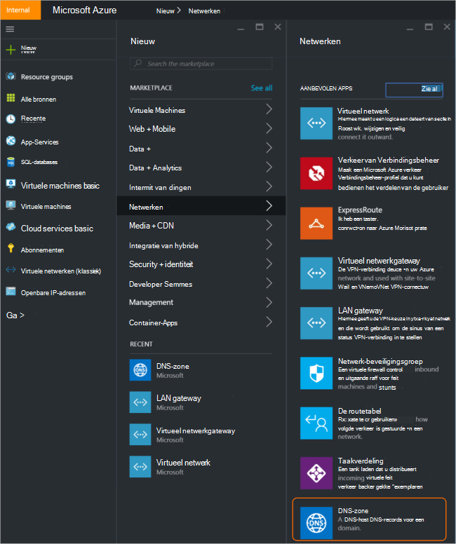
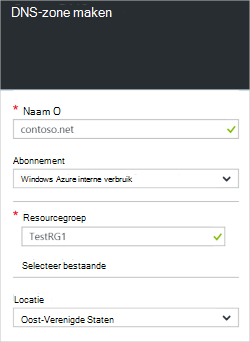
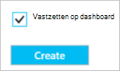
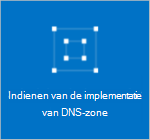
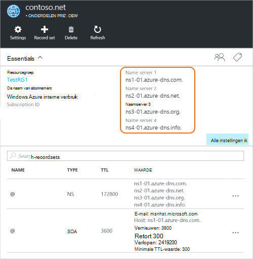
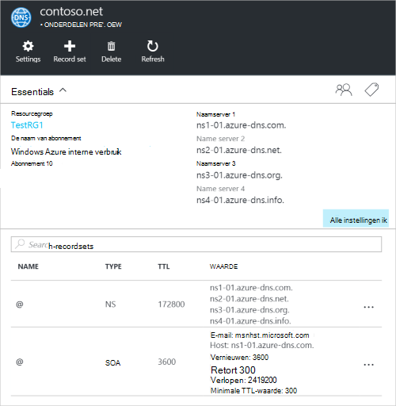

<properties
   pageTitle="Het maken en beheren van een DNS-zone in Azure portal | Microsoft Azure"
   description="Informatie over het maken van DNS-zones voor DNS Azure. Dit is een stapsgewijze handleiding voor het maken en beheren van uw eerste DNS en hosting van uw DNS-domein met de Azure portal start."
   services="dns"
   documentationCenter="na"
   authors="sdwheeler"
   manager="carmonm"
   editor=""
   tags="azure-resource-manager"/>

<tags
   ms.service="dns"
   ms.devlang="na"
   ms.topic="article"
   ms.tgt_pltfrm="na"
   ms.workload="infrastructure-services"
   ms.date="08/16/2016"
   ms.author="sewhee"/>

# Een DNS-zone maken in de portal voor Azure

> [AZURE.SELECTOR]
- [Azure Portal](dns-getstarted-create-dnszone-portal.md)
- [PowerShell](dns-getstarted-create-dnszone.md)
- [Azure CLI](dns-getstarted-create-dnszone-cli.md)

Dit artikel begeleidt u door de stappen voor het maken van een DNS-zone met behulp van de portal Azure. Ook kunt u een DNS-zone met PowerShell of CLI.

[AZURE.INCLUDE [dns-create-zone-about](../../includes/dns-create-zone-about-include.md)]

### Codes voor Azure DNS

Tags zijn een lijst met de naam / waarde-paren en door Azure Resource Manager label bronnen voor facturering of groepeerniveau doeleinden worden gebruikt. Voor meer informatie over labels, Zie het artikel [werken met labels voor het ordenen van uw resources Azure](../resource-group-using-tags.md).

U kunt labels in Azure portal toevoegen met behulp van het blad van de **Instellingen** voor de DNS-zone.

## Een DNS-zone maken

1. Aanmelden bij de Azure portal

2. Klik in het menu Hub en op **Nieuw > toegang >** en klik op **DNS-zone** de DNS-zone blade openen.

    

3. Klik op de **DNS-zone** -blade onder **maken** . Hiermee opent u het blad **maken DNS-zone** .

    

4. Naam op het blad **maken DNS-zone** de DNS-zone. Bijvoorbeeld *contoso.com*. Zie [DNS-zonenamen](#names) in de bovenstaande sectie.

5. Geef vervolgens de resourcegroep die u wilt gebruiken. U kunt een nieuwe resourcegroep maken of selecteren dat al bestaat.

6. Geef de locatie van de resourcegroep in de vervolgkeuzelijst **locatie** . Houd er rekening mee dat deze instelling naar de locatie van de resourcegroep, niet de locatie voor een DNS-zone verwijst. De werkelijke bron die DNS-zone automatisch 'Algemeen' en niet iets wat u kunt (of wilt) opgeven in de portal.

7. Kunt u het selectievakje **vastmaken aan het dashboard** is geselecteerd als u wilt gemakkelijk vinden van de nieuwe zone op het dashboard. Klik vervolgens op **maken**.

    

8. Nadat u op maken klikt, ziet u de nieuwe zone wordt geconfigureerd op het dashboard.

    

9. Wanneer u de nieuwe zone is gemaakt, wordt het blad voor de nieuwe zone geopend op het dashboard.

## Records weergeven

Een DNS-zone maakt, maakt ook de volgende records:

- De record 'Start of Authority"(SOA). De SOA is aanwezig in de hoofdmap van elke DNS-zone.
- De gemachtigde naamserver (NS) records. Deze statistieken tonen welke naamservers host fungeert voor de zone. Azure DNS naamservers van een groep wordt gebruikt, en dus verschillende naamservers kunnen worden toegewezen aan de verschillende zones in Azure DNS. Zie [een Azure-DNS-domein delegeren](dns-domain-delegation.md) voor meer informatie.

U kunt de records uit de Azure portal weergeven

1. Klik op **alle instellingen** voor het openen van de **blade instellingen** voor de DNS-zone vanaf de **DNS-zone** -blade.

    

2. U ziet in het onderste gedeelte van het deelvenster Essentials, stelt u de record voor de DNS-zone.

    

## Test

U kunt de DNS-zone met behulp van DNS-hulpprogramma's, zoals nslookup, graven of de [DNS-omzetting-naam PowerShell-cmdlet](https://technet.microsoft.com/library/jj590781.aspx)testen.

Als u uw gebruik van de nieuwe zone in Azure DNS-domein nog niet hebt overgedragen, moet u direct de DNS-query naar een van de naamservers voor de zone. De naamservers voor de zone worden gegeven in de NS-records, zoals vermeld door `Get-AzureRmDnsRecordSet` hierboven. Zorg ervoor dat het vervangende product de juiste waarden voor uw zone in de opdracht hieronder.

    nslookup
    > set type=SOA
    > server ns1-01.azure-dns.com
    > contoso.com

    Server: ns1-01.azure-dns.com
    Address:  208.76.47.1

    contoso.com
            primary name server = ns1-01.azure-dns.com
            responsible mail addr = msnhst.microsoft.com
            serial  = 1
            refresh = 900 (15 mins)
            retry   = 300 (5 mins)
            expire  = 604800 (7 days)
            default TTL = 300 (5 mins)

## Verwijderen van een DNS-zone

U kunt de DNS-zone verwijderen direct vanaf de portal. Voordat u een DNS-zone in DNS Azure verwijdert, moet u het verwijderen van alle records sets, met uitzondering van de NS- en SOA-records in de hoofdmap van de zone die automatisch zijn gemaakt als de zone is gemaakt.

1. Zoek het blad van de **DNS-zone** voor de zone die u wilt verwijderen en klik op **verwijderen** op de bovenkant van het blad.

2. Er verschijnt een laten weten dat u alle records sets, met uitzondering van de NS- en SOA-records die automatisch zijn gemaakt dient te verwijderen. Als u uw sets record hebt verwijderd, klikt u op **Ja**. Houd er rekening mee dat bij het verwijderen van een DNS-zone van de portal, de resourcegroep die betrekking heeft op de DNS-zone niet worden verwijderd.

## Volgende stappen

Na het maken van een DNS-zone maken [Recordsets en records](dns-getstarted-create-recordset-portal.md) als u wilt beginnen met het omzetten van namen voor uw Internet-domein.
