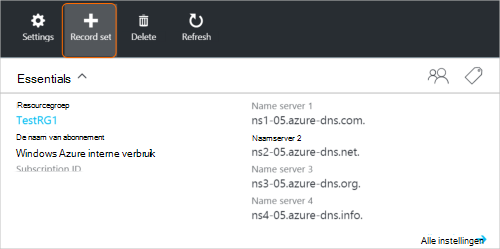
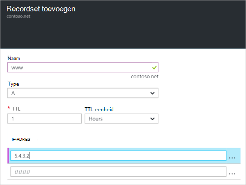

<properties
   pageTitle="Maak een recordset en records voor een DNS-Zone met behulp van de portal Azure | Microsoft Azure"
   description="Hostrecords maken voor Azure DNS en recordsets en de records met de Azure portal maken"
   services="dns"
   documentationCenter="na"
   authors="sdwheeler"
   manager="carmonm"
   editor=""
   tags="azure-resource-manager"/>

<tags
   ms.service="dns"
   ms.devlang="na"
   ms.topic="article"
   ms.tgt_pltfrm="na"
   ms.workload="infrastructure-services"
   ms.date="08/16/2016"
   ms.author="sewhee"/>

# DNS-record sets en records maken met behulp van de portal voor Azure

> [AZURE.SELECTOR]
- [Azure Portal](dns-getstarted-create-recordset-portal.md)
- [PowerShell](dns-getstarted-create-recordset.md)
- [Azure CLI](dns-getstarted-create-recordset-cli.md)

Dit artikel begeleidt u door het proces van het maken van records en records wordt ingesteld met behulp van de portal Azure. Nadat u de DNS-zone maakt, moet u de DNS-records voor uw domein toevoegen. Hiertoe moet u eerst begrijpen DNS-records en recordsets.

[AZURE.INCLUDE [dns-about-records-include](../../includes/dns-about-records-include.md)]

## Een recordset en een record maken

In het volgende voorbeeld helpt u bij het proces van het maken van een recordset en een record met behulp van de portal Azure. We gebruiken het recordtype DNS-'A'.

1. Log in op de portal.

2. Ga naar de **DNS-zone** blade in die u wilt maken van een verzameling.

3. Selecteer **Record instellen** voor het openen van het blad **toevoegen record ingesteld** aan de bovenkant van het blad van de **DNS-zone** .

    

4. Naam voor uw record set op het blad **toevoegen record ingesteld** . U kan bijvoorbeeld uw verzameling '**www**' noemen.

    

5. Selecteer het type record dat u wilt maken. Selecteer bijvoorbeeld **een**.

6. De **TTL-waarde**instellen. De standaard in de portal live is één uur.

7. De IP-adressen, één IP-adres per regel toevoegen. Als u de voorgestelde recordreeks naam en het type record eerder is beschreven, kunt u de IPv4 IP-adressen toevoegen aan de **A** -record voor de WWW-record.

8. Nadat u IP-adressen toe te voegen, klik op **OK** onder aan het blad. De DNS-record gemaakt.

## Volgende stappen

Voor het beheren van de recordset en records Zie [bronrecords beheren en registreren met behulp van de portal Azure wordt ingesteld](dns-operations-recordsets-portal.md).

Zie voor meer informatie over DNS Azure [Azure DNS-overzicht](dns-overview.md).
