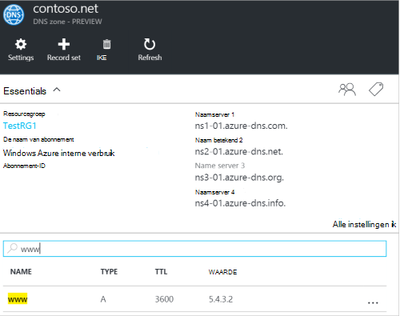
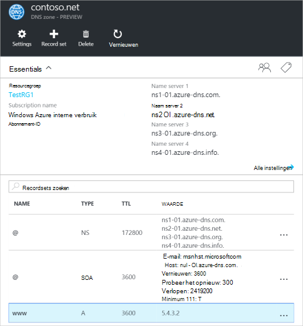
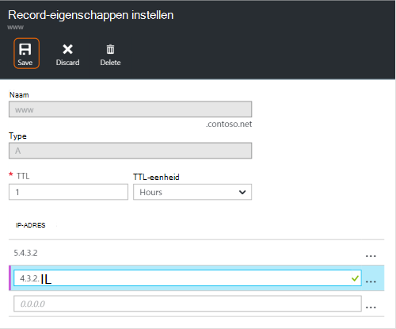
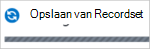
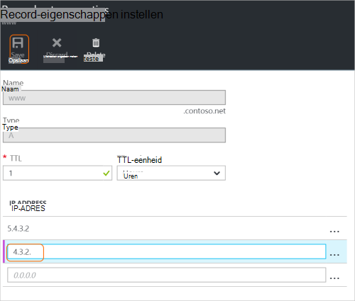
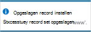
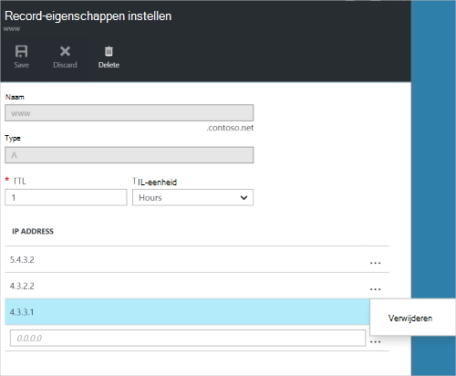
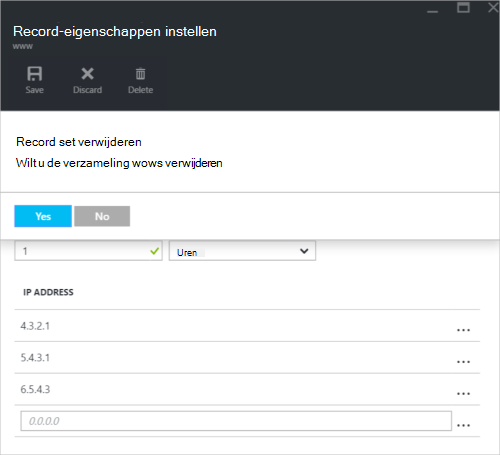

<properties
   pageTitle="Beheren van DNS-record sets en records met behulp van de portal Azure | Microsoft Azure"
   description="Beheren van DNS record ingesteld en wordt vastgelegd wanneer het hosten van uw Azure DNS-domein."
   services="dns"
   documentationCenter="na"
   authors="sdwheeler"
   manager="carmonm"
   editor=""
   tags="azure-resource-manager"/>

<tags
   ms.service="dns"
   ms.devlang="na"
   ms.topic="article"
   ms.tgt_pltfrm="na"
   ms.workload="infrastructure-services"
   ms.date="08/16/2016"
   ms.author="sewhee"/>

# DNS-records beheren en record wordt ingesteld met behulp van de portal voor Azure

> [AZURE.SELECTOR]
- [Azure Portal](dns-operations-recordsets-portal.md)
- [Azure CLI](dns-operations-recordsets-cli.md)
- [PowerShell](dns-operations-recordsets.md)

In dit artikel wordt beschreven hoe u records voor uw DNS-zone en recordsets beheren via de Azure portal.

Het is belangrijk te begrijpen het verschil tussen de DNS-record sets en afzonderlijke DNS-records. Een verzameling is een verzameling van records in een zone met dezelfde naam en hetzelfde type. Zie [records met behulp van de portal Azure en recordsets maken DNS](dns-getstarted-create-recordset-portal.md)voor meer informatie.

## Maak een nieuwe record en record

Zie maken van een recordset in de Azure portal [maken DNS-records met behulp van de portal Azure](dns-getstarted-create-recordset-portal.md).

## Een verzameling weergeven

1. Ga naar de **DNS-zone** blade in het portal voor Azure.

2. Zoeken naar de verzameling en selecteer deze. De eigenschappen Recordset wordt geopend.

    

## Een nieuwe record toevoegt aan een verzameling

U kunt maximaal 20 records toevoegen aan een verzameling. Een verzameling kan geen twee identieke records bevatten. Leeg record sets (met nul records) kunnen worden gemaakt, maar worden niet weergegeven op de Azure DNS-naamservers. Recordsets van het type CNAME kunnen maximaal één record bevatten.

1. Klik op de record set die u wilt toevoegen aan een-record op de bladeserver **Record eigenschappen instellen** voor de DNS-zone.

    

2. Geef dat de record eigenschappen instellen door de velden.

    

2. Klik op **Opslaan** op de bovenkant van het blad als uw instellingen wilt opslaan. Sluit de bladeserver.

3. In de hoek ziet u dat de record wordt opgeslagen.

    

De waarden op de **DNS-zone** blade weerspiegelt de nieuwe record nadat de record is opgeslagen.

## Een record bijwerken

De velden die u kunt bijwerken wanneer u een record in een bestaande groep records bijwerkt, is afhankelijk van het type record waaraan u werkt.

1. Op de bladeserver **Record eigenschappen instellen** voor uw set records zoeken voor de record.

2. De record wijzigen. Wanneer u een record wijzigt, kunt u de beschikbare instellingen voor de record. In het volgende voorbeeld wordt het veld **IP-adres** is geselecteerd en wordt het IP-adres wordt gewijzigd.

    

3. Klik op **Opslaan** op de bovenkant van het blad als uw instellingen wilt opslaan. In de rechterbovenhoek te klikken ziet u de melding dat de record is opgeslagen.

    

De waarden voor de record ingesteld op de **DNS-zone** blade weerspiegelt de bijgewerkte record nadat de record is opgeslagen.

## Een record verwijderen uit een verzameling

U kunt de Azure portal gebruiken om records te verwijderen uit een verzameling. Houd er rekening mee dat de laatste record verwijderen uit een verzameling niet de verzameling verwijdert.

1. Op de bladeserver **Record eigenschappen instellen** voor uw set records zoeken voor de record.

2. Klik op de record die u wilt verwijderen. Selecteer **verwijderen**.

    

3. Klik op **Opslaan** op de bovenkant van het blad als uw instellingen wilt opslaan.

3. Nadat u de record hebt verwijderd, worden de waarden voor de record op de **DNS-zone** blade verwijderen weerspiegelen.

## Een verzameling verwijderen

1. Op de **Record eigenschappen instellen** blade voor uw record instellen, klikt u op **verwijderen**.

    

2. Een bericht gevraagd of u wilt verwijderen van de record ingesteld.

3. Controleer of de naam overeenkomt met de verzameling die u wilt verwijderen en klik vervolgens op **Ja**.

4. Controleer of de verzameling is niet meer zichtbaar op de **DNS-zone** -blade.

## Werken met NS- en SOA-records

NS- en SOA-records die worden automatisch gemaakt worden anders worden beheerd vanuit andere recordtypen.

### SOA-records wijzigen

U kan toevoegen of verwijderen van records uit de automatisch gemaakte SOA-record ingesteld op de top van de zone (naam = "@"). Echter, kunt u een van de parameters in de SOA-record (met uitzondering van "Host") en de record set TTL.

### NS-records op de top van de zone wijzigen

U kan toevoegen, verwijderen of de records in de automatisch gemaakte NS-record ingesteld op de top van de zone wijzigen (naam = "@"). De enige wijziging die toegestaan, is het wijzigen van de record set TTL.

### SOA- of NS-record sets verwijderen

U kunt het SOA niet verwijderen en de NS-record ingesteld op de top van de zone (naam = "@") die automatisch worden gemaakt wanneer de zone is gemaakt. Ze worden automatisch verwijderd wanneer u de zone verwijderen.

## Volgende stappen

-   Zie voor meer informatie over DNS Azure [Azure DNS-overzicht](dns-overview.md).
-   Zie voor meer informatie over het automatiseren van DNS [maken van DNS-zones en record wordt ingesteld met behulp van de SDK voor .NET](dns-sdk.md).
-   Zie voor meer informatie over reverse DNS-records [beheren reverse DNS-records voor uw services met PowerShell](dns-reverse-dns-record-operations-ps.md).
