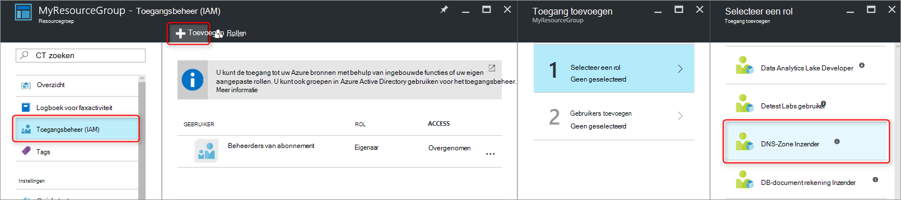
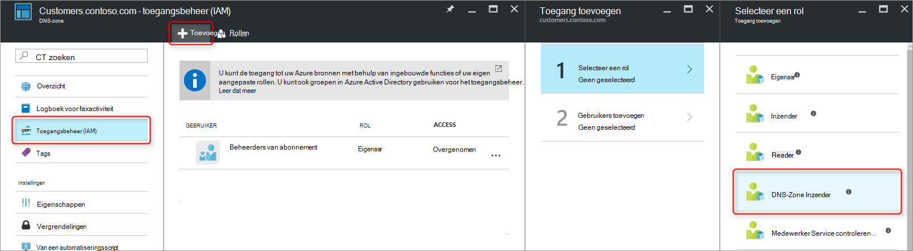
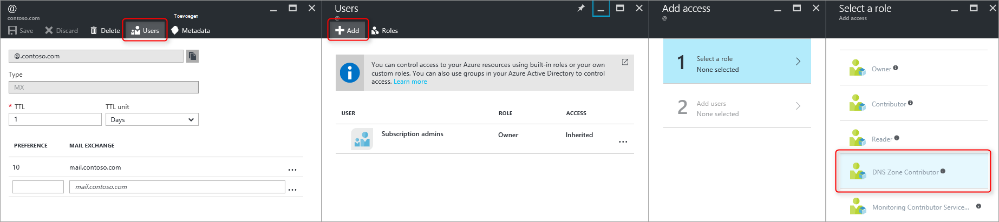
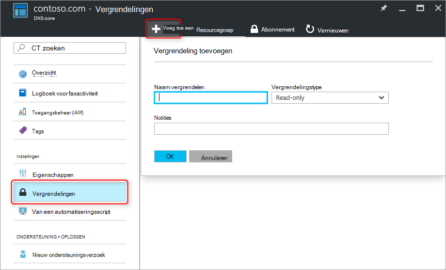

<properties 
   pageTitle="Beveiligen van DNS-Zones en Records | Microsoft Azure" 
   description="Het beveiligen van DNS-zones en record wordt in Microsoft Azure DNS." 
   services="dns" 
   documentationCenter="na" 
   authors="jtuliani" 
   manager="carmonm" 
   editor=""/>

<tags
   ms.service="dns"
   ms.devlang="na"
   ms.topic="article"
   ms.tgt_pltfrm="na"
   ms.workload="infrastructure-services" 
   ms.date="10/20/2016"
   ms.author="jtuliani"/>

# Het beveiligen van DNS-zones en records

DNS-zones en records zijn essentiële bronnen. Verwijderen van een DNS-zone of zelfs slechts één DNS-record kan resulteren in een totale servicestoring.  Het is daarom belangrijk dat de essentiële DNS-zones en records worden beschermd tegen onbevoegde of onbedoelde wijzigingen.

In dit artikel wordt uitgelegd hoe Azure DNS zorgt ervoor dat u uw DNS-zones en records tegen dergelijke wijzigingen te beveiligen.  We twee krachtige beveiligingsfuncties door Azure Resource Manager toepassen: [op rollen gebaseerde toegangscontrole](../active-directory/role-based-access-control-what-is.md) en [sloten van de resource](../resource-group-lock-resources.md).

## Toegangsbeheer op basis van rollen

Azure Role-Based Access Control RBAC () kunt fijnmazig toegangsbeheer voor Azure gebruikers, groepen en bronnen. RBAC gebruikt, kunt u geven nauwkeurig het bedrag van de toegang die gebruikers nodig hebben voor het uitvoeren van hun taken. Zie [op rollen gebaseerde toegangscontrole](../active-directory/role-based-access-control-what-is.md)voor meer informatie over hoe RBAC helpt u bij het beheren van toegang.

### De rol "Inzender DNS-Zone"

De functie 'DNS-Zone Inzender' is een ingebouwde functie die Azure voor DNS-bronnen beheren.  DNS-Zone Inzender machtigingen toewijzen aan een gebruiker of groep, kunt die groep voor het beheren van DNS-bronnen, maar niet de resources van een ander type.

Stel bijvoorbeeld dat de resource-groep 'myzones' bevat vijf zones voor Contoso Corporation. De DNS-beheerder machtigingen aan deze resourcegroep "Inzender DNS-Zone" verleent, kan volledige controle over de DNS-zones. Het voorkomt ook onnodige machtigingen verlenen voor de DNS-beheerder kan maken of virtuele Machines te stoppen.

De eenvoudigste manier RBAC-machtigingen toe te wijzen is [via de portal Azure](../active-directory/role-based-access-control-configure.md).  De blade toegangsbeheer (IAM) voor de resourcegroep openen, klik op 'Toevoegen', en vervolgens selecteert u de rol 'DNS-Zone Inzender' en selecteer de vereiste gebruikers of groepen om machtigingen te verlenen.

Machtigingen kunnen ook worden [verleend met Azure PowerShell](../active-directory/role-based-access-control-manage-access-powershell.md):

    # Grant 'DNS Zone Contributor' permissions to all zones in a resource group
    New-AzureRmRoleAssignment -SignInName <user email address> -RoleDefinitionName "DNS Zone Contributor" -ResourceGroupName <resource group name>

De equivalente opdracht is ook [beschikbaar via de CLI Azure](../active-directory/role-based-access-control-manage-access-azure-cli.md):

    # Grant 'DNS Zone Contributor' permissions to all zones in a resource group
    azure role assignment create --signInName  <user email address> --roleName "DNS Zone Contributor" --resourceGroup <resource group name>

### Niveau van een internetzone RBAC

Azure RBAC regels kunnen worden toegepast op een abonnement, een resourcegroep of voor een afzonderlijke resource. Bij DNS Azure is die bron een afzonderlijke DNS-zone of een afzonderlijke recordreeks.

Stel bijvoorbeeld dat de resource-groep 'myzones' bevat de zone contoso.com en een subzone 'customers.contoso.com' waarin de CNAME-records worden gemaakt voor elke klant account.  Machtigingen voor het maken van records in de zone 'customers.contoso.com' alleen door de account die wordt gebruikt voor het beheren van deze CNAME-records moet worden toegewezen, er mogen geen toegang tot de andere zones.

Zone-niveau RBAC-machtigingen kunnen worden toegekend via de portal Azure.  Open de blade toegangsbeheer (IAM) voor de zone, klik op 'Toevoegen', en vervolgens selecteert u de rol 'DNS-Zone Inzender' en selecteer de vereiste gebruikers of groepen om machtigingen te verlenen.

Machtigingen kunnen ook worden [verleend met Azure PowerShell](../active-directory/role-based-access-control-manage-access-powershell.md):

    # Grant 'DNS Zone Contributor' permissions to a specific zone
    New-AzureRmRoleAssignment -SignInName <user email address> -RoleDefinitionName "DNS Zone Contributor" -ResourceGroupName <resource group name> -ResourceName <zone name> -ResourceType Microsoft.Network/DNSZones

De equivalente opdracht is ook [beschikbaar via de CLI Azure](../active-directory/role-based-access-control-manage-access-azure-cli.md):

    # Grant 'DNS Zone Contributor' permissions to a specific zone
    azure role assignment create --signInName <user email address> --roleName "DNS Zone Contributor" --resource-name <zone name> --resource-type Microsoft.Network/DNSZones --resource-group <resource group name>

### Record niveau van RBAC instellen

We kunnen een stap verder gaan. U kunt de e-mailbeheerder voor Contoso Corporation, die toegang tot de MX- en TXT-records op de top van de zone 'contoso.com' nodig heeft.  Ze nodig niet voor toegang tot andere MX- of TXT records, of alle records van een ander type.  Azure DNS kunt u machtigingen toe te wijzen op het niveau van de recordset nauwkeurig de records die de e-mailbeheerder heeft toegang tot nodig.  De e-mailbeheerder is precies de bepalen ze nodig heeft en is niet in staat om andere wijzigingen worden toegekend.
  
Record-level RBAC machtigingen kunnen worden geconfigureerd via de portal met de knop 'Users' in de recordreeks blade Azure:

Record set machtigingen op gebruikersniveau RBAC kunnen ook worden [verleend met Azure PowerShell](../active-directory/role-based-access-control-manage-access-powershell.md):

    # Grant permissions to a specific record set
    New-AzureRmRoleAssignment -SignInName <user email address> -RoleDefinitionName "DNS Zone Contributor" -Scope "/subscriptions/<subscription id>/resourceGroups/<resource group name>/providers/Microsoft.Network/dnszones/<zone name>/<record type>/<record name>" 

De equivalente opdracht is ook [beschikbaar via de CLI Azure](../active-directory/role-based-access-control-manage-access-azure-cli.md):

    # Grant permissions to a specific record set
    azure role assignment create --signInName <user email address> --roleName "DNS Zone Contributor" --scope "/subscriptions/<subscription id>/resourceGroups/<resource group name>/providers/Microsoft.Network/dnszones/<zone name>/<record type>/<record name>"

### Aangepaste rollen

De ingebouwde 'DNS-Zone Inzender' rol kunnen volledige controle over een DNS-bronrecords. Het is ook mogelijk uw eigen klant Azure rollen, zodat zelfs nauwkeurigere besturing mogelijk maken.

Bekijk opnieuw het voorbeeld waarin een CNAME-record in de zone 'customers.contoso.com' wordt gemaakt voor elke klantrekening Contoso Corporation.  De account die wordt gebruikt voor het beheren van deze CNAME-records moet worden gemachtigd voor het beheren van CNAME-records alleen.  Is deze niet wijzigen van records van andere typen (zoals het wijzigen van MX-records) of zone niveau bewerkingen uitvoeren zoals zone verwijderen.

In het volgende voorbeeld ziet u een aangepaste rol-definitie voor het beheren van alleen CNAME-records:

    {
        "Name": "DNS CNAME Contributor",
        "Id": "",
        "IsCustom": true,
        "Description": "Can manage DNS CNAME records only.",
        "Actions": [
            "Microsoft.Network/dnsZones/CNAME/*",
            "Microsoft.Network/dnsZones/read",
            "Microsoft.Authorization/*/read",
            "Microsoft.Insights/alertRules/*",
            "Microsoft.ResourceHealth/availabilityStatuses/read",
            "Microsoft.Resources/deployments/*",
            "Microsoft.Resources/subscriptions/resourceGroups/read",
            "Microsoft.Support/*"
        ],
        "NotActions": [
        ],
        "AssignableScopes": [
            "/subscriptions/ c276fc76-9cd4-44c9-99a7-4fd71546436e"
        ]
    }

De eigenschap acties worden de volgende DNS-specifieke machtigingen gedefinieerd:

- `Microsoft.Network/dnsZones/CNAME/*`subsidies volledig beheer over CNAME-records
- `Microsoft.Network/dnsZones/read`Geeft het recht om te lezen van DNS-zones, maar niet kunnen wijzigen, zodat u kunt zien van de zone waarin de CNAME wordt gemaakt.

De overige acties worden uit de [ingebouwde functie van inzender voor DNS-Zone](../active-directory/role-based-access-built-in-roles.md#dns-zone-contributor)gekopieerd.

>[AZURE.NOTE] Met behulp van een aangepaste RBAC-rol verwijderen recordsets, hoewel nog steeds zodat ze kunnen worden bijgewerkt niet een doeltreffende controle voorkomen. Het voorkomt dat recordsets wordt verwijderd, maar het voorkomt niet dat ze worden gewijzigd.  Toegestane wijzigingen omvatten het toevoegen en verwijderen van records uit de verzameling, met inbegrip van alle records van een verzameling 'leeg' laat verwijderen. Dit heeft hetzelfde effect als het verwijderen van de record uit een oogpunt van DNS-resolutie instellen.

Aangepaste roldefinities kunnen niet op dit moment worden gedefinieerd via de portal Azure. Een aangepaste rol op basis van deze roldefinitie kan worden gemaakt met Azure PowerShell:

    # Create new role definition based on input file
    New-AzureRmRoleDefinition -InputFile <file path>

Het kan ook worden gemaakt via de CLI Azure:

    # Create new role definition based on input file
    azure role create –inputfile <file path>

De functie kan vervolgens worden toegewezen op dezelfde manier als de ingebouwde functies, zoals eerder in dit artikel wordt beschreven.

Voor meer informatie over het maken, beheren, en aangepaste rollen toewijzen, Zie [Aangepaste Azure RBAC-rollen](../active-directory/role-based-access-control-custom-roles.md).

## Resource-sloten

Azure Resource Manager ondersteunt naast RBAC, een ander type besturingselement beveiliging, namelijk de mogelijkheid om resources 'lock'. Waar RBAC regels kunnen u bepalen de acties van bepaalde gebruikers en groepen, resource vergrendelingen op de resource zijn toegepast en zijn van kracht voor alle gebruikers en rollen. Zie [bronnen vergrendelen met Azure Resource Manager](../resource-group-lock-resources.md)voor meer informatie.

Er zijn twee soorten bronvergrendeling: **DoNotDelete** en **alleen-lezen**. Deze kunnen worden toegepast op een DNS-zone of in een afzonderlijke record set.  De volgende secties worden enkele veelvoorkomende scenario's en het ondersteunen van deze resource vergrendelingen gebruiken.

### Bescherming tegen alle wijzigingen

Om te voorkomen dat eventuele wijzigingen, een alleen-lezen vergrendeling voor de zone van toepassing.  Hiermee voorkomt u dat nieuwe recordsets worden gemaakt en bestaande recordsets worden gewijzigd of verwijderd.

Zone niveau resource vergrendelingen kunnen worden gemaakt via de portal Azure.  Klik in de DNS-zone-blade 'Slot', 'Voeg toe':

Vergrendelingen kunnen ook worden gemaakt via Azure PowerShell resource zone-niveau:

    # Lock a DNS zone
    New-AzureRmResourceLock -LockLevel <lock level> -LockName <lock name> -ResourceName <zone name> -ResourceType Microsoft.Network/DNSZones -ResourceGroupName <resource group name> 

Azure resource vergrendelingen configureren wordt momenteel niet ondersteund via de CLI Azure.

### Beveiligen van afzonderlijke records
Als u wilt voorkomen dat een bestaande DNS-record instellen tegen wijziging, een alleen-lezen vergrendeling van toepassing op de verzameling.

>[AZURE.NOTE] Een vergrendeling DoNotDelete toepassen op een verzameling is niet een doeltreffende controle. Hiermee voorkomt u dat de recordset wordt verwijderd, maar voorkomt niet dat deze niet meer worden gewijzigd.  Toegestane wijzigingen omvatten het toevoegen en verwijderen van records uit de verzameling, met inbegrip van alle records van een verzameling 'leeg' laat verwijderen. Dit heeft hetzelfde effect als het verwijderen van de record uit een oogpunt van DNS-resolutie instellen.

Recordset niveau resource vergrendelingen op dit moment kunnen alleen worden geconfigureerd met behulp van Azure PowerShell.  Ze worden niet ondersteund in de Azure portal of Azure CLI.

    # Lock a DNS record set
    New-AzureRmResourceLock -LockLevel <lock level> -LockName <lock name> -ResourceName <zone name>/<record set name> -ResourceType Microsoft.Network/DNSZones/<record type> -ResourceGroupName <resource group name> 

### Bescherming tegen het verwijderen van de zone

Wanneer een zone in Azure DNS wordt verwijderd, worden alle recordsets in de zone worden ook verwijderd.  Deze bewerking kan niet ongedaan worden gemaakt.  Per ongeluk verwijderen van een kritieke zone is een aanzienlijke zakelijke impact hebben.  Daarom is het belangrijk om te beschermen tegen onbedoelde zone verwijderen.

Een vergrendeling DoNotDelete toepassen op een zone, voorkomt u dat de zone wordt verwijderd.  Echter, aangezien vergrendelingen worden overgenomen door onderliggende bronnen, het voorkomt ook dat alle recordsets in de zone wordt verwijderd, wat mogelijk niet gewenst.  Bovendien, zoals beschreven in de bovenstaande opmerking is ook niet effectief omdat records kunnen nog steeds worden verwijderd uit de bestaande record.

Als alternatief toe te passen van een vergrendeling DoNotDelete aan een record in de zone, zoals de SOA-record set instellen.  Dit biedt bescherming tegen verwijdering van de zone, terwijl nog steeds recordsets in de zone moet vrij kunnen worden gewijzigd omdat de zone niet worden verwijderd zonder het verwijderen van de record wordt ook. Als wordt geprobeerd om de zone te verwijderen, detecteert Azure Resource Manager dit zou ook de SOA-record set verwijderen en het gesprek wordt geblokkeerd omdat de SOA is vergrendeld.  Geen recordsets worden verwijderd.

De volgende PowerShell-opdracht maakt een vergrendeling DoNotDelete tegen de SOA-record van een bepaalde zone:

    # Protect against zone delete with DoNotDelete lock on the record set
    New-AzureRmResourceLock -LockLevel DoNotDelete -LockName <lock name> -ResourceName <zone name>/@ -ResourceType Microsoft.Network/DNSZones/SOA -ResourceGroupName <resource group name> 

Een andere manier om te voorkomen dat per ongeluk zone verwijderen met behulp van een aangepaste rol om ervoor te zorgen de operator is en de serviceaccounts die worden gebruikt voor het beheren van zones zijn geen machtigingen verwijderen zone. Als u hoeft om een zone te verwijderen, kunt u twee stappen verwijderen, eerste verlenen zone machtigingen voor het verwijderen (in de scope, om te voorkomen dat de verkeerde zone verwijderen) en tweede de zone verwijderen afdwingen.

Deze tweede methode heeft het voordeel dat het werkt voor alle zones die worden geopend door deze rekeningen, zonder dat u hoeft te onthouden te maken alle vergrendelingen. Het heeft het nadeel dat accounts met machtigingen verwijderen zone, zoals de eigenaar van het abonnement nog per ongeluk een kritieke zone kunnen verwijderen.

Het is mogelijk gebruik van beide benaderingen - bronvergrendelingen en aangepaste rollen - op hetzelfde moment als een DNS-zone bescherming in ingrijpende aanpak.

## Volgende stappen

- Zie [aan de slag met access management in Azure portal](../active-directory/role-based-access-control-what-is.md)voor meer informatie over het werken met RBAC. 
- Zie voor meer informatie over het werken met resource vergrendelingen [bronnen vergrendelen met Azure Resource Manager](../resource-group-lock-resources.md).
- Zie voor meer informatie over het beveiligen van uw resources Azure [Beveiligingsoverwegingen voor Azure Resource Manager](../best-practices-resource-manager-security.md).
