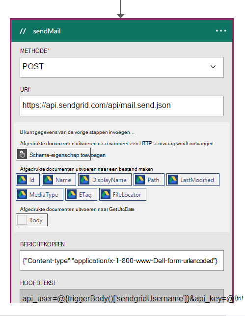
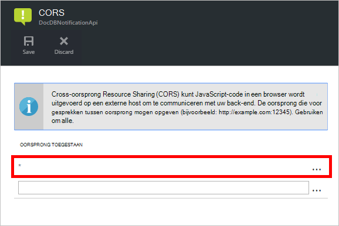

<properties 
    pageTitle="DocumentDB met logica Apps meldingen wijzigen | Microsoft Azure" 
    description="." 
    keywords="Wijzigingsmelding"
    services="documentdb" 
    authors="hedidin" 
    manager="jhubbard" 
    editor="mimig" 
    documentationCenter=""/>

<tags 
    ms.service="documentdb" 
    ms.workload="data-services" 
    ms.tgt_pltfrm="na" 
    ms.devlang="rest-api" 
    ms.topic="article" 
    ms.date="09/23/2016" 
    ms.author="b-hoedid"/>

# <a name="notifications-for-new-or-changed-documentdb-resources-using-logic-apps"></a>Meldingen voor nieuwe of gewijzigde DocumentDB resources met logica Apps

In dit artikel komt over van een vraag die ik zag een van de forums in de community Azure DocumentDB geboekt. De vraag was **DocumentDB biedt ondersteuning voor meldingen voor gewijzigde bronnen**?

Ik heb gewerkt met BizTalk Server voor vele jaren, en dit is heel gebruikelijk bij het gebruik van de [WCF LOB-Adapter](https://msdn.microsoft.com/library/bb798128.aspx). Dus besloot ik om te zien als ik deze functionaliteit in het DocumentDB voor nieuwe en/of gewijzigde documenten kan dupliceren.

Dit artikel biedt een overzicht van de onderdelen van de wijziging melding oplossing die een [trigger](documentdb-programming.md#trigger) en een [App logica](../app-service-logic/app-service-logic-what-are-logic-apps.md)bevat. Belangrijk codefragmenten inline worden geleverd en de hele oplossing is beschikbaar op [GitHub](https://github.com/HEDIDIN/DocDbNotifications).

## <a name="use-case"></a>Use-case

Het volgende artikel is de use-case voor dit artikel.

DocumentDB is de opslagplaats voor documenten die de gezondheid van niveau zeven internationale (HL7) snel gezondheidszorg interoperabiliteit Resources (FHIR). Gaan we ervan uit dat de database DocumentDB gecombineerd met de API en logica App in de berekening van een Server HL7 FHIR.  Een faciliteit voor gezondheidszorg patiëntgegevens worden opgeslagen in het DocumentDB 'Patiënten' database. Er zijn verschillende collecties binnen de patiënt database. Klinische, identificatie, enz. Patiënten informatie valt onder de identificatie.  U hebt een verzameling met de naam 'Patiënt'.

De afdeling Cardiologische apparatuur bijgehouden persoonsgegevens heide- en oefening. Zoeken naar nieuwe of gewijzigde patiëntrecords is tijdrovend. Ze de IT-afdeling gevraagd als er een manier dat ze een melding voor nieuwe of gewijzigde patiëntrecords kunnen ontvangen is.  

De IT-afdeling zei dat ze dit gemakkelijk kunnen bieden. Ze zei ook dat ze de documenten kunnen push naar [Azure Blob-opslag](https://azure.microsoft.com/services/storage/) zodat de afdeling Cardiologische apparatuur kan deze gemakkelijk toegankelijk.

## <a name="how-the-it-department-solved-the-problem"></a>Hoe de IT-afdeling is het probleem opgelost

De IT-afdeling besloten om deze toepassing te maken, als model voor het eerst.  Het leuke van het gebruik van Business Process Model en notatie (BPMN) is dat technische en niet-technische gebruikers gemakkelijk het begrijpen kan. Dit proces van volledige kennisgeving wordt beschouwd als een bedrijfsproces. 

## <a name="high-level-view-of-notification-process"></a>Globaal overzicht van meldingen

1. U begint met een App logica met een timer-trigger. Standaard wordt de trigger elk uur uitgevoerd.
2. Vervolgens doet u een HTTP POST naar de toepassing van de logica.
3. De logica App doet al het werk.


### <a name="lets-take-a-look-at-what-this-logic-app-does"></a>Laten we eens wat dit App logica wordt
Als u naar de volgende afbeelding kijkt, zijn er verschillende stappen in de workflow LogicApp.


De stappen zijn als volgt:

1. U moet de huidige UTC datum/tijd krijgen van een App-API.  De standaardwaarde is één uur vorige.

2. De datum/UTC-tijd wordt geconverteerd naar een Unix Timestamp-indeling. Dit is de standaardindeling voor tijdstempels in DocumentDB.

3. U BOEKT de waarde naar een API-App, die een DocumentDB query. De waarde wordt in een query gebruikt.

    ```SQL
        SELECT * FROM Patients p WHERE (p._ts >= @unixTimeStamp)
    ```

    > [AZURE.NOTE] De _ts vertegenwoordigt de metagegevens van de tijdstempel voor alle bronnen van DocumentDB.

4. Als er documenten gevonden, wordt het hoofdgedeelte van de response verzonden naar uw Azure Blob-opslag.

    > [AZURE.NOTE] BLOB-opslag vereist een opslag Azure-account. U moet een Azure Blob storage account creëren en een nieuwe Blob patiënten met de naam toevoegen. Zie voor meer informatie [over Azure opslag rekeningen](../storage/storage-create-storage-account.md) en [aan de slag met Azure Blob-opslag](../storage/storage-dotnet-how-to-use-blobs.md).

5. Ten slotte wordt een e-mail verzonden dat aangeeft dat de ontvanger van het aantal gevonden documenten. Als er geen documenten zijn gevonden, worden het e-mailbericht '0 documenten gevonden'. 

Nu dat u een idee van de werking van de werkstroom hebt, laten we op de manier waarop u het implementeert.

### <a name="lets-start-with-the-main-logic-app"></a>We beginnen met de belangrijkste logica App

Als u niet vertrouwd bent met logica Apps, ze zijn beschikbaar in de [Marketplace Azure](https://portal.azure.com/)voor meer informatie over deze in [Wat zijn Apps logica?](../app-service-logic/app-service-logic-what-are-logic-apps.md)

Wanneer u een nieuwe logica App maakt, wordt u gevraagd **Hoe wilt u beginnen?**

Wanneer u in het tekstvak klikt, hebt u een keuze van gebeurtenissen. Selecteer **handmatig: als een HTTP-aanvraag wordt ontvangen** voor deze toepassing logica zoals hieronder wordt weergegeven.


### <a name="design-view-of-your-completed-logic-app"></a>Ontwerpweergave van de voltooide logica App
We gaan en bekijk het voltooide ontwerpweergave voor de toepassing van de logica, die DocDB heet.


Bij het bewerken van de acties in de logica App Designer hebt u **uitgangen** van de HTTP-aanvraag of van de vorige actie kiezen zoals in de onderstaande sendMail actie.



Voor elke actie in uw werkstroom, kunt u een besluit; **Toevoegen van een actie** of **een voorwaarde toevoegen** zoals in de volgende afbeelding.


Als u **een voorwaarde toevoegen**selecteert, verschijnt er een formulier, zoals in de volgende afbeelding in te voeren van de logica.  Dit is in wezen een bedrijfsregel.  Als u in een veld klikt, hebt u een keuze van de parameters in de vorige actie te selecteren. U kunt de waarden ook rechtstreeks invoeren.


> [AZURE.NOTE] U hebt ook de mogelijkheid om alles in de weergave Code invoeren.

Laten we op de voltooide logica App in de codeweergave.  

```JSON
   
    "$schema": "https://schema.management.azure.com/providers/Microsoft.Logic/schemas/2015-08-01-preview/workflowdefinition.json#",
    "actions": {
        "Conversion": {
            "conditions": [
                {
                    "dependsOn": "GetUtcDate"
                }
            ],
            "inputs": {
                "method": "post",
                "queries": {
                    "currentdateTime": "@{body('GetUtcDate')}"
                },
                "uri": "https://docdbnotificationapi-debug.azurewebsites.net/api/Conversion"
            },
            "metadata": {
                "apiDefinitionUrl": "https://docdbnotificationapi-debug.azurewebsites.net/swagger/docs/v1",
                "swaggerSource": "custom"
            },
            "type": "Http"
        },
        "Createfile": {
            "conditions": [
                {
                    "expression": "@greater(length(body('GetDocuments')), 0)"
                },
                {
                    "dependsOn": "GetDocuments"
                }
            ],
            "inputs": {
                "body": "@body('GetDocuments')",
                "host": {
                    "api": {
                        "runtimeUrl": "https://logic-apis-westus.azure-apim.net/apim/azureblob"
                    },
                    "connection": {
                        "name": "@parameters('$connections')['azureblob']['connectionId']"
                    }
                },
                "method": "post",
                "path": "/datasets/default/files",
                "queries": {
                    "folderPath": "/patients",
                    "name": "Patient_@{guid()}.json"
                }
            },
            "type": "ApiConnection"
        },
        "GetDocuments": {
            "conditions": [
                {
                    "dependsOn": "Conversion"
                }
            ],
            "inputs": {
                "method": "post",
                "queries": {
                    "unixTimeStamp": "@body('Conversion')"
                },
                "uri": "https://docdbnotificationapi-debug.azurewebsites.net/api/Patient"
            },
            "metadata": {
                "apiDefinitionUrl": "https://docdbnotificationapi-debug.azurewebsites.net/swagger/docs/v1",
                "swaggerSource": "custom"
            },
            "type": "Http"
        },
        "GetUtcDate": {
            "conditions": [],
            "inputs": {
                "method": "get",
                "queries": {
                    "hoursBack": "@{int(triggerBody()['GetUtcDate_HoursBack'])}"
                },
                "uri": "https://docdbnotificationapi-debug.azurewebsites.net/api/Authorization"
            },
            "metadata": {
                "apiDefinitionUrl": "https://docdbnotificationapi-debug.azurewebsites.net/swagger/docs/v1",
                "swaggerSource": "custom"
            },
            "type": "Http"
        },
        "sendMail": {
            "conditions": [
                {
                    "dependsOn": "GetDocuments"
                }
            ],
            "inputs": {
                "body": "api_user=@{triggerBody()['sendgridUsername']}&api_key=@{triggerBody()['sendgridPassword']}&from=@{parameters('fromAddress')}&to=@{triggerBody()['EmailTo']}&subject=@{triggerBody()['Subject']}&text=@{int(length(body('GetDocuments')))} Documents Found",
                "headers": {
                    "Content-type": "application/x-www-form-urlencoded"
                },
                "method": "POST",
                "uri": "https://api.sendgrid.com/api/mail.send.json"
            },
            "type": "Http"
        }
    },
    "contentVersion": "1.0.0.0",
    "outputs": {
        "Results": {
            "type": "String",
            "value": "@{int(length(body('GetDocuments')))} Records Found"
        }
    },
    "parameters": {
        "$connections": {
            "defaultValue": {},
            "type": "Object"
        },
        "fromAddress": {
            "defaultValue": "user@msn.com",
            "type": "String"
        },
        "toAddress": {
            "defaultValue": "XXXXX@XXXXXXX.net",
            "type": "String"
        }
    },
    "triggers": {
        "manual": {
            "inputs": {
                "schema": {
                    "properties": {},
                    "required": [],
                    "type": "object"
                }
            },
            "type": "Manual"
        }
    
```

Als u niet bekend bent met wat de verschillende onderdelen in de code staat, kunt u de documentatie van de [Logica App Workflow Definition Language](http://aka.ms/logicappsdocs) weergeven.

U gebruikt een [Http-Webhook Trigger](https://sendgrid.com/blog/whats-webhook/)voor deze werkstroom. Als u de bovenstaande code bekijkt, ziet u de parameters zoals in het volgende voorbeeld.

```C#

    =@{triggerBody()['Subject']}

```

De `triggerBody()` geeft de parameters die zijn opgenomen in de hoofdtekst van een bericht van de REST de logica App REST API. De `()['Subject']` het veld vertegenwoordigt. Al deze parameters de JSON vormen instantie opgemaakt. 

> [AZURE.NOTE] Via een hook Internet hebt u volledige toegang naar de kop en de hoofdtekst van de aanvraag van de trigger. U wilt dat de tekst in deze toepassing.

Zoals eerder vermeld, kunt u de ontwerpfunctie parameters toewijzen of dat doen in de codeweergave.
Als u deze in de codeweergave, definiëren u welke eigenschappen hebben een waarde nodig, zoals in het volgende codevoorbeeld. 

```JSON

    "triggers": {
        "manual": {
            "inputs": {
            "schema": {
                "properties": {
            "Subject": {
                "type" : "String"   

            }
            },
                "required": [
            "Subject"
                 ],
                "type": "object"
            }
            },
            "type": "Manual"
        }
        }
```

Wat u doet is het een JSON-schema dat wordt doorgegeven maken uit het hoofdgedeelte van de HTTP POST.
De trigger wordt gestart, moet u de URL van een Callback.  U leert hoe hoger in de zelfstudie wordt gegenereerd.  

## <a name="actions"></a>Acties
We gaan kijken hoe elke actie in onze App logica werkt.

### <a name="getutcdate"></a>GetUTCDate

**Designer-weergave**


**Codeweergave**

```JSON

    "GetUtcDate": {
            "conditions": [],
            "inputs": {
            "method": "get",
            "queries": {
                "hoursBack": "@{int(triggerBody()['GetUtcDate_HoursBack'])}"
            },
            "uri": "https://docdbnotificationapi-debug.azurewebsites.net/api/Authorization"
            },
            "metadata": {
            "apiDefinitionUrl": "https://docdbnotificationapi-debug.azurewebsites.net/swagger/docs/v1"
            },
            "type": "Http"
        },

```

Deze actie HTTP-uitvoert GET-bewerking.  Het aanroept APP-GetUtcDate-API. De Uri gebruikt de eigenschap 'GetUtcDate_HoursBack' is in het lichaam van de Trigger wordt doorgegeven.  De waarde 'GetUtcDate_HoursBack' is ingesteld in de eerste App van logica. Later in de zelfstudie leert u meer over de App Trigger logica.

Deze actie roept de API App de UTC-datum string-waarde opvragen.

#### <a name="operations"></a>Bewerkingen

**Aanvraag**

```JSON

    {
        "uri": "https://docdbnotificationapi-debug.azurewebsites.net/api/Authorization",
        "method": "get",
        "queries": {
          "hoursBack": "24"
        }
    }

```

**Reactie**

```JSON

    {
        "statusCode": 200,
        "headers": {
          "pragma": "no-cache",
          "cache-Control": "no-cache",
          "date": "Fri, 26 Feb 2016 15:47:33 GMT",
          "server": "Microsoft-IIS/8.0",
          "x-AspNet-Version": "4.0.30319",
          "x-Powered-By": "ASP.NET"
        },
        "body": "Fri, 15 Jan 2016 23:47:33 GMT"
    }

```

De volgende stap is de UTC-datum/tijd-waarde converteren naar de Unix tijdstempel, een dubbele type .NET.

### <a name="conversion"></a>Conversie

##### <a name="designer-view"></a>Designer-weergave


##### <a name="code-view"></a>Codeweergave

```JSON

    "Conversion": {
        "conditions": [
        {
            "dependsOn": "GetUtcDate"
        }
        ],
        "inputs": {
        "method": "post",
        "queries": {
            "currentDateTime": "@{body('GetUtcDate')}"
        },
        "uri": "https://docdbnotificationapi-debug.azurewebsites.net/api/Conversion"
        },
        "metadata": {
        "apiDefinitionUrl": "https://docdbnotificationapi-debug.azurewebsites.net/swagger/docs/v1"
        },
        "type": "Http"
    },

```

In deze stap geeft u in de opgehaalde waarde van de GetUTCDate.  Er is een voorwaarde dependsOn, wat betekent dat de actie GetUTCDate moet voltooid. Als dit niet het geval is, wordt deze actie overgeslagen. 

Deze actie wordt uw App API voor het verwerken van de conversie.

#### <a name="operations"></a>Bewerkingen

##### <a name="request"></a>Aanvraag

```JSON

    {
        "uri": "https://docdbnotificationapi-debug.azurewebsites.net/api/Conversion",
        "method": "post",
        "queries": {
        "currentDateTime": "Fri, 15 Jan 2016 23:47:33 GMT"
        }
    }   
```

##### <a name="response"></a>Reactie

```JSON

    {
        "statusCode": 200,
        "headers": {
          "pragma": "no-cache",
          "cache-Control": "no-cache",
          "date": "Fri, 26 Feb 2016 15:47:33 GMT",
          "server": "Microsoft-IIS/8.0",
          "x-AspNet-Version": "4.0.30319",
          "x-Powered-By": "ASP.NET"
        },
        "body": 1452901653
    }
```

In de volgende actie doet u een POST-bewerking aan onze API App.

### <a name="getdocuments"></a>GetDocuments 

##### <a name="designer-view"></a>Designer-weergave


##### <a name="code-view"></a>Codeweergave

```JSON

    "GetDocuments": {
        "conditions": [
        {
            "dependsOn": "Conversion"
        }
        ],
        "inputs": {
        "method": "post",
        "queries": {
            "unixTimeStamp": "@{body('Conversion')}"
        },
        "uri": "https://docdbnotificationapi-debug.azurewebsites.net/api/Patient"
        },
        "metadata": {
        "apiDefinitionUrl": "https://docdbnotificationapi-debug.azurewebsites.net/swagger/docs/v1"
        },
        "type": "Http"
    },

```

U gaat geven in de hoofdtekst van het antwoord van de conversie-actie voor de actie GetDocuments. Dit is een parameter in de Uri:

 
```C#

    unixTimeStamp=@{body('Conversion')}

```

De actie QueryDocuments heeft een HTTP POST-bewerking API App. 

De methode met de naam is **QueryForNewPatientDocuments**.

#### <a name="operations"></a>Bewerkingen

##### <a name="request"></a>Aanvraag

```JSON

    {
        "uri": "https://docdbnotificationapi-debug.azurewebsites.net/api/Patient",
        "method": "post",
        "queries": {
        "unixTimeStamp": "1452901653"
        }
    }
```

##### <a name="response"></a>Reactie

```JSON

    {
        "statusCode": 200,
        "headers": {
        "pragma": "no-cache",
        "cache-Control": "no-cache",
        "date": "Fri, 26 Feb 2016 15:47:35 GMT",
        "server": "Microsoft-IIS/8.0",
        "x-AspNet-Version": "4.0.30319",
        "x-Powered-By": "ASP.NET"
        },
        "body": [
        {
            "id": "xcda",
            "_rid": "vCYLAP2k6gAXAAAAAAAAAA==",
            "_self": "dbs/vCYLAA==/colls/vCYLAP2k6gA=/docs/vCYLAP2k6gAXAAAAAAAAAA==/",
            "_ts": 1454874620,
            "_etag": "\"00007d01-0000-0000-0000-56b79ffc0000\"",
            "resourceType": "Patient",
            "text": {
            "status": "generated",
            "div": "<div>\n      \n      <p>Henry Levin the 7th</p>\n    \n    </div>"
            },
            "identifier": [
            {
                "use": "usual",
                "type": {
                "coding": [
                    {
                    "system": "http://hl7.org/fhir/v2/0203",
                    "code": "MR"
                    }
                ]
                },
                "system": "urn:oid:2.16.840.1.113883.19.5",
                "value": "12345"
            }
            ],
            "active": true,
            "name": [
            {
                    "family": [
                        "Levin"
                    ],
                    "given": [
                        "Henry"
                    ]
                }
            ],
            "gender": "male",
            "birthDate": "1932-09-24",
            "managingOrganization": {
                "reference": "Organization/2.16.840.1.113883.19.5",
                "display": "Good Health Clinic"
            }
        },

```

De documenten opslaan in [Azure Blog opslag](https://azure.microsoft.com/services/storage/)is de volgende actie. 

> [AZURE.NOTE] BLOB-opslag vereist een opslag Azure-account. U moet een Azure Blob storage account creëren en een nieuwe Blob patiënten met de naam toevoegen. Zie [aan de slag met Azure Blob-opslag](../storage/storage-dotnet-how-to-use-blobs.md)voor meer informatie.

### <a name="create-file"></a>Bestand maken

##### <a name="designer-view"></a>Designer-weergave


##### <a name="code-view"></a>Codeweergave

```JSON

    {
    "host": {
        "api": {
            "runtimeUrl": "https://logic-apis-westus.azure-apim.net/apim/azureblob"
        },
        "connection": {
            "name": "subscriptions/fxxxxxc079-4e5d-b002-xxxxxxxxxx/resourceGroups/Api-Default-Central-US/providers/Microsoft.Web/connections/azureblob"
        }
    },
    "method": "post",
    "path": "/datasets/default/files",
    "queries": {
        "folderPath": "/patients",
        "name": "Patient_17513174-e61d-4b56-88cb-5cf383db4430.json"
    },
    "body": [
        {
            "id": "xcda",
            "_rid": "vCYLAP2k6gAXAAAAAAAAAA==",
            "_self": "dbs/vCYLAA==/colls/vCYLAP2k6gA=/docs/vCYLAP2k6gAXAAAAAAAAAA==/",
            "_ts": 1454874620,
            "_etag": "\"00007d01-0000-0000-0000-56b79ffc0000\"",
            "resourceType": "Patient",
            "text": {
                "status": "generated",
                "div": "<div>\n      \n      <p>Henry Levin the 7th</p>\n    \n    </div>"
            },
            "identifier": [
                {
                    "use": "usual",
                    "type": {
                        "coding": [
                            {
                                "system": "http://hl7.org/fhir/v2/0203",
                                "code": "MR"
                            }
                        ]
                    },
                    "system": "urn:oid:2.16.840.1.113883.19.5",
                    "value": "12345"
                }
            ],
            "active": true,
            "name": [
                {
                    "family": [
                        "Levin"
                    ],
                    "given": [
                        "Henry"
                    ]
                }
            ],
            "gender": "male",
            "birthDate": "1932-09-24",
            "managingOrganization": {
                "reference": "Organization/2.16.840.1.113883.19.5",
                "display": "Good Health Clinic"
            }
        },

```

De code is gegenereerd op basis van de actie in de ontwerpfunctie. U hoeft niet de code te wijzigen.

Als u niet bekend bent met de Azure Blob-API gebruiken, raadpleegt u [aan de slag met de Azure blob storage API](../connectors/connectors-create-api-azureblobstorage.md).

#### <a name="operations"></a>Bewerkingen

##### <a name="request"></a>Aanvraag

```JSON

    "host": {
        "api": {
            "runtimeUrl": "https://logic-apis-westus.azure-apim.net/apim/azureblob"
        },
        "connection": {
            "name": "subscriptions/fxxxxxc079-4e5d-b002-xxxxxxxxxx/resourceGroups/Api-Default-Central-US/providers/Microsoft.Web/connections/azureblob"
        }
    },
    "method": "post",
    "path": "/datasets/default/files",
    "queries": {
        "folderPath": "/patients",
        "name": "Patient_17513174-e61d-4b56-88cb-5cf383db4430.json"
    },
    "body": [
        {
            "id": "xcda",
            "_rid": "vCYLAP2k6gAXAAAAAAAAAA==",
            "_self": "dbs/vCYLAA==/colls/vCYLAP2k6gA=/docs/vCYLAP2k6gAXAAAAAAAAAA==/",
            "_ts": 1454874620,
            "_etag": "\"00007d01-0000-0000-0000-56b79ffc0000\"",
            "resourceType": "Patient",
            "text": {
                "status": "generated",
                "div": "<div>\n      \n      <p>Henry Levin the 7th</p>\n    \n    </div>"
            },
            "identifier": [
                {
                    "use": "usual",
                    "type": {
                        "coding": [
                            {
                                "system": "http://hl7.org/fhir/v2/0203",
                                "code": "MR"
                            }
                        ]
                    },
                    "system": "urn:oid:2.16.840.1.113883.19.5",
                    "value": "12345"
                }
            ],
            "active": true,
            "name": [
                {
                    "family": [
                        "Levin"
                    ],
                    "given": [
                        "Henry"
                    ]
                }
            ],
            "gender": "male",
            "birthDate": "1932-09-24",
            "managingOrganization": {
                "reference": "Organization/2.16.840.1.113883.19.5",
                "display": "Good Health Clinic"
            }
        },….


```

##### <a name="response"></a>Reactie

```JSON

    {
        "statusCode": 200,
        "headers": {
        "pragma": "no-cache",
        "x-ms-request-id": "2b2f7c57-2623-4d71-8e53-45c26b30ea9d",
        "cache-Control": "no-cache",
        "date": "Fri, 26 Feb 2016 15:47:36 GMT",
        "set-Cookie": "ARRAffinity=29e552cea7db23196f7ffa644003eaaf39bc8eb6dd555511f669d13ab7424faf;Path=/;Domain=127.0.0.1",
        "server": "Microsoft-HTTPAPI/2.0",
        "x-AspNet-Version": "4.0.30319",
        "x-Powered-By": "ASP.NET"
        },
        "body": {
        "Id": "0B0nBzHyMV-_NRGRDcDNMSFAxWFE",
        "Name": "Patient_47a2a0dc-640d-4f01-be38-c74690d085cb.json",
        "DisplayName": "Patient_47a2a0dc-640d-4f01-be38-c74690d085cb.json",
        "Path": "/Patient/Patient_47a2a0dc-640d-4f01-be38-c74690d085cb.json",
        "LastModified": "2016-02-26T15:47:36.215Z",
        "Size": 65647,
        "MediaType": "application/octet-stream",
        "IsFolder": false,
        "ETag": "\"c-g_a-1OtaH-kNQ4WBoXLp3Zv9s/MTQ1NjUwMTY1NjIxNQ\"",
        "FileLocator": "0B0nBzHyMV-_NRGRDcDNMSFAxWFE"
        }
    }
```

De laatste stap is een e-mailbericht verzenden

### <a name="sendemail"></a>sendEmail

##### <a name="designer-view"></a>Designer-weergave


##### <a name="code-view"></a>Codeweergave

```JSON


    "sendMail": {
        "conditions": [
        {
            "dependsOn": "GetDocuments"
        }
        ],
        "inputs": {
        "body": "api_user=@{triggerBody()['sendgridUsername']}&api_key=@{triggerBody()['sendgridPassword']}&from=@{parameters('fromAddress')}&to=@{triggerBody()['EmailTo']}&subject=@{triggerBody()['Subject']}&text=@{int(length(body('GetDocuments')))} Documents Found",
        "headers": {
            "Content-type": "application/x-www-form-urlencoded"
        },
        "method": "POST",
        "uri": "https://api.sendgrid.com/api/mail.send.json"
        },
        "type": "Http"
    }
```

In deze actie kunt u een e-mailbericht verzenden.  U [SendGrid](https://sendgrid.com/marketing/sendgrid-services?cvosrc=PPC.Bing.sendgrib&cvo_cid=SendGrid%20-%20US%20-%20Brand%20-%20&mc=Paid%20Search&mcd=BingAds&keyword=sendgrib&network=o&matchtype=e&mobile=&content=&search=1&utm_source=bing&utm_medium=cpc&utm_term=%5Bsendgrib%5D&utm_content=%21acq%21v2%2134335083397-8303227637-1649139544&utm_campaign=SendGrid+-+US+-+Brand+-+%28English%29)gebruikt.   

Deze code is gegenereerd met behulp van een sjabloon voor App logica en SendGrid die zich in de [opslagplaats van 101 logica-app sendgrid-Github](https://github.com/Azure/azure-quickstart-templates/tree/master/101-logic-app-sendgrid).
 
De HTTP-bewerking is een advertentie. 

De vergunning-parameters zijn in de trigger-eigenschappen

```JSON

    },
        "sendgridPassword": {
             "type": "SecureString"
         },
         "sendgridUsername": {
            "type": "String"
         }

        In addition, other parameters are static values set in the Parameters section of the Logic App. These are:
        },
        "toAddress": {
            "defaultValue": "XXXX@XXXX.com",
            "type": "String"
        },
        "fromAddress": {
            "defaultValue": "XXX@msn.com",
            "type": "String"
        },
        "emailBody": {
            "defaultValue": "@{string(concat(int(length(actions('QueryDocuments').outputs.body)) Records Found),'/n', actions('QueryDocuments').outputs.body)}",
            "type": "String"
        },

```

De emailBody is het aantal documenten dat is geretourneerd door de query die "0" of meer, samen met worden kan, "Records gevonden" aaneen. De rest van de parameters van de Trigger-parameters worden ingesteld.

Deze actie is afhankelijk van de actie **GetDocuments** .

#### <a name="operations"></a>Bewerkingen

##### <a name="request"></a>Aanvraag
```JSON

    {
        "uri": "https://api.sendgrid.com/api/mail.send.json",
        "method": "POST",
        "headers": {
        "Content-type": "application/x-www-form-urlencoded"
        },
        "body": "api_user=azureuser@azure.com&api_key=Biz@Talk&from=user@msn.com&to=XXXX@XXXX.com&subject=New Patients&text=37 Documents Found"
    }

```

##### <a name="response"></a>Reactie

```JSON

    {
        "statusCode": 200,
        "headers": {
        "connection": "keep-alive",
        "x-Frame-Options": "DENY,DENY",
        "access-Control-Allow-Origin": "https://sendgrid.com",
        "date": "Fri, 26 Feb 2016 15:47:35 GMT",
        "server": "nginx"
        },
        "body": {
        "message": "success"
        }
    }
```

U wilt tenslotte kunnen zien van de resultaten van uw App logica op de Portal Azure. Hiervoor kunt u een parameter toevoegen aan de sectie Output.


```JSON

    "outputs": {
        "Results": {
            "type": "String",
            "value": "@{int(length(actions('QueryDocuments').outputs.body))} Records Found"
        }

```

Hiermee wordt dezelfde waarde die in het e-mailbericht is verzonden. In de volgende afbeelding ziet u een voorbeeld waarin '29 Records gevonden'.


## <a name="metrics"></a>Statistieken
U kunt controle voor de belangrijkste App logica in de portal. Hiermee kunt u de vertraging uitgevoerd en andere gebeurtenissen weergeven in de volgende afbeelding weergeven.


## <a name="docdb-trigger"></a>De Trigger DocDb

Deze logica App is die de werkstroom wordt gestart op uw belangrijkste logica App.

De volgende afbeelding ziet u de ontwerpweergave.


```JSON

    {
        "$schema": "https://schema.management.azure.com/providers/Microsoft.Logic/schemas/2015-08-01-preview/workflowdefinition.json#",
        "actions": {
        "Http": {
            "conditions": [],
            "inputs": {
            "body": {
                "EmailTo": "XXXXXX@XXXXX.net",
                "GetUtcDate_HoursBack": "24",
                "Subject": "New Patients",
                "sendgridPassword": "********",
                "sendgridUsername": "azureuser@azure.com"
            },
            "method": "POST",
            "uri": "https://prod-01.westus.logic.azure.com:443/workflows/12a1de57e48845bc9ce7a247dfabc887/triggers/manual/run?api-version=2015-08-01-preview&sp=%2Ftriggers%2Fmanual%2Frun&sv=1.0&sig=ObTlihr529ATIuvuG-dhxOgBL4JZjItrvPQ8PV6973c"
            },
            "type": "Http"
        }
        },
        "contentVersion": "1.0.0.0",
        "outputs": {
        "Results": {
            "type": "String",
            "value": "@{body('Http')['status']}"
        }
        },
        "parameters": {},
        "triggers": {
        "recurrence": {
            "recurrence": {
            "frequency": "Hour",
            "interval": 24
            },
            "type": "Recurrence"
        }
        }
    }

```

De Trigger is voor een herhaling van 24 uur ingesteld. De actie is een HTTP-POST die de Callback-URL voor de belangrijkste logica App gebruikt. De hoofdtekst bevat de parameters die zijn opgegeven in het Schema JSON. 

#### <a name="operations"></a>Bewerkingen

##### <a name="request"></a>Aanvraag

```JSON

    {
        "uri": "https://prod-01.westus.logic.azure.com:443/workflows/12a1de57e48845bc9ce7a247dfabc887/triggers/manual/run?api-version=2015-08-01-preview&sp=%2Ftriggers%2Fmanual%2Frun&sv=1.0&sig=ObTlihr529ATIuvuG-dhxOgBL4JZjItrvPQ8PV6973c",
        "method": "POST",
        "body": {
        "EmailTo": "XXXXXX@XXXXX.net",
        "GetUtcDate_HoursBack": "24",
        "Subject": "New Patients",
        "sendgridPassword": "********",
        "sendgridUsername": "azureuser@azure.com"
        }
    }

```

##### <a name="response"></a>Reactie

```JSON

    {
        "statusCode": 202,
        "headers": {
        "pragma": "no-cache",
        "x-ms-ratelimit-remaining-workflow-writes": "7486",
        "x-ms-ratelimit-burst-remaining-workflow-writes": "1248",
        "x-ms-request-id": "westus:2d440a39-8ba5-4a9c-92a6-f959b8d2357f",
        "cache-Control": "no-cache",
        "date": "Thu, 25 Feb 2016 21:01:06 GMT"
        }
    }
```

Nu bekijken we de App-API.

## <a name="docdbnotificationapi"></a>DocDBNotificationApi

Er zijn verschillende bewerkingen in de app, gaat u slechts drie gebruiken.

* GetUtcDate
* ConvertToTimeStamp
* QueryForNewPatientDocuments

### <a name="docdbnotificationapi-operations"></a>DocDBNotificationApi activiteiten
Laten we de Swagger-documentatie

> [AZURE.NOTE] Zodat u de bewerkingen extern aanroepen, moet u een oorsprongwaarde van toegestane CORS toevoegen ' * ' (zonder aanhalingstekens) in de instellingen van uw App API zoals in de volgende afbeelding.



#### <a name="getutcdate"></a>GetUtcDate


#### <a name="converttotimestamp"></a>ConvertToTimeStamp


#### <a name="queryfornewpatientdocuments"></a>QueryForNewPatientDocuments


Laten we de code achter deze bewerking.

#### <a name="getutcdate"></a>GetUtcDate

```C#

    /// <summary>
    /// Gets the current UTC Date value
    /// </summary>
    /// <returns></returns>
    [H ttpGet]
    [Metadata("GetUtcDate", "Gets the current UTC Date value minus the Hours Back")]
    [SwaggerOperation("GetUtcDate")]
    [SwaggerResponse(HttpStatusCode.OK, type: typeof (string))]
    [SwaggerResponse(HttpStatusCode.InternalServerError, "Internal Server Operation Error")]
    public string GetUtcDate(
       [Metadata("Hours Back", "How many hours back from the current Date Time")] int hoursBack)
    {


        return DateTime.UtcNow.AddHours(-hoursBack).ToString("r");
    }
```

Deze bewerking wordt de geeft als resultaat de huidige UTC DateTime min de waarde HoursBack.

#### <a name="converttotimestamp"></a>ConvertToTimeStamp

``` C#

        /// <summary>
        ///     Converts DateTime to double
        /// </summary>
        /// <param name="currentdateTime"></param>
        /// <returns></returns>
        [Metadata("Converts Universal DateTime to number")]
        [SwaggerResponse(HttpStatusCode.OK, null, typeof (double))]
        [SwaggerResponse(HttpStatusCode.BadRequest, "DateTime is invalid")]
        [SwaggerResponse(HttpStatusCode.InternalServerError)]
        [SwaggerOperation(nameof(ConvertToTimestamp))]
        public double ConvertToTimestamp(
            [Metadata("currentdateTime", "DateTime value to convert")] string currentdateTime)
        {
            double result;

            try
            {
                var uncoded = HttpContext.Current.Server.UrlDecode(currentdateTime);

                var newDateTime = DateTime.Parse(uncoded);
                //create Timespan by subtracting the value provided from the Unix Epoch
                var span = newDateTime - new DateTime(1970, 1, 1, 0, 0, 0, 0).ToLocalTime();

                //return the total seconds (which is a UNIX timestamp)
                result = span.TotalSeconds;
            }
            catch (Exception e)
            {
                throw new Exception("unable to convert to Timestamp", e.InnerException);
            }

            return result;
        }

```

Deze bewerking omgezet in het antwoord van de GetUtcDate-bewerking een double-waarde.

#### <a name="queryfornewpatientdocuments"></a>QueryForNewPatientDocuments

```C#

        /// <summary>
        ///     Query for new Patient Documents
        /// </summary>
        /// <param name="unixTimeStamp"></param>
        /// <returns>IList</returns>
        [Metadata("QueryForNewDocuments",
            "Query for new Documents where the Timestamp is greater than or equal to the DateTime value in the query parameters."
            )]
        [SwaggerOperation("QueryForNewDocuments")]
        [SwaggerResponse(HttpStatusCode.OK, type: typeof (Task<IList<Document>>))]
        [SwaggerResponse(HttpStatusCode.BadRequest, "The syntax of the SQL Statement is incorrect")]
        [SwaggerResponse(HttpStatusCode.NotFound, "No Documents were found")]
        [SwaggerResponse(HttpStatusCode.InternalServerError, "Internal Server Operation Error")]
        // ReSharper disable once ConsiderUsingAsyncSuffix
        public IList<Document> QueryForNewPatientDocuments(
            [Metadata("UnixTimeStamp", "The DateTime value used to search from")] double unixTimeStamp)
        {
            var context = new DocumentDbContext();
            var filterQuery = string.Format(InvariantCulture, "SELECT * FROM Patient p WHERE p._ts >=  {0}",
                unixTimeStamp);
            var options = new FeedOptions {MaxItemCount = -1};


            var collectionLink = UriFactory.CreateDocumentCollectionUri(DocumentDbContext.DatabaseId,
                DocumentDbContext.CollectionId);

            var response =
                context.Client.CreateDocumentQuery<Document>(collectionLink, filterQuery, options).AsEnumerable();

            return response.ToList();
    }

```

Deze bewerking wordt de [DocumentDB.NET SDK](documentdb-sdk-dotnet.md) voor het maken van een query van het document. 

```C#
     CreateDocumentQuery<Document>(collectionLink, filterQuery, options).AsEnumerable();
```

Het antwoord van de ConvertToTimeStamp-bewerking (unixTimeStamp) wordt doorgegeven. De bewerking wordt een lijst van documenten, `IList<Document>`.

Eerder hadden wij over de CallbackURL. Om de workflow in uw belangrijkste logica App start, moet u aan te roepen met behulp van de CallbackURL.

## <a name="callbackurl"></a>CallbackURL

Als u wilt beginnen, moet u uw Azure AD-Token.  Kan het moeilijk zijn om dit token. Ik was op zoek naar een eenvoudige methode en Jeff Hollan, die een programma Azure logica App manager, aanbevolen gebruik van de [armclient](http://blog.davidebbo.com/2015/01/azure-resource-manager-client.html) in PowerShell.  U kunt deze installeren volgens de aanwijzingen.

De bewerkingen die u wilt gebruiken, zijn aanmeldings-id en ARM-API aanroept.
 
Aanmelden: U dezelfde referenties aangemeld bij de Portal Azure. 

De bewerking ARM Api aanroepen is dat de CallBackURL wordt gegenereerd.

In PowerShell aanroepen u deze als volgt:  

```powershell

    ArmClient.exe post https://management.azure.com/subscriptions/[YOUR SUBSCRIPTION ID/resourcegroups/[YOUR RESOURCE GROUP]/providers/Microsoft.Logic/workflows/[YOUR LOGIC APP NAME/triggers/manual/listcallbackurl?api-version=2015-08-01-preview

```

Het resultaat ziet er zo uit:

```powershell

    https://prod-02.westus.logic.azure.com:443/workflows/12a1de57e48845bc9ce7a247dfabc887/triggers/manual/run?api-version=2015-08-01-prevaiew&sp=%2Ftriggers%2Fmanual%2Frun&sv=1.0&sig=XXXXXXXXXXXXXXXXXXX

```

U kunt een hulpprogramma zoals [postman](http://www.getpostman.com/) u belangrijkste logica App testen zoals in de volgende afbeelding.


De volgende tabel vindt u de Trigger-parameters die de tekst van de App DocDB Trigger logica.

Parameter | Beschrijving 
--- | --- 
GetUtcDate_HoursBack | Het aantal uren voor de begindatum van de zoekopdracht instellen
sendgridUsername | Het aantal uren voor de begindatum van de zoekopdracht instellen
sendgridPassword | De gebruikersnaam voor e-mailbericht verzenden raster
EmailTo | Het e-mailadres het e-mailbericht ontvangt
Onderwerp | Het onderwerp voor het e-mailbericht

## <a name="viewing-the-patient-data-in-the-azure-blob-service"></a>De patiënt gegevens bekijken in de Azure Blob-service

Ga naar uw account Azure opslag en selecteer BLOB's onder services, zoals wordt weergegeven in de volgende afbeelding.

 

U zult kunnen zien van de patiënt blob gegevens zoals hieronder wordt weergegeven.


## <a name="summary"></a>Samenvatting

In dit scenario hebt u het volgende geleerd:

* Het is mogelijk voor het implementeren van meldingen in DocumentDB.
* Logica Apps gebruikt, kunt u het proces automatiseren.
* Logica Apps gebruikt, kun je de tijd die nodig is voor het leveren van een toepassing.
* Met behulp van HTTP kunt u eenvoudig een API App binnen een logica App verbruiken.
* U kunt gemakkelijk een CallBackURL ter vervanging van de HTTP-Listener maken.
* Met logica Apps Designer kunt u eenvoudig aangepaste werkstromen maken.

De sleutel is om vooruit te plannen en het model van uw workflow.

## <a name="next-steps"></a>Volgende stappen
Download en gebruik de code App logica op [Github](https://github.com/HEDIDIN/DocDbNotifications). Ik nodigen u uit op de toepassing bouwen en wijzigingen in de repo indienen. 

Bezoek voor meer informatie over DocumentDB, het [Leren pad](https://azure.microsoft.com/documentation/learning-paths/documentdb/).
