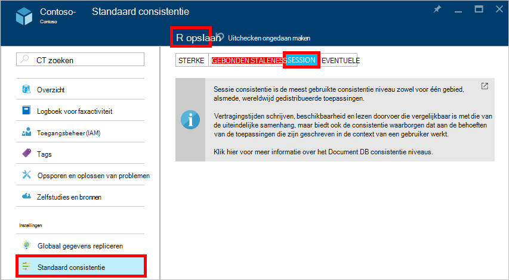

<properties
    pageTitle="Niveaus van consistentie in DocumentDB | Microsoft Azure"
    description="DocumentDB heeft vier niveaus voor consistentie om saldo uiteindelijk consistentie, beschikbaarheid en latentie e-mailverkeer."
    keywords="uiteindelijke algehele consistentie, documentdb, azure, Microsoft azure"
    services="documentdb"
    authors="syamkmsft"
    manager="jhubbard"
    editor="cgronlun"
    documentationCenter=""/>

<tags
    ms.service="documentdb"
    ms.workload="data-services"
    ms.tgt_pltfrm="na"
    ms.devlang="na"
    ms.topic="article"
    ms.date="08/24/2016"
    ms.author="syamk"/>

# Niveaus van consistentie in DocumentDB

Azure DocumentDB is ontworpen vanaf de grond omhoog met wereldwijde distributie in gedachten. Het is ontworpen om lage latentie voorspelbare garanties, een SLA van 99,99% beschikbaarheid en meerdere goed gedefinieerde beperkte consistentie modellen bieden. Op dit moment DocumentDB biedt vier niveaus van consistentie: sterk, begrensd staleness sessie, en uiteindelijk. Naast de **sterke** en de **uiteindelijke algehele consistentie** modellen meestal aangeboden door andere databases NoSQL DocumentDB ook biedt twee zorgvuldig gecodificeerde en geoperationaliseerd consistentie modellen – **staleness begrensd** en **sessie**, en hun bruikbaarheid tegen echte wereld use-cases is gevalideerd. Gezamenlijk kunnen deze consistentie op vier niveaus u afweging goed gemotiveerde tussen consistentie, beschikbaarheid en latentie. 

## Bereik van consistentie

De granulatie van de samenhang is binnen het bereik van een enkele aanvraag. Een aanvraag kan overeenkomen met een invoegen, vervangen, upsert of transactie (met of zonder de uitvoering van een bijbehorende vóór of na de trigger) verwijderen. Of een schrijfopdracht kan overeenkomen met de transactionele uitvoering van een JavaScript opgeslagen procedure die via meerdere documenten in een partitie. Net als bij het schrijven, een transactie lezen/query is ook binnen het bereik van een enkele aanvraag. De gebruiker kan worden verlangd pagineren over een grote resultaatset, spanning meerdere partities, maar elke transactie is binnen het bereik van één pagina en van binnen een enkele partitie bediend gelezen.

## Niveaus samenhang

U kunt een standaardniveau consistentie op uw databaseaccount die wordt toegepast op alle collecties (langs alle databases) onder de databaseaccount van uw. Standaard lees- en query's die worden uitgegeven tegen de door gebruiker gedefinieerde bronnen gebruikt het standaardniveau voor consistentie in de databaseaccount opgegeven. Lekker, het niveau van de consistentie van een aanvraag voor een specifieke lezen/query door te geven van de verzoek-header [[x-ms-consistentie-niveau]](https://msdn.microsoft.com/library/azure/mt632096.aspx) . Er zijn vier soorten consistentie niveaus ondersteund door het protocol van de replicatie DocumentDB een duidelijk compromis tussen specifieke consistentie waarborgen en prestaties bieden, zoals hieronder beschreven.

![DocumentDB biedt verschillende, duidelijk zijn gedefinieerd (beperkte) consistentie modellen om uit te kiezen][1]

**Sterke**: 

- Sterke samenhang biedt een garantie van [linearizability](https://aphyr.com/posts/313-strong-consistency-models) met gegarandeerd de meest recente versie van een document gelezen. 
- Sterke samenhang zorgt ervoor dat een schrijfbewerking alleen zichtbaar is nadat u deze blijvend wordt toegewezen door het quorum meerderheid van replica's. Een schrijven ofwel synchroon hecht blijvend door zowel de primaire als het quorum van secundaire servers of wordt afgebroken. Lees altijd wordt bevestigd door de meeste quorum lezen, een client een niet-doorgevoerde of gedeeltelijke schrijven nooit kunt zien en altijd gegarandeerd de nieuwste erkende schrijven lezen. 
- DocumentDB-accounts die zijn geconfigureerd voor het gebruik van sterke samenhang koppelen niet meer dan één regio van Azure aan de account DocumentDB. 
- De kosten van een leesbewerking (uitgedrukt in [eenheden van de aanvraag](documentdb-request-units.md) verbruikt) met sterke samenhang is hoger dan de sessie en uiteindelijk, maar hetzelfde als gebonden staleness.
 

**Staleness dat wordt begrensd**: 

- Begrensd staleness consistentie waarborgen die gelezen bij schrijfbewerkingen door maximaal *K* versies of prefixen van een document of *t achterblijven kunnen* -tijdsinterval. 
- Daarom bij het kiezen van gebonden staleness, kan de "staleness" kan worden geconfigureerd op twee manieren: 
    - Aantal *K* versies van het document waarop de leest bij de schrijfbewerkingen achterblijven
    - Tijdsinterval *t* 
- Staleness biedt totale wereldwijde bestellingen, behalve in het venster' staleness' wordt begrensd. Opmerking het monotone lezen dat bestaat in een gebied binnen en buiten de "staleness venster". 
- Gebonden staleness biedt een sterkere samenhang garantie dan sessie of uiteindelijke algehele consistentie. Wereldwijd gedistribueerde toepassingen, wordt u aangeraden u gebonden staleness voor scenario's waarin u graag wilt hebben sterke samenhang maar ook wilt 99,99% beschikbaarheid en lage latentie. 
- DocumentDB-accounts die zijn geconfigureerd met begrensde staleness consistentie kunnen u een willekeurig aantal Azure regio's koppelen aan hun account DocumentDB. 
- De kosten van een leesbewerking (wat de RUs verbruikt) met een begrensde staleness hoger is dan sessie en uiteindelijke algehele consistentie, maar hetzelfde als sterke samenhang.

**Sessie**: 

- In tegenstelling tot de globale consistentie-modellen aangeboden door sterke en begrensde staleness consistentie niveaus samenhang sessie is binnen het bereik van een clientsessie. 
- Consistentie van de sessie is ideaal voor alle scenario's waarin een apparaat of gebruiker de sessie is betrokken aangezien garant monotone leest, monotone schrijven en lezen garandeert uw eigen schrijft (RYW). 
- Sessie consistentie consistentie voorspelbare voor een sessie en maximale doorvoer lezen tijdens het bieden van de laagste latentie schrijven en lezen. 
- DocumentDB-accounts die zijn geconfigureerd met de consistentie van de sessie kunnen een willekeurig aantal Azure regio's koppelen aan hun account DocumentDB. 
- De kosten van een leesbewerking (wat de RUs verbruikt) is kleiner dan sterk en begrensde staleness, maar meer dan de uiteindelijke algehele consistentie met sessie consistent niveau
 

**Uiteindelijk**: 

- Uiteindelijke algehele consistentie zorgt ervoor dat bij het ontbreken van eventuele verdere schrijft, de replica's in de groep zal uiteindelijk convergeren. 
- Uiteindelijke algehele consistentie is de zwakste vorm van consistentie waar de waarden die ouder zijn dan degene die was eerder op een client kan krijgen.
- Uiteindelijke algehele consistentie van de zwakste meer consistentie, maar biedt de laagste latentie voor lees- en schrijfbewerkingen.
- DocumentDB-accounts die zijn geconfigureerd met uiteindelijke algehele consistentie kunnen u een willekeurig aantal Azure regio's koppelen aan hun account DocumentDB. 
- De kosten van een leesbewerking (wat de RUs verbruikt) met de consistentie van het uiteindelijke niveau is de laagste van de niveaus voor de consistentie van DocumentDB.

## Consistentie waarborgen

De volgende tabel worden verschillende consistentie waarborgen die overeenkomt met de consistentie van de vier niveaus vastgelegd.

| Garantie                                                         |    Sterke                                       |    Gebonden Staleness                                                                           |    Sessie                                       |    Eventuele                                 |
|----------------------------------------------------------|-------------------------------------------------|------------------------------------------------------------------------------------------------|--------------------------------------------------|--------------------------------------------------|
|    **Totale wereldwijde bestellingen**                                |    Ja                                          |    Ja, buiten het venster' staleness'                                                      |    Nee, de volgorde van gedeeltelijke "sessie"                   |    Nee                                            |
|    **Voorvoegsel van consistente garantie**                       |    Ja                                          |    Ja                                                                                         |    Ja                                           |    Ja                                           |
|    **Monotone leest**                                   |    Ja                                          |    Ja, tussen de regio's buiten het venster van de staleness en binnen een regio voortdurend.     |    Ja, voor een bepaalde sessie                    |    Nee                                            |
|    **Monotone schrijft**                                  |    Ja                                          |    Ja                                                                                         |    Ja                                           |    Ja                                           |
|    **Lees uw schrijft**                                  |    Ja                                          |    Ja                                                                                         |    Ja (in het gebied schrijven)                      |    Nee                                            |

## Het standaardniveau voor consistentie configureren

1.  Klik in de [portal Azure](https://portal.azure.com/), in de Jumpbar, **DocumentDB (NoSQL)**.

2. Selecteer de databaseaccount te wijzigen in de blade **DocumentDB (NoSQL)** .

3. Klik op **standaard consistentie**in de blade account.

4. Selecteer het nieuwe consistentie in de blade **Standaard consistentie** en klikt u op **Opslaan**.

    

## Niveaus samenhang voor query 's

Standaard voor bronnen door de gebruiker gedefinieerd, de consistentie niveau voor query's is gelijk aan het niveau van de consistentie voor leesbewerkingen. De index wordt standaard synchroon bijgewerkt op elke invoegen, vervangen of verwijderen van een document aan de collectie. Hiermee kunt de query's ingaan op hetzelfde niveau als die van het document leest consistentie. Terwijl DocumentDB geoptimaliseerd schrijven is en aanhoudende volumes van document schrijft, synchrone index onderhoud en consistente query's voor ondersteunt, kunt u bepaalde collecties lazily de index bijwerken. Lazy indexing verder verhoogt de schrijfprestaties en is ideaal voor bulk ingestie scenario's wanneer een werkbelasting voornamelijk lezen dik is.  

De Indexing-modus|  Leest|  Query 's  
-------------|-------|---------
Consistente (standaard)|   Selecteer een van de sterke, begrensde staleness, sessie, of eventuele|    Selecteer een van de sterke, begrensde staleness, sessie, of eventuele|
Lazy|   Selecteer een van de sterke, begrensde staleness, sessie, of eventuele|    Eventuele  

Als kunt aanvragen voor lezen, u het niveau van de consistentie van een aanvraag voor een specifieke query verlagen door te geven van de verzoek-header [x-ms-consistentie-niveau](https://msdn.microsoft.com/library/azure/mt632096.aspx) .

## Volgende stappen

Als u meer lezen over niveaus samenhang en het gebruik van systeembronnen wilt, raden we aan de volgende bronnen:

-   Doug Terry. Consistentie van de gerepliceerde gegevens toegelicht door middel van baseball (video).   
[https://www.YouTube.com/watch?v=gluIh8zd26I](https://www.youtube.com/watch?v=gluIh8zd26I)
-   Doug Terry. Consistentie van de gerepliceerde gegevens toegelicht door middel van honkbal.   
[http://Research.Microsoft.com/pubs/157411/ConsistencyAndBaseballReport.PDF](http://research.microsoft.com/pubs/157411/ConsistencyAndBaseballReport.pdf)
-   Doug Terry. Sessie garanties voor zwak consistente gerepliceerde gegevens.   
[http://DL.ACM.org/Citation.cfm?id=383631](http://dl.acm.org/citation.cfm?id=383631)
-   Daniel Abadi. Consistentie en nadelen in moderne gedistribueerde Database systemen ontwerp: CAP is slechts een deel van het verhaal '.   
[http://computer.org/CSDL/mags/CO/2012/02/mco2012020037-ABS.HTML](http://computer.org/csdl/mags/co/2012/02/mco2012020037-abs.html)
-   Peter Bailis, Shivaram Venkataraman, Michael J. Franklin, Joseph M. Hellerstein, Ion Stoica. Probabilistische begrensd Staleness (PBS) voor praktische gedeeltelijke quorum.   
[http://vldb.org/pvldb/vol5/p776_peterbailis_vldb2012.PDF](http://vldb.org/pvldb/vol5/p776_peterbailis_vldb2012.pdf)
-   Werner Vogels. Een consistente - herzien.    
[http://allthingsdistributed.com/2008/12/eventually_consistent.HTML](http://allthingsdistributed.com/2008/12/eventually_consistent.html)

[1]: ./media/documentdb-consistency-levels/consistency-tradeoffs.png
