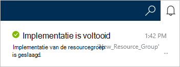

<properties
    pageTitle="Het maken van een account DocumentDB | Microsoft Azure"
    description="Een database NoSQL met Azure DocumentDB samenstellen. Volg deze instructies voor het maken van een account DocumentDB en beginnen met het samenstellen van de razendsnelle snelle, wereldwijde schaal NoSQL database." 
    keywords="een database maken"
    services="documentdb"
    documentationCenter=""
    authors="mimig1"
    manager="jhubbard"
    editor="monicar"/>

<tags
    ms.service="documentdb"
    ms.workload="data-services"
    ms.tgt_pltfrm="na"
    ms.devlang="na"
    ms.topic="get-started-article"
    ms.date="10/17/2016"
    ms.author="mimig"/>

# Het maken van een DocumentDB NoSQL rekening met de Azure portal

> [AZURE.SELECTOR]
- [Azure portal](documentdb-create-account.md)
- [Azure CLI en Azure Resource Manager](documentdb-automation-resource-manager-cli.md)

Als u een database met DocumentDB voor Microsoft Azure, moet u:

- Een Azure-account hebben. Als u geen sjabloon hebt, kunt u een [gratis Azure account](https://azure.microsoft.com/free) krijgen. 
- Maak een account DocumentDB.  

Kunt u een DocumentDB-account met behulp van de portal Azure, Azure Resource Manager sjablonen of Azure opdrachtregelinterface (CLI). In dit artikel ziet u hoe een DocumentDB account maken met de Azure portal. Zie maken van een account met behulp van bronbeheer Azure of Azure CLI [DocumentDB automatiseren-database maken](documentdb-automation-resource-manager-cli.md).

Bent u met DocumentDB? [Deze](https://azure.microsoft.com/documentation/videos/create-documentdb-on-azure/) vier minuten video door Scott Hanselman om te zien hoe u de meest voorkomende taken in de online portal.

1.  Log in om de [Azure portal](https://portal.azure.com/).
2.  In de Jumpbar, klikt u op **Nieuw**, klikt u op **Databases**en klik op **DocumentDB (NoSQL)**. 

      

3. Geef de gewenste configuratie voor de account DocumentDB in de **nieuwe account** -blade.

    

    - Voer in het vak **ID** een unieke naam voor de account DocumentDB.  Wanneer de **ID** wordt gevalideerd, verschijnt er een groen vinkje in het vak **ID** . De **id-** waarde wordt de hostnaam van de in de URI. De **ID** bevat mogelijk alleen kleine letters, cijfers en '-' teken, en moet tussen 3 en 50 tekens. Houd er rekening mee dat *documents.azure.com* wordt toegevoegd aan de naam van het die u ook kiest, het resultaat hiervan het eindpunt van de account DocumentDB wordt.

    - Selecteer in het vak **NoSQL API** het programmeermodel te gebruiken:
        - **DocumentDB**: de DocumentDB-API is beschikbaar via .NET, Java, Node.js, Python en JavaScript, [SDK's](documentdb-sdk-dotnet.md), zowel als HTTP- [REST](https://msdn.microsoft.com/library/azure/dn781481.aspx)en biedt programmatische toegang tot alle functies van de DocumentDB. 
       
        - **MongoDB**: DocumentDB biedt ook [ondersteuning voor protocol-niveau](documentdb-protocol-mongodb.md) voor **MongoDB** API's. Wanneer u de API MongoDB-optie kiest, kunt u bestaande MongoDB-SDK's en [hulpprogramma's](documentdb-mongodb-mongochef.md) om DocumentDB te spreken. U kunt [gaan](documentdb-import-data.md) uw bestaande MongoDB-apps voor het gebruik van DocumentDB, [geen codewijzigingen nodig](documentdb-connect-mongodb-account.md), en profiteren van een volledig beheerde database als een service, met een onbeperkte omvang, globale replicatie en andere mogelijkheden.

    - Voor **abonnement**, selecteer het Azure abonnement dat u wilt gebruiken voor de account DocumentDB. Als uw account slechts één abonnement heeft, wordt die account is standaard ingeschakeld.

    - In de **Resourcegroep**of een resourcegroep voor uw DocumentDB-account maken.  Standaard wordt een nieuwe groep gemaakt. Zie [werken met de Azure portal Azure resources beheren](../articles/azure-portal/resource-group-portal.md)voor meer informatie.

    - **Locatie** opgeven van de geografische locatie die als host voor uw DocumentDB-account gebruiken. 

4.  Nadat de nieuwe accountopties voor DocumentDB zijn geconfigureerd, klikt u op **maken**. Controleert u de status van de implementatie, de hub meldingen.  

      

    

5.  Nadat de account DocumentDB wordt gemaakt, is deze gereed voor gebruik met de standaardinstellingen. De standaard consistentie van de DocumentDB-account is ingesteld op **sessie**.  De standaard consistentie kunt u aanpassen door te klikken op **Standaard consistentie** in het menu bron. Zie voor meer informatie over de consistentie niveaus aangeboden door DocumentDB, [consistentie niveaus in DocumentDB](documentdb-consistency-levels.md).

      

      

[How to: Create a DocumentDB account]: #Howto
[Next steps]: #NextSteps
[documentdb-manage]:../articles/documentdb/documentdb-manage.md

## Volgende stappen

Nu dat u een DocumentDB-account hebt, is de volgende stap voor het maken van een DocumentDB-collectie en de database. 

U kunt een nieuwe collectie en een database maken met behulp van een van de volgende:

- De Azure portal, zoals wordt beschreven in [een DocumentDB-collectie met de Azure portal maken](documentdb-create-collection.md).
- De alomvattende zelfstudies, waaronder voorbeeldgegevens: [.NET](documentdb-get-started.md), [MVC.NET](documentdb-dotnet-application.md), [Java](documentdb-java-application.md), [Python](documentdb-python-application.md)of [Node.js](documentdb-nodejs-application.md).
- De [.NET](documentdb-dotnet-samples.md#database-examples), [Node.js](documentdb-nodejs-samples.md#database-examples)of [Python](documentdb-python-samples.md#database-examples) voorbeeldcode beschikbaar in de GitHub.
- De [.NET](documentdb-sdk-dotnet.md) [Node.js](documentdb-sdk-node.md), [Java](documentdb-sdk-java.md), [Python](documentdb-sdk-python.md)en SDK's [REST](https://msdn.microsoft.com/library/azure/mt489072.aspx) .

Na het maken van uw database en de collectie, moet u [documenten toevoegen](documentdb-view-json-document-explorer.md) aan de collectie.

Nadat u een verzameling documenten hebt, kunt u [DocumentDB SQL](documentdb-sql-query.md) [query's uitvoeren](documentdb-sql-query.md#executing-queries) op uw documenten. U kunt query's uitvoeren met behulp van de [Query Explorer](documentdb-query-collections-query-explorer.md) in de portal, de [REST API](https://msdn.microsoft.com/library/azure/dn781481.aspx)of één van de [SDK's](documentdb-sdk-dotnet.md).

### Meer informatie

Meer informatie over DocumentDB, Verken deze bronnen:

-   [Leren pad voor DocumentDB](https://azure.microsoft.com/documentation/learning-paths/documentdb/)
-   [Hiërarchische model met DocumentDB en concepten](documentdb-resources.md)
