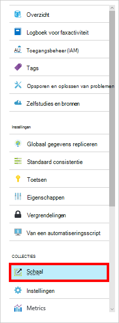

<properties 
    pageTitle="Maak een database met DocumentDB en collectie | Microsoft Azure" 
    description="Informatie over het maken van databases NoSQL en JSON-document-collecties met de on line serviceportal voor Azure DocumentDB document database op basis van een wolk. Krijg een gratis proefperiode vandaag." 
    services="documentdb" 
    authors="mimig1" 
    manager="jhubbard" 
    editor="monicar" 
    documentationCenter=""/>

<tags 
    ms.service="documentdb" 
    ms.workload="data-services" 
    ms.tgt_pltfrm="na" 
    ms.devlang="na" 
    ms.topic="article" 
    ms.date="10/17/2016" 
    ms.author="mimig"/>

# Het maken van een DocumentDB-collectie en de database met behulp van de portal voor Azure

Voor het gebruik van DocumentDB voor Microsoft Azure, hebt u een [account voor DocumentDB](documentdb-create-account.md), een database, een collectie en documenten. In dit onderwerp wordt beschreven hoe u een verzameling DocumentDB maken in de portal Azure. 

U weet niet wat een verzameling is? Zie [Wat is een collectie DocumentDB?](#what-is-a-documentdb-collection)

1.  In de [portal Azure](https://portal.azure.com/), in de Jumpbar, op **DocumentDB (NoSQL)**en selecteer vervolgens de rekening voor het toevoegen van een collectie in het blad **DocumentDB (NoSQL)** . Als u niet alle rekeningen hebt, moet u [een DocumentDB-account maken](documentdb-create-account.md).

    
    
    Als **DocumentDB (NoSQL)** niet zichtbaar in de Jumpbar is, klik op **Meer Services** en klik vervolgens op **DocumentDB (NoSQL)**. Als u niet alle rekeningen hebt, moet u [een DocumentDB-account maken](documentdb-create-account.md).

2. In het blad **DocumentDB account** voor de geselecteerde account, klikt u op **Verzameling toevoegen**.

    

3. Voer in het blad **Collectie toevoegen** in het vak **ID** de ID voor de nieuwe collectie. Collectienamen moet tussen 1 en 255 tekens en geen `/ \ # ?` of een spatie. Wanneer de naam wordt gevalideerd, verschijnt er een groen vinkje in het vak ID.

    

4. **Prijzen laag** is standaard ingesteld op **standaard** , zodat u de doorvoer en opslag voor uw collectie kunt. Zie voor meer informatie over de prijzen laag [niveau van de prestaties in DocumentDB](documentdb-performance-levels.md).  

5. Selecteer een **modus voor partitionering** voor de collectie is **Één partitie** of **Partitioned**. 

    Een **enkele partitie** is een gereserveerde opslagcapaciteit van 10 GB en kan niveaus gegevensdoorvoer van 400 10.000 aanvraag eenheden per seconde (RU/s). Een RU correspondeert met de doorvoer van het lezen van een document van 1KB. Zie voor meer informatie over eenheden van de aanvraag, [aanvraag eenheden](documentdb-request-units.md). 

    Een **gepartitioneerde collectie** voor het verwerken van een onbeperkte omvang voor opslag op meerdere partities kunnen worden geschaald, en beginnen bij 10,100 RU/s doorvoer-niveaus kan hebben. In de portal, de grootste opslag die kunt u reserveren is 250 GB, en de meeste doorvoer die kunt u reserveren 250.000 RU/s. Bestand wilt verhogen of quota, een verzoek zoals wordt beschreven in de [aanvraag DocumentDB account quota verhoogd](documentdb-increase-limits.md). Zie voor meer informatie over collecties gepartitioneerde [één partitie en gepartitioneerde collecties](documentdb-partition-data.md#single-partition-and-partitioned-collections).

    De doorvoer van een nieuwe collectie met één partitie is standaard ingesteld op 1000 RU (s) met een opslagcapaciteit van 10 GB. De doorvoer van de collectie is voor een gepartitioneerde collectie ingesteld op 10100 RU (s) met een opslagcapaciteit van 250 GB. Kunt u de doorvoer en opslag voor de collectie nadat de collectie is gemaakt. 

6. Als u een gepartitioneerde collectie maakt, selecteert u de **Partitie-sleutel** voor de collectie. Selecteren van de juiste partitiesleutel is belangrijk bij het maken van een collectie zodat. Zie [voor het partitioneren van ontwerpen](documentdb-partition-data.md#designing-for-partitioning)voor meer informatie over het selecteren van een partitiesleutel.

7. Een nieuwe database maken of een bestaande gebruiken in de **Database** -blade. Databasenaam moet tussen 1 en 255 tekens en mag niet `/ \ # ?` of een spatie. Klik buiten het tekstvak voor het valideren van de naam. Wanneer de naam wordt gevalideerd, verschijnt er een groen vinkje in het vak.

8. Klik op **OK** onder aan het scherm om een nieuwe collectie maken. 

9. Nu de nieuwe collectie in de lens **collecties** op het blad **Overzicht** wordt weergegeven.
 
    

10. **Optioneel:** De doorvoer van de collectie in de portal wijzigen, klikt u op **schaal** in het menu bron. 

    

## Wat is een verzameling DocumentDB? 

Een collectie is een container van JSON-documenten en de bijbehorende JavaScript toepassingslogica. Een collectie is een entiteit te factureren, waarbij de [kosten](documentdb-performance-levels.md) worden bepaald door de ingerichte doorvoer van de collectie. Verzamelingen kunnen een of meer partities/servers omvatten en is schaalbaar, zodat een vrijwel onbeperkt aantal volumes van opslag of doorvoer te verwerken.

Collecties met DocumentDB automatisch ingedeeld in een of meer fysieke servers. Als u een verzameling maakt, kunt u de doorvoer ingerichte uitgedrukt in eenheden van de aanvraag per seconde en een belangrijke eigenschap van de partitie. De waarde van deze eigenschap wordt gebruikt door de DocumentDB voor het distribueren van documenten tussen de partities en route aanvragen zoals query's. De waarde van de partitie fungeert ook als de transactiegrens voor opgeslagen procedures en triggers. Elke collectie heeft een gereserveerde deel van de doorvoer van die collectie, wordt niet gedeeld met andere collecties in dezelfde account. Daarom kunt u de schaal van uw toepassing, zowel in termen van opslag en doorvoer. 

Collecties zijn niet hetzelfde als tabellen in een relationele databases. Collecties schema niet afdwingen, in feite DocumentDB schema's niet toepassen, is een database schema vrij. Daarom kunt u verschillende documenttypen met uiteenlopende schema opslaan in dezelfde collectie. U kunt verzamelingen gebruiken voor het opslaan van objecten van een enkel type zoals u zou met tabellen doen. Het beste model hangt alleen hoe de gegevens samen in query's en transacties weergegeven.

## Andere manieren voor het maken van een verzameling DocumentDB

Verzamelingen hoeven niet te worden gemaakt met behulp van de portal, kunnen ook worden gemaakt met behulp van de [DocumentDB SDK's](documentdb-sdk-dotnet.md) en de REST-API. 

- Zie de [voorbeelden van C#-collectie](documentdb-dotnet-samples.md#collection-examples)voor een C#-code monster. 
- Zie voor een codevoorbeeld Node.js [Node.js collectie samples](documentdb-nodejs-samples.md#collection-examples).
- Zie voor een codevoorbeeld Python [Python collectie samples](documentdb-python-samples.md#collection-examples).
- Zie voor een voorbeeld REST API [maken een collectie](https://msdn.microsoft.com/library/azure/mt489078.aspx).

## Het oplossen van problemen

Als de **Collectie toevoegen** in de portal Azure is uitgeschakeld, betekent dit dat uw account is momenteel uitgeschakeld, die normaal gesproken doet zich voor wanneer de voordelen verantwoording voor de maand worden gebruikt.   

## Volgende stappen

U hebt een verzameling, is de volgende stap aan documenten toevoegen of importeren van documenten in de collectie. Wanneer het gaat om documenten toe te voegen aan een collectie, hebt u een paar opties kiezen:

- U kunt [documenten toevoegen](documentdb-view-json-document-explorer.md) met behulp van de Explorer-Document in de portal.
- Kunt u [gegevens en documenten importeren](documentdb-import-data.md) met behulp van de DocumentDB Data Migration Tool, waarmee u JSON- en CSV-bestanden importeren, evenals gegevens uit SQL Server, MongoDB Azure tabelopslag en andere DocumentDB collecties. 
- Of u kunt documenten toevoegen met behulp van een van de [DocumentDB SDK's](documentdb-sdk-dotnet.md). DocumentDB is een .NET, Java, Python, Node.js en SDK's JavaScript-API. Zie de [voorbeelden van C#-document](documentdb-dotnet-samples.md#document-examples)voor C# codevoorbeelden waarin wordt beschreven hoe u werkt met documenten met behulp van de DocumentDB .NET SDK. Zie de [voorbeelden van Node.js document](documentdb-nodejs-samples.md#document-examples)voor Node.js codevoorbeelden waarin wordt beschreven hoe u werkt met documenten met behulp van de SDK DocumentDB Node.js.

Nadat u een verzameling documenten hebt, kunt u [DocumentDB SQL](documentdb-sql-query.md) [query's](documentdb-sql-query.md#executing-queries) uitvoeren tegen uw documenten met behulp van de [Query Explorer](documentdb-query-collections-query-explorer.md) in de portal, de [REST API](https://msdn.microsoft.com/library/azure/dn781481.aspx)of één van de [SDK's](documentdb-sdk-dotnet.md). 
