<properties 
    pageTitle="Implementatie van DocumentDB en Azure App Service Web Apps met behulp van een Resource Manager Azure sjabloon | Microsoft Azure" 
    description="Informatie over het implementeren van een DocumentDB, Azure App Service Web Apps, en een monster webtoepassing met behulp van een sjabloon Azure Resource Manager." 
    services="documentdb, app-service\web" 
    authors="h0n" 
    manager="jhubbard" 
    editor="monicar" 
    documentationCenter=""/>

<tags 
    ms.service="documentdb" 
    ms.workload="data-services" 
    ms.tgt_pltfrm="na" 
    ms.devlang="na" 
    ms.topic="article" 
    ms.date="08/02/2016" 
    ms.author="hawong"/>

# Implementatie van DocumentDB en Azure App Service Web Apps met behulp van een sjabloon Azure Resource Manager

In deze zelfstudie wordt beschreven hoe u een sjabloon Azure Resource Manager gebruiken voor de implementatie en integratie van [Microsoft Azure DocumentDB](https://azure.microsoft.com/services/documentdb/), een [Azure App Service](http://go.microsoft.com/fwlink/?LinkId=529714) web app en een voorbeeld van een web-toepassing.

Azure Resource Manager-sjablonen gebruikt, kunt u gemakkelijk automatiseren de implementatie en configuratie van uw resources Azure.  Deze zelfstudie laat zien hoe implementeren van een webtoepassing en verbindingsgegevens DocumentDB-account automatisch te configureren.

Na het voltooien van deze zelfstudie, is het mogelijk om de volgende vragen te beantwoorden:  

-   Hoe kan ik een sjabloon Azure Resource Manager gebruiken om te implementeren en integreren van een DocumentDB en een web app in Azure App-Service?
-   Hoe kan ik een sjabloon Azure Resource Manager gebruiken om te implementeren en integreren van een DocumentDB, een web app in App Service Web Apps, en een Webdeploy toepassing?

## Vereisten
> [AZURE.TIP] Terwijl deze zelfstudie geen ervaring met Azure Resource Manager sjablonen of JSON denken zal moet die u wilt wijzigen van de sjablonen waarnaar wordt verwezen of implementatieopties, vervolgens kennis van elk van deze gebieden vereist zijn.

Voordat u de instructies in deze zelfstudie, zorg ervoor dat het volgende:

- Een abonnement op Azure. Azure is een platform op basis van een abonnement.  Zie voor meer informatie over het verkrijgen van een abonnement [Koopt](https://azure.microsoft.com/pricing/purchase-options/), [Biedt lid](https://azure.microsoft.com/pricing/member-offers/)of [Gratis](https://azure.microsoft.com/pricing/free-trial/).

##Stap 1: Download de sjabloonbestanden ##
Laten we beginnen met het downloaden van de sjabloonbestanden we in deze zelfstudie gebruiken.

1. De [DocumentDB-account, Web-Apps maken en implementeren van een voorbeeld van een toepassing demo](https://portalcontent.blob.core.windows.net/samples/DocDBWebsiteTodo.json) sjabloon downloaden naar een lokale map (bv. C:\DocumentDBTemplates). Deze sjabloon implementeert een DocumentDB, een web App Service app, en een webtoepassing.  Deze configureert ook automatisch de web-toepassing verbinding maken met de account DocumentDB.

2. Het [maken van een account DocumentDB en Web Apps monster](https://portalcontent.blob.core.windows.net/samples/DocDBWebSite.json) sjabloon downloaden naar een lokale map (bv. C:\DocumentDBTemplates). Deze sjabloon DocumentDB-account, een webtoepassing App-Service implementeert en instellingen om gemakkelijk verbindingsgegevens DocumentDB over het oppervlak van de site worden gewijzigd, maar bevat geen een webtoepassing.  

##Stap 2: De DocumentDB-account, App Service web app en demo toepassing monster implementeren

Nu gaan we onze eerste sjabloon te implementeren.

> [AZURE.TIP] De sjabloon wordt niet gevalideerd voor het web app naam en de naam van DocumentDB ingevoerd onder een) geldig is en b) beschikbaar zijn.  Het is raadzaam dat u controleert of de beschikbaarheid van de namen die u van plan bent om op te geven voordat u de implementatie.

1. Aanmelden bij de [Portal Azure](https://portal.azure.com), op Nieuw en zoek naar 'sjabloonimplementatie'.
    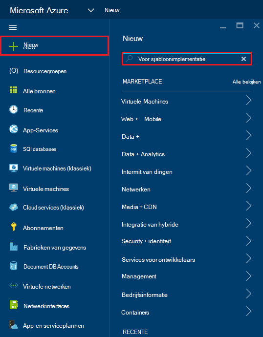

2. Selecteer de sjabloon voor implementatie en klik op **maken**
    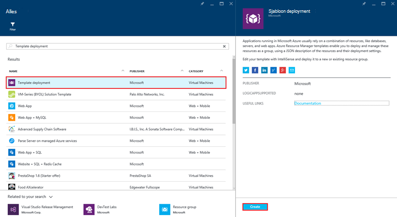

3.  Klik op **sjabloon bewerken**, plakt u de inhoud van de sjabloon DocDBWebsiteTodo.json en klik op **Opslaan**.
    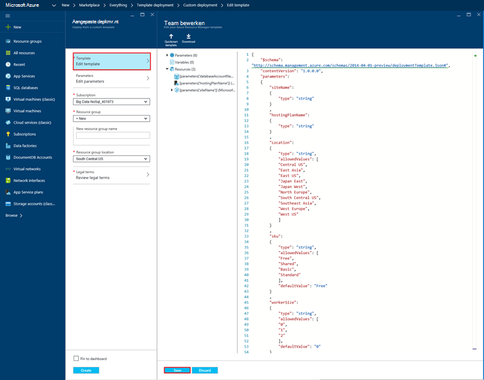

4. Klik op **parameters bewerken**waarden opgeven voor elk van de verplichte parameters en klik op **OK**.  De parameters zijn als volgt:

    1. SITENAAM: Geeft de naam van de App Service web app en maken de URL die u gebruiken wilt voor toegang tot de web app wordt gebruikt (bijvoorbeeld als u "mydemodocdbwebapp" opgeeft, wordt de URL waarmee u toegang de web app tot zal mydemodocdbwebapp.azurewebsites.net).

    2. HOSTINGPLANNAME: Geeft de naam van App Service hosting plan te maken.

    3. LOCATIE: Geeft de Azure waarin de DocumentDB en web app resources maken.

    4. DATABASEACCOUNTNAME: Hiermee geeft u de naam van de DocumentDB-account te maken.   

    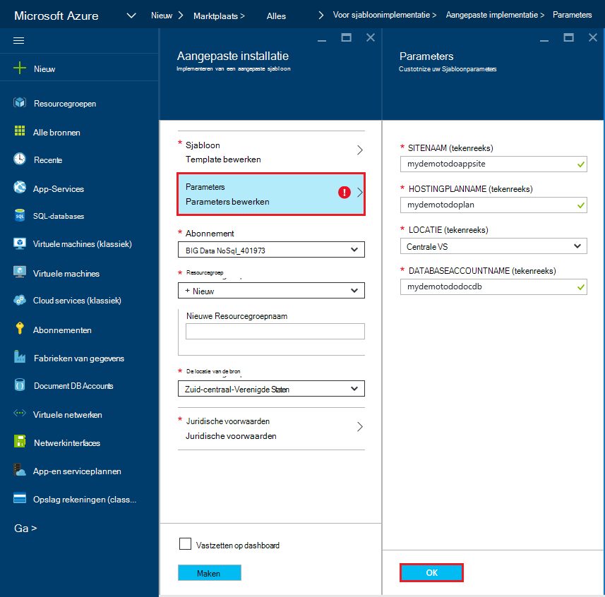

5. Kies een bestaande resourcegroep of geef een naam op te maken van een nieuwe bronnengroep en kies een locatie voor de resourcegroep.
    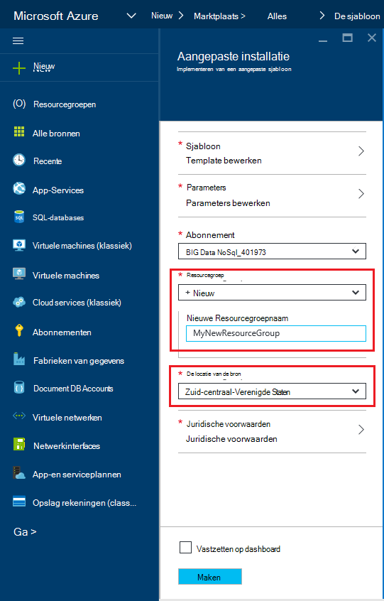
  
6.  **Juridische voorwaarden controleren**, **Inkoop**, en klik op **maken** om te beginnen met de implementatie.  Selecteer **aan het dashboard vastmaken** zodat de resulterende implementatie gemakkelijk zichtbaar op de Azure portal startpagina is.
    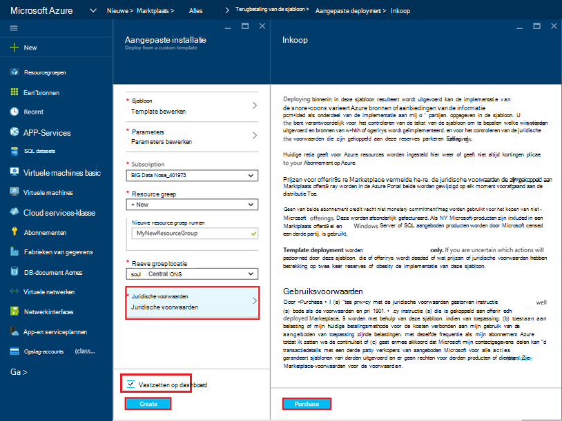

7.  Wanneer de installatie is voltooid, wordt de Resource groep blade geopend.
    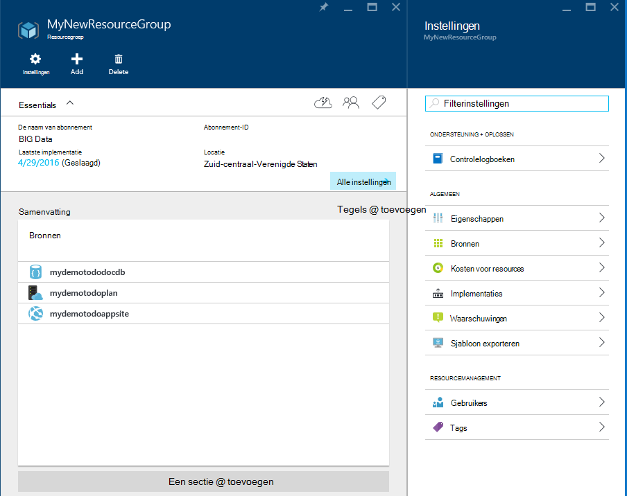  

8.  Voor het gebruik van de toepassing gewoon gaat u naar de URL van de web app (in het voorbeeld wordt de URL is http://mydemodocdbwebapp.azurewebsites.net).  Hier ziet u de volgende web-toepassing:

    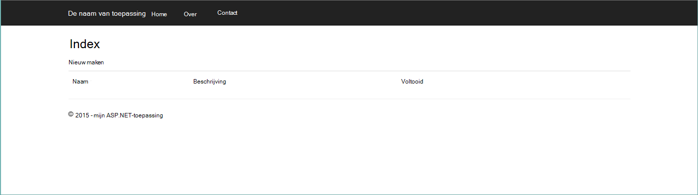

9. Vooruit gaan en een aantal taken in de web app maken en vervolgens terug naar de Resource groep blade in Azure portal. Klik op de bron DocumentDB-account in de lijst met Resources en klik vervolgens op **Query Explorer**.
    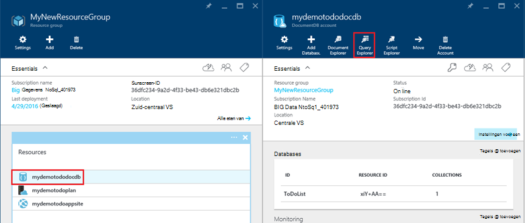  

10. De standaardquery uitvoert, "SELECT *FROM c" en de resultaten controleren.  U ziet dat de query is opgehaald uit de JSON representatie van de items die u hebt gemaakt in stap 7 hierboven.  Voel vrij om te experimenteren met query's. Probeer bijvoorbeeld selecteren uit te voeren* uit c WHERE c.isComplete = true te retourneren van alle todo-items die zijn gemarkeerd als voltooid.

    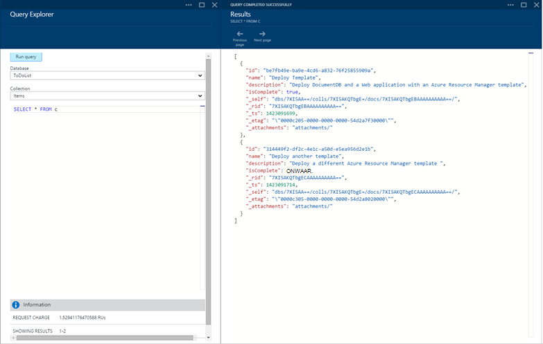

11. Gerust de portal ervaringen DocumentDB verkennen of de voorbeeldtoepassing Todo wijzigen.  Wanneer u klaar bent, laten we een andere sjabloon te implementeren.
    
 
## Stap 3: Implementatie van het monster Document account en app

Nu gaan we onze tweede sjabloon te implementeren.  Deze sjabloon is handig om aan te geven hoe u kunt injecteren DocumentDB verbindingsgegevens zoals het eindpunt van de account en de hoofdsleutel een web app als instellingen van de toepassing of een aangepaste verbindingsreeks. Bijvoorbeeld, misschien hebt u uw eigen webtoepassing die u wilt implementeren met een DocumentDB-account en hebt de verbindingsgegevens automatisch ingevuld tijdens de implementatie.

> [AZURE.TIP] De sjabloon wordt niet gevalideerd voor het web app naam en de naam van DocumentDB ingevoerd onder een) geldig is en b) beschikbaar zijn.  Het is raadzaam dat u controleert of de beschikbaarheid van de namen die u van plan bent om op te geven voordat u de implementatie.

1. Klik op Nieuw en zoek naar 'sjabloonimplementatie' in de [Portal Azure](https://portal.azure.com).
    

2. Selecteer de sjabloon voor implementatie en klik op **maken**
    

3.  Klik op **sjabloon bewerken**, plakt u de inhoud van de sjabloon DocDBWebSite.json en klik op **Opslaan**.
    

4. Klik op **parameters bewerken**waarden opgeven voor elk van de verplichte parameters en klik op **OK**.  De parameters zijn als volgt:

    1. SITENAAM: Geeft de naam van de App Service web app en maken de URL die u gebruiken wilt voor toegang tot de web app wordt gebruikt (bijvoorbeeld als u "mydemodocdbwebapp" opgeeft, wordt de URL waarmee u toegang de web app tot zal mydemodocdbwebapp.azurewebsites.net).

    2. HOSTINGPLANNAME: Geeft de naam van App Service hosting plan te maken.

    3. LOCATIE: Geeft de Azure waarin de DocumentDB en web app resources maken.

    4. DATABASEACCOUNTNAME: Hiermee geeft u de naam van de DocumentDB-account te maken.   

    

5. Kies een bestaande resourcegroep of geef een naam op te maken van een nieuwe bronnengroep en kies een locatie voor de resourcegroep.
    
  
6.  **Juridische voorwaarden controleren**, **Inkoop**, en klik op **maken** om te beginnen met de implementatie.  Selecteer **aan het dashboard vastmaken** zodat de resulterende implementatie gemakkelijk zichtbaar op de Azure portal startpagina is.
    

7.  Wanneer de installatie is voltooid, wordt de Resource groep blade geopend.
      

8. De Web App resource in de lijst met Resources en klik op **Instellingen voor toepassing**
      

9. Opmerking hoe er instellingen voor het eindpunt van de DocumentDB en de DocumentDB master sleutels aanwezig zijn.
    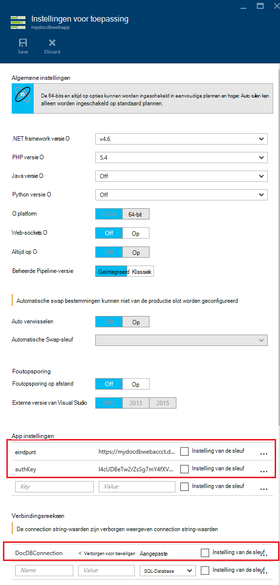  

10. Verdere verduidelijking van de Portal Azure gerust of voert u een van onze DocumentDB [voorbeelden](http://go.microsoft.com/fwlink/?LinkID=402386) voor het maken van uw eigen toepassing DocumentDB.

    
    

## Volgende stappen

Gefeliciteerd! U kunt DocumentDB, App Service web app en een monster webtoepassing met behulp van bronbeheer Azure sjablonen hebt geïmplementeerd.

- Voor meer informatie over DocumentDB, klik [hier](http://azure.com/docdb).
- Voor meer informatie over Azure App Service Web apps, klik [hier](http://go.microsoft.com/fwlink/?LinkId=325362).
- Voor meer informatie over sjablonen voor Azure Resource Manager, klik [hier](https://msdn.microsoft.com/library/azure/dn790549.aspx).

## Wat er veranderd
* Zie voor een handleiding voor het wijzigen van Websites met App-Service: [Azure App Service en de Impact op de bestaande Azure Services](http://go.microsoft.com/fwlink/?LinkId=529714)
* Zie voor informatie over de wijziging van de oude portal naar de nieuwe portal: [referentie voor het navigeren in de klassieke Azure-Portal](http://go.microsoft.com/fwlink/?LinkId=529715)

>[AZURE.NOTE] Als u wilt aan de slag met Azure App-Service voordat u aanmelden voor een account met Azure, gaat u naar de [App-Service probeert](http://go.microsoft.com/fwlink/?LinkId=523751), waar u direct een starter tijdelijk web app in de App-Service maken kunt. Geen creditcard vereist; geen verplichtingen.
 
