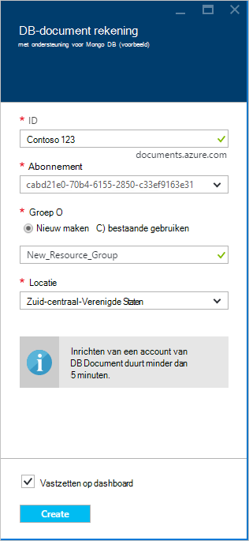

<properties 
    pageTitle="Een DocumentDB-account maken met ondersteuning voor MongoDB | Microsoft Azure" 
    description="Informatie over het maken van een account DocumentDB met ondersteuning voor MongoDB, nu beschikbaar voor preview." 
    services="documentdb" 
    authors="AndrewHoh" 
    manager="jhubbard" 
    editor="" 
    documentationCenter=""/>

<tags 
    ms.service="documentdb" 
    ms.workload="data-services" 
    ms.tgt_pltfrm="na" 
    ms.devlang="na" 
    ms.topic="article" 
    ms.date="10/20/2016" 
    ms.author="anhoh"/>

# Een DocumentDB-account maken met ondersteuning voor MongoDB met de Azure portal

Als u wilt een Azure-DocumentDB-account maken met ondersteuning voor MongoDB-protocol, moet u:

- Een Azure-account hebben. Als u geen sjabloon hebt, kunt u een [gratis Azure account](https://azure.microsoft.com/free/) krijgen.

## De account maken  

Om een DocumentDB-account maken met ondersteuning voor MongoDB-protocol, moet u de volgende stappen uitvoeren.

1. Log in op de [Azure Portal](https://portal.azure.com)in een nieuw venster.
2. Klik op **Nieuw**op de **Data- +**, klikt u op **alle**en zoekt u in de categorie **gegevens + opslag** voor "DocumentDB protocol". Klik op **DocumentDB - protocolondersteuning voor MongoDB**.

    

3. Ook in de categorie **gegevens + opslag** onder **opslag**, klik op **meer**en klik op **meer laden** een of meer keer **DocumentDB - protocolondersteuning voor MongoDB**weergeven. Klik op **DocumentDB - protocolondersteuning voor MongoDB**.

    

4. Klik op **maken** om het signup proces starten in het blad **DocumentDB - protocolondersteuning voor MongoDB (voorbeeld)** .

    

5. Klik op **aanmelden om te bekijken**in het blad **DocumentDB account** . Lees de informatie en klik vervolgens op **OK**.

    

6.  Na het accepteren van de voorwaarden voor de voorvertoning, keert u terug naar de blade maken.  Geef de gewenste configuratie voor de account in de blade **DocumentDB account** .

    

    - Voer in het vak **ID** een unieke naam voor de account.  Wanneer de **ID** wordt gevalideerd, verschijnt er een groen vinkje in het vak **ID** . De **id-** waarde wordt de hostnaam van de in de URI. De **ID** bevat mogelijk alleen kleine letters, cijfers en '-' teken, en moet tussen 3 en 50 tekens. Houd er rekening mee dat *documents.azure.com* wordt toegevoegd aan de naam van het die u ook kiest, het resultaat van die het eindpunt van uw account worden zal.

    - Voor **abonnement**, selecteer het Azure abonnement dat u wilt gebruiken voor de account. Als uw account slechts één abonnement heeft, wordt die account is standaard ingeschakeld.

    - In de **Resourcegroep**selecteren of maken van een resourcegroep voor de account.  Standaard wordt een bestaande resourcegroep onder de Azure abonnement gekozen.  U, echter kunt selecteren voor het maken van een nieuwe groep die u wilt de account toe te voegen. Zie [werken met de Azure portal Azure resources beheren](resource-group-portal.md)voor meer informatie.

    - **Locatie** opgeven van de geografische locatie die als host voor de account wordt gebruikt.
    
    - Optioneel: Selectievakje **pincode op het dashboard**. Als op het dashboard is vastgemaakt, voert u **stap 8** hieronder als u wilt weergeven van de linkermenubalk van uw nieuwe account.

7.  Nadat de nieuwe accountopties zijn geconfigureerd, klikt u op **maken**.  Het kan even duren om de account te maken.  Als aan het dashboard is vastgemaakt, kunt u de provisioning voortgang van de Startboard controleren.  
      

    Als u niet aan het dashboard is vastgemaakt, kunt u de voortgang van de meldingen hub controleren.  

      

    

8.  Als u uw nieuwe account, klikt u in het menu links op **DocumentDB (NoSQL)** . Klik op de naam van uw nieuwe account in uw lijst van regelmatige DocumentDB en DocumentDB met Mongo-protocol, ondersteuning van accounts.

9.  Het is nu gereed voor gebruik met de standaardinstellingen. 

    
    

## Volgende stappen

- Meer informatie over hoe te [verbinden](documentdb-connect-mongodb-account.md) met een DocumentDB-account met protocol ondersteunen voor MongoDB.

 
