<properties 
    pageTitle="ASP.NET MVC zelfstudie voor DocumentDB: Web Application Development | Microsoft Azure" 
    description="ASP.NET MVC-zelfstudie voor het maken van een MVC-webtoepassing met behulp van DocumentDB. U JSON opslaan en toegang tot gegevens van een todo app gehost op Websites van Azure - zelfstudie voor ASP NET MVC stap voor stap." 
    keywords="ASP.NET mvc zelfstudie, de ontwikkeling van webtoepassingen, mvc web application, zelfstudie voor asp net mvc stap voor stap"
    services="documentdb" 
    documentationCenter=".net" 
    authors="syamkmsft" 
    manager="jhubbard" 
    editor="cgronlun"/>

<tags 
    ms.service="documentdb" 
    ms.workload="data-services" 
    ms.tgt_pltfrm="na" 
    ms.devlang="dotnet" 
    ms.topic="hero-article" 
    ms.date="08/25/2016" 
    ms.author="syamk"/>

# ASP.NET MVC zelfstudie: Ontwikkeling van webtoepassingen met DocumentDB

> [AZURE.SELECTOR]
- [.NET](documentdb-dotnet-application.md)
- [Node.js](documentdb-nodejs-application.md)
- [Java](documentdb-java-application.md)
- [Python](documentdb-python-application.md) 

Hoe u kunt efficiënt gebruikmaken van Azure DocumentDB op te slaan en de query JSON-documenten wilt markeren, wordt in dit artikel een end-to-end overzicht weergeven van hoe u een todo app met Azure DocumentDB. De taken worden opgeslagen als JSON-documenten in Azure DocumentDB.

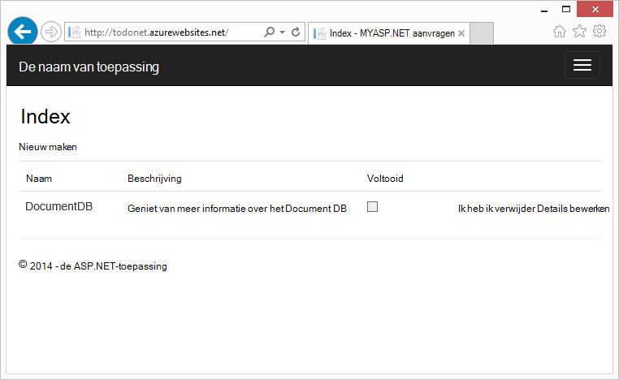

Dit overzicht wordt beschreven hoe u de service DocumentDB van Azure gebruiken om te slaan en toegang tot gegevens op een ASP.NET MVC web application gehost op Azure. Als u op zoek bent voor een zelfstudie is alleen op DocumentDB en de onderdelen ASP.NET MVC gericht Zie [bouwen een consoletoepassing DocumentDB C#](documentdb-get-started.md).

> [AZURE.TIP] In deze zelfstudie wordt ervan uitgegaan dat u ervaring met ASP.NET MVC en Azure Websites. Als u ASP.NET of de [vereiste hulpprogramma's](#_Toc395637760), wordt u aangeraden het volledige voorbeeldproject downloaden van [GitHub][] en volg de instructies in dit voorbeeld. Zodra u die gemaakt hebt, kunt u in dit artikel voor het verkrijgen van inzicht in de code in het kader van het project bekijken.

## Vereisten voor deze zelfstudie

Voordat u de instructies in dit artikel uitvoert, moet u ervoor zorgen dat u de volgende opties hebt:

- Een actieve account Azure. Als u geen account hebt, kunt u een gratis proefperiode account in een paar minuten. Zie voor meer informatie, [Gratis proefperiode van Azure](https://azure.microsoft.com/pricing/free-trial/).
- [Visual Studio 2015](http://www.visualstudio.com/) of Visual Studio 2013 Update 4 of hoger. Als u Visual Studio 2013, moet u het [pakket van Microsoft.Net.Compilers nuget](https://www.nuget.org/packages/Microsoft.Net.Compilers/) Voeg ondersteuning voor C# 6.0 installeren. 
- Azure SDK voor .NET versie 2.5.1 of hoger, beschikbaar via de [Microsoft Web Platform Installer][].

De schermopnamen in dit artikel zijn genomen met behulp van Visual Studio 2013 met Update 4 toegepast en de Azure SDK voor .NET versie 2.5.1. Als uw systeem is geconfigureerd met verschillende versies is het mogelijk dat de opties en schermen niet overeen met volledig, maar als u aan de bovenstaande vereisten voldoet deze oplossing moet werken.

## Stap 1: Maak een account DocumentDB database

Laten we beginnen met het maken van een account DocumentDB. Als u al een account hebt, kunt u overslaan naar [een nieuwe ASP.NET MVC-toepassing maken](#_Toc395637762).

[AZURE.INCLUDE [documentdb-create-dbaccount](../../includes/documentdb-create-dbaccount.md)]

[AZURE.INCLUDE [documentdb-keys](../../includes/documentdb-keys.md)]

 
We nu helpt bij het maken van een nieuwe ASP.NET MVC toepassing vanaf de grond-up. 

## Stap 2: Maak een nieuwe ASP.NET MVC-toepassing

Nadat u een account hebt, we maken ons nieuwe project voor ASP.NET.

1. In Visual Studio, klikt u in het menu **bestand** , wijs **Nieuw**aan en klik vervolgens op **Project**.

    Het dialoogvenster **Nieuw Project** wordt weergegeven.
2. Klik in het deelvenster **Project types** Vouw **sjablonen**, **Visual C#**, **Web**en selecteert u **ASP.NET-webtoepassingen**.

    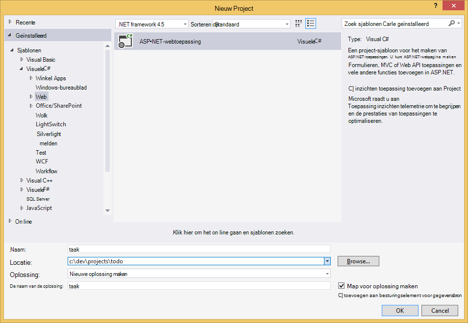

3. Typ in het vak **naam** de naam van het project. In deze zelfstudie wordt de naam 'doen'. Als u kiest voor iets anders dan dit, waar deze zelfstudie gesprekken over de todo-naamruimte voert, moet u aan te passen in de beschikbare codevoorbeelden voor het gebruik van hoe u uw toepassing genoemd. 

4. Klik op **Bladeren** om te navigeren naar de map waar u willen zou maken van het project en klik vervolgens op **OK**.

    Het dialoogvenster **Nieuw Project voor ASP.NET** weergegeven.

    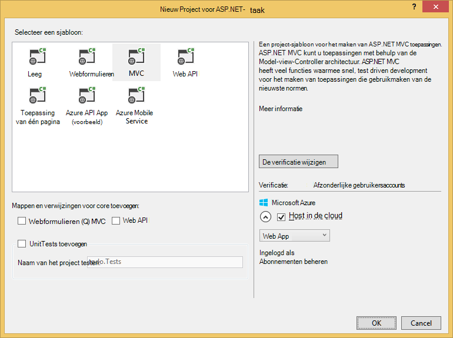

5. Selecteer in het deelvenster sjablonen **MVC**.

6. Als u van plan bent die als host fungeert voor de toepassing in Azure selecteert u **Host in de cloud** op het lagere recht Azure host voor de toepassing. Wij hebt beschikken in de cloud en voor de toepassing die wordt gehost in een Website Azure geselecteerd. Met deze optie een Azure-Website preprovision voor u en uw leven een stuk eenvoudiger wanneer er voor de implementatie van de uiteindelijke werkende toepassing. Als u wilt deze elders plaatsen of Azure voorhand configureren niet wilt, maar schakelt u **Host in de Cloud**.

7. Klik op **OK** en laat Visual Studio doet haar ding rond de lege sjabloon met ASP.NET MVC scaffolding. 

8. Als u wilt dat deze host in de cloud die worden er ten minste één extra wordt weergegeven waarin u kunt aanmelden bij uw account Azure en sommige waarden opgeven voor uw nieuwe website. De aanvullende waarden en doorgaan. 

    Ik nog niet 'databaseserver' hier gekozen omdat we niet maken gebruik van een SQL-databaseserver Azure hier, gaan we maken een nieuwe Azure DocumentDB account later in de Portal Azure.

    Zie voor meer informatie over het kiezen van een **App serviceplan** en **resourcegroep** [Azure App Service plannen diepgaand overzicht](../app-service/azure-web-sites-web-hosting-plans-in-depth-overview.md).

    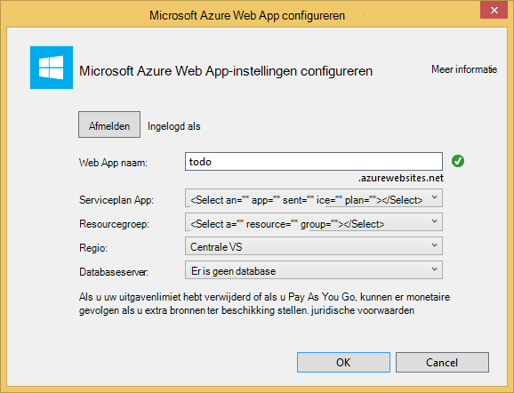

9. Nadat u Visual Studio is klaar met het maken van de generieke toepassing MVC hebt u een lege ASP.NET-toepassing die u lokaal kunt uitvoeren.

    We voeren het project lokaal omdat ik zeker weet iedereen kent de ASP.NET "Hello World" overslaan toepassing. We gaan direct naar het DocumentDB toe te voegen aan dit project en het bouwen van de toepassing.

## Stap 3: DocumentDB toevoegen aan uw project MVC web application

Nu dat we de meeste van de ASP.NET MVC sanitair die we voor deze oplossing nodig hebben, krijgen we aan het echte doel van deze zelfstudie, Azure DocumentDB toe te voegen aan onze MVC web application.

1. De DocumentDB .NET SDK wordt verpakt en gedistribueerd als een NuGet package. Als u het pakket NuGet in Visual Studio, gebruikt u de NuGet package manager in Visual Studio door met de rechtermuisknop op het project in de **Solution Explorer** en klik vervolgens op **Beheren NuGet pakketten**.

    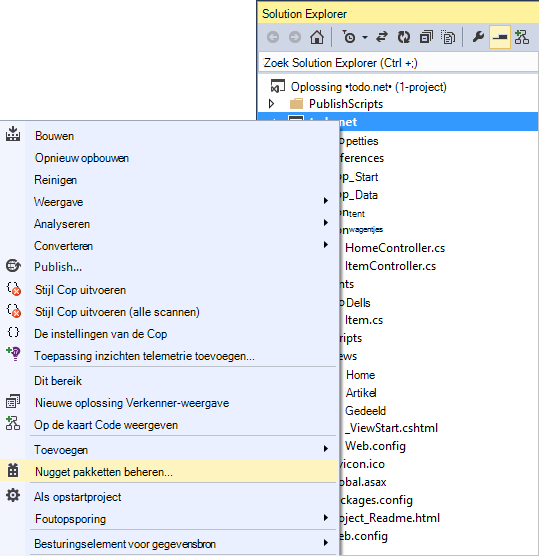

    Het dialoogvenster **NuGet pakketten beheren** wordt weergegeven.

2. Typ in het vak NuGet **Bladeren** ***Azure DocumentDB***.
    
    Uit de resultaten van de **Client-bibliotheek van Microsoft Azure DocumentDB** -pakket te installeren. Dit zal downloaden en installeren van het pakket DocumentDB, alsmede alle afhankelijkheden, zoals Newtonsoft.Json. Klik op **OK** in het venster **voorbeeld** en **ik ga akkoord** in het venster **Licentie accepteren** om de installatie te voltooien.

    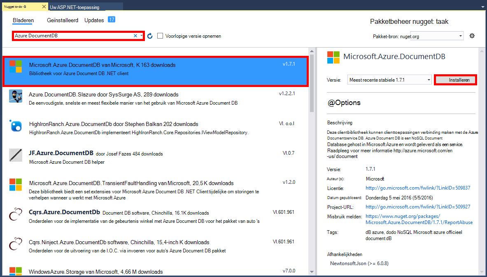

    U kunt de Package Manager-Console ook gebruiken om het pakket te installeren. Hiertoe klikt u in het menu **Extra** , klik op **NuGet Package Manager**en klik vervolgens op **Package Manager-Console**. Typ het volgende achter de opdrachtprompt.

        Install-Package Microsoft.Azure.DocumentDB

3. Nadat het pakket is geïnstalleerd, de Visual Studio-oplossing moet als volgt uitzien met twee nieuwe verwijzingen toegevoegd, Microsoft.Azure.Documents.Client en Newtonsoft.Json.

    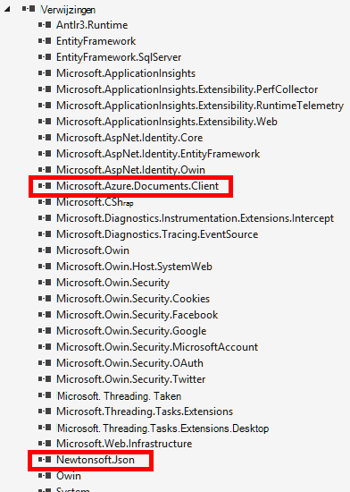

##Stap 4: De toepassing ASP.NET MVC instellen
 
Nu gaan we de modellen, weergaven en domeincontrollers toevoegen aan deze toepassing MVC:

- [Een model toevoegen](#_Toc395637764).
- [Een domeincontroller toevoegen](#_Toc395637765).
- [Weergaven toevoegen](#_Toc395637766).

### Een model JSON-gegevens toevoegen

Laten we de **M** in MVC, het model te maken. 

1. In de **Solution Explorer**met de rechtermuisknop op de map **modellen** , klikt u op **toevoegen**en klik op **klasse**.

    Het dialoogvenster **Add New Item** wordt weergegeven.

2. Naam van uw nieuwe klasse **Item.cs** en klik op **toevoegen**. 

3. Voeg de volgende na de laatste *instructie*in deze nieuwe **Item.cs** -bestand.
        
        using Newtonsoft.Json;
    
4. Nu deze code vervangen 
        
        public class Item
        {
        }

    met de volgende code.

        public class Item
        {
            [JsonProperty(PropertyName = "id")]
            public string Id { get; set; }
             
            [JsonProperty(PropertyName = "name")]
            public string Name { get; set; }

            [JsonProperty(PropertyName = "description")]
            public string Description { get; set; }

            [JsonProperty(PropertyName = "isComplete")]
            public bool Completed { get; set; }
        }

    Alle gegevens in de DocumentDB is via het netwerk doorgegeven en opgeslagen als JSON. Om te bepalen hoe de objecten worden geserialiseerd/gedeserialiseerd door JSON.NET kunt u het kenmerk **JsonProperty** zoals in **de artikelklasse die we zojuist hebben gemaakt** . Niet **hebben** doen dit maar ik wil ervoor zorgen dat mijn eigenschappen de JSON camelCase-naamgevingsconventies volgen. 
    
    Niet alleen kunt u bepalen de indeling van de naam van de eigenschap wanneer deze worden opgeslagen in JSON, maar u de eigenschappen van uw .NET volledig wijzigen kunt zoals ik heb met de eigenschap **Description** . 
    

### Een domeincontroller toevoegen

Dat zorgt voor de **M**, nu gaan we de **C** in MVC, een controller-klasse te maken.

1. In de **Solution Explorer**met de rechtermuisknop op de map **Controllers** , klikt u op **toevoegen**en klik op de **Controller**.

    Het dialoogvenster **Scaffold toevoegen** wordt weergegeven.

2. Selecteer **MVC 5 Controller - leeg** en klik vervolgens op **toevoegen**.

    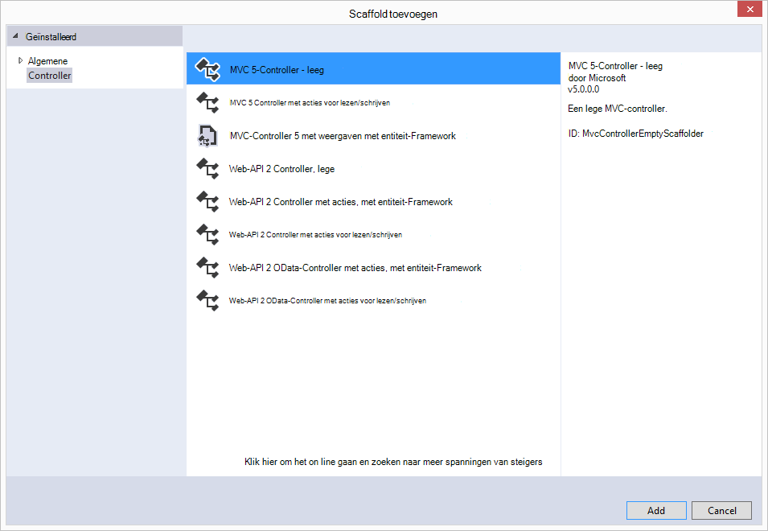

3. Naam van de nieuwe Controller, **ItemController.**

    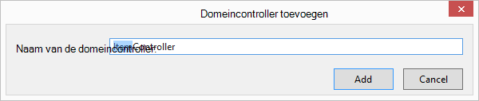

    Als het bestand is gemaakt, moet de Visual Studio-oplossing uitzien met het nieuwe bestand ItemController.cs in de **Solution Explorer**. Het nieuwe Item.cs bestand eerder hebt gemaakt, wordt ook weergegeven.

    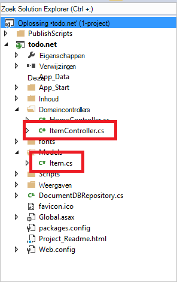

    U kunt ItemController.cs sluiten, we zullen het later terugkomen. 

### Weergaven toevoegen

Nu maken we de **V** in MVC, de weergaven:

- [De weergave van een Item Index toevoegen](#AddItemIndexView).
- [De weergave van een nieuw Item toevoegen](#AddNewIndexView).
- [Een weergave bewerken Item toevoegen](#_Toc395888515).

#### De weergave van een Index-Item toevoegen

1. In de **Solution Explorer**vouwt u de map **weergaven** met de rechtermuisknop op **de lege map die Visual Studio voor u gemaakt wanneer u de **ItemController** eerder hebt toegevoegd** , klikt u op **toevoegen**en klik vervolgens op **weergeven**.

    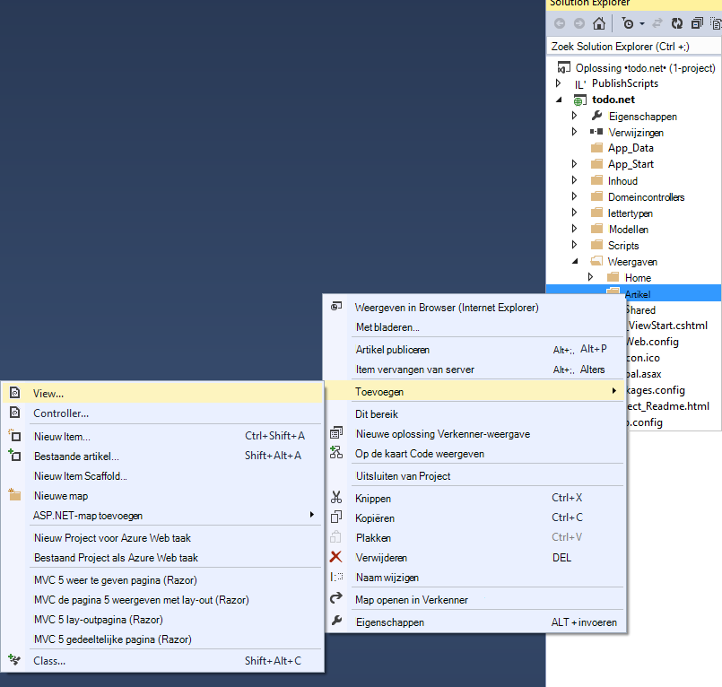

2. Klik in het dialoogvenster **Weergave toevoegen** door het volgende te doen:
    - Typ in het vak **naam voor de** ***Index***.
    - Selecteer de ***lijst***in het vak **sjabloon** .
    - Selecteer in het vak **klasse Model** ***Item (todo. Modellen)***.
    - **Klasse context** dit vak leeg laten. 
    - Typ in het paginavak lay-out ***~/Views/Shared/_Layout.cshtml***.
    
    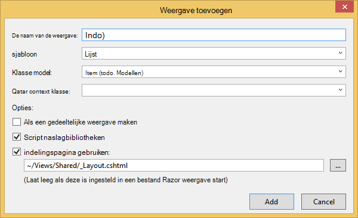

3. Wanneer al deze waarden zijn ingesteld, klikt u op **toevoegen** en kunt u Visual Studio maakt een nieuwe sjabloonweergave. Zodra deze klaar is, wordt deze geopend het cshtml-bestand dat is gemaakt. We kunnen dat bestand in Visual Studio sluiten, zoals we zullen het later terugkomen.

#### De weergave van een nieuw Item toevoegen

Vergelijkbaar met hoe we een **Artikel Index** weergave hebt gemaakt, Maak nu een nieuwe weergave voor het maken van nieuwe **Items**.

1. In de **Solution Explorer**opnieuw met de rechtermuisknop op **de map** , klikt u op **toevoegen**en klik vervolgens op **weergeven**.

2. Klik in het dialoogvenster **Weergave toevoegen** door het volgende te doen:
    - Typ in het vak **naam van de weergave** ***maken***.
    - Selecteer in het vak **sjabloon** ***maken***.
    - Selecteer in het vak **klasse Model** ***Item (todo. Modellen)***.
    - **Klasse context** dit vak leeg laten.
    - Typ in het paginavak lay-out ***~/Views/Shared/_Layout.cshtml***.
    - Klik op **toevoegen**.

#### Een weergave bewerken Item toevoegen

En ten slotte een laatste weergave voor het bewerken van een **Item** in het net als voorheen.

1. In de **Solution Explorer**opnieuw met de rechtermuisknop op **de map** , klikt u op **toevoegen**en klik vervolgens op **weergeven**.

2. Klik in het dialoogvenster **Weergave toevoegen** door het volgende te doen:
    - Typ in het vak **naam van de weergave** ***bewerken***.
    - Selecteer ***bewerken***in het vak **sjabloon** .
    - Selecteer in het vak **klasse Model** ***Item (todo. Modellen)***.
    - **Klasse context** dit vak leeg laten. 
    - Typ in het paginavak lay-out ***~/Views/Shared/_Layout.cshtml***.
    - Klik op **toevoegen**.

Zodra dit gebeurt, sluit u alle documenten cshtml in Visual Studio als we later keert terug naar deze weergaven.

## Stap 5: Bedrading van DocumentDB

Nu gaan we nu dat de standaard MVC spullen is afgehandeld, met het toevoegen van de code voor DocumentDB. 

In dit gedeelte gaan we de code voor het verwerken van de volgende toevoegen:

- [Onvolledige objecten aan te bieden](#_Toc395637770).
- Het [toevoegen van Items](#_Toc395637771).
- Het [bewerken van Items](#_Toc395637772).

### Niet-voltooide Items in uw toepassing MVC web aanbieding

Eerst hier doen is het toevoegen van een klasse bevat de logica om te verbinden en het gebruik van DocumentDB. We zullen alle deze logica in een opslagplaats klasse DocumentDBRepository aangeroepen inkapselen voor deze zelfstudie. 

1. In de **Solution Explorer**met de rechtermuisknop op het project, klikt u op **toevoegen**en klik vervolgens op **klasse**. Naam van de nieuwe klasse **DocumentDBRepository** en klik op **toevoegen**.
 
2. Klasse in de zojuist gemaakte **DocumentDBRepository** en voeg de volgende *instructies* boven *de naamruimtedeclaratie*
        
        using Microsoft.Azure.Documents; 
        using Microsoft.Azure.Documents.Client; 
        using Microsoft.Azure.Documents.Linq; 
        using System.Configuration;
        using System.Linq.Expressions;
        using System.Threading.Tasks;

    Nu deze code vervangen 

        public class DocumentDBRepository
        {
        }

    met de volgende code.

        public static class DocumentDBRepository<T> where T : class
        {
            private static readonly string DatabaseId = ConfigurationManager.AppSettings["database"];
            private static readonly string CollectionId = ConfigurationManager.AppSettings["collection"];
            private static DocumentClient client;
    
            public static void Initialize()
            {
                client = new DocumentClient(new Uri(ConfigurationManager.AppSettings["endpoint"]), ConfigurationManager.AppSettings["authKey"]);
                CreateDatabaseIfNotExistsAsync().Wait();
                CreateCollectionIfNotExistsAsync().Wait();
            }
    
            private static async Task CreateDatabaseIfNotExistsAsync()
            {
                try
                {
                    await client.ReadDatabaseAsync(UriFactory.CreateDatabaseUri(DatabaseId));
                }
                catch (DocumentClientException e)
                {
                    if (e.StatusCode == System.Net.HttpStatusCode.NotFound)
                    {
                        await client.CreateDatabaseAsync(new Database { Id = DatabaseId });
                    }
                    else
                    {
                        throw;
                    }
                }
            }
    
            private static async Task CreateCollectionIfNotExistsAsync()
            {
                try
                {
                    await client.ReadDocumentCollectionAsync(UriFactory.CreateDocumentCollectionUri(DatabaseId, CollectionId));
                }
                catch (DocumentClientException e)
                {
                    if (e.StatusCode == System.Net.HttpStatusCode.NotFound)
                    {
                        await client.CreateDocumentCollectionAsync(
                            UriFactory.CreateDatabaseUri(DatabaseId),
                            new DocumentCollection { Id = CollectionId },
                            new RequestOptions { OfferThroughput = 1000 });
                    }
                    else
                    {
                        throw;
                    }
                }
            }
        }

    > [AZURE.TIP] Bij het maken van een nieuwe DocumentCollection kunt u een optionele parameter RequestOptions van OfferType, waarmee u het prestatieniveau van de nieuwe collectie opgeven. Het standaardtype van het voorstel wordt gebruikt als u deze parameter niet wordt doorgegeven. Voor meer informatie over DocumentDB Zie type aanbieding [Prestaties DocumentDB](documentdb-performance-levels.md)

3. We dus open het bestand **Web.config** van uw toepassing en voeg de volgende regels onder sommige waarden van de configuratie, leest de `<AppSettings>` sectie.
    
        <add key="endpoint" value="enter the URI from the Keys blade of the Azure Portal"/>
        <add key="authKey" value="enter the PRIMARY KEY, or the SECONDARY KEY, from the Keys blade of the Azure  Portal"/>
        <add key="database" value="ToDoList"/>
        <add key="collection" value="Items"/>
    
4. De waarden voor het *eindpunt* en *authKey* met behulp van de toetsen blade van de Azure Portal nu bijwerken. De **URI** van de bladeserver toetsen gebruiken als de waarde van de instelling voor het eindpunt en de **Primaire sleutel**of **Secundaire sleutel** van de bladeserver toetsen gebruiken als de waarde van de instelling authKey.

    Dat zorgt voor de bekabeling van de opslagplaats DocumentDB nu laten we onze toepassingslogica wordt toegevoegd.

5. Het eerste wat dat we willen kunnen doen met een toepassing todo lijst is onvolledig items weergeven.  Kopieer en plak het volgende stukje code ergens in de klasse **DocumentDBRepository** .

        public static async Task<IEnumerable<T>> GetItemsAsync(Expression<Func<T, bool>> predicate)
        {
            IDocumentQuery<T> query = client.CreateDocumentQuery<T>(
                UriFactory.CreateDocumentCollectionUri(DatabaseId, CollectionId))
                .Where(predicate)
                .AsDocumentQuery();

            List<T> results = new List<T>();
            while (query.HasMoreResults)
            {
                results.AddRange(await query.ExecuteNextAsync<T>());
            }

            return results;
        }

6. Open de **ItemController** we eerder toegevoegd en voeg de volgende *instructies* boven de naamruimtedeclaratie.

        using System.Net;
        using System.Threading.Tasks;
        using todo.Models;

    Als het project niet de naam 'todo', moet u te werken met "todo. Modellen"; altijd de naam van het project.

    Nu deze code vervangen

        //GET: Item
        public ActionResult Index()
        {
            return View();
        }

    met de volgende code.

        [ActionName("Index")]
        public async Task<ActionResult> IndexAsync()
        {
            var items = await DocumentDBRepository<Item>.GetItemsAsync(d => !d.Completed);
            return View(items);
        }
    
7. **Global.asax.cs** Open en voeg de volgende regel aan de methode **Application_Start** 
 
        DocumentDBRepository<todo.Models.Item>.Initialize();
    
De oplossing moet op dit punt kunnen bouwen zonder fouten.

Als u de toepassing nu uitgevoerd, zou u Ga naar de **HomeController** en de **Index** van die domeincontroller. Dit is de standaardinstelling voor het project van MVC sjabloon kiest u aan het begin, maar we willen niet dat! We wijzigen de routering op deze toepassing MVC dit kunt wijzigen.

Open ***App\_Start\RouteConfig.cs*** en zoek de regel die begint met ' standaardwaarden: "en dit als volgt uitzien als u wilt wijzigen.

        defaults: new { controller = "Item", action = "Index", id = UrlParameter.Optional }

Deze nu ASP.NET MVC dat als u geen waarde hebt opgegeven in de URL waarmee u het routeringsgedrag van **thuis**, dat in plaats daarvan **artikel** gebruikt als de controller en **Index** als de weergave aangeeft.

Nu als u de toepassing uitvoert, wordt aangeroepen in de **ItemController** in de opslagplaats klasse aanroepen en de methode GetItems gebruiken om de onvoltooide items in de **weergaven**\\**artikel**\\**Index** weergeven. 

Als u bouwen en dit project nu uitvoeren, ziet u nu iets dat dit eruit ziet.    

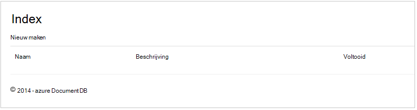

### Items toevoegen

We bepaalde items in onze database zodat we iets meer dan een leeg raster om naar te kijken.

Laten we enkele code toevoegen aan de DocumentDBRepository en ItemController om de record in de DocumentDB.

1.  De volgende methode toevoegen aan de klasse **DocumentDBRepository** .

        public static async Task<Document> CreateItemAsync(T item)
        {
            return await client.CreateDocumentAsync(UriFactory.CreateDocumentCollectionUri(DatabaseId, CollectionId), item);
        }

    Met deze methode wordt een object dat wordt doorgegeven aan het gewoon en blijft deze bestaan in de DocumentDB.

2. Open het bestand ItemController.cs en voeg het volgende stukje code in de klasse. Dit is de manier waarop ASP.NET MVC weet wat te doen voor de actie **maken** . In dit geval de bijbehorende Create.cshtml die u eerder gemaakt alleen weergeven.

        [ActionName("Create")]
        public async Task<ActionResult> CreateAsync()
        {
            return View();
        }

    Nu moeten we wat meer code in deze controller waarin de indiening van de weergave **maken** .

2. Het volgende blok met code toevoegen aan de klasse ItemController.cs die ASP.NET MVC wat vertelt te doen met een formulier boeken voor deze domeincontroller.
    
        [HttpPost]
        [ActionName("Create")]
        [ValidateAntiForgeryToken]
        public async Task<ActionResult> CreateAsync([Bind(Include = "Id,Name,Description,Completed")] Item item)
        {
            if (ModelState.IsValid)
            {
                await DocumentDBRepository<Item>.CreateItemAsync(item);
                return RedirectToAction("Index");
            }

            return View(item);
        }

    Deze code roept aan de DocumentDBRepository en de methode CreateItemAsync wordt gebruikt om het nieuwe item todo aan de database. 
 
    **Opmerking over beveiliging**: het kenmerk **ValidateAntiForgeryToken** wordt hier gebruikt ter bescherming van deze toepassing tegen aanvallen van cross-site request vervalsing. Er is niet alleen dit kenmerk toe te voegen, moeten uw weergaven werken met deze ter voorkoming-token. Zie voor meer informatie over het onderwerp en voorbeelden van hoe u dit goed doet, [Cross-Site Request vervalsing te voorkomen][]. De broncode die op [GitHub][] beschikt over de volledige uitvoering.

    **Opmerking over beveiliging**: We gebruiken ook het kenmerk **koppelen** op de parameter van de methode om beter te beveiligen tegen aanvallen te boeken. Zie [Basisbewerkingen CRUD in ASP.NET MVC][]voor meer informatie.

Dit concludeert de code die is vereist voor het toevoegen van nieuwe Items in onze database.

### Items bewerken

Er is één laatste ding is voor ons te doen, en dat is toe te voegen de mogelijkheid om **Items** te bewerken in de database en om deze te markeren als voltooid. De weergave voor bewerken is al toegevoegd aan het project, moeten we gewoon opnieuw toe te voegen sommige code aan onze controleur en aan de klasse **DocumentDBRepository** .

1. Voeg het volgende toe aan de klasse **DocumentDBRepository** .

        public static async Task<Document> UpdateItemAsync(string id, T item)
        {
            return await client.ReplaceDocumentAsync(UriFactory.CreateDocumentUri(DatabaseId, CollectionId, id), item);
        }

        public static async Task<T> GetItemAsync(string id)
        {
            try
            {
                Document document = await client.ReadDocumentAsync(UriFactory.CreateDocumentUri(DatabaseId, CollectionId, id));
                return (T)(dynamic)document;
            }
            catch (DocumentClientException e)
            {
                if (e.StatusCode == HttpStatusCode.NotFound)
                {
                    return null;
                }
                else
                {
                    throw;
                }
            }
        }
    
    De eerste van deze methoden, **GetItem** op te halen een Item uit het DocumentDB dat wordt doorgegeven naar de **ItemController** en vervolgens op de weergave **bewerken** .
    
    De tweede van de methoden we vervangt die het **Document** in de DocumentDB met de versie van het **Document** vanuit de **ItemController doorgegeven**zojuist toegevoegd.

2. Voeg het volgende toe aan de klasse **ItemController** .

        [HttpPost]
        [ActionName("Edit")]
        [ValidateAntiForgeryToken]
        public async Task<ActionResult> EditAsync([Bind(Include = "Id,Name,Description,Completed")] Item item)
        {
            if (ModelState.IsValid)
            {
                await DocumentDBRepository<Item>.UpdateItemAsync(item.Id, item);
                return RedirectToAction("Index");
            }

            return View(item);
        }

        [ActionName("Edit")]
        public async Task<ActionResult> EditAsync(string id)
        {
            if (id == null)
            {
                return new HttpStatusCodeResult(HttpStatusCode.BadRequest);
            }

            Item item = await DocumentDBRepository<Item>.GetItemAsync(id);
            if (item == null)
            {
                return HttpNotFound();
            }

            return View(item);
        }
    
    De eerste methode omgaat met Http GET dat gebeurt wanneer de gebruiker klikt op de link **bewerken** in de weergave van de **Index** . Deze methode wordt een [**Document**](http://msdn.microsoft.com/library/azure/microsoft.azure.documents.document.aspx) kan worden opgehaald uit de DocumentDB en wordt doorgegeven aan de weergave **bewerken** .

    De weergave **bewerken** Klik doet op de **IndexController**een Http POST. 
    
    De tweede methode die verwerkt het bijgewerkte object doorgeven aan DocumentDB te worden doorgevoerd in de database toegevoegd.

Dat is, dat is alles wat die we nodig hebben om onze toepassing uitvoeren, niet-voltooide **Items**weer nieuwe **Items**toevoegen en **Items**bewerken.

## Stap 6: De toepassing lokaal uitvoeren

Als u wilt testen van de toepassing op uw lokale computer, het volgende doen:

1. Druk op F5 in Visual Studio om de toepassing in de foutopsporingsmodus te maken. Het moet de toepassing bouwen en een browser met het raster van lege pagina dat hebt gezien vóór starten:

    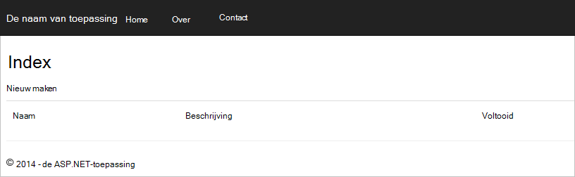

    Als u met behulp van Visual Studio 2013 en wordt het foutbericht "Kan niet wacht tot in de hoofdtekst van een catch-component." u moet de [Microsoft.Net.Compilers nuget package](https://www.nuget.org/packages/Microsoft.Net.Compilers/)installeren. U kunt ook de code voor het voorbeeldproject op [GitHub][]vergelijken. 

2. Klik op de koppeling **Nieuw** en waarden in de velden **naam** en **Beschrijving** toevoegen. De **voltooid** selectievakje uitgeschakeld laat anders het nieuwe **Item** wordt toegevoegd aan een voltooide staat en niet op de eerste lijst weergegeven.

    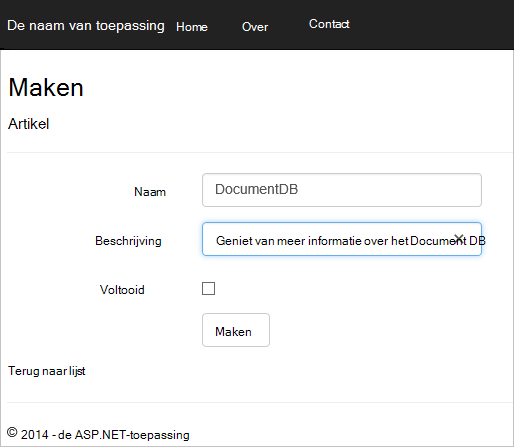

3. Klik op **maken** en wordt u omgeleid naar de **Index** weergeven en het **Item** wordt weergegeven in de lijst.

    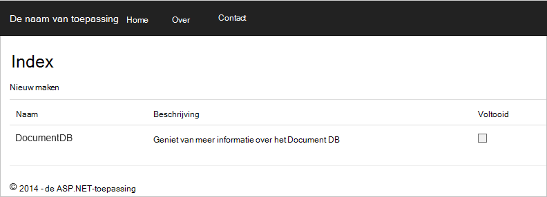

    Gerust een paar meer **Items** toevoegen aan uw takenlijst.

3. Klik op **bewerken** naast een **Item** in de lijst en u worden in de weergave **bewerken** waarin u een eigenschap van het object, met inbegrip van de vlag **voltooid** kunt bijwerken. Als u het markeren als **voltooid** en klik op **Opslaan**klikt, wordt het **Item** verwijderd uit de lijst met niet-voltooide taken.

    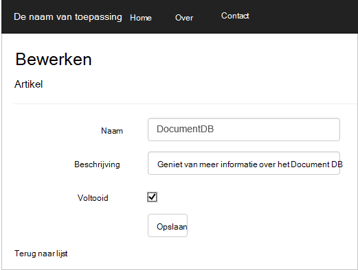

4. Eenmaal getest en de app, druk op Ctrl + F5 om te stoppen met het opsporen van fouten in de toepassing. U bent klaar om te implementeren!

## Stap 7: De toepassing naar Azure Websites implementeren

Nu dat u hebt de volledige toepassing correct werkt met DocumentDB gaan we dit web app naar Azure Websites implementeren. Als u **Host in de cloud** hebt geselecteerd tijdens het maken van de lege ASP.NET MVC project Visual Studio is dit heel eenvoudig en biedt de meeste van het werk voor u. 

1. Voor het publiceren van deze toepassing is hoeft u met de rechtermuisknop op het project in de **Solution Explorer** en klik op **publiceren**.

    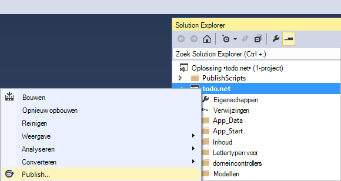

2. Alles moet al geconfigureerd volgens uw referenties; in feite is de website al gemaakt in Azure voor u op de **Doel-URL** weergegeven, hoeft u op **publiceren**klikt.

    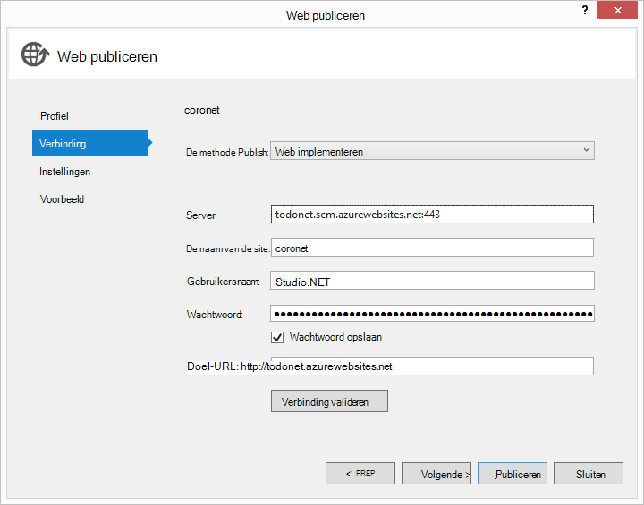

Visual Studio wordt binnen enkele seconden klaar bent met het publiceren van uw webtoepassing en een browser waarin u kunt zien bij de hand hebt uitgevoerd in Azure starten!

## Volgende stappen

Gefeliciteerd! U gewoon uw eerste ASP.NET MVC web application met Azure DocumentDB gebouwd en Azure websites gepubliceerd. De broncode voor de volledige toepassing, met inbegrip van de details en delete functionaliteit die niet zijn opgenomen in deze zelfstudie kan worden gedownload of gekopieerd [GitHub][]. Dus als u geïnteresseerd bent in die toe te voegen aan uw app, pak de code en toe te voegen aan dit app.

Om extra functionaliteit toe te voegen aan uw toepassing, bekijk de API's die beschikbaar zijn in de [Bibliotheek van DocumentDB .NET](https://msdn.microsoft.com/library/azure/dn948556.aspx) en gerust bij te dragen tot de .NET DocumentDB Library op [GitHub][]. 

[\*]: https://microsoft.sharepoint.com/teams/DocDB/Shared%20Documents/Documentation/Docs.LatestVersions/PicExportError
[Visual Studio Express]: http://www.visualstudio.com/products/visual-studio-express-vs.aspx
[Microsoft Web Platform Installer]: http://www.microsoft.com/web/downloads/platform.aspx
[Cross-Site Request vervalsing te voorkomen]: http://go.microsoft.com/fwlink/?LinkID=517254
[CRUD elementaire bewerkingen in ASP.NET MVC]: http://go.microsoft.com/fwlink/?LinkId=317598
[GitHub]: https://github.com/Azure-Samples/documentdb-net-todo-app
