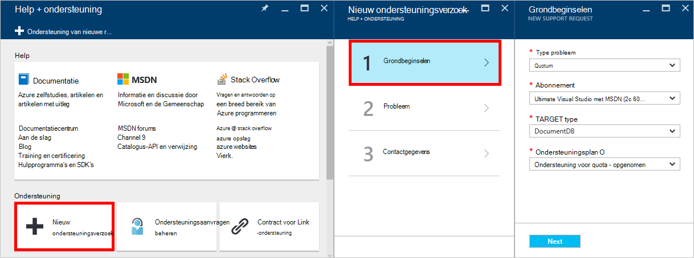

<properties
    pageTitle="DocumentDB firewall ondersteuning | Microsoft Azure"
    description="Leren werken met het beleid voor IP-toegang voor ondersteuning van de firewall op Azure DocumentDB database accounts."
    keywords="IP-toegang beheren, firewall-ondersteuning"
    services="documentdb"
    authors="shahankur11"
    manager="jhubbard"
    editor=""
    tags="azure-resource-manager"
    documentationCenter=""/>

<tags 
    ms.service="documentdb" 
    ms.workload="data-services" 
    ms.tgt_pltfrm="na" 
    ms.devlang="na" 
    ms.topic="article" 
    ms.date="10/17/2016" 
    ms.author="ankshah; kraman"/>

# Firewall-ondersteuning voor DocumentDB

Beveiliging van gegevens die zijn opgeslagen in een database Azure DocumentDB account heeft DocumentDB ondersteuning voor een geheime basis [model vergunning](https://msdn.microsoft.com/library/azure/dn783368.aspx) die gebruikmaakt van een sterke Hash-based message authentication code (HMAC) verstrekt. DocumentDB ondersteunt nu, naast het model geheime basis vergunning beleid op IP gebaseerde toegangscontrole voor de firewall binnenkomende ondersteuning gereden. Dit model is vergelijkbaar met de firewall-regels van een traditionele database-systeem en biedt een extra niveau van beveiliging aan de account van de database DocumentDB. Met dit model, kunt u een account DocumentDB database alleen toegankelijk vanaf een goedgekeurde set van machines en/of cloud-services nu configureren. Toegang tot bronnen van de DocumentDB van deze erkende sets van machines en services moeten nog steeds de beller een geldige Autorisatietoken te presenteren.

## IP-Toegangsbeheer-overzicht

Een DocumentDB database-account is standaard toegankelijk vanaf het openbare internet, mits het verzoek vergezeld van een geldige vergunning token gaat. Configureren van IP-beleid gebaseerd toegangsbeheer, moet de gebruiker de reeks IP-adressen of IP-adresbereiken in CIDR-formulier om te worden opgenomen in de lijst met toegestane van client-IP-adressen voor een bepaalde database opgeven. Nadat u deze configuratie wordt toegepast, worden alle aanvragen die afkomstig zijn van computers buiten de toegestane lijst door de server geblokkeerd.  De verwerking van de artikelenstroom voor het besturingselement op basis van een IP verbinding wordt beschreven in het volgende diagram.

## Verbindingen van cloud-services

Cloud-services zijn in Azure, een eenvoudige manier voor het hosten van de midden-tier-service logica met DocumentDB. Voor toegang tot een DocumentDB database-account van een cloud-service, moet het openbare IP-adres van de cloud-service worden toegevoegd aan de lijst met toegestane IP-adressen die zijn gekoppeld aan uw account DocumentDB database contact opnemen met [ondersteuning van Azure](#configure-ip-policy).  Dit zorgt ervoor dat alle exemplaren van de rol van cloud-services toegang tot uw account DocumentDB database hebben. Zoals in de volgende schermafdruk, kunt u IP-adressen voor de cloud-services in het portal voor Azure ophalen. 

Als u van uw cloud-service schalen door instanties aanvullende rol toe te voegen, hebben deze nieuwe exemplaren automatisch toegang tot de database DocumentDB account omdat ze deel van dezelfde service cloud uitmaken.

## Verbindingen van virtuele machines

[Virtuele machines](https://azure.microsoft.com/services/virtual-machines/) of [virtuele machine schaal ingesteld](../virtual-machine-scale-sets/virtual-machine-scale-sets-overview.md) kan ook worden gebruikt als host voor de middelste laag services met behulp van DocumentDB.  Configureren van de DocumentDB moet database-account voor toegang van virtuele machines, openbare IP-adressen van de virtuele machine en/of virtuele machine schaal set worden geconfigureerd als een van de toegestane IP-adressen voor de account DocumentDB database contact opnemen met [ondersteuning van Azure](#configure-ip-policy). Zoals in de volgende schermafdruk kunt u IP-adressen voor de virtuele machines in de portal voor Azure ophalen.

Wanneer u extra virtuele machine exemplaren aan de groep toevoegen, worden ze automatisch toegang tot uw account DocumentDB database opgegeven.

## Verbindingen vanaf het internet

Wanneer u een account DocumentDB database vanaf een computer op het internet, moet u de client-IP-adres of IP-adresbereik van de machine toegevoegd aan de lijst met toegestane IP-adres voor de account DocumentDB database. 

## Het toegangsbeleid voor IP configureren

De Azure portal gebruiken om de IP-toegangsbeleid op uw databaseaccount aanvragen met [Ondersteuning van Azure](https://portal.azure.com/?#blade/Microsoft_Azure_Support/HelpAndSupportBlade) .

1. Selecteer **nieuw ondersteuningsverzoek**in de blade [Help + ondersteuning](https://portal.azure.com/?#blade/Microsoft_Azure_Support/HelpAndSupportBlade) .
2. Selecteer in het blad **nieuw ondersteuningsverzoek** **Grondbeginselen**.
3. Selecteer de volgende opties in de blade **Grondbeginselen** :
    - **Soort probleem**: Quota
    - **Abonnement**: het abonnement is gekoppeld aan de account waarin het toegangsbeleid IP toevoegen.
    - **Target type**: DocumentDB
    - **Ondersteuningsplan**: ondersteuning voor Quota - opgenomen.
4. In het blad **probleem** het volgende doen:
    - **Ernst**: Selecteer C - overlast
    - **Details**: Kopieer de volgende tekst in het vak en uw account naam/s en het IP-adres/es: "Ik wil graag ondersteuning voor mijn account van de database DocumentDB firewall inschakelen. Database-account: *inclusief account naam/s*. IP-adresbereiken toegestaan: *bevat IP-adresbereik in CIDR-indeling, bijvoorbeeld 13.91.6.132, 13.91.6.1/24*. "
    - Klik op **volgende**. 
5. Vul uw contactgegevens in de blade **contactgegevens** en klikt u op **maken**. 

Zodra uw aanvraag is ontvangen, kan IP-toegangsbeheer moet worden ingeschakeld binnen 24 uur. U wordt gewaarschuwd wanneer de aanvraag voltooid is.

## Het toegangsbeleid voor IP-problemen oplossen

### Portal-bewerkingen

Doordat de IP-beleid voor uw account DocumentDB database toegestaan alle toegang tot uw account DocumentDB database van computers buiten de geconfigureerde lijst met IP-adresbereiken worden geblokkeerd. Op grond van dit model, worden vlak bij de gegevensbewerking vanaf de portal te surfen ook geblokkeerd om de integriteit van toegangsbeheer. 

### SDK & Rest API

Voor toegang via SDK of de API van de REST van de machines niet in de lijst met toegestane uit veiligheidsoverwegingen het resultaat van generieke 404 niet gevonden zonder extra details. Controleer of de IP-toegestaan lijst die is geconfigureerd voor uw account DocumentDB database zodat de configuratie van het juiste beleid wordt toegepast op uw account DocumentDB database.

## Volgende stappen

Voor informatie over het netwerk Zie Verwante performance tips, [tips voor betere prestaties](documentdb-performance-tips.md).