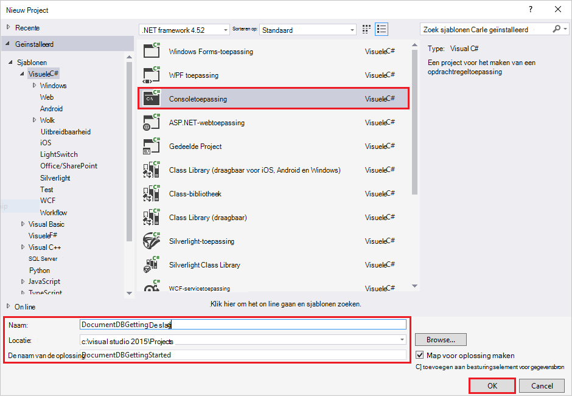
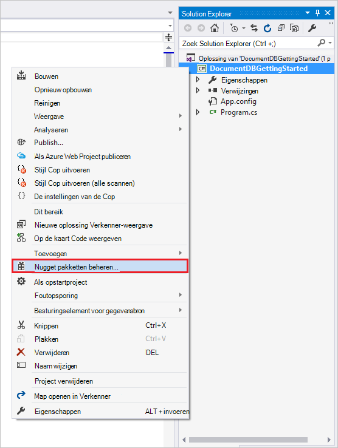
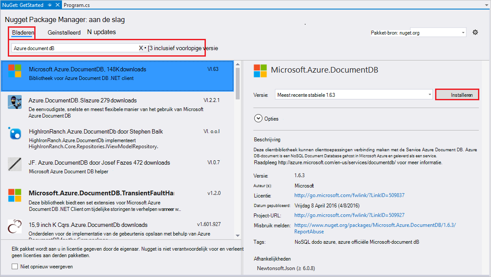
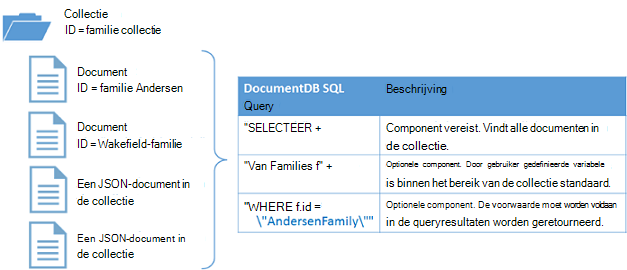

<properties
    pageTitle="Zelfstudie voor NoSQL: DocumentDB .NET SDK | Microsoft Azure"
    description="Een zelfstudie NoSQL die een online database en C# met behulp van de DocumentDB .NET SDK consoletoepassing worden gemaakt. DocumentDB is een database NoSQL voor JSON."
    keywords="nosql zelfstudie, on line database consoletoepassing in c#"
    services="documentdb"
    documentationCenter=".net"
    authors="AndrewHoh"
    manager="jhubbard"
    editor="monicar"/>

<tags
    ms.service="documentdb"
    ms.workload="data-services"
    ms.tgt_pltfrm="na"
    ms.devlang="dotnet"
    ms.topic="hero-article"
    ms.date="08/29/2016"
    ms.author="anhoh"/>

# NoSQL zelfstudie: bouwen van een DocumentDB C# consoletoepassing

> [AZURE.SELECTOR]
- [.NET](documentdb-get-started.md)
- [Node.js](documentdb-nodejs-get-started.md)

Welkom bij de zelfstudie NoSQL voor de .NET SDK Azure DocumentDB! Na het volgen van deze zelfstudie hebt u een consoletoepassing die wordt gemaakt en de query DocumentDB bronnen.

Wij zullen betrekking hebben op:

- Maken en verbinding maken met een account met DocumentDB
- Configureren van de Visual Studio-oplossing
- Een on line database maken
- Een collectie maken
- JSON-documenten maken
- Bij het controleren van de collectie
- Een document vervangen
- Een document verwijderen
- De database verwijderen

Geen tijd? Maak je niet druk! De volledige oplossing is beschikbaar op [GitHub](https://github.com/Azure-Samples/documentdb-dotnet-getting-started). Springen naar het [ophalen van de sectie van de complete oplossing](#GetSolution) voor snel instructies.

Daarna Gebruik de stemknoppen boven of onder aan deze pagina om ons feedback te geven. Als u wij u rechtstreeks contact opnemen met dat wilt, kunt u uw e-mailadres opnemen in uw opmerkingen.

Nu gaan we aan de slag!

## Vereisten

Zorg ervoor dat u hebt de volgende opties:

- Een actieve account Azure. Als u niet hebt, kunt u zich aanmelden voor een [gratis account](https://azure.microsoft.com/free/).
- [Visual Studio 2013 / Visual Studio 2015](http://www.visualstudio.com/).
- .NET framework 4.6

## Stap 1: Maak een account DocumentDB

We maken een DocumentDB account. Als u al een account die u wilt gebruiken, kunt u verder gaan voor het [instellen van de Visual Studio-oplossing](#SetupVS).

[AZURE.INCLUDE [documentdb-create-dbaccount](../../includes/documentdb-create-dbaccount.md)]

## Stap 2: Stel de Visual Studio-oplossing

1. Open de **Visual Studio 2015** op uw computer.
2. Selecteer **Nieuw**in het menu **bestand** en kies vervolgens **Project**.
3. Selecteer in het dialoogvenster **Nieuw Project** **sjablonen** / **Visual C#** / **Console-programma**, het project een naam en klik op **OK**.

4. In de **Solution Explorer**, klik met de rechtermuisknop op de nieuwe consoletoepassing in de Visual Studio-oplossing.
5. Zonder het menu, klik op **Beheren NuGet-pakketten...** 
 
6. Klik op **Bladeren**op het tabblad **Nuget** en **azure documentdb** typt in het zoekvak.
7. In de resultaten van de **Microsoft.Azure.DocumentDB** zoeken en klik op **installeren**.
De pakket-ID voor de Client-bibliotheek van DocumentDB is [Microsoft.Azure.DocumentDB](https://www.nuget.org/packages/Microsoft.Azure.DocumentDB)

Heel goed! Nu dat we de setup is voltooid, moet u eerst wat code schrijft. Een project van de volledige code van deze zelfstudie kunt u vinden op [GitHub](https://github.com/Azure-Samples/documentdb-dotnet-getting-started/blob/master/src/Program.cs).

## Stap 3: Verbinding maken met een account met DocumentDB

Eerst deze verwijzingen toevoegen aan het begin van de C#-toepassing in het bestand Program.cs:

    using System;
    using System.Linq;
    using System.Threading.Tasks;

    // ADD THIS PART TO YOUR CODE
    using System.Net;
    using Microsoft.Azure.Documents;
    using Microsoft.Azure.Documents.Client;
    using Newtonsoft.Json;

> [AZURE.IMPORTANT] Voordat u deze zelfstudie NoSQL voltooien, moet dat u de bovenstaande afhankelijkheden toevoegen.

Nu deze twee constanten en de variabele *client* onder de openbare klasse *programma*toevoegen.

    public class Program
    {
        // ADD THIS PART TO YOUR CODE
        private const string EndpointUri = "<your endpoint URI>";
        private const string PrimaryKey = "<your key>";
        private DocumentClient client;

Volgende kop aan de [Azure Portal](https://portal.azure.com) voor het ophalen van de URI en de primaire sleutel. De URI van de DocumentDB en de primaire sleutel zijn nodig voor uw toepassing te begrijpen waar u verbinding maken met en voor de DocumentDB van uw toepassing verbinding te vertrouwen.

Navigeer naar de account van de DocumentDB in de Portal Azure en klik op **toetsen**.

De URI van de portal te kopiëren en plakken in `<your endpoint URI>` in het bestand program.cs. Vervolgens de primaire sleutel van de portal te kopiëren en plakken in `<your key>`.

![Schermafdruk van Azure Portal gebruikt door de NoSQL zelfstudie voor het maken van een consoletoepassing C#. Geeft een DocumentDB-account met de actieve hub gemarkeerd, de TOETSEN-knop op de account DocumentDB blade gemarkeerd en de URI, primaire en secundaire sleutel waarden op de bladeserver sleutels gemarkeerd][keys]

We beginnen de ophalen toepassing gestart met het maken van een nieuw exemplaar van de **DocumentClient**.

Voeg dit nieuwe asynchrone taak genaamd **GetStartedDemo**, die wordt een exemplaar van onze nieuwe **DocumentClient**onder de **Main** -methode.

    static void Main(string[] args)
    {
    }

    // ADD THIS PART TO YOUR CODE
    private async Task GetStartedDemo()
    {
        this.client = new DocumentClient(new Uri(EndpointUri), PrimaryKey);
    }

Voeg de volgende code de asynchrone taak uitvoeren vanuit de **Main** -methode. De **Main** -methode wordt werkelijk uitzonderingen en schrijf deze op de console.

    static void Main(string[] args)
    {
            // ADD THIS PART TO YOUR CODE
            try
            {
                    Program p = new Program();
                    p.GetStartedDemo().Wait();
            }
            catch (DocumentClientException de)
            {
                    Exception baseException = de.GetBaseException();
                    Console.WriteLine("{0} error occurred: {1}, Message: {2}", de.StatusCode, de.Message, baseException.Message);
            }
            catch (Exception e)
            {
                    Exception baseException = e.GetBaseException();
                    Console.WriteLine("Error: {0}, Message: {1}", e.Message, baseException.Message);
            }
            finally
            {
                    Console.WriteLine("End of demo, press any key to exit.");
                    Console.ReadKey();
            }

Druk op **F5** om de toepassing te starten.

Gefeliciteerd! U verbinding met een DocumentDB-account hebt gemaakt, nu laten we bij het werken met resources DocumentDB.  

## Stap 4: Een database maken
Voordat u de code voor het maken van een database toevoegen, kunt u een helpmethode voor het schrijven van de console toevoegen.

Kopieer en plak de methode **WriteToConsoleAndPromptToContinue** onder de methode **GetStartedDemo** .

    // ADD THIS PART TO YOUR CODE
    private void WriteToConsoleAndPromptToContinue(string format, params object[] args)
    {
            Console.WriteLine(format, args);
            Console.WriteLine("Press any key to continue ...");
            Console.ReadKey();
    }

De DocumentDB- [database](documentdb-resources.md#databases) kan worden gemaakt met de methode [CreateDatabaseAsync](https://msdn.microsoft.com/library/microsoft.azure.documents.client.documentclient.createdatabaseasync.aspx) van de klasse **DocumentClient** . Een database is de logische container van JSON-documentopslag gepartitioneerd in collecties.

Kopieer en plak de methode **CreateDatabaseIfNotExists** onder de methode **WriteToConsoleAndPromptToContinue** .

    // ADD THIS PART TO YOUR CODE
    private async Task CreateDatabaseIfNotExists(string databaseName)
    {
            // Check to verify a database with the id=FamilyDB does not exist
            try
            {
                    await this.client.ReadDatabaseAsync(UriFactory.CreateDatabaseUri(databaseName));
                    this.WriteToConsoleAndPromptToContinue("Found {0}", databaseName);
            }
            catch (DocumentClientException de)
            {
                    // If the database does not exist, create a new database
                    if (de.StatusCode == HttpStatusCode.NotFound)
                    {
                            await this.client.CreateDatabaseAsync(new Database { Id = databaseName });
                            this.WriteToConsoleAndPromptToContinue("Created {0}", databaseName);
                    }
                    else
                    {
                            throw;
                    }
            }
    }

Kopieer en plak de volgende code in de methode **GetStartedDemo** onder het maken van de client. Hiermee maakt u een database met de naam *FamilyDB*.

    private async Task GetStartedDemo()
    {
        this.client = new DocumentClient(new Uri(EndpointUri), PrimaryKey);

        // ADD THIS PART TO YOUR CODE
        await this.CreateDatabaseIfNotExists("FamilyDB_oa");

Druk op **F5** om de toepassing te starten.

Gefeliciteerd! Een DocumentDB-database hebt gemaakt.  

## Stap 5: Een collectie maken  

> [AZURE.WARNING] **CreateDocumentCollectionAsync** maakt een nieuwe collectie met gereserveerde doorvoer die prijzen implicaties heeft. Bezoek onze [prijzen pagina](https://azure.microsoft.com/pricing/details/documentdb/)voor meer details.

Een [collectie](documentdb-resources.md#collections) kan worden gemaakt met de methode [CreateDocumentCollectionAsync](https://msdn.microsoft.com/library/microsoft.azure.documents.client.documentclient.createdocumentcollectionasync.aspx) van de klasse **DocumentClient** . Een collectie is een container van JSON-documenten en de bijbehorende JavaScript toepassingslogica.

Kopieer en plak de methode **CreateDocumentCollectionIfNotExists** onder de methode **CreateDatabaseIfNotExists** .

    // ADD THIS PART TO YOUR CODE
    private async Task CreateDocumentCollectionIfNotExists(string databaseName, string collectionName)
    {
        try
        {
            await this.client.ReadDocumentCollectionAsync(UriFactory.CreateDocumentCollectionUri(databaseName, collectionName));
            this.WriteToConsoleAndPromptToContinue("Found {0}", collectionName);
        }
        catch (DocumentClientException de)
        {
            // If the document collection does not exist, create a new collection
            if (de.StatusCode == HttpStatusCode.NotFound)
            {
                DocumentCollection collectionInfo = new DocumentCollection();
                collectionInfo.Id = collectionName;

                // Configure collections for maximum query flexibility including string range queries.
                collectionInfo.IndexingPolicy = new IndexingPolicy(new RangeIndex(DataType.String) { Precision = -1 });

                // Here we create a collection with 400 RU/s.
                await this.client.CreateDocumentCollectionAsync(
                    UriFactory.CreateDatabaseUri(databaseName),
                    collectionInfo,
                    new RequestOptions { OfferThroughput = 400 });

                this.WriteToConsoleAndPromptToContinue("Created {0}", collectionName);
            }
            else
            {
                throw;
            }
        }
    }

Kopieer en plak de volgende code in de methode **GetStartedDemo** onder het maken van de database. Hiermee maakt u een document-collectie met de naam *FamilyCollection_oa*.

        this.client = new DocumentClient(new Uri(EndpointUri), PrimaryKey);

        await this.CreateDatabaseIfNotExists("FamilyDB_oa");

        // ADD THIS PART TO YOUR CODE
        await this.CreateDocumentCollectionIfNotExists("FamilyDB_oa", "FamilyCollection_oa");

Druk op **F5** om de toepassing te starten.

Gefeliciteerd! Een collectie DocumentDB document hebt gemaakt.  

## Stap 6: JSON-documenten maken
Een [document](documentdb-resources.md#documents) kan worden gemaakt met de methode [CreateDocumentAsync](https://msdn.microsoft.com/library/microsoft.azure.documents.client.documentclient.createdocumentasync.aspx) van de klasse **DocumentClient** . Documenten worden door de gebruiker gedefinieerde (willekeurige) JSON-inhoud. We kunnen nu een of meer documenten toevoegen. Als u de gegevens die u wilt opslaan in uw database al hebt, kunt u de DocumentDB [Data Migration tool](documentdb-import-data.md).

Eerst moet een **familie** klasse maken die objecten die worden opgeslagen in de DocumentDB in dit voorbeeld wordt aangegeven. We gaan ook de **bovenliggende**, **onderliggende**, **huisdieren**, **adres** subklassen die worden gebruikt binnen de **familie**maken. Houd er rekening mee dat documenten moeten een **Id** -eigenschap **id** in JSON worden geserialiseerd. Deze klassen maken door de volgende interne onderdelen klassen toe te voegen na de methode **GetStartedDemo** .

Kopieer en plak de **familie**, **bovenliggende**, **onderliggende**, **huisdieren**en **adresklassen onder de methode **WriteToConsoleAndPromptToContinue** ** .

    private void WriteToConsoleAndPromptToContinue(string format, params object[] args)
    {
        Console.WriteLine(format, args);
        Console.WriteLine("Press any key to continue ...");
        Console.ReadKey();
    }

    // ADD THIS PART TO YOUR CODE
    public class Family
    {
        [JsonProperty(PropertyName = "id")]
        public string Id { get; set; }
        public string LastName { get; set; }
        public Parent[] Parents { get; set; }
        public Child[] Children { get; set; }
        public Address Address { get; set; }
        public bool IsRegistered { get; set; }
        public override string ToString()
        {
                return JsonConvert.SerializeObject(this);
        }
    }

    public class Parent
    {
        public string FamilyName { get; set; }
        public string FirstName { get; set; }
    }

    public class Child
    {
        public string FamilyName { get; set; }
        public string FirstName { get; set; }
        public string Gender { get; set; }
        public int Grade { get; set; }
        public Pet[] Pets { get; set; }
    }

    public class Pet
    {
        public string GivenName { get; set; }
    }

    public class Address
    {
        public string State { get; set; }
        public string County { get; set; }
        public string City { get; set; }
    }

Kopieer en plak de methode **CreateFamilyDocumentIfNotExists** onder de methode **CreateDocumentCollectionIfNotExists** .

    // ADD THIS PART TO YOUR CODE
    private async Task CreateFamilyDocumentIfNotExists(string databaseName, string collectionName, Family family)
    {
        try
        {
            await this.client.ReadDocumentAsync(UriFactory.CreateDocumentUri(databaseName, collectionName, family.Id));
            this.WriteToConsoleAndPromptToContinue("Found {0}", family.Id);
        }
        catch (DocumentClientException de)
        {
            if (de.StatusCode == HttpStatusCode.NotFound)
            {
                await this.client.CreateDocumentAsync(UriFactory.CreateDocumentCollectionUri(databaseName, collectionName), family);
                this.WriteToConsoleAndPromptToContinue("Created Family {0}", family.Id);
            }
            else
            {
                throw;
            }
        }
    }

En voegt u twee documenten de Andersen-familie en de familie Wakefield.

Kopieer en plak de volgende code in de methode **GetStartedDemo** onder het maken van een siteverzameling document.

    await this.CreateDatabaseIfNotExists("FamilyDB_oa");

    await this.CreateDocumentCollectionIfNotExists("FamilyDB_oa", "FamilyCollection_oa");

    // ADD THIS PART TO YOUR CODE
    Family andersenFamily = new Family
    {
            Id = "Andersen.1",
            LastName = "Andersen",
            Parents = new Parent[]
            {
                    new Parent { FirstName = "Thomas" },
                    new Parent { FirstName = "Mary Kay" }
            },
            Children = new Child[]
            {
                    new Child
                    {
                            FirstName = "Henriette Thaulow",
                            Gender = "female",
                            Grade = 5,
                            Pets = new Pet[]
                            {
                                    new Pet { GivenName = "Fluffy" }
                            }
                    }
            },
            Address = new Address { State = "WA", County = "King", City = "Seattle" },
            IsRegistered = true
    };

    await this.CreateFamilyDocumentIfNotExists("FamilyDB_oa", "FamilyCollection_oa", andersenFamily);

    Family wakefieldFamily = new Family
    {
            Id = "Wakefield.7",
            LastName = "Wakefield",
            Parents = new Parent[]
            {
                    new Parent { FamilyName = "Wakefield", FirstName = "Robin" },
                    new Parent { FamilyName = "Miller", FirstName = "Ben" }
            },
            Children = new Child[]
            {
                    new Child
                    {
                            FamilyName = "Merriam",
                            FirstName = "Jesse",
                            Gender = "female",
                            Grade = 8,
                            Pets = new Pet[]
                            {
                                    new Pet { GivenName = "Goofy" },
                                    new Pet { GivenName = "Shadow" }
                            }
                    },
                    new Child
                    {
                            FamilyName = "Miller",
                            FirstName = "Lisa",
                            Gender = "female",
                            Grade = 1
                    }
            },
            Address = new Address { State = "NY", County = "Manhattan", City = "NY" },
            IsRegistered = false
    };

    await this.CreateFamilyDocumentIfNotExists("FamilyDB_oa", "FamilyCollection_oa", wakefieldFamily);

Druk op **F5** om de toepassing te starten.

Gefeliciteerd! U hebt twee DocumentDB documenten gemaakt.  

##Stap 7: Query DocumentDB resources

DocumentDB ondersteunt krachtige [query's](documentdb-sql-query.md) tegen JSON-documenten die zijn opgeslagen in elke collectie.  De volgende voorbeeldcode ziet u verschillende query's - met beide DocumentDB SQL-syntaxis en LINQ - ingevoegd dat we kunnen worden uitgevoerd ten opzichte van de documenten we in de vorige stap.

Kopieer en plak de methode **ExecuteSimpleQuery** onder de methode **CreateFamilyDocumentIfNotExists** .

    // ADD THIS PART TO YOUR CODE
    private void ExecuteSimpleQuery(string databaseName, string collectionName)
    {
        // Set some common query options
        FeedOptions queryOptions = new FeedOptions { MaxItemCount = -1 };

            // Here we find the Andersen family via its LastName
            IQueryable<Family> familyQuery = this.client.CreateDocumentQuery<Family>(
                    UriFactory.CreateDocumentCollectionUri(databaseName, collectionName), queryOptions)
                    .Where(f => f.LastName == "Andersen");

            // The query is executed synchronously here, but can also be executed asynchronously via the IDocumentQuery<T> interface
            Console.WriteLine("Running LINQ query...");
            foreach (Family family in familyQuery)
            {
                    Console.WriteLine("\tRead {0}", family);
            }

            // Now execute the same query via direct SQL
            IQueryable<Family> familyQueryInSql = this.client.CreateDocumentQuery<Family>(
                    UriFactory.CreateDocumentCollectionUri(databaseName, collectionName),
                    "SELECT * FROM Family WHERE Family.LastName = 'Andersen'",
                    queryOptions);

            Console.WriteLine("Running direct SQL query...");
            foreach (Family family in familyQueryInSql)
            {
                    Console.WriteLine("\tRead {0}", family);
            }

            Console.WriteLine("Press any key to continue ...");
            Console.ReadKey();
    }

Kopieer en plak de volgende code in de methode **GetStartedDemo** onder het tweede document maken.

    await this.CreateFamilyDocumentIfNotExists("FamilyDB_oa", "FamilyCollection_oa", wakefieldFamily);

    // ADD THIS PART TO YOUR CODE
    this.ExecuteSimpleQuery("FamilyDB_oa", "FamilyCollection_oa");

Druk op **F5** om de toepassing te starten.

Gefeliciteerd! U hebt met succes tegen een DocumentDB-collectie opgevraagd.

In het volgende diagram ziet u hoe de DocumentDB SQL-querysyntaxis ten opzichte van de collectie die u hebt gemaakt wordt genoemd en dezelfde logica van toepassing is aan de LINQ-query.

Het sleutelwoord [FROM](documentdb-sql-query.md#from-clause) wordt optioneel in de query omdat DocumentDB query's zijn al binnen het bereik van één collectie. Dus "Van Families f" kan worden verwisseld met "Van basis-r" of elke andere variabele naam u kiest. DocumentDB zal afleiden dat Families, het hoofd of de naam van de variabele die u hebt gekozen, verwijst naar de huidige collectie standaard.

##Stap 8: Vervangen JSON-document

DocumentDB ondersteunt vervangt JSON-documenten.  

Kopieer en plak de methode **ReplaceFamilyDocument** onder de methode **ExecuteSimpleQuery** .

    // ADD THIS PART TO YOUR CODE
    private async Task ReplaceFamilyDocument(string databaseName, string collectionName, string familyName, Family updatedFamily)
    {
        try
        {
            await this.client.ReplaceDocumentAsync(UriFactory.CreateDocumentUri(databaseName, collectionName, familyName), updatedFamily);
            this.WriteToConsoleAndPromptToContinue("Replaced Family {0}", familyName);
        }
        catch (DocumentClientException de)
        {
            throw;
        }
    }

Kopieer en plak de volgende code in de methode **GetStartedDemo** onder de uitvoering van de query. Na het vervangen van het document wordt opnieuw om het gewijzigde document dezelfde query uitgevoerd.

    await this.CreateFamilyDocumentIfNotExists("FamilyDB_oa", "FamilyCollection_oa", wakefieldFamily);

    this.ExecuteSimpleQuery("FamilyDB_oa", "FamilyCollection_oa");

    // ADD THIS PART TO YOUR CODE
    // Update the Grade of the Andersen Family child
    andersenFamily.Children[0].Grade = 6;

    await this.ReplaceFamilyDocument("FamilyDB_oa", "FamilyCollection_oa", "Andersen.1", andersenFamily);

    this.ExecuteSimpleQuery("FamilyDB_oa", "FamilyCollection_oa");

Druk op **F5** om de toepassing te starten.

Gefeliciteerd! U hebt een document DocumentDB is vervangen.

##Stap 9: JSON-document verwijderen

DocumentDB ondersteunt verwijderen JSON-documenten.  

Kopieer en plak de methode **DeleteFamilyDocument** onder de methode **ReplaceFamilyDocument** .

    // ADD THIS PART TO YOUR CODE
    private async Task DeleteFamilyDocument(string databaseName, string collectionName, string documentName)
    {
        try
        {
            await this.client.DeleteDocumentAsync(UriFactory.CreateDocumentUri(databaseName, collectionName, documentName));
            Console.WriteLine("Deleted Family {0}", documentName);
        }
        catch (DocumentClientException de)
        {
            throw;
        }
    }

Kopieer en plak de volgende code in de methode **GetStartedDemo** onder de tweede query kan worden uitgevoerd.

    await this.ReplaceFamilyDocument("FamilyDB_oa", "FamilyCollection_oa", "Andersen.1", andersenFamily);

    this.ExecuteSimpleQuery("FamilyDB_oa", "FamilyCollection_oa");

    // ADD THIS PART TO CODE
    await this.DeleteFamilyDocument("FamilyDB_oa", "FamilyCollection_oa", "Andersen.1");

Druk op **F5** om de toepassing te starten.

Gefeliciteerd! Een DocumentDB document verwijderd.

##Stap 10: De database verwijderen

De gemaakte database verwijdert, wordt de database en alle onderliggende bronnen (verzamelingen, documenten, enz.).

Kopieer en plak de volgende code in de methode **GetStartedDemo** onder het document de gehele database en alle onderliggende bronnen verwijderen om te verwijderen.

    this.ExecuteSimpleQuery("FamilyDB_oa", "FamilyCollection_oa");

    await this.DeleteFamilyDocument("FamilyDB_oa", "FamilyCollection_oa", "Andersen.1");

    // ADD THIS PART TO CODE
    // Clean up/delete the database
    await this.client.DeleteDatabaseAsync(UriFactory.CreateDatabaseUri("FamilyDB_oa"));

Druk op **F5** om de toepassing te starten.

Gefeliciteerd! Een DocumentDB-database verwijderd.

##Stap 11: Uitvoering de C#-consoletoepassing bij elkaar!

Druk op F5 in Visual Studio om de toepassing in de foutopsporingsmodus te maken.

Hier ziet u de uitvoer van de get gestarte app. De uitvoer ziet de resultaten van de query's die we toegevoegd en moet overeenkomen met het onderstaande voorbeeldtekst.

    Created FamilyDB_oa
    Press any key to continue ...
    Created FamilyCollection_oa
    Press any key to continue ...
    Created Family Andersen.1
    Press any key to continue ...
    Created Family Wakefield.7
    Press any key to continue ...
    Running LINQ query...
        Read {"id":"Andersen.1","LastName":"Andersen","District":"WA5","Parents":[{"FamilyName":null,"FirstName":"Thomas"},{"FamilyName":null,"FirstName":"Mary Kay"}],"Children":[{"FamilyName":null,"FirstName":"Henriette Thaulow","Gender":"female","Grade":5,"Pets":[{"GivenName":"Fluffy"}]}],"Address":{"State":"WA","County":"King","City":"Seattle"},"IsRegistered":true}
    Running direct SQL query...
        Read {"id":"Andersen.1","LastName":"Andersen","District":"WA5","Parents":[{"FamilyName":null,"FirstName":"Thomas"},{"FamilyName":null,"FirstName":"Mary Kay"}],"Children":[{"FamilyName":null,"FirstName":"Henriette Thaulow","Gender":"female","Grade":5,"Pets":[{"GivenName":"Fluffy"}]}],"Address":{"State":"WA","County":"King","City":"Seattle"},"IsRegistered":true}
    Replaced Family Andersen.1
    Press any key to continue ...
    Running LINQ query...
        Read {"id":"Andersen.1","LastName":"Andersen","District":"WA5","Parents":[{"FamilyName":null,"FirstName":"Thomas"},{"FamilyName":null,"FirstName":"Mary Kay"}],"Children":[{"FamilyName":null,"FirstName":"Henriette Thaulow","Gender":"female","Grade":6,"Pets":[{"GivenName":"Fluffy"}]}],"Address":{"State":"WA","County":"King","City":"Seattle"},"IsRegistered":true}
    Running direct SQL query...
        Read {"id":"Andersen.1","LastName":"Andersen","District":"WA5","Parents":[{"FamilyName":null,"FirstName":"Thomas"},{"FamilyName":null,"FirstName":"Mary Kay"}],"Children":[{"FamilyName":null,"FirstName":"Henriette Thaulow","Gender":"female","Grade":6,"Pets":[{"GivenName":"Fluffy"}]}],"Address":{"State":"WA","County":"King","City":"Seattle"},"IsRegistered":true}
    Deleted Family Andersen.1
    End of demo, press any key to exit.

Gefeliciteerd! U deze zelfstudie NoSQL hebt voltooid en hebt een werkende C# consoletoepassing!

##Volledige zelfstudie NoSQL oplossing
Als u de GetStarted oplossing met de voorbeelden in dit artikel, moet u het volgende:

- Een actieve account Azure. Als u niet hebt, kunt u zich aanmelden voor een [gratis account](https://azure.microsoft.com/free/).
-   Een [DocumentDB account][documentdb-create-account].
-   De [GetStarted](https://github.com/Azure-Samples/documentdb-dotnet-getting-started) oplossing beschikbaar op GitHub.

Als u de verwijzingen naar DocumentDB in Visual Studio .NET SDK herstellen, de **GetStarted** oplossing in de Solution Explorer met de rechtermuisknop en klik vervolgens op **Inschakelen NuGet pakket herstellen**. Vervolgens het bestand App.config werk in de waarden EndpointUrl en AuthorizationKey zoals beschreven in [verbinding maken met een account met DocumentDB](#Connect).

## Volgende stappen

- Wilt u een meer complexe ASP.NET MVC NoSQL zelfstudie? Zie het [maken van een webtoepassing met ASP.NET MVC met DocumentDB](documentdb-dotnet-application.md).
- Wilt u schaal en prestaties testen met DocumentDB uit te voeren? Zie [prestaties en testen met Azure DocumentDB schaal](documentdb-performance-testing.md)
-   Meer informatie over hoe u [een account DocumentDB monitor](documentdb-monitor-accounts.md).
-   Query's uitvoeren tegen onze dataset monster in de [Query Speelplaats](https://www.documentdb.com/sql/demo).
-   Meer informatie over het programmeermodel in de sectie van het opstellen van de [DocumentDB documentatiepagina](https://azure.microsoft.com/documentation/services/documentdb/).

[documentdb-create-account]: documentdb-create-account.md
[documentdb-manage]: documentdb-manage.md
[keys]: media/documentdb-get-started/nosql-tutorial-keys.png
