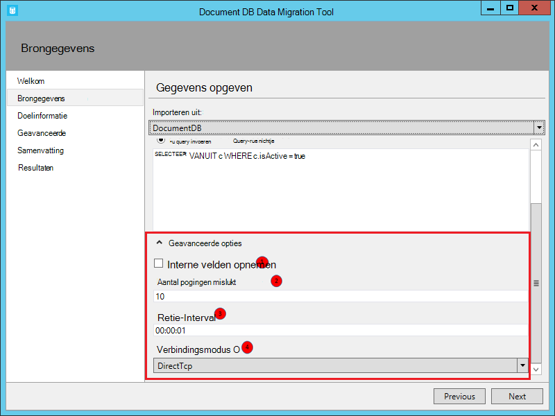

<properties
    pageTitle="Database migratie tool voor DocumentDB | Microsoft Azure"
    description="Informatie over het gebruik van de open-source DocumentDB hulpprogramma's voor gegevensmigratie DocumentDB gegevens importeren uit verschillende bronnen, met inbegrip van MongoDB, SQL Server, tabel opslag, Amazon, DynamoDB, CSV- en JSON bestanden. CSV naar JSON-conversie."
    keywords="CSV naar json, migratiehulpmiddelen voor databases, csv converteren naar json"
    services="documentdb"
    authors="andrewhoh"
    manager="jhubbard"
    editor="monicar"
    documentationCenter=""/>

<tags
    ms.service="documentdb"
    ms.workload="data-services"
    ms.tgt_pltfrm="na"
    ms.devlang="na"
    ms.topic="article"
    ms.date="10/06/2016"
    ms.author="anhoh"/>

# Gegevens importeren met het hulpprogramma databasemigratie-DocumentDB

In dit artikel wordt beschreven hoe u de officiële bron openen DocumentDB data migration tool gebruiken om gegevens te importeren naar [Microsoft Azure DocumentDB](https://azure.microsoft.com/services/documentdb/) uit verschillende bronnen, met inbegrip van JSON bestanden, CSV-bestanden, SQL, MongoDB, Azure tabelopslag, Amazon, DynamoDB en DocumentDB collecties.

Na het lezen van dit artikel, zult u de volgende vragen beantwoorden:  

-   Hoe kan ik JSON-bestand, een CSV-bestand, SQL Server-gegevens of MongoDB-gegevens importeren in DocumentDB?
-   Hoe kan ik gegevens importeren vanuit Azure opslag, Amazon, DynamoDB en HBase te DocumentDB?
-   Hoe kan ik migreren van gegevens tussen de DocumentDB?

##Vereisten

Voordat u de instructies in dit artikel, zorg ervoor dat de volgende programma's:

- [Microsoft .NET Framework 4,51](https://www.microsoft.com/download/developer-tools.aspx) of hoger.

##Overzicht van de DocumentDB Data Migration Tool

De DocumentDB Data Migration tool is een open-source oplossing waarmee gegevens naar DocumentDB uit tal van bronnen, waaronder:

- JSON bestanden
- MongoDB
- SQL Server
- CSV-bestanden
- Azure tabelopslag
- Amazon DynamoDB
- HBase
- DocumentDB collecties

Terwijl het hulpprogramma voor importeren bevat een grafische gebruikersinterface (dtui.exe), kan het ook vanaf de opdrachtregel (dt.exe) voort. Er is in feite een optie om de bijbehorende opdracht uitvoeren nadat u een import via de gebruikersinterface hebt ingesteld. Dat hiërarchische relaties (subdocumenten) kunnen worden gemaakt tijdens het importeren van worden gegevens in tabelvorm (bv. een SQL Server- of CSV-bestanden) omgezet. Houd lezen voor meer informatie over opties voor brongegevens sample regels om de resultaten van elke bron, doel opties en weergave importeren importeren.

##Installeren van de DocumentDB Data Migration tool

De broncode voor migration tool is beschikbaar op GitHub in [deze bibliotheek](https://github.com/azure/azure-documentdb-datamigrationtool) en een gecompileerde versie is beschikbaar via het [Microsoft Download Center](http://www.microsoft.com/downloads/details.aspx?FamilyID=cda7703a-2774-4c07-adcc-ad02ddc1a44d). U kunt compileren van de oplossing of gewoon downloaden en uitpakken van de gecompileerde versie naar een map van uw keuze. Voer een:

- **Dtui.exe**: versie van de grafische interface van het hulpprogramma
- **DT.exe**: de opdrachtregelversie van de tool

##JSON-bestanden importeren

De importeur bestand JSON optie kunt u importeren in een of meer één document JSON of JSON bestanden die elk een array van JSON-documenten bevatten. Bij het toevoegen van mappen met bestanden voor het importeren van JSON hebt u de mogelijkheid van zoeken naar bestanden in submappen recursief.

Hier volgen enkele voorbeelden opdrachtregel JSON bestanden importeren:

    #Import a single JSON file
    dt.exe /s:JsonFile /s.Files:.\Sessions.json /t:DocumentDBBulk /t.ConnectionString:"AccountEndpoint=<DocumentDB Endpoint>;AccountKey=<DocumentDB Key>;Database=<DocumentDB Database>;" /t.Collection:Sessions /t.CollectionThroughput:2500

    #Import a directory of JSON files
    dt.exe /s:JsonFile /s.Files:C:\TESessions\*.json /t:DocumentDBBulk /t.ConnectionString:" AccountEndpoint=<DocumentDB Endpoint>;AccountKey=<DocumentDB Key>;Database=<DocumentDB Database>;" /t.Collection:Sessions /t.CollectionThroughput:2500

    #Import a directory (including sub-directories) of JSON files
    dt.exe /s:JsonFile /s.Files:C:\LastFMMusic\**\*.json /t:DocumentDBBulk /t.ConnectionString:" AccountEndpoint=<DocumentDB Endpoint>;AccountKey=<DocumentDB Key>;Database=<DocumentDB Database>;" /t.Collection:Music /t.CollectionThroughput:2500

    #Import a directory (single), directory (recursive), and individual JSON files
    dt.exe /s:JsonFile /s.Files:C:\Tweets\*.*;C:\LargeDocs\**\*.*;C:\TESessions\Session48172.json;C:\TESessions\Session48173.json;C:\TESessions\Session48174.json;C:\TESessions\Session48175.json;C:\TESessions\Session48177.json /t:DocumentDBBulk /t.ConnectionString:"AccountEndpoint=<DocumentDB Endpoint>;AccountKey=<DocumentDB Key>;Database=<DocumentDB Database>;" /t.Collection:subs /t.CollectionThroughput:2500

    #Import a single JSON file and partition the data across 4 collections
    dt.exe /s:JsonFile /s.Files:D:\\CompanyData\\Companies.json /t:DocumentDBBulk /t.ConnectionString:"AccountEndpoint=<DocumentDB Endpoint>;AccountKey=<DocumentDB Key>;Database=<DocumentDB Database>;" /t.Collection:comp[1-4] /t.PartitionKey:name /t.CollectionThroughput:2500

##Importeren van MongoDB

De optie MongoDB importeur kunt u importeren uit een collectie met afzonderlijke MongoDB en eventueel filteren met behulp van een query en/of de documentstructuur te wijzigen met behulp van een projectie.  

De verbindingsreeks heeft de standaard MongoDB-indeling:

    mongodb://<dbuser>:<dbpassword>@<host>:<port>/<database>

> [AZURE.NOTE] Gebruik de opdracht controleren om ervoor te zorgen dat het opgegeven in het veld connection string MongoDB-exemplaar kan worden geopend.

Voer de naam van de collectie van waaruit de gegevens worden geïmporteerd. Kan u eventueel opgeeft of een bestand voor een query (bijvoorbeeld {pop: {$gt: 5000}}) en/of projectie (bijvoorbeeld {loc:0}) aan de shapegegevens wilt importeren en filteren.

Hier volgen enkele monsters van de opdrachtregel van MongoDB importeren:

    #Import all documents from a MongoDB collection
    dt.exe /s:MongoDB /s.ConnectionString:mongodb://<dbuser>:<dbpassword>@<host>:<port>/<database> /s.Collection:zips /t:DocumentDBBulk /t.ConnectionString:"AccountEndpoint=<DocumentDB Endpoint>;AccountKey=<DocumentDB Key>;Database=<DocumentDB Database>;" /t.Collection:BulkZips /t.IdField:_id /t.CollectionThroughput:2500

    #Import documents from a MongoDB collection which match the query and exclude the loc field
    dt.exe /s:MongoDB /s.ConnectionString:mongodb://<dbuser>:<dbpassword>@<host>:<port>/<database> /s.Collection:zips /s.Query:{pop:{$gt:50000}} /s.Projection:{loc:0} /t:DocumentDBBulk /t.ConnectionString:"AccountEndpoint=<DocumentDB Endpoint>;AccountKey=<DocumentDB Key>;Database=<DocumentDB Database>;" /t.Collection:BulkZipsTransform /t.IdField:_id/t.CollectionThroughput:2500

##MongoDB-exportbestanden importeren

De MongoDB JSON-bestand bron importeur exportoptie kunt u voor het importeren van een of meer JSON bestanden met het hulpprogramma mongoexport geproduceerd.  

Bij het toevoegen van mappen met MongoDB export JSON bestanden voor het importeren van hebt u de mogelijkheid van zoeken naar bestanden in submappen recursief.

Hier volgt een voorbeeld van de opdrachtregel van MongoDB exporteren JSON bestanden importeren:

    dt.exe /s:MongoDBExport /s.Files:D:\mongoemployees.json /t:DocumentDBBulk /t.ConnectionString:"AccountEndpoint=<DocumentDB Endpoint>;AccountKey=<DocumentDB Key>;Database=<DocumentDB Database>;" /t.Collection:employees /t.IdField:_id /t.Dates:Epoch /t.CollectionThroughput:2500

##Importeren van SQL Server

De optie SQL importeur kunt u importeren uit een afzonderlijke SQL Server-database en filter optioneel de records moeten worden geïmporteerd met behulp van een query. U kunt de documentstructuur ook wijzigen door te geven van een geneste scheidingsteken (meer op dat in een moment).  

De indeling van de verbindingsreeks is standaard SQL indeling van de verbindingsreeks.

> [AZURE.NOTE] Gebruik de opdracht controleren om ervoor te zorgen dat de SQL Server-exemplaar dat is opgegeven in het veld connection string toegankelijk is.

De geneste eigenschap separator wordt hiërarchische relaties (onderliggende documenten) maken tijdens het importeren gebruikt. Houd rekening met de volgende SQL-query:

*CAST (BusinessEntityID AS varchar) selecteert als Id, naam, adrestype als [Address.AddressType], AddressLine1 als [Address.AddressLine1], stad als [Address.Location.City], StateProvinceName als [Address.Location.StateProvinceName], postcode als [Address.PostalCode], CountryRegionName als [Address.CountryRegionName] van Adrestype waarbij Sales.vStoreWithAddresses = 'Hoofdkantoor'*

Die als resultaat het volgende (gedeeltelijke):

Opmerking de aliassen zoals Address.AddressType en Address.Location.StateProvinceName. Door op te geven van geneste scheidingsteken '.', het hulpprogramma voor importeren adres en Address.Location subdocumenten gemaakt tijdens het importeren. Hier volgt een voorbeeld van het resulterende document in DocumentDB:

*{"id": "956", "naam": "Fijnere verkoop en Service", "Adres": {'Adrestype': "Main Office", "AddressLine1": "#500 75 O'Connor straat", "Vestiging": {"Plaats": "Canada Ottawa", "StateProvinceName": "Ontario"}, "Postcode": "K4B 1S2", "CountryRegionName": 'Canada'}}*

Hier volgen enkele monsters van de opdrachtregel om te importeren uit een SQL Server:

    #Import records from SQL which match a query
    dt.exe /s:SQL /s.ConnectionString:"Data Source=<server>;Initial Catalog=AdventureWorks;User Id=advworks;Password=<password>;" /s.Query:"select CAST(BusinessEntityID AS varchar) as Id, * from Sales.vStoreWithAddresses WHERE AddressType='Main Office'" /t:DocumentDBBulk /t.ConnectionString:" AccountEndpoint=<DocumentDB Endpoint>;AccountKey=<DocumentDB Key>;Database=<DocumentDB Database>;" /t.Collection:Stores /t.IdField:Id /t.CollectionThroughput:2500

    #Import records from sql which match a query and create hierarchical relationships
    dt.exe /s:SQL /s.ConnectionString:"Data Source=<server>;Initial Catalog=AdventureWorks;User Id=advworks;Password=<password>;" /s.Query:"select CAST(BusinessEntityID AS varchar) as Id, Name, AddressType as [Address.AddressType], AddressLine1 as [Address.AddressLine1], City as [Address.Location.City], StateProvinceName as [Address.Location.StateProvinceName], PostalCode as [Address.PostalCode], CountryRegionName as [Address.CountryRegionName] from Sales.vStoreWithAddresses WHERE AddressType='Main Office'" /s.NestingSeparator:. /t:DocumentDBBulk /t.ConnectionString:" AccountEndpoint=<DocumentDB Endpoint>;AccountKey=<DocumentDB Key>;Database=<DocumentDB Database>;" /t.Collection:StoresSub /t.IdField:Id /t.CollectionThroughput:2500

##Importeren van CSV-bestanden - CSV converteren naar JSON

De optie CSV-bestand voor importeur kunt u een of meer CSV-bestanden importeren. Bij het toevoegen van mappen met bestanden voor het importeren van CSV-hebt u de mogelijkheid van zoeken naar bestanden in submappen recursief.

Vergelijkbaar met de SQL-bron, de nesten eigenschap separator mogen hiërarchische relaties (onderliggende documenten) maken tijdens het importeren worden gebruikt. Houd rekening met de volgende header met CSV-rij en gegevensrijen:

Opmerking de aliassen zoals DomainInfo.Domain_Name en RedirectInfo.Redirecting. Door op te geven van geneste scheidingsteken '.', maakt het hulpprogramma voor importeren subdocumenten DomainInfo en RedirectInfo tijdens het importeren. Hier volgt een voorbeeld van het resulterende document in DocumentDB:

*{"DomainInfo": {"Domeinnaam": "ACUS.GOV", "Domain_Name_Address": "http://www.ACUS.GOV"}, "Federale Agentschap": "administratieve Conferentie van de Verenigde Staten", "RedirectInfo": {'Omleiden': "0", "Redirect_Destination": ""}, "id": "9cc565c5-ebcd-1c03-ebd3-cc3e2ecd814d"}*

Het hulpprogramma voor importeren wilt afleiden van informatie over niet-beursgenoteerde waarden in CSV-bestanden (geciteerde waarden worden altijd behandeld als tekenreeksen).  Typen worden aangeduid in de volgende volgorde: nummer, datumtijd, Boole-waarde.  

Er zijn twee dingen te weten over CSV-import:

1.  Standaard niet-beursgenoteerde waarden worden altijd bijgesneden voor tabs en spaties, terwijl geciteerde waarden als behouden blijven-is. Dit probleem kan worden overschreven met de checkbox waarden met spaties tussen aanhalingstekens of de optie /s.TrimQuoted vanaf de opdrachtregel.

2.  Standaard wordt een niet-beursgenoteerde null worden behandeld als een null-waarde. Dit probleem kan worden opgeheven (dat wil zeggen een null zonder aanhalingstekens beschouwd als een tekenreeks 'null') met de behandelen zonder aanhalingstekens NULL als tekenreeks checkbox of de optie /s.NoUnquotedNulls vanaf de opdrachtregel.

Hier volgt een voorbeeld van de opdrachtregel voor CSV-import:

    dt.exe /s:CsvFile /s.Files:.\Employees.csv /t:DocumentDBBulk /t.ConnectionString:"AccountEndpoint=<DocumentDB Endpoint>;AccountKey=<DocumentDB Key>;Database=<DocumentDB Database>;" /t.Collection:Employees /t.IdField:EntityID /t.CollectionThroughput:2500

##Importeren uit de tabel Azure opslag

De optie tabel Azure opslag importeur kunt u importeren uit een afzonderlijke Azure opslag tabel en filter optioneel de entiteiten van de tabel te importeren.  

De indeling van de verbindingsreeks Azure tabel opslag is:

    DefaultEndpointsProtocol=<protocol>;AccountName=<Account Name>;AccountKey=<Account Key>;

> [AZURE.NOTE] Gebruik de opdracht controleren om ervoor te zorgen dat de tabel Azure opslag exemplaar is opgegeven in het veld connection string toegankelijk is.

Voer de naam van de Azure tabel waaruit de gegevens worden geïmporteerd. U kunt desgewenst een [filter](https://msdn.microsoft.com/library/azure/ff683669.aspx)opgeven.

De optie tabel Azure opslag importeur heeft de volgende extra opties:

1. Interne velden opnemen
    2. All - omvatten alle interne velden (PartitionKey, RowKey en Timestamp)
    3. Geen: alle interne velden uitsluiten
    4. RowKey - alleen het RowKey-veld opnemen
3. Kolommen selecteren
    1. Azure tabelfilters opslag ondersteunen geen uitstekende delen. Als u wilt dat alleen specifieke eigenschappen van de tabel Azure entiteit importeren, deze toevoegen aan de lijst kolommen selecteren. Alle andere entiteitseigenschappen worden genegeerd.

Hier volgt een voorbeeld van de opdrachtregel om te importeren uit de tabel Azure opslag:

    dt.exe /s:AzureTable /s.ConnectionString:"DefaultEndpointsProtocol=https;AccountName=<Account Name>;AccountKey=<Account Key>" /s.Table:metrics /s.InternalFields:All /s.Filter:"PartitionKey eq 'Partition1' and RowKey gt '00001'" /s.Projection:ObjectCount;ObjectSize  /t:DocumentDBBulk /t.ConnectionString:" AccountEndpoint=<DocumentDB Endpoint>;AccountKey=<DocumentDB Key>;Database=<DocumentDB Database>;" /t.Collection:metrics /t.CollectionThroughput:2500

##Importeren uit DynamoDB Amazon

De optie importeur DynamoDB Amazon kunt u importeren uit een afzonderlijke tabel voor Amazon DynamoDB en filter optioneel de entiteiten moeten worden geïmporteerd. Verschillende sjablonen zijn bedoeld om het instellen van een invoervergunning is zo eenvoudig mogelijk.

De indeling van de verbindingsreeks Amazon DynamoDB is:

    ServiceURL=<Service Address>;AccessKey=<Access Key>;SecretKey=<Secret Key>;

> [AZURE.NOTE] Gebruik de opdracht controleren om ervoor te zorgen dat het opgegeven in het veld connection string Amazon DynamoDB exemplaar kan worden geopend.

Hier volgt een voorbeeld van de opdrachtregel van Amazon DynamoDB importeren:

    dt.exe /s:DynamoDB /s.ConnectionString:ServiceURL=https://dynamodb.us-east-1.amazonaws.com;AccessKey=<accessKey>;SecretKey=<secretKey> /s.Request:"{   """TableName""": """ProductCatalog""" }" /t:DocumentDBBulk /t.ConnectionString:"AccountEndpoint=<DocumentDB Endpoint>;AccountKey=<DocumentDB Key>;Database=<DocumentDB Database>;" /t.Collection:catalogCollection /t.CollectionThroughput:2500

##Bestanden importeren vanuit Azure Blob-opslag

De JSON-bestand, MongoDB-exportbestand en opties voor brongegevens importeur van CSV-bestand kunnen u een of meer bestanden importeren van Azure Blob-opslag. Na het opgeven van een Blob container URL en de sleutel van de Account, bieden u gewoon een reguliere expressie, schakelt u de bestanden wilt importeren.

Hier is monster JSON bestanden importeren vanuit Azure Blob-opslag vanaf de opdrachtregel:

    dt.exe /s:JsonFile /s.Files:"blobs://<account key>@account.blob.core.windows.net:443/importcontainer/.*" /t:DocumentDBBulk /t.ConnectionString:"AccountEndpoint=<DocumentDB Endpoint>;AccountKey=<DocumentDB Key>;Database=<DocumentDB Database>;" /t.Collection:doctest

##Importeren uit DocumentDB

De importeur DocumentDB optie kunt u gegevens importeren uit een of meer DocumentDB-collecties en eventueel filteren met behulp van een query.  

De indeling van de verbindingsreeks van DocumentDB is:

    AccountEndpoint=<DocumentDB Endpoint>;AccountKey=<DocumentDB Key>;Database=<DocumentDB Database>;

De verbindingsreeks account kan worden opgehaald uit de sleutels blade van de Azure portal DocumentDB, zoals beschreven in [het beheren van een rekening DocumentDB](documentdb-manage-account.md), de naam van de database moet echter worden toegevoegd aan de verbindingsreeks in de volgende notatie:

    Database=<DocumentDB Database>;

> [AZURE.NOTE] Gebruik de opdracht controleren om ervoor te zorgen dat de instantie DocumentDB is opgegeven in het veld connection string toegankelijk is.

Als u wilt importeren uit een enkele DocumentDB-collectie, voer de naam van de collectie van waaruit de gegevens worden geïmporteerd. Als u wilt importeren vanuit meerdere DocumentDB verzamelingen, bieden een reguliere expressie overeenkomt met de namen van een of meer collecties (bv. collection01 | collection02 | collection03). Eventueel kan u opgeeft, of een bestand voor een query te filteren en in vorm de gegevens moeten worden geïmporteerd.

> [AZURE.NOTE] Omdat de collectie-veld reguliere expressies accepteert als u importeert vanuit één collectie waarvan de naam tekens van de reguliere expressie bevat, vervolgens die tekens doorsluizen dienovereenkomstig.

De optie DocumentDB importeur heeft de volgende geavanceerde opties:

1. Interne velden opnemen: Hiermee geeft u op of DocumentDB systeem documenteigenschappen opnemen in de uitvoer (bv. _rid, _ts).
2. Aantal pogingen mislukt: Hiermee geeft u het aantal keren opnieuw proberen de verbinding met DocumentDB tijdelijke storingen (bv. network connectivity onderbreking).
3. Interval voor opnieuw proberen: Hiermee geeft u op hoe lang moet worden gewacht tussen opnieuw proberen de verbinding met DocumentDB tijdelijke storingen (bv. network connectivity onderbreking).
4. Verbindingsmodus: Hiermee geeft u de verbindingsmodus met DocumentDB. De beschikbare opties zijn DirectTcp, DirectHttps en Gateway. De directe verbinding modi zijn sneller, terwijl de modus gateway meer beschrijvende firewall als poort 443 wordt alleen gebruikt.

> [AZURE.TIP] Het hulpprogramma voor importeren standaard verbindingsmodus DirectTcp. Als u firewall problemen ondervindt, overschakelen naar verbindingsmodus Gateway, aangezien alleen poort 443.

Hier zijn enkele voorbeelden opdrachtregel importeren uit DocumentDB:

    #Migrate data from one DocumentDB collection to another DocumentDB collections
    dt.exe /s:DocumentDB /s.ConnectionString:"AccountEndpoint=<DocumentDB Endpoint>;AccountKey=<DocumentDB Key>;Database=<DocumentDB Database>;" /s.Collection:TEColl /t:DocumentDBBulk /t.ConnectionString:" AccountEndpoint=<DocumentDB Endpoint>;AccountKey=<DocumentDB Key>;Database=<DocumentDB Database>;" /t.Collection:TESessions /t.CollectionThroughput:2500

    #Migrate data from multiple DocumentDB collections to a single DocumentDB collection
    dt.exe /s:DocumentDB /s.ConnectionString:"AccountEndpoint=<DocumentDB Endpoint>;AccountKey=<DocumentDB Key>;Database=<DocumentDB Database>;" /s.Collection:comp1|comp2|comp3|comp4 /t:DocumentDBBulk /t.ConnectionString:"AccountEndpoint=<DocumentDB Endpoint>;AccountKey=<DocumentDB Key>;Database=<DocumentDB Database>;" /t.Collection:singleCollection /t.CollectionThroughput:2500

    #Export a DocumentDB collection to a JSON file
    dt.exe /s:DocumentDB /s.ConnectionString:"AccountEndpoint=<DocumentDB Endpoint>;AccountKey=<DocumentDB Key>;Database=<DocumentDB Database>;" /s.Collection:StoresSub /t:JsonFile /t.File:StoresExport.json /t.Overwrite /t.CollectionThroughput:2500

##Importeren uit HBase

De importeur HBase optie kunt u gegevens importeren uit een tabel HBase en eventueel de gegevens te filteren. Verschillende sjablonen zijn bedoeld om het instellen van een invoervergunning is zo eenvoudig mogelijk.

De indeling van de verbindingsreeks HBase Stargate is:

    ServiceURL=<server-address>;Username=<username>;Password=<password>

> [AZURE.NOTE] Gebruik de opdracht controleren om ervoor te zorgen dat het opgegeven in het veld connection string HBase exemplaar kan worden geopend.

Hier volgt een voorbeeld van de opdrachtregel van HBase importeren:

    dt.exe /s:HBase /s.ConnectionString:ServiceURL=<server-address>;Username=<username>;Password=<password> /s.Table:Contacts /t:DocumentDBBulk /t.ConnectionString:"AccountEndpoint=<DocumentDB Endpoint>;AccountKey=<DocumentDB Key>;Database=<DocumentDB Database>;" /t.Collection:hbaseimport

##DocumentDB (Bulk importeren) importeren

De importeur DocumentDB Bulk kunt u importeren uit een van de beschikbare opties, met een DocumentDB opgeslagen procedure voor efficiëntie. De tool ondersteunt het importeren in één enkel gepartitioneerd DocumentDB-collectie, maar ook een laptopgeheugen importeren, waarbij de gegevens over meerdere single gepartitioneerd DocumentDB verzamelingen is gepartitioneerd. Zie voor meer informatie over het partitioneren van gegevens [partitionering en schaling in Azure DocumentDB](documentdb-partition-data.md). Het hulpprogramma zal maken, uitvoeren en vervolgens de opgeslagen procedure verwijderen uit de collection(s) van het doel.  

De indeling van de verbindingsreeks van DocumentDB is:

    AccountEndpoint=<DocumentDB Endpoint>;AccountKey=<DocumentDB Key>;Database=<DocumentDB Database>;

De verbindingsreeks account kan worden opgehaald uit de sleutels blade van de Azure portal DocumentDB, zoals beschreven in [het beheren van een rekening DocumentDB](documentdb-manage-account.md), de naam van de database moet echter worden toegevoegd aan de verbindingsreeks in de volgende notatie:

    Database=<DocumentDB Database>;

> [AZURE.NOTE] Gebruik de opdracht controleren om ervoor te zorgen dat de instantie DocumentDB is opgegeven in het veld connection string toegankelijk is.

Als u wilt importeren in één collectie, voer de naam van de collectie waarnaar gegevens worden geïmporteerd en klik op de knop toevoegen. Voor het importeren van meerdere collecties, de naam van elke verzameling afzonderlijk invoeren of gebruik de volgende syntaxis geeft u meerdere collecties: *collection_prefix*[startIndex - eindindex]. Houd rekening met het volgende bij het opgeven van meerdere collecties via de bovengenoemde syntaxis:

1. Alleen geheel bereik naam patronen worden ondersteund. Bijvoorbeeld, collectie [0-3] opgeven produceert de volgende collecties: collection0, collection1, collection2, collection3.
2. U kunt een verkorte syntaxis: [3] collectie dezelfde set van collecties die worden vermeld in stap 1 worden verzonden.
3. Meer dan een vervanging kan worden geleverd. Bijvoorbeeld, collectie [0-1] [0-9] 20 collectienamen met voorloopnul wordt gegenereerd (collection01,... 02... 03).

Nadat u de collectie namen zijn opgegeven, kiest u de gewenste doorvoer van de collection(s) (400 RUs tot 10.000 RUs). Kies een hogere doorvoersnelheid voor de beste prestaties voor importeren. Zie voor meer informatie over prestaties, [prestaties in een DocumentDB](documentdb-performance-levels.md).

> [AZURE.NOTE] De instelling van de prestaties van doorvoer is alleen van toepassing op het maken van een siteverzameling. Als de opgegeven verzameling al bestaat, wordt de gegevensdoorvoer niet worden gewijzigd.

Bij het importeren van meerdere collecties, wordt in de hash import tool ondersteunt sharding gebaseerd. In dit scenario geeft de documenteigenschap die u wilt gebruiken als de partitie-sleutel (als de partitiesleutel leeg is, documenten worden een laptopgeheugen willekeurig over de collecties doel).

Eventueel kunt u opgeven welk veld in de gegevensbron importeren als de eigenschap DocumentDB document-id moet worden gebruikt tijdens het importeren (Let erop dat als documenten deze eigenschap bevatten, vervolgens het hulpprogramma voor importeren een GUID als de waarde van de eigenschap id genereert).

Tijdens het importeren zijn een aantal geavanceerde opties beschikbaar. Terwijl het gereedschap bevat eerst een bulkimport standaard opgeslagen procedure (BulkInsert.js), u kunt uw eigen opgeslagen importprocedure:

 

Ook bij het importeren van de typen datum (bv. van SQL Server of MongoDB), kunt u kiezen tussen drie opties voor importeren:

 

-   Reeks: Blijven behouden als een string-waarde
-   Epoch: Blijven behouden als een numerieke waarde Epoch
-   Beide: Zowel tekenreeks als numerieke waarden Epoch aanhouden. Deze optie maakt u een subdocument, bijvoorbeeld: "date_joined": {"Waarde": "2013-10-21T21:17:25.2410000Z", "epoche": 1382390245}

De DocumentDB Bulk-importeur heeft de volgende extra geavanceerde opties:

1. Batchgrootte: Het hulpprogramma standaard een batchgrootte van 50.  Als de documenten moeten worden geïmporteerd groot zijn, rekening houden met de batchgrootte te verlagen. Omgekeerd, als de documenten moeten worden geïmporteerd klein zijn, kunt u verhogen van de grootte van de partij.
2. Maximum aantal Script-grootte (bytes): het hulpprogramma wordt standaard een maximum aantal script-grootte van 512KB
3. Automatisch uitschakelen-Id genereren: Als elk document te importeren een id-veld bevat, deze optie kunt de prestaties verbeteren. Ontbrekende een unieke-id-veld worden niet geïmporteerd.
4. Update bestaande documenten: Het hulpprogramma standaard niet vervangen door een bestaande documenten ID-conflicten zijn. Als u deze optie selecteert, kunt overschrijven van bestaande documenten met dezelfde id. Deze functie is handig voor het geplande data migraties die bestaande documenten bijwerken.
5. Aantal pogingen mislukt: Hiermee geeft u het aantal keren opnieuw proberen de verbinding met DocumentDB tijdelijke storingen (bv. network connectivity onderbreking).
6. Interval voor opnieuw proberen: Hiermee geeft u op hoe lang moet worden gewacht tussen opnieuw proberen de verbinding met DocumentDB tijdelijke storingen (bv. network connectivity onderbreking).
7. Verbindingsmodus: Hiermee geeft u de verbindingsmodus met DocumentDB. De beschikbare opties zijn DirectTcp, DirectHttps en Gateway. De directe verbinding modi zijn sneller, terwijl de modus gateway meer beschrijvende firewall als poort 443 wordt alleen gebruikt.

> [AZURE.TIP] Het hulpprogramma voor importeren standaard verbindingsmodus DirectTcp. Als u firewall problemen ondervindt, overschakelen naar verbindingsmodus Gateway, aangezien alleen poort 443.

##DocumentDB (opeenvolgende Record importeren) importeren

De importeur DocumentDB sequentiële record kunt u importeren uit een van de beschikbare opties op basis van een andere record. U kunt deze optie kiezen als u wilt importeren naar een bestaande collectie die zijn quotum van opgeslagen procedures heeft bereikt. De tool ondersteunt importeren in één (één partitie en meerdere partitie) DocumentDB, ook als een laptopgeheugen collectie importeren waarbij gegevens over meerdere één partitie en/of partitie met meerdere DocumentDB verzamelingen is gepartitioneerd. Zie voor meer informatie over het partitioneren van gegevens [partitionering en schaling in Azure DocumentDB](documentdb-partition-data.md).

De indeling van de verbindingsreeks van DocumentDB is:

    AccountEndpoint=<DocumentDB Endpoint>;AccountKey=<DocumentDB Key>;Database=<DocumentDB Database>;

De verbindingsreeks account kan worden opgehaald uit de sleutels blade van de Azure portal DocumentDB, zoals beschreven in [het beheren van een rekening DocumentDB](documentdb-manage-account.md), de naam van de database moet echter worden toegevoegd aan de verbindingsreeks in de volgende notatie:

    Database=<DocumentDB Database>;

> [AZURE.NOTE] Gebruik de opdracht controleren om ervoor te zorgen dat de instantie DocumentDB is opgegeven in het veld connection string toegankelijk is.

Als u wilt importeren in één collectie, voer de naam van de collectie waarnaar gegevens worden geïmporteerd en klik op de knop toevoegen. Voor het importeren van meerdere collecties, de naam van elke verzameling afzonderlijk invoeren of gebruik de volgende syntaxis geeft u meerdere collecties: *collection_prefix*[startIndex - eindindex]. Houd rekening met het volgende bij het opgeven van meerdere collecties via de bovengenoemde syntaxis:

1. Alleen geheel bereik naam patronen worden ondersteund. Bijvoorbeeld, collectie [0-3] opgeven produceert de volgende collecties: collection0, collection1, collection2, collection3.
2. U kunt een verkorte syntaxis: [3] collectie dezelfde set van collecties die worden vermeld in stap 1 worden verzonden.
3. Meer dan een vervanging kan worden geleverd. Bijvoorbeeld, collectie [0-1] [0-9] 20 collectienamen met voorloopnul wordt gegenereerd (collection01,... 02... 03).

Nadat u de collectie namen zijn opgegeven, kiest u de gewenste doorvoer van de collection(s) (400 RUs tot 250.000 RUs). Kies een hogere doorvoersnelheid voor de beste prestaties voor importeren. Zie voor meer informatie over prestaties, [prestaties in een DocumentDB](documentdb-performance-levels.md). Collecties met doorvoer invoer > 10.000 RUs vereist een partitiesleutel. Als u meer dan 250.000 RUs, Zie [aanvragen verhoogd limieten van DocumentDB](documentdb-increase-limits.md).

> [AZURE.NOTE] De instelling van de doorvoer is alleen van toepassing op het maken van een siteverzameling. Als de opgegeven verzameling al bestaat, wordt de gegevensdoorvoer niet worden gewijzigd.

Bij het importeren van meerdere collecties, wordt in de hash import tool ondersteunt sharding gebaseerd. In dit scenario geeft de documenteigenschap die u wilt gebruiken als de partitie-sleutel (als de partitiesleutel leeg is, documenten worden een laptopgeheugen willekeurig over de collecties doel).

Eventueel kunt u opgeven welk veld in de gegevensbron importeren als de eigenschap DocumentDB document-id moet worden gebruikt tijdens het importeren (Let erop dat als documenten deze eigenschap bevatten, vervolgens het hulpprogramma voor importeren een GUID als de waarde van de eigenschap id genereert).

Tijdens het importeren zijn een aantal geavanceerde opties beschikbaar. Eerst, wanneer datum typen (bijvoorbeeld van SQL Server of MongoDB) importeert, kunt u kiezen tussen drie opties voor importeren:

 

-   Reeks: Blijven behouden als een string-waarde
-   Epoch: Blijven behouden als een numerieke waarde Epoch
-   Beide: Zowel tekenreeks als numerieke waarden Epoch aanhouden. Deze optie maakt u een subdocument, bijvoorbeeld: "date_joined": {"Waarde": "2013-10-21T21:17:25.2410000Z", "epoche": 1382390245}

De DocumentDB - sequentieel record importeur heeft de volgende opties:

1. Het aantal parallelle aanvragen: het hulpprogramma wordt standaard 2 parallelle aanvragen. Als de documenten moeten worden geïmporteerd kleine zijn, moet u het verhogen van het aantal parallelle aanvragen. Houd er rekening mee dat als u dit nummer te veel wordt verhoogd, de import beperken treden.
2. Automatisch uitschakelen-Id genereren: Als elk document te importeren een id-veld bevat, deze optie kunt de prestaties verbeteren. Ontbrekende een unieke-id-veld worden niet geïmporteerd.
3. Update bestaande documenten: Het hulpprogramma standaard niet vervangen door een bestaande documenten ID-conflicten zijn. Als u deze optie selecteert, kunt overschrijven van bestaande documenten met dezelfde id. Deze functie is handig voor het geplande data migraties die bestaande documenten bijwerken.
4. Aantal pogingen mislukt: Hiermee geeft u het aantal keren opnieuw proberen de verbinding met DocumentDB tijdelijke storingen (bv. network connectivity onderbreking).
5. Interval voor opnieuw proberen: Hiermee geeft u op hoe lang moet worden gewacht tussen opnieuw proberen de verbinding met DocumentDB tijdelijke storingen (bv. network connectivity onderbreking).
6. Verbindingsmodus: Hiermee geeft u de verbindingsmodus met DocumentDB. De beschikbare opties zijn DirectTcp, DirectHttps en Gateway. De directe verbinding modi zijn sneller, terwijl de modus gateway meer beschrijvende firewall als poort 443 wordt alleen gebruikt.

> [AZURE.TIP] Het hulpprogramma voor importeren standaard verbindingsmodus DirectTcp. Als u firewall problemen ondervindt, overschakelen naar verbindingsmodus Gateway, aangezien alleen poort 443.

##Een beleid voor indexing opgeven bij het maken van verzamelingen van DocumentDB

Wanneer u het migratieprogramma collecties maken tijdens het importeren van toestaat, kunt u het indexeren beleid van de collecties. In de geavanceerde opties sectie van de DocumentDB Bulk importeren en opties voor sequentiële DocumentDB record navigeert u naar de sectie beleid voor indexering.

Met het indexeren van beleid voor geavanceerde optie, kunt u selecteren een beleidsbestand indexing, handmatig invoeren van een beleid voor indexing, of uit een reeks standaardsjablonen (met de rechtermuisknop te klikken in de textbox indexing beleid).

Er worden de beleidssjablonen van die de tool biedt:

- Standaard. Dit beleid is het beste wanneer u uitvoeren van query's gelijkheid tegen tekenreeksen en ORDER BY, bereik en gelijkheid query's gebruiken voor getallen. Dit beleid heeft een lagere index opslagoverhead dan bereik.
- Bereik. Dit beleid is de beste u query's ORDER BY, bereik en gelijkheid op zowel getallen en tekenreeksen. Dit beleid heeft een hogere index opslagoverhead dan standaard of Hash.

> [AZURE.NOTE] Als u een beleid voor indexering niet opgeeft, wordt het standaardbeleid worden toegepast. Zie voor meer informatie over het beleid van indexing [indexing beleid DocumentDB](documentdb-indexing-policies.md).

## Exporteren naar bestand JSON

De exporteur JSON DocumentDB kunt u een van de beschikbare opties te exporteren naar een JSON-bestand een matrix van JSON-documenten bevat. Het hulpprogramma voor het exporteren voor u verwerkt, of u kunt de resulterende migratie opdracht weergeven en uitvoeren van de opdracht. Het resulterende JSON-bestand kan lokaal zijn opgeslagen of in Azure Blob-opslag.

Desgewenst kunt u de resulterende JSON die de omvang van het resulterende document neemt terwijl u de inhoud meer prettify leesbaar.

    Standard JSON export
    [{"id":"Sample","Title":"About Paris","Language":{"Name":"English"},"Author":{"Name":"Don","Location":{"City":"Paris","Country":"France"}},"Content":"Don's document in DocumentDB is a valid JSON document as defined by the JSON spec.","PageViews":10000,"Topics":[{"Title":"History of Paris"},{"Title":"Places to see in Paris"}]}]

    Prettified JSON export
    [
    {
    "id": "Sample",
    "Title": "About Paris",
    "Language": {
      "Name": "English"
    },
    "Author": {
      "Name": "Don",
      "Location": {
        "City": "Paris",
        "Country": "France"
      }
    },
    "Content": "Don's document in DocumentDB is a valid JSON document as defined by the JSON spec.",
    "PageViews": 10000,
    "Topics": [
      {
        "Title": "History of Paris"
      },
      {
        "Title": "Places to see in Paris"
      }
    ]
    }]

## Geavanceerde configuratie

Geef de locatie van het logboekbestand waarnaar u eventuele fouten die zijn geschreven dat wilt in het scherm Geavanceerde configuratie. De volgende regels van toepassing op deze pagina:

1.  Als een bestandsnaam is opgegeven, zullen alle fouten op de pagina met zoekresultaten worden geretourneerd.
2.  Als een bestandsnaam wordt geleverd zonder een map, wordt vervolgens het bestand gemaakt (of overschreven) in de huidige map in de omgeving.
3.  Als u een bestaand bestand, wordt het bestand overschreven, wordt er geen optie toevoegen.

Kies of u aan te melden, kritiek, of er geen foutberichten weergegeven. Ten slotte kunt u bepalen hoe vaak het bericht voor overdracht van op scherm wordt bijgewerkt met de voortgang.

    

## Bevestig de instellingen importeren en weergeven vanaf de opdrachtregel

1. Na het opgeven van gegevens, informatie en geavanceerde configuratie, de samenvatting migratie beoordelen en, eventueel bekijken of kopiëren de resulterende migratie opdracht (de opdracht kopiëren is handig voor het automatiseren van importeren):

    

    

2. Als u tevreden met de bron- en doel-opties bent, klik op **importeren**. De verstreken tijd, het aantal overgebrachte en fout informatie (als u niet een bestand opgeeft in de geavanceerde configuratie) worden bijgewerkt als de import uitgevoerd wordt. Als het eenmaal is voltooid, kunt u de resultaten exporteren (bv. voor de behandeling van eventuele importfouten).

    

3. U kunt ook een nieuwe import starten te behouden van de bestaande instellingen (bv. connection string informatie, bron en doel keuze, enz.) of alle waarden opnieuw in te stellen.

    

## Volgende stappen

- Zie voor meer informatie over DocumentDB, het [Leren pad](https://azure.microsoft.com/documentation/learning-paths/documentdb/).
