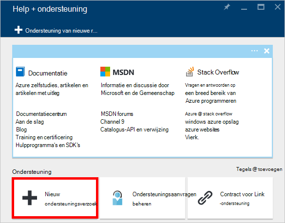

<properties
    pageTitle="Aanvraag DocumentDB account quota verhoogd | Microsoft Azure"
    description="Informatie over het aanvragen van een aanpassing van de quota van de DocumentDB database zoals documentopslag en doorvoer per collectie."
    services="documentdb"
    authors="AndrewHoh"
    manager="jhubbard"
    editor="monicar"
    documentationCenter=""/>

<tags
    ms.service="documentdb"
    ms.workload="data-services"
    ms.tgt_pltfrm="na"
    ms.devlang="na"
    ms.topic="article"
    ms.date="08/25/2016"
    ms.author="anhoh"/>

# Limieten van verhoogde DocumentDB aanvragen

[DocumentDB voor Microsoft Azure](https://azure.microsoft.com/services/documentdb/) is een set van standaard quota's die kunnen worden aangepast door contact opnemen met ondersteuning van Azure.  In dit artikel ziet u hoe aanvragen van een verhoging van de quota.

Na het lezen van dit artikel, zult u de volgende vragen beantwoorden:  

-   Welke database DocumentDB quota kunnen worden aangepast door contact opnemen met ondersteuning van Azure?
-   Hoe kan ik een DocumentDB account quota correctie aanvragen?

##DocumentDB account quota

De volgende tabel beschrijft de DocumentDB quota. De quota met een sterretje (*) kunnen worden aangepast door Azure ondersteuning contact opnemen met:

[AZURE.INCLUDE [azure-documentdb-limits](../../includes/azure-documentdb-limits.md)]

##Aanvraag voor een aanpassing van de quota
De volgende stappen laten zien hoe aanvragen van een aanpassing van de quota.

1. Klik op **Meer Services**in [Azure portal](https://portal.azure.com)en klik op **Help + ondersteuning**.

    

2. Klik op **nieuw ondersteuningsverzoek**in de blade **Help + ondersteuning** .

    

3. Klik in de blade **nieuw ondersteuningsverzoek** **Grondbeginselen**. Next, set **type probleem** **Quota**, **abonnement** op uw abonnement die fungeert als host voor uw DocumentDB account **type quotum** te **DocumentDB**en **ondersteuningsplan** **Quota SUPPORT - opgenomen**. Klik vervolgens op **volgende**.

    

4. Kies een prioriteit in de blade **probleem** en informatie bevatten over de verhoging van de quota in **Details**. Klik op **volgende**.

    

5. Ten slotte, vul uw contactgegevens in het blad **gegevens van contactpersonen** en klikt u op **maken**.

Zodra het ticket support is gemaakt, ontvangt u het nummer van de aanvraag ondersteuning via e-mail.  U kunt ook het verzoek om ondersteuning weergeven door te klikken op **beheren ondersteuning aanvragen** in de blade **Help + ondersteuning** .

##Volgende stappen
- Voor meer informatie over DocumentDB, klik [hier](http://azure.com/docdb).
