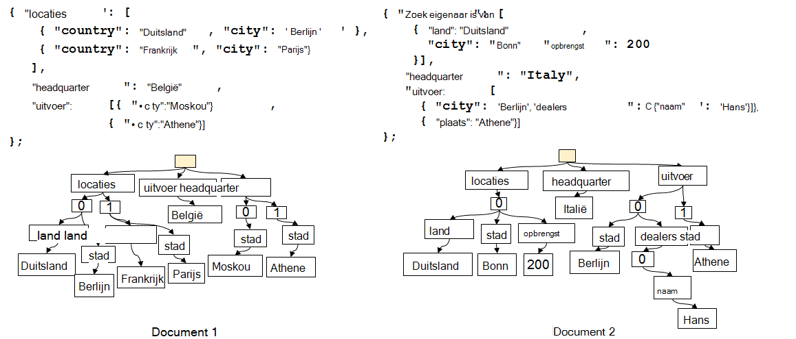
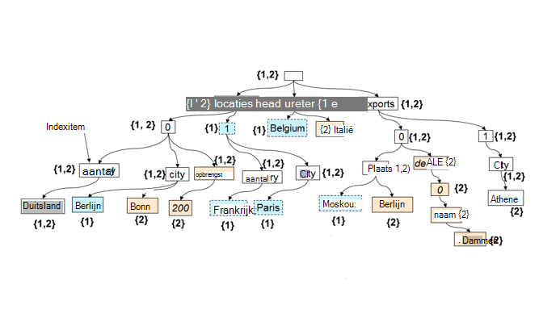

<properties 
    pageTitle="Automatische indexering in DocumentDB | Microsoft Azure" 
    description="Meer informatie over hoe automatische indexering works in Azure DocumentDB." 
    services="documentdb" 
    authors="arramac" 
    manager="jhubbard" 
    editor="mimig" 
    documentationCenter=""/>

<tags 
    ms.service="documentdb" 
    ms.workload="data-services" 
    ms.tgt_pltfrm="na" 
    ms.devlang="na" 
    ms.topic="article" 
    ms.date="10/27/2016" 
    ms.author="arramac"/>
    
# Automatische indexering in Azure, DocumentDB

Dit artikel is overgenomen uit het papier ["Schema Agnostic indexeren met Azure DocumentDB"](http://www.vldb.org/pvldb/vol8/p1668-shukla.pdf) , die wordt gepresenteerd op de [41e interne Conferentie over zeer grote Databases](http://www.vldb.org/2015/) tussen 31 augustus - 4 September 2015 en is een inleiding in het indexeren van works in Azure DocumentDB. 

Na het lezen van dit, zal u de volgende vragen beantwoorden:

- Hoe DocumentDB afleiden van het schema van een JSON-document?
- Hoe DocumentDB een index maken in verschillende documenten?
- Hoe voert DocumentDB uit automatische indexering op schaal

##Hoe werkt DocumentDB indexeren?

[DocumentDB voor Microsoft Azure](https://azure.microsoft.com/services/documentdb/) is een true database schema vrije doel gebouwd voor JSON. Dit niet verwachten of vereisen een schema of secundaire index definities om gegevens te indexeren op schaal. Hiermee kunt u snel bepalen en herhalen op application data-modellen met behulp van DocumentDB. Als u documenten aan een collectie toevoegt, indexeert DocumentDB automatisch alle documenteigenschappen zodat ze beschikbaar voor u aan de query zijn. Automatische indexering kunt u documenten die horen bij volledig willekeurige schema's zonder u zorgen te maken over schema's of secundaire sleutels worden opgeslagen.

DocumentDB exploiteert met het doel om de impedantie-mismatch tussen de database en de application programming modellen weg te nemen, de eenvoud van JSON en het gebrek aan een schemaspecificatie. Er wordt geen veronderstellingen over de documenten en kan documenten binnen een collectie DocumentDB in schema, behalve de specifieke waarden variëren. In tegenstelling tot andere databases document werkt van DocumentDB-database-engine rechtstreeks op het niveau van JSON grammatica, het concept van een documentschema agnostische resterende en vervaging van de grens tussen de structuur en instantie van documenten. Deze, in-Draai, kunnen deze automatisch index documenten zonder schema of secundaire.

Het indexeren in het DocumentDB maakt gebruik van het feit dat JSON grammatica kan documenten worden **weergegeven als bomen**. Een JSON-document worden weergegeven als een boom, moet een dummy-hoofdknooppunt worden gemaakt die de rest van de werkelijke knooppunten in het document onder parents. Elk etiket met inbegrip van de array indices in een JSON-document wordt een knooppunt van de structuur. In de volgende afbeelding ziet u een voorbeeld van de JSON-document en de bijbehorende boomstructuur.

>[AZURE.NOTE] Aangezien JSON zelfbeschrijvend is namelijk elk document bevat gegevens en schema (metagegevens) b.v. `{"locationId": 5, "city": "Moscow"}` blijkt dat er twee eigenschappen zijn `locationId` en `city`, en een tekenreeks en de numerieke waarden van eigenschap hebben. DocumentDB kan afleiden van het schema van documenten en deze index wanneer ze worden ingevoegd of vervangen zonder dat u ooit schema's of secundaire indexen definiëren.

**JSON-documenten als bomen:**

Bijvoorbeeld, in het bovenstaande voorbeeld:

- De eigenschap JSON `{"headquarters": "Belgium"}` eigenschap in het bovenstaande voorbeeld komt overeen met het pad/hoofdkantoor/België.
- De matrix JSON `{"exports": [{"city": “Moscow"}`, `{"city": Athens"}]}` komt overeen met de paden `/exports/[]/city/Moscow` en `/exports/[]/city/Athens`.

Met de automatische indexering, (1) elk pad in de documentstructuur van een wordt geïndexeerd (tenzij de ontwikkelaar heeft het indexeren beleid voor het uitsluiten van bepaalde patronen pad expliciet is geconfigureerd). (2) elke update van een document aan een collectie DocumentDB leidt tot het bijwerken van de structuur van de index (dat wil zeggen: oorzaken toevoegen of verwijderen van knooppunten). Een van de primaire eisen van de automatische indexering van documenten is ervoor te zorgen dat de kosten om te indexeren en doorzoeken van een document met diep geneste structuur, zeg 10 niveaus, is hetzelfde als die van een platte JSON-document dat bestaat uit een sleutel / waarde-paren één niveau diep. Een weergave van de genormaliseerde pad is daarom de basis waarop beide automatische indexering en query-subsystemen worden gebouwd.

Een belangrijke implicatie van verwerking van zowel de waarden schema en aanleg van paden op uniforme wijze is dat logisch, net zoals de afzonderlijke documenten, een index van de twee documenten weergegeven die een toewijzing tussen paden blijft en de document-id's met dat pad kunnen ook worden weergegeven als een boom. DocumentDB wordt dit feit voor het maken van een index-structuur die is samengesteld uit de Unie van alle bomen die afzonderlijke documenten in de collectie vertegenwoordigt. De structuur van de index in DocumentDB collecties groeit na verloop van tijd als nieuwe documenten toegevoegd of in de collectie bijgewerkt.

**DocumentDB-Index als een structuur:**

Ondanks de vrij schema, DocumentDB van SQL en JavaScript query talen zorgen voor relationele projecties en filters, hiërarchische navigatie tussen documenten, ruimtelijke bewerkingen, en het aanroepen van de UDF is geschreven in JavaScript volledig. Query-runtime van de DocumentDB, kan deze query's ondersteunen, omdat het rechtstreeks tegen deze boomstructuur index van de gegevens kan werken.

Het standaardbeleid voor indexing automatisch alle eigenschappen van alle documenten indexeert en biedt consistente query (dat wil zeggen de index synchroon met het schrijven van het document wordt bijgewerkt). Hoe ondersteunt DocumentDB werkt u consistent bij de structuur van de index op schaal DocumentDB wordt geoptimaliseerd schrijven, vergrendelen gratis en log gestructureerde index onderhoud technieken. Dit betekent dat DocumentDB een aanhoudende volume van snelle schrijft terwijl nog steeds consistente query's kunnen ondersteunen. 

Indexering van DocumentDB is ontworpen voor opslag efficiëntie en voor het verwerken van meerdere pacht. De opslagoverhead op schijf van de index is voor effectiviteit qua kosten, lage en voorspelbaar. Index-updates worden ook uitgevoerd binnen het budget van de systeembronnen toegewezen per collectie DocumentDB.

##Volgende stappen
- Download ["Schema Agnostic indexeren met Azure DocumentDB"](http://www.vldb.org/pvldb/vol8/p1668-shukla.pdf)voor te leggen op de 41e interne conferentie op zeer grote Databases, 31 augustus - 4 September 2015.
- [Query met een SQL DocumentDB](documentdb-sql-query.md)
- Klik hier voor informatie over het aanpassen van de index DocumentDB [hier](documentdb-indexing-policies.md)
 
