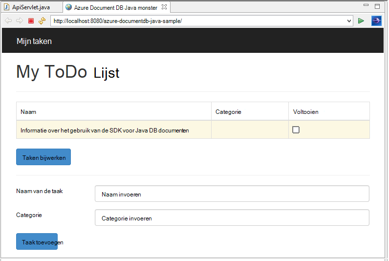
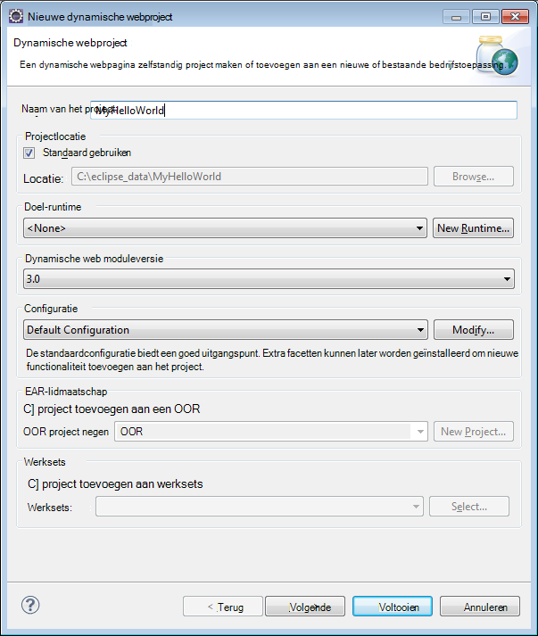
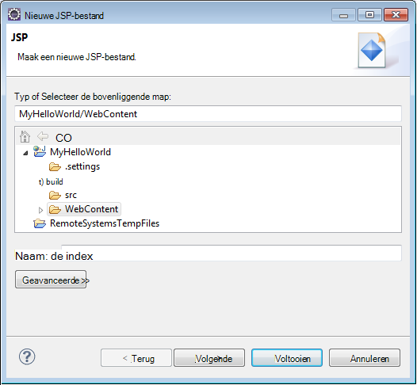
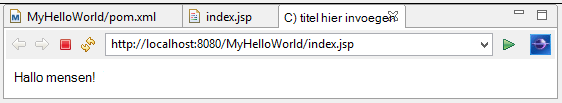
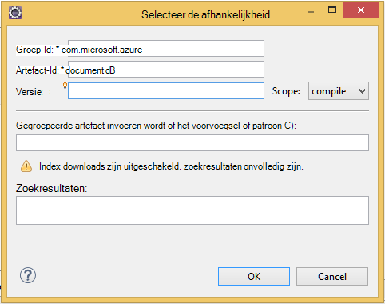

<properties
    pageTitle="Java application development zelfstudie met behulp van DocumentDB | Microsoft Azure"
    description="Deze zelfstudie Java web application ziet u hoe de Azure DocumentDB-service gebruiken om te slaan en toegang tot gegevens uit een Java-toepassing op Azure Websites gehost."
    keywords="De ontwikkeling van toepassingen, zelfstudie, java-toepassing, java web application zelfstudie, documentdb, azure, Microsoft azure"
    services="documentdb"
    documentationCenter="java"
    authors="dennyglee"
    manager="jhubbard"
    editor="mimig"/>

<tags
    ms.service="documentdb"
    ms.devlang="java"
    ms.topic="hero-article"
    ms.tgt_pltfrm="NA"
    ms.workload="data-services"
    ms.date="08/24/2016"
    ms.author="denlee"/>

# Bouwen van een Java webtoepassing met behulp van DocumentDB

> [AZURE.SELECTOR]
- [.NET](documentdb-dotnet-application.md)
- [Node.js](documentdb-nodejs-application.md)
- [Java](documentdb-java-application.md)
- [Python](documentdb-python-application.md)

Deze zelfstudie Java web application ziet u hoe u de service [Microsoft Azure DocumentDB](https://portal.azure.com/#gallery/Microsoft.DocumentDB) gebruiken om te slaan en toegang tot gegevens uit een Java-toepassing op Azure Websites gehost. In dit onderwerp wordt beschreven:

- Het bouwen van een JSP basistoepassing Eclips.
- Het werken met de DocumentDB van Azure service met behulp van de [DocumentDB Java SDK](https://github.com/Azure/azure-documentdb-java).

Deze Java-toepassing zelfstudie wordt beschreven hoe u een webgebaseerde Taakbeheer toepassing maken waarmee u het maken, ophalen, en taken als voltooid markeren als weergegeven in de volgende afbeelding. Elk van de taken in de takenlijst worden opgeslagen als de JSON-documenten in Azure DocumentDB.

> [AZURE.TIP] Deze zelfstudie application development wordt ervan uitgegaan dat u ervaring met Java. Als u Java of de [vereiste hulpprogramma's](#Prerequisites), wordt aangeraden het project voltooid [todo](https://github.com/Azure-Samples/documentdb-java-todo-app) downloaden van GitHub en bouwen met behulp van [de instructies aan het einde van dit artikel](#GetProject). Zodra u die gemaakt hebt, kunt u het artikel voor het verkrijgen van inzicht in de code in het kader van het project bekijken.  

##Vereisten voor deze zelfstudie Java web application
Voordat u deze zelfstudie application development, hebt u het volgende:

- Een actieve account Azure. Als u geen account hebt, kunt u een gratis proefperiode account in een paar minuten. Zie voor meer informatie, [Gratis proefperiode van Azure](https://azure.microsoft.com/pricing/free-trial/).
- [Java Development Kit (JDK) 7 +](http://www.oracle.com/technetwork/java/javase/downloads/index.html).
- [Eclips IDE voor ontwikkelaars van Java EE.](http://www.eclipse.org/downloads/packages/eclipse-ide-java-ee-developers/lunasr1)
- [Een Azure-Website met een Java runtime environment (b.v. Tomcat of Jetty) ingeschakeld.](../app-service-web/web-sites-java-get-started.md)

Als u deze hulpprogramma's voor het eerst installeert, coreservlets.com biedt een overzicht van de installatie in de sectie snel starten van hun [Zelfstudie: TomCat7 installeren en gebruiken van het met Eclips](http://www.coreservlets.com/Apache-Tomcat-Tutorial/tomcat-7-with-eclipse.html) artikel.

##Stap 1: Maak een account DocumentDB database

Laten we beginnen met het maken van een account DocumentDB. Als u al een account hebt, kunt u verdergaan met [stap 2: de JSP Java-toepassing maken](#CreateJSP).

[AZURE.INCLUDE [documentdb-create-dbaccount](../../includes/documentdb-create-dbaccount.md)]

[AZURE.INCLUDE [documentdb-keys](../../includes/documentdb-keys.md)]

##Stap 2: Maak de JSP Java-toepassing

De JSP-toepassing maken:

1. Eerst, we beginnen uit door een Java-project maken. Eclips, start en vervolgens klikt u op **bestand**, klik op **Nieuw**en klik op **Dynamische Web-Project**. Als er geen **Dynamische Web Project** weergegeven als een project beschikbaar, als volgt: klik op **bestand**, klikt u op **Nieuw**... klikt u op **Project**, vouw **Web**, klikt u op **Dynamic Web Project**en klik op **volgende**.

    

2. Voer de naam van een project in het vak **naam van het Project** en in de vervolgkeuzelijst **Doel Runtime** , selecteer desgewenst een waarde (bijvoorbeeld Apache Tomcat v7.0) en klik op **Voltooien**. Selecteert een doel, kunt u het project niet lokaal worden uitgevoerd via een Eclips.
3. Vouw in de Eclips, in de Projectverkenner het project. **Webinhoud**met de rechtermuisknop op **Nieuw**en klik vervolgens op **JSP-bestand**.
4. In het dialoogvenster **Nieuwe JSP-bestand** het bestand **index.jsp**een naam. De bovenliggende map bewaren als **webinhoud**, zoals in de volgende afbeelding wordt weergegeven en klik op **volgende**.

    

5. Klik in het dialoogvenster **Selecteer JSP-sjabloon** voor deze zelfstudie **Nieuwe JSP-bestand (html)**selecteren en klik op **Voltooien**.

6. Als het bestand index.jsp wordt geopend in de Eclips, weer te geven tekst toevoegen **Hello World!** binnen de bestaande <body> element. Uw bijgewerkte <body> inhoud eruit moet de volgende code:

        <body>
            <% out.println("Hello World!"); %>
        </body>

8. Sla het bestand index.jsp.
9. Als u een doel-runtime in stap 2 hebt ingesteld, kunt u **Project** en vervolgens op **uitvoeren** als u wilt uw toepassing JSP lokaal uitvoeren:

    

##Stap 3: De DocumentDB Java SDK installeren ##

De eenvoudigste manier om op te halen in de DocumentDB Java SDK en de bijbehorende afhankelijkheden is via [Apache Maven](http://maven.apache.org/).

Hiervoor moet u uw project omzetten in een maven-project door de volgende stappen uit te voeren:

1. Klik met de rechtermuisknop op het project in de Project Explorer, klik op **configureren**, klik op **converteren naar Maven Project**.
2. Accepteer de standaardinstellingen in het venster **nieuwe POM maken** en klik op **Voltooien**.
3. Open het bestand pom.xml in **Project Explorer**.
4. Klik op **toevoegen**op het tabblad **afhankelijkheden** in het deelvenster **afhankelijkheden** .
4. In het venster **Afhankelijkheid selecteert u** het volgende doen:
 - Voer in het vak **groeps-id** com.microsoft.azure.
 - Voer in het vak **Id artefact** azure-documentdb.
 - Voer in het vak **versie** 1.5.1.

    

    Of de afhankelijkheid van XML voor groeps-id en ArtifactId rechtstreeks toevoegen aan de pom.xml via een teksteditor:

        <dependency>
            <groupId>com.microsoft.azure</groupId>
            <artifactId>azure-documentdb</artifactId>
            <version>1.5.1</version>
        </dependency>

5. Klik op **Ok** en Maven zal de DocumentDB Java SDK installeren.
6. Sla het bestand pom.xml.

##Stap 4: Gebruik van de service DocumentDB in een Java-toepassing

1. Eerst definiëren we de object TodoItem:

        @Data
        @Builder
        public class TodoItem {
            private String category;
            private boolean complete;
            private String id;
            private String name;
        }

    In dit project gebruiken we [Lombok Project](http://projectlombok.org/) voor het genereren van de constructor, getters setters en een opbouwfunctie. U kunt ook handmatig schrijven van deze code of hebben de IDE gegenereerd.

2. Om de DocumentDB-service aanroept, moet u een nieuwe **DocumentClient**te instantiëren. In het algemeen is het beste opnieuw gebruiken van de **DocumentClient** - in plaats van een nieuwe client voor elke volgende aanvraag maken. De client door de client in een **DocumentClientFactory**kan worden hergebruikt. Dit is ook waar u moet plak de URI en de primaire sleutel waarde die u naar het Klembord in [stap 1](#CreateDB)hebt opgeslagen. Vervang [uw\_EINDPUNT\_hier] met de URI en vervangen [uw\_sleutel\_hier] met de primaire sleutel.

        private static final String HOST = "[YOUR_ENDPOINT_HERE]";
        private static final String MASTER_KEY = "[YOUR_KEY_HERE]";

        private static DocumentClient documentClient;

        public static DocumentClient getDocumentClient() {
            if (documentClient == null) {
                documentClient = new DocumentClient(HOST, MASTER_KEY,
                        ConnectionPolicy.GetDefault(), ConsistencyLevel.Session);
            }

            return documentClient;
        }

3. Nu maken we een Object DAO (Data Access) om abstracte persistent maken onze ToDo items naar DocumentDB.

    Wilt opslaan van ToDo-items aan een collectie, de client moet weten welke database en collectie aanhouden om (waarnaar wordt verwezen door automatische koppelingen). In het algemeen is het meest geschikt voor het opslaan van de database en als het mogelijk is om te voorkomen dat extra gegevens van en naar de database.

    De volgende code ziet u hoe onze database en de collectie ophalen als deze bestaat, of maak een nieuwe als het niet bestaat:

        public class DocDbDao implements TodoDao {
            // The name of our database.
            private static final String DATABASE_ID = "TodoDB";

            // The name of our collection.
            private static final String COLLECTION_ID = "TodoCollection";

            // The DocumentDB Client
            private static DocumentClient documentClient = DocumentClientFactory
                    .getDocumentClient();

            // Cache for the database object, so we don't have to query for it to
            // retrieve self links.
            private static Database databaseCache;

            // Cache for the collection object, so we don't have to query for it to
            // retrieve self links.
            private static DocumentCollection collectionCache;

            private Database getTodoDatabase() {
                if (databaseCache == null) {
                    // Get the database if it exists
                    List<Database> databaseList = documentClient
                            .queryDatabases(
                                    "SELECT * FROM root r WHERE r.id='" + DATABASE_ID
                                            + "'", null).getQueryIterable().toList();

                    if (databaseList.size() > 0) {
                        // Cache the database object so we won't have to query for it
                        // later to retrieve the selfLink.
                        databaseCache = databaseList.get(0);
                    } else {
                        // Create the database if it doesn't exist.
                        try {
                            Database databaseDefinition = new Database();
                            databaseDefinition.setId(DATABASE_ID);

                            databaseCache = documentClient.createDatabase(
                                    databaseDefinition, null).getResource();
                        } catch (DocumentClientException e) {
                            // TODO: Something has gone terribly wrong - the app wasn't
                            // able to query or create the collection.
                            // Verify your connection, endpoint, and key.
                            e.printStackTrace();
                        }
                    }
                }

                return databaseCache;
            }

            private DocumentCollection getTodoCollection() {
                if (collectionCache == null) {
                    // Get the collection if it exists.
                    List<DocumentCollection> collectionList = documentClient
                            .queryCollections(
                                    getTodoDatabase().getSelfLink(),
                                    "SELECT * FROM root r WHERE r.id='" + COLLECTION_ID
                                            + "'", null).getQueryIterable().toList();

                    if (collectionList.size() > 0) {
                        // Cache the collection object so we won't have to query for it
                        // later to retrieve the selfLink.
                        collectionCache = collectionList.get(0);
                    } else {
                        // Create the collection if it doesn't exist.
                        try {
                            DocumentCollection collectionDefinition = new DocumentCollection();
                            collectionDefinition.setId(COLLECTION_ID);

                            collectionCache = documentClient.createCollection(
                                    getTodoDatabase().getSelfLink(),
                                    collectionDefinition, null).getResource();
                        } catch (DocumentClientException e) {
                            // TODO: Something has gone terribly wrong - the app wasn't
                            // able to query or create the collection.
                            // Verify your connection, endpoint, and key.
                            e.printStackTrace();
                        }
                    }
                }

                return collectionCache;
            }
        }

4. De volgende stap is om sommige code schrijven voor de TodoItems in om de collectie te behouden. In dit voorbeeld gebruiken we [Gson](https://code.google.com/p/google-gson/) serialiseren en terugconverteren naar JSON-documenten op TodoItem gewoon oude Java-objecten (POJOs). [Jackson](http://jackson.codehaus.org/) - of uw eigen aangepaste serializer zijn ook goede alternatieven voor het serialiseren van POJOs.

        // We'll use Gson for POJO <=> JSON serialization for this example.
        private static Gson gson = new Gson();

        @Override
        public TodoItem createTodoItem(TodoItem todoItem) {
            // Serialize the TodoItem as a JSON Document.
            Document todoItemDocument = new Document(gson.toJson(todoItem));

            // Annotate the document as a TodoItem for retrieval (so that we can
            // store multiple entity types in the collection).
            todoItemDocument.set("entityType", "todoItem");

            try {
                // Persist the document using the DocumentClient.
                todoItemDocument = documentClient.createDocument(
                        getTodoCollection().getSelfLink(), todoItemDocument, null,
                        false).getResource();
            } catch (DocumentClientException e) {
                e.printStackTrace();
                return null;
            }

            return gson.fromJson(todoItemDocument.toString(), TodoItem.class);
        }

5. Zoals DocumentDB, databases en collecties documenten wordt ook verwezen naar zichzelf gekoppeld. De volgende Help-functie kan we documenten ophalen door een ander kenmerk (bijvoorbeeld "id") in plaats van zelf een koppeling:

        private Document getDocumentById(String id) {
            // Retrieve the document using the DocumentClient.
            List<Document> documentList = documentClient
                    .queryDocuments(getTodoCollection().getSelfLink(),
                            "SELECT * FROM root r WHERE r.id='" + id + "'", null)
                    .getQueryIterable().toList();

            if (documentList.size() > 0) {
                return documentList.get(0);
            } else {
                return null;
            }
        }

6. Gebruik de helpmethode in stap 5 kunnen wij een TodoItem JSON-document met id ophalen en deze vervolgens terugconverteren naar een POJO:

        @Override
        public TodoItem readTodoItem(String id) {
            // Retrieve the document by id using our helper method.
            Document todoItemDocument = getDocumentById(id);

            if (todoItemDocument != null) {
                // De-serialize the document in to a TodoItem.
                return gson.fromJson(todoItemDocument.toString(), TodoItem.class);
            } else {
                return null;
            }
        }

7. We kunnen de DocumentClient ook gebruiken om een collectie of een lijst met TodoItems met DocumentDB SQL:

        @Override
        public List<TodoItem> readTodoItems() {
            List<TodoItem> todoItems = new ArrayList<TodoItem>();

            // Retrieve the TodoItem documents
            List<Document> documentList = documentClient
                    .queryDocuments(getTodoCollection().getSelfLink(),
                            "SELECT * FROM root r WHERE r.entityType = 'todoItem'",
                            null).getQueryIterable().toList();

            // De-serialize the documents in to TodoItems.
            for (Document todoItemDocument : documentList) {
                todoItems.add(gson.fromJson(todoItemDocument.toString(),
                        TodoItem.class));
            }

            return todoItems;
        }

8. Er zijn vele manieren om een document bijwerken met de DocumentClient. In onze Todo lijst toepassing willen we kunnen kiezen of een TodoItem voltooid is. Dit kan worden bereikt door het kenmerk "volledig" in het document bij te werken:

        @Override
        public TodoItem updateTodoItem(String id, boolean isComplete) {
            // Retrieve the document from the database
            Document todoItemDocument = getDocumentById(id);

            // You can update the document as a JSON document directly.
            // For more complex operations - you could de-serialize the document in
            // to a POJO, update the POJO, and then re-serialize the POJO back in to
            // a document.
            todoItemDocument.set("complete", isComplete);

            try {
                // Persist/replace the updated document.
                todoItemDocument = documentClient.replaceDocument(todoItemDocument,
                        null).getResource();
            } catch (DocumentClientException e) {
                e.printStackTrace();
                return null;
            }

            return gson.fromJson(todoItemDocument.toString(), TodoItem.class);
        }

9. Ten slotte willen we de mogelijkheid een TodoItem te verwijderen uit onze lijst. Hiertoe kunnen we gebruiken de helpmethode geschreven op te halen de automatische koppeling en geef vervolgens op de client te verwijderen:

        @Override
        public boolean deleteTodoItem(String id) {
            // DocumentDB refers to documents by self link rather than id.

            // Query for the document to retrieve the self link.
            Document todoItemDocument = getDocumentById(id);

            try {
                // Delete the document by self link.
                documentClient.deleteDocument(todoItemDocument.getSelfLink(), null);
            } catch (DocumentClientException e) {
                e.printStackTrace();
                return false;
            }

            return true;
        }

##Stap 5: Bekabeling voor de rest van het van Java application development project samen

Nu dat we klaar bent met het leuke bits - alle links is het bouwen van een snelle gebruiker interface en wire-tot onze DAO.

1. Eerst laten we beginnen met het bouwen van een domeincontroller om aan te roepen onze DAO:

        public class TodoItemController {
            public static TodoItemController getInstance() {
                if (todoItemController == null) {
                    todoItemController = new TodoItemController(TodoDaoFactory.getDao());
                }
                return todoItemController;
            }

            private static TodoItemController todoItemController;

            private final TodoDao todoDao;

            TodoItemController(TodoDao todoDao) {
                this.todoDao = todoDao;
            }

            public TodoItem createTodoItem(@NonNull String name,
                    @NonNull String category, boolean isComplete) {
                TodoItem todoItem = TodoItem.builder().name(name).category(category)
                        .complete(isComplete).build();
                return todoDao.createTodoItem(todoItem);
            }

            public boolean deleteTodoItem(@NonNull String id) {
                return todoDao.deleteTodoItem(id);
            }

            public TodoItem getTodoItemById(@NonNull String id) {
                return todoDao.readTodoItem(id);
            }

            public List<TodoItem> getTodoItems() {
                return todoDao.readTodoItems();
            }

            public TodoItem updateTodoItem(@NonNull String id, boolean isComplete) {
                return todoDao.updateTodoItem(id, isComplete);
            }
        }

    In een complexe toepassing kan de controller waarin complexe bedrijfslogica op de DAO.

2. Vervolgens maken we een servlet op route HTTP-aanvragen op de controller:

        public class TodoServlet extends HttpServlet {
            // API Keys
            public static final String API_METHOD = "method";

            // API Methods
            public static final String CREATE_TODO_ITEM = "createTodoItem";
            public static final String GET_TODO_ITEMS = "getTodoItems";
            public static final String UPDATE_TODO_ITEM = "updateTodoItem";

            // API Parameters
            public static final String TODO_ITEM_ID = "todoItemId";
            public static final String TODO_ITEM_NAME = "todoItemName";
            public static final String TODO_ITEM_CATEGORY = "todoItemCategory";
            public static final String TODO_ITEM_COMPLETE = "todoItemComplete";

            public static final String MESSAGE_ERROR_INVALID_METHOD = "{'error': 'Invalid method'}";

            private static final long serialVersionUID = 1L;
            private static final Gson gson = new Gson();

            @Override
            protected void doGet(HttpServletRequest request,
                    HttpServletResponse response) throws ServletException, IOException {

                String apiResponse = MESSAGE_ERROR_INVALID_METHOD;

                TodoItemController todoItemController = TodoItemController
                        .getInstance();

                String id = request.getParameter(TODO_ITEM_ID);
                String name = request.getParameter(TODO_ITEM_NAME);
                String category = request.getParameter(TODO_ITEM_CATEGORY);
                boolean isComplete = StringUtils.equalsIgnoreCase("true",
                        request.getParameter(TODO_ITEM_COMPLETE)) ? true : false;

                switch (request.getParameter(API_METHOD)) {
                case CREATE_TODO_ITEM:
                    apiResponse = gson.toJson(todoItemController.createTodoItem(name,
                            category, isComplete));
                    break;
                case GET_TODO_ITEMS:
                    apiResponse = gson.toJson(todoItemController.getTodoItems());
                    break;
                case UPDATE_TODO_ITEM:
                    apiResponse = gson.toJson(todoItemController.updateTodoItem(id,
                            isComplete));
                    break;
                default:
                    break;
                }

                response.getWriter().println(apiResponse);
            }

            @Override
            protected void doPost(HttpServletRequest request,
                    HttpServletResponse response) throws ServletException, IOException {
                doGet(request, response);
            }
        }

3. Moeten we een Web-gebruikersinterface voor de gebruiker moet worden weergegeven. We gaan opnieuw schrijven de index.jsp dat we eerder hebben gemaakt:

        <html>
        <head>
          <meta http-equiv="Content-Type" content="text/html; charset=ISO-8859-1">
          <meta http-equiv="X-UA-Compatible" content="IE=edge;" />
          <title>Azure DocumentDB Java Sample</title>

          <!-- Bootstrap -->
          <link href="//ajax.aspnetcdn.com/ajax/bootstrap/3.2.0/css/bootstrap.min.css" rel="stylesheet">

          
        </head>
        <body>
          <!-- Nav Bar -->
          

            

              

                <a class="navbar-brand" href="#">My Tasks</a>
              

            

          

          <!-- Body -->
          

            <h1>My ToDo List</h1>

            

            <!-- The ToDo List -->
            

              <table class="table table-bordered table-striped" id="todoItems">
                <thead>
                  <tr>
                    <th>Name</th>
                    <th>Category</th>
                    <th>Complete</th>
                  </tr>
                </thead>
                <tbody>
                </tbody>
              </table>

              <!-- Update Button -->
              

                <form class="form-horizontal" role="form">
                  <button type="button" class="btn btn-primary">Update Tasks</button>
                </form>
              

            

            

            <!-- Item Input Form -->
            

              <form class="form-horizontal" role="form">
                

                  <label for="inputItemName" class="col-sm-2">Task Name</label>
                  

                    <input type="text" class="form-control" id="inputItemName" placeholder="Enter name">
                  

                

                

                  <label for="inputItemCategory" class="col-sm-2">Task Category</label>
                  

                    <input type="text" class="form-control" id="inputItemCategory" placeholder="Enter category">
                  

                

                <button type="button" class="btn btn-primary">Add Task</button>
              </form>
            

          

          <!-- Placed at the end of the document so the pages load faster -->
          
          
          
        </body>
        </html>

4. En ten slotte enkele client-side Javascript om de web-interface en de servlet met elkaar verbinden, schrijft:

        var todoApp = {
          /*
           * API methods to call Java backend.
           */
          apiEndpoint: "api",

          createTodoItem: function(name, category, isComplete) {
            $.post(todoApp.apiEndpoint, {
                "method": "createTodoItem",
                "todoItemName": name,
                "todoItemCategory": category,
                "todoItemComplete": isComplete
              },
              function(data) {
                var todoItem = data;
                todoApp.addTodoItemToTable(todoItem.id, todoItem.name, todoItem.category, todoItem.complete);
              },
              "json");
          },

          getTodoItems: function() {
            $.post(todoApp.apiEndpoint, {
                "method": "getTodoItems"
              },
              function(data) {
                var todoItemArr = data;
                $.each(todoItemArr, function(index, value) {
                  todoApp.addTodoItemToTable(value.id, value.name, value.category, value.complete);
                });
              },
              "json");
          },

          updateTodoItem: function(id, isComplete) {
            $.post(todoApp.apiEndpoint, {
                "method": "updateTodoItem",
                "todoItemId": id,
                "todoItemComplete": isComplete
              },
              function(data) {},
              "json");
          },

          /*
           * UI Methods
           */
          addTodoItemToTable: function(id, name, category, isComplete) {
            var rowColor = isComplete ? "active" : "warning";

            todoApp.ui_table().append($("<tr>")
              .append($("<td>").text(name))
              .append($("<td>").text(category))
              .append($("<td>")
                .append($("<input>")
                  .attr("type", "checkbox")
                  .attr("id", id)
                  .attr("checked", isComplete)
                  .attr("class", "isComplete")
                ))
              .addClass(rowColor)
            );
          },

          /*
           * UI Bindings
           */
          bindCreateButton: function() {
            todoApp.ui_createButton().click(function() {
              todoApp.createTodoItem(todoApp.ui_createNameInput().val(), todoApp.ui_createCategoryInput().val(), false);
              todoApp.ui_createNameInput().val("");
              todoApp.ui_createCategoryInput().val("");
            });
          },

          bindUpdateButton: function() {
            todoApp.ui_updateButton().click(function() {
              // Disable button temporarily.
              var myButton = $(this);
              var originalText = myButton.text();
              $(this).text("Updating...");
              $(this).prop("disabled", true);

              // Call api to update todo items.
              $.each(todoApp.ui_updateId(), function(index, value) {
                todoApp.updateTodoItem(value.name, value.value);
                $(value).remove();
              });

              // Re-enable button.
              setTimeout(function() {
                myButton.prop("disabled", false);
                myButton.text(originalText);
              }, 500);
            });
          },

          bindUpdateCheckboxes: function() {
            todoApp.ui_table().on("click", ".isComplete", function(event) {
              var checkboxElement = $(event.currentTarget);
              var rowElement = $(event.currentTarget).parents('tr');
              var id = checkboxElement.attr('id');
              var isComplete = checkboxElement.is(':checked');

              // Toggle table row color
              if (isComplete) {
                rowElement.addClass("active");
                rowElement.removeClass("warning");
              } else {
                rowElement.removeClass("active");
                rowElement.addClass("warning");
              }

              // Update hidden inputs for update panel.
              todoApp.ui_updateForm().children("input[name='" + id + "']").remove();

              todoApp.ui_updateForm().append($("<input>")
                .attr("type", "hidden")
                .attr("class", "updateComplete")
                .attr("name", id)
                .attr("value", isComplete));

            });
          },

          /*
           * UI Elements
           */
          ui_createNameInput: function() {
            return $(".todoForm #inputItemName");
          },

          ui_createCategoryInput: function() {
            return $(".todoForm #inputItemCategory");
          },

          ui_createButton: function() {
            return $(".todoForm button");
          },

          ui_table: function() {
            return $(".todoList table tbody");
          },

          ui_updateButton: function() {
            return $(".todoUpdatePanel button");
          },

          ui_updateForm: function() {
            return $(".todoUpdatePanel form");
          },

          ui_updateId: function() {
            return $(".todoUpdatePanel .updateComplete");
          },

          /*
           * Install the TodoApp
           */
          install: function() {
            todoApp.bindCreateButton();
            todoApp.bindUpdateButton();
            todoApp.bindUpdateCheckboxes();

            todoApp.getTodoItems();
          }
        };

        $(document).ready(function() {
          todoApp.install();
        });

5. Meester! Alles wat overblijft is nu om de toepassing te testen. De toepassing lokaal uitgevoerd en sommige Todo items toevoegen door het invullen van het artikel en de categorie en klikt u op **Taak toevoegen**.

6. Zodra het item wordt weergegeven, kunt u bijwerken of deze voltooid is door het selectievakje uit te schakelen en te klikken op **Taken bijwerken**.

##Stap 6: Uw Java-toepassing naar Azure Websites implementeren

Azure Websites maakt gebruik van Java-toepassingen ofwel via het besturingselement (bijvoorbeeld GIT) uploaden en het exporteren van uw toepassing als een WAR-bestand of FTP.

1. Als uw toepassing exporteren als een OORLOG, met de rechtermuisknop op het project in **Project Explorer**, klik op **exporteren**en klik op **WAR-bestand**.
2. In het venster **Exporteren WAR** het volgende doen:
 - Voer in het vak Web project azure, documentdb, java, monster.
 - Kies een bestemming op te slaan het WAR-bestand in het vak doel.
 - Klik op **Voltooien**.

3. Nu dat u een WAR-bestand in de hand hebt, kunt u deze gewoon uploaden van uw Website Azure **webapps** map. Zie [een toepassing naar uw Java-website op Azure toevoegen](../app-service-web/web-sites-java-add-app.md)voor instructies over het uploaden van het bestand.

    Zodra u het WAR-bestand is geüpload naar de directory webapps, detecteert de runtime-omgeving die u hebt toegevoegd en wordt automatisch geladen.
4. Als u wilt weergeven in het eindproduct, Ga naar http://YOUR\_SITE\_NAME.azurewebsites.net/azure-documentdb-java-sample/ en start uw taken toe te voegen!

##Het project van GitHub ophalen

De voorbeelden in deze zelfstudie zijn opgenomen in het project [doen](https://github.com/Azure-Samples/documentdb-java-todo-app) op GitHub. Als u wilt importeren het project todo in Eclips, zorg ervoor dat u de software en de bronnen die worden vermeld in de sectie [vereisten](#Prerequisites) hebt en vervolgens doet u het volgende:

1. Installeer [Project Lombok](http://projectlombok.org/). Lombok wordt gebruikt voor het genereren van constructors, getters en setters in het project. Nadat u het bestand lombok.jar hebt gedownload, dubbelklikt u erop om te installeren of te installeren vanaf de opdrachtregel.
2. Als Eclips geopend is, sluit u het en opnieuw wilt laden Lombok.
3. In Eclips, klikt u in het menu **bestand** op **importeren**.
4. **Git**klikt u op in het venster **Import** naar **projecten uit Git**en klik vervolgens op **volgende**.
5. Klik op het scherm **Selecteer opslagplaats bron** **Klonen URI**.
6. Geef https://github.com/Azure-Samples/documentdb-java-todo-app.git op in het vak **URI** van het scherm **Bron Git Repository** en klik op **volgende**.
7. Controleer op het scherm **Selectie tak** die **stramienpagina** is geselecteerd en klik op **volgende**.
8. Klik op **Bladeren** als u een map waar de opslagplaats kan worden gekopieerd en klik op **volgende**op het scherm **Lokale bestemming** .
9. Op het scherm **Selecteer een wizard te gebruiken voor het importeren van projecten** ervoor te zorgen dat **bestaande projecten importeren** is geselecteerd en klik vervolgens op **volgende**.
10. Hef de selectie van het **DocumentDB** -project op het scherm **Projecten importeren** en klik op **Voltooien**. Het DocumentDB-project bevat de DocumentDB Java-SDK, die we in plaats daarvan wordt toegevoegd als een afhankelijkheid.
11. Ga naar azure-documentdb-java-sample\src\com.microsoft.azure.documentdb.sample.dao\DocumentClientFactory.java in de **Projectverkenner**de HOST- en MASTER_KEY waarden vervangen door de URI en de primaire sleutel voor uw DocumentDB account en slaat u het bestand. Zie stap 1 [voor meer informatie. Maak een account DocumentDB database](#CreateDB).
12. In **Project Explorer**, klik met de rechtermuisknop de **azure, documentdb, java, monster**, klikt u op **Pad maken**en klik op **Bouwen pad configureren**.
13. Selecteer het tabblad **bibliotheken** op het scherm **Java-pad maken** in het rechterdeelvenster en klik vervolgens op **Externe potten toevoegen**. Navigeer naar de locatie van het bestand lombok.jar en klik op **openen**en klik vervolgens op **OK**.
14. Stap 12 gebruiken om het venster **Eigenschappen** opnieuw te openen en klik vervolgens in het linkerdeelvenster op **Runtimes gericht**.
15. **Op het scherm **Gericht Runtimes** , klikt u op **Nieuw**en selecteer **v7.0 Apache Tomcat**.**
16. Stap 12 gebruiken om het venster **Eigenschappen** opnieuw te openen en klik vervolgens in het linkerdeelvenster op **Project facetten**.
17. Selecteer **Dynamische Web Module** en **Java**op het scherm **Facetten Project** en klik op **OK**.
18. Klik op het tabblad **Servers** onder in het scherm met de rechtermuisknop op **v7.0 Tomcat-Server op localhost** en klik op **toevoegen en verwijderen**.
19. **Azure, documentdb, java, monster** verplaatsen naar het vak **geconfigureerd** in het venster **toevoegen en verwijderen** , en klik op **Voltooien**.
20. **V7.0 Tomcat-Server op localhost**met de rechtermuisknop op het tabblad **Server** en klik vervolgens op **opnieuw starten**.
21. In een browser, Ga naar http://localhost:8080/azure-documentdb-java-voorbeeldbestanden / en beginnen toe te voegen aan de lijst met taken. Opmerking Als u de standaardwaarden voor poort gewijzigd 8080 wijzigen op de waarde die u hebt geselecteerd.
22. Als u wilt uw project implementeren op een Azure-website, Zie stap 6 [. Implementatie van uw toepassing naar Azure Websites](#Deploy).

[1]: media/documentdb-java-application/keys.png
