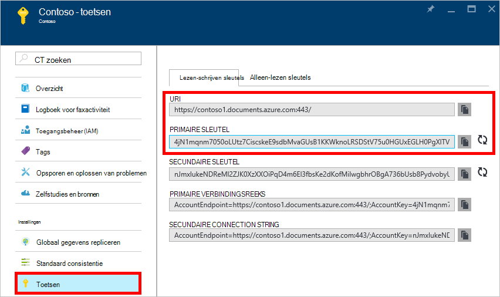
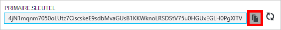
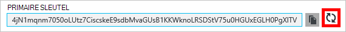
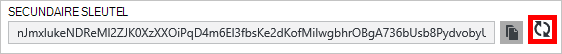
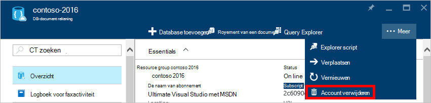
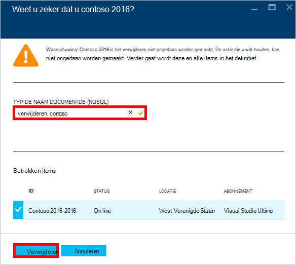

<properties
    pageTitle="Beheren van een rekening DocumentDB via de Portal Azure | Microsoft Azure"
    description="Informatie over het beheren van uw DocumentDB-rekening via de Portal Azure. Een gids over het gebruik van de Portal Azure weergeven, kopiëren, verwijderen en toegang tot accounts te vinden."
    keywords="Azure Portal, documentdb, azure, Microsoft azure"
    services="documentdb"
    documentationCenter=""
    authors="kirillg"
    manager="jhubbard"
    editor="cgronlun"/>

<tags
    ms.service="documentdb"
    ms.workload="data-services"
    ms.tgt_pltfrm="na"
    ms.devlang="na"
    ms.topic="article"
    ms.date="10/14/2016"
    ms.author="kirillg"/>

# Het beheren van een rekening DocumentDB

Informatie over het wereldwijde consistentie ingesteld, werken met sleutels en een DocumentDB in de Azure portal verwijderen.

## DocumentDB consistentie-instellingen beheren

Het niveau van de juiste consistentie te selecteren, is afhankelijk van de semantiek van de toepassing. Moet u vertrouwd raken met de niveaus beschikbaar consistentie in DocumentDB door te lezen [met consistentie niveaus te maximaliseren, beschikbaarheid en prestaties in DocumentDB] [consistency]. DocumentDB biedt de consistentie, beschikbaarheid en prestaties waarborgen, op elk niveau samenhang beschikbaar voor de databaseaccount van uw. Configureren van een databaseaccount met een sterke samenhang is vereist dat de gegevens beperkt tot één regio Azure en niet algemeen beschikbaar. Anderzijds, de niveaus ontspannen consistentie - begrensde staleness, sessie of eventuele inschakelen u een willekeurig aantal Azure regio's koppelen aan de databaseaccount van uw. De volgende eenvoudige stappen laten zien hoe het standaardniveau voor consistentie voor de databaseaccount van uw te selecteren. 

### De consistentie van de standaard voor een DocumentDB-account opgeven

1. In de [Azure portal](https://portal.azure.com/)toegang krijgen tot uw account DocumentDB.
2. Klik op **standaard consistentie**in de blade account.
3. Selecteer het nieuwe consistentie in de blade **Standaard consistentie** en klikt u op **Opslaan**.
    ![Standaard consistentie sessie][5]

## Weergeven, kopiëren en opnieuw genereren van sleutels voor access
Wanneer u een DocumentDB-account maakt, genereert de service twee master toegangstoetsen die kunnen worden gebruikt voor verificatie als de account DocumentDB wordt geopend. Door middel van twee toegangstoetsen kunt DocumentDB u opnieuw genereren van sleutels met geen onderbreking aan uw account DocumentDB. 

In de [Azure portal](https://portal.azure.com/)toegang krijgen tot de **sleutels** blade in het menu bron in het blad **DocumentDB account** bekijken, kopiëren en opnieuw genereren van de toegang tot sleutels die worden gebruikt voor toegang tot uw account DocumentDB.

> [AZURE.NOTE] De blade **sleutels** bevat ook de primaire en secundaire verbindingsreeksen die verbinding maken met uw account in het [Hulpprogramma voor migratie van gegevens](documentdb-import-data.md)kunnen worden gebruikt.

Alleen-lezen sleutels zijn ook beschikbaar op deze blade. Leest en query's zijn alleen-lezen bewerkingen tijdens wordt gemaakt, worden verwijderd, en vervangt niet.

### Een toegangstoets in de Portal Azure kopiëren

Klik op de knop **kopiëren** naar rechts van de sleutel die u wilt kopiëren op de bladeserver **sleutels** .

### Toegangstoetsen toevoegen

Met uw account DocumentDB regelmatig te beveiligen de verbindingen, moet u de toegangstoetsen wijzigen. Toegangstoetsen twee worden toegewezen om te onderhouden verbindingen met de DocumentDB-account met een toegangstoets terwijl u de toegangstoets opnieuw genereren.

> [AZURE.WARNING] Uw access-sleutels opnieuw genereren van invloed op alle toepassingen die afhankelijk van de huidige sleutel zijn. Alle clients die de toegangstoets gebruiken voor toegang tot de account DocumentDB moeten worden bijgewerkt om de nieuwe sleutel te gebruiken.

Als u toepassingen of cloud-services met de DocumentDB-account hebt, verliest u de verbindingen als u opnieuw genereren van sleutels, tenzij u uw sleutels herstellen. De volgende stappen geven een overzicht van het proces die betrokken zijn bij uw sleutels rolling.

1. De toegangstoets in uw toepassingscode verwijzen naar de secundaire sneltoets van de DocumentDB-account bijwerken.
2. De primaire toegangstoets voor uw DocumentDB-account opnieuw te genereren. In de [Azure Portal](https://portal.azure.com/)toegang krijgen tot uw account DocumentDB.
3. Klik op de **toetsen**in het blad **DocumentDB Account** .
4. Op de **toetsen** blade, klikt u op opnieuw genereren en klik vervolgens op **Ok** om te bevestigen dat u wilt een nieuwe sleutel genereren.
    

5. Nadat u hebt gecontroleerd dat de nieuwe sleutel beschikbaar voor gebruik (ongeveer 5 minuten na de regeneratie is), werken in de toepassingscode om te verwijzen naar de nieuwe primaire toegangstoets toegangstoets.
6. De secundaire sneltoets opnieuw te genereren.

    

> [AZURE.NOTE] Het kan enkele minuten duren voordat een nieuwe sleutel kan worden gebruikt voor toegang tot uw account DocumentDB.

## De verbindingsreeks ophalen

U haalt de verbindingsreeks, het volgende doen: 

1. In de [Azure portal](https://portal.azure.com)toegang krijgen tot uw account DocumentDB.
2. Klik in het menu bron **sleutels**.
3. Klik op de knop **kopiëren** naast het vak **Verbindingsreeks primaire** of **Secundaire verbindingsreeks** . 

Als u de verbindingsreeks in het [Hulpprogramma voor migratie van DocumentDB Database](documentdb-import-data.md)toevoegen de naam van de database aan het eind van de verbindingstekenreeks. `AccountEndpoint=< >;AccountKey=< >;Database=< >`.

## Een DocumentDB-account verwijderen
Een DocumentDB als account wilt verwijderen uit de Azure-Portal die u niet meer gebruikt, gebruik van de opdracht **Account verwijderen** op het blad **DocumentDB account** .

1. In de [Azure portal](https://portal.azure.com/)toegang krijgen tot de DocumentDB-account die u wilt verwijderen.
2. Op de blade **DocumentDB-account** , klikt u op **meer**en klik vervolgens op **Account verwijderen**. Of klik met de rechtermuisknop op de naam van de database en klik op **Account verwijderen**.
3. Typ de naam van de DocumentDB om te bevestigen dat u wilt verwijderen van de account op de resulterende bevestiging-blade.
4. Klik op de knop **verwijderen** .

## Volgende stappen

Meer informatie over hoe u aan de [slag met uw account DocumentDB](http://go.microsoft.com/fwlink/p/?LinkId=402364).

Zie voor meer informatie over DocumentDB, de DocumentDB Azure documentatie op [azure.com](http://go.microsoft.com/fwlink/?LinkID=402319&clcid=0x409).

<!--Image references-->
[1]: ./media/documentdb-manage-account/documentdb_add_region-1.png
[2]: ./media/documentdb-manage-account/documentdb_add_region-2.png
[3]: ./media/documentdb-manage-account/documentdb_change_write_region-1.png
[4]: ./media/documentdb-manage-account/documentdb_change_write_region-2.png
[5]: ./media/documentdb-manage-account/documentdb_change_consistency-1.png
[6]: ./media/documentdb-manage-account/chooseandsaveconsistency.png

<!--Reference style links - using these makes the source content way more readable than using inline links-->
[bcdr]: https://azure.microsoft.com/documentation/articles/best-practices-availability-paired-regions/
[consistency]: https://azure.microsoft.com/documentation/articles/documentdb-consistency-levels/
[azureregions]: https://azure.microsoft.com/en-us/regions/#services
[offers]: https://azure.microsoft.com/en-us/pricing/details/documentdb/
