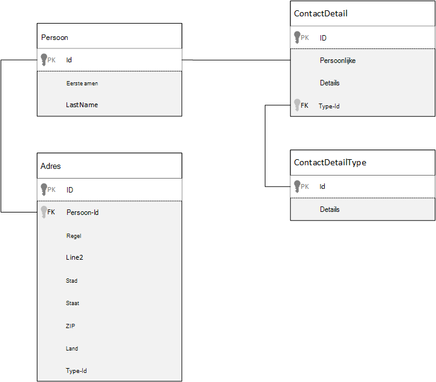
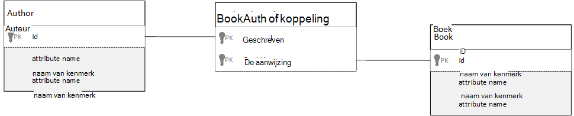

<properties 
    pageTitle="Modellering van gegevens in Azure DocumentDB | Microsoft Azure" 
    description="Informatie over gegevens voor DocumentDB, een database NoSQL document modeling." 
    keywords="modellering van gegevens"
    services="documentdb" 
    authors="kiratp" 
    manager="jhubbard" 
    editor="mimig1" 
    documentationCenter=""/>

<tags 
    ms.service="documentdb" 
    ms.workload="data-services" 
    ms.tgt_pltfrm="na" 
    ms.devlang="na" 
    ms.topic="article" 
    ms.date="08/05/2016" 
    ms.author="kipandya"/>

#Modellering van gegevens in DocumentDB#
Terwijl schema vrije databases, zoals DocumentDB, Azure, het maken heel eenvoudig om te spelen op wijzigingen in het gegevensmodel van uw u moet nog steeds besteden sommige tijd na te denken over uw gegevens. 

Hoe gegevens zal worden opgeslagen? Hoe verloopt de toepassing op te halen en gegevens opvragen Is voor uw toepassing dik lezen of schrijven? 

Na het lezen van dit artikel, is het mogelijk om de volgende vragen te beantwoorden:

- Hoe moet ik denk dat over een document in een document database?
- Wat is data modellering en waarom moet ik care? 
- Hoe is modelleren gegevens in de database van een document in een relationele database?
- Hoe ik de relaties tussen gegevens in een niet-relationele database express?
- Bij ingesloten gegevens en wanneer kan ik gegevens koppelen?

##Gegevens insluiten##
Wanneer u start met het modelleren van gegevens in een documentarchief, zoals DocumentDB, probeer te behandelen uw diensten als **zelfstandige documenten** weergegeven in JSON.

Voordat we zelf aan de slag te veel verder laten we een paar stappen terug te nemen en bekijken hoe we iets in een relationele database, een onderwerp dat velen van ons al bekend met bent mogelijk model. In het volgende voorbeeld ziet u hoe een persoon kan worden opgeslagen in een relationele database. 

Bij het werken met relationele databases, hebben we geleerd jarenlang te normaliseren, normaliseren, normaliseren.

Meestal normaliseren van uw gegevens moet een entiteit, zoals een persoon, nemen en deze te splitsen aparte op gegevens. In het bovenstaande voorbeeld, kan een persoon hebben meerdere contactpersonen detailrecords als meerdere adresrecords. We nog een stap verder gaan en uitsplitsen naar contactgegevens uitpakken van meer algemene velden, zoals een type. Hetzelfde adres, hier elke record heeft een type zoals *thuis* of op het *werk* 

De Wegwijzer vooronderstelling wanneer normalisatie van gegevens is te **voorkomen dat overbodige gegevens opslaan** op elke record en in plaats daarvan verwijzen naar gegevens. In dit voorbeeld als u wilt lezen van een persoon, met hun contactgegevens en adressen, moet u met behulp van JOINS effectief uw gegevens samen te voegen tijdens runtime.

    SELECT p.FirstName, p.LastName, a.City, cd.Detail
    FROM Person p
    JOIN ContactDetail cd ON cd.PersonId = p.Id
    JOIN ContactDetailType on cdt ON cdt.Id = cd.TypeId
    JOIN Address a ON a.PersonId = p.Id

Bijwerken van één persoon met hun contactgegevens en adressen vereist schrijfbewerkingen in veel afzonderlijke tabellen. 

Nu eens kijken hoe we dezelfde gegevens als een zelfstandige entiteit in een document database zou model.
        
    {
        "id": "1",
        "firstName": "Thomas",
        "lastName": "Andersen",
        "addresses": [
            {            
                "line1": "100 Some Street",
                "line2": "Unit 1",
                "city": "Seattle",
                "state": "WA",
                "zip": 98012
            }
        ],
        "contactDetails": [
            {"email: "thomas@andersen.com"},
            {"phone": "+1 555 555-5555", "extension": 5555}
        ] 
    }

Met behulp van de bovenstaande aanpak we hebben nu **gedenormaliseerde** degene leggen waar we **ingesloten** de gegevens betreffende deze persoon, zoals hun contactgegevens en adressen, in een JSON-document.
Bovendien hebben we de flexibiliteit om te doen alsof u de contactgegevens van de verschillende vormen geheel omdat we niet beperkt tot een vast schema blijven. 

Een volledige persoonsrecord ophalen uit de database is nu een enkele bewerking tegen één collectie en voor één document lezen. Bijwerken van een persoonsrecord met hun contactgegevens en adressen, wordt ook een enkel schrijfbewerking tegen een enkel document.

Uw toepassing kan door denormalizing gegevens, moet er minder query's en updates om veelvoorkomende bewerkingen te voltooien. 

###Bij het insluiten

Ingesloten gegevens in het algemeen gebruikt wanneer modellen:

- Er zijn **bevat** relaties tussen entiteiten.
- Er zijn **één tot enkele** relaties tussen entiteiten.
- Er zijn ingesloten gegevens die **niet vaak veranderen**.
- Er is ingesloten gegevens won't groeien **zonder gebonden**.
- Er is een **integraal** naar gegevens in een document ingesloten gegevens.

> [AZURE.NOTE] Gedenormaliseerde gegevensmodellen bieden doorgaans betere prestaties met **lezen** .

###Wanneer niet insluiten

De vuistregel in een document database is alles denormalize en alle gegevens in een document insluit, kan dit leiden tot sommige situaties die moeten worden vermeden.

In dit fragment JSON in beslag nemen.

    {
        "id": "1",
        "name": "What's new in the coolest Cloud",
        "summary": "A blog post by someone real famous",
        "comments": [
            {"id": 1, "author": "anon", "comment": "something useful, I'm sure"},
            {"id": 2, "author": "bob", "comment": "wisdom from the interwebs"},
            …
            {"id": 100001, "author": "jane", "comment": "and on we go ..."},
            …
            {"id": 1000000001, "author": "angry", "comment": "blah angry blah angry"},
            …
            {"id": ∞ + 1, "author": "bored", "comment": "oh man, will this ever end?"},
        ]
    }

Dit kan zijn wat een entiteit boeken met ingesloten opmerkingen eruit zou zien als we zijn een typische blog of CMS, systeem modellering. Het probleem met dit voorbeeld is dat de matrix opmerkingen **niet-gebonden**, wat betekent dat dat er geen (praktische) limiet voor het aantal opmerkingen dat alle posten kan hebben. Dit zal een probleem worden als de grootte van het document kan aanzienlijk groeien.

> [AZURE.TIP] Documenten in de DocumentDB hebben een maximale grootte. Raadpleeg voor meer informatie over dit [DocumentDB grenzen](documentdb-limits.md).

De grootte van het document zal de mogelijkheid om de gegevens verzenden via de draad en lezen en bijwerken van het document, klikt u op schaal worden beïnvloed.

In dit geval zou het beter rekening te houden met het volgende model zijn.
        
    Post document:
    {
        "id": "1",
        "name": "What's new in the coolest Cloud",
        "summary": "A blog post by someone real famous",
        "recentComments": [
            {"id": 1, "author": "anon", "comment": "something useful, I'm sure"},
            {"id": 2, "author": "bob", "comment": "wisdom from the interwebs"},
            {"id": 3, "author": "jane", "comment": "....."}
        ]
    }

    Comment documents:
    {
        "postId": "1"
        "comments": [
            {"id": 4, "author": "anon", "comment": "more goodness"},
            {"id": 5, "author": "bob", "comment": "tails from the field"},
            ...
            {"id": 99, "author": "angry", "comment": "blah angry blah angry"}
        ]
    },
    {
        "postId": "1"
        "comments": [
            {"id": 100, "author": "anon", "comment": "yet more"},
            ...
            {"id": 199, "author": "bored", "comment": "will this ever end?"}
        ]
    }

Dit model heeft de drie meest recente opmerkingen die zijn ingesloten in de advertentie, met een vaste matrix afhankelijk is van deze tijd. De andere opmerkingen zijn gegroepeerd in aan 100 opmerkingen en opgeslagen in afzonderlijke documenten. De grootte van de partij is gekozen als 100 omdat onze fictieve toepassing kan de gebruiker opmerkingen 100 tegelijk laden.  

Een ander geval waarin gegevens insluiten een goed idee is is als de ingesloten gegevens vaak in documenten gebruikt worden en vaak worden gewijzigd. 

In dit fragment JSON in beslag nemen.

    {
        "id": "1",
        "firstName": "Thomas",
        "lastName": "Andersen",
        "holdings": [
            {
                "numberHeld": 100,
                "stock": { "symbol": "zaza", "open": 1, "high": 2, "low": 0.5 }
            },
            {
                "numberHeld": 50,
                "stock": { "symbol": "xcxc", "open": 89, "high": 93.24, "low": 88.87 }
            }
        ]
    }

Dit kan leiden tot de aandelenportefeuille van de persoon. We hebt aandeleninformatie in elk document portfolio insluiten gekozen. In een omgeving waarin gerelateerde gegevens vaak worden gewijzigd, zal zoals een voorraad handel van toepassing, het insluiten van gegevens die regelmatig veranderen betekenen dat u elk document portfolio voortdurend bijwerken wilt telkens wanneer een aandeel wordt verhandeld.

Voorraad *zaza* vele honderden keren in één dag mogen worden verhandeld en duizenden gebruikers *zaza* kunnen hebben op hun portefeuille. Met een gegevensmodel zoals het bovenstaande zou moeten we duizenden portfolio documenten vaak werken elke dag leidt tot een systeem dat won't schaal zeer goed. 

##Verwijzen naar gegevens##

Dus netjes voor veel gevallen gegevens insluiten werkt, maar het is duidelijk dat er scenario's als uw gegevens denormalizing meer problemen dan waard. Dus wat we nu doen? 

Relationele databases zijn niet de enige plaats waar u relaties tussen entiteiten maken kunt. In de database van een document hebt u gegevens in een document dat eigenlijk betrekking op de gegevens in andere documenten heeft. Nu, ik ben niet pleiten voor een nog 1 minuut dat wij bouwen systemen die zijn beter voor een relationele database in DocumentDB, of een andere database in het document geschikt zou, maar eenvoudige relaties zijn prima en zijn erg praktisch. 

In de JSON we het voorbeeld van een aandelenportefeuille van eerder gebruik hebt gekozen, maar deze keer verwijzen we naar het voorraaditem op de portefeuille niet insluiten maar. Op deze manier, wanneer het voorraaditem verandert gedurende de dag vaak het enige document dat moet worden bijgewerkt, is het één aandeel document. 

    Person document:
    {
        "id": "1",
        "firstName": "Thomas",
        "lastName": "Andersen",
        "holdings": [
            { "numberHeld":  100, "stockId": 1},
            { "numberHeld":  50, "stockId": 2}
        ]
    }
    
    Stock documents:
    {
        "id": "1",
        "symbol": "zaza",
        "open": 1,
        "high": 2,
        "low": 0.5,
        "vol": 11970000,
        "mkt-cap": 42000000,
        "pe": 5.89
    },
    {
        "id": "2",
        "symbol": "xcxc",
        "open": 89,
        "high": 93.24,
        "low": 88.87,
        "vol": 2970200,
        "mkt-cap": 1005000,
        "pe": 75.82
    }
    

Een direct nadeel van deze aanpak is echter als uw toepassing vereist is voor het weergeven van informatie over de voorraad die wordt aangehouden bij het weergeven van de portefeuille van een persoon; in dit geval moet u meerdere trips aanbrengen in de database de gegevens voor elk aandeel document laden. Hier hebben we een besluit ter verbetering van de efficiëntie van schrijfbewerkingen die gebeurt vaak gedurende de dag, maar op zijn beurt wordt ingebroken op de leesbewerkingen die mogelijk minder invloed op de prestaties van deze bijzondere regeling hebben aangebracht.

> [AZURE.NOTE] Gestandaardiseerde gegevens modellen **kunt vereisen meer interactie** met de server.

### Hoe zit het met refererende sleutels?
Omdat er momenteel geen concept van een beperking, refererende sleutel of anderszins, geen relaties tussen document die u in documenten zijn effectief "zwakke banden" en zal niet worden gecontroleerd door de database zelf. Als u zorgen dat de gegevens die een document verwijst wilt naar daadwerkelijk bestaat, moet u dit doen in uw toepassing of door het gebruik van server-side triggers of opgeslagen procedures op DocumentDB.

###Wanneer kan verwijzen naar
In het algemeen, genormaliseerde gegevens gebruiken als modellen:

- Die **een-op-veel** -relaties.
- Die **veel-op-veel** -relaties.
- Gerelateerde gegevens **vaak worden gewijzigd**.
- Kan gegevens waarnaar wordt verwezen worden **niet-gebonden**.

> [AZURE.NOTE] Meestal normaliseren biedt betere prestaties **schrijven** .

###Waar plaats ik de relatie
De groei van de relatie kunt u bepalen in welk document voor het opslaan van de verwijzing.

Als we de onderstaande JSON die uitgevers en boeken modellen bekijken.

    Publisher document:
    {
        "id": "mspress",
        "name": "Microsoft Press",
        "books": [ 1, 2, 3, ..., 100, ..., 1000]
    }

    Book documents:
    {"id": "1", "name": "DocumentDB 101" }
    {"id": "2", "name": "DocumentDB for RDBMS Users" }
    {"id": "3", "name": "Taking over the world one JSON doc at a time" }
    ...
    {"id": "100", "name": "Learn about Azure DocumentDB" }
    ...
    {"id": "1000", "name": "Deep Dive in to DocumentDB" }

Als het nummer van de boeken per uitgever klein met beperkte groei is, kan bewaren van de naslaginformatie voor het publisher-document adresboek nuttig zijn. Echter, als het aantal boeken per uitgever ongebonden, vervolgens dit gegevensmodel leidt tot veranderlijke, groeiende arrays, zoals in het bovenstaande voorbeeld publisher document. 

Overschakelen naar een andere dingen rond een bit zou resulteren in een model dat geeft nog steeds dezelfde gegevens, maar nu deze grote veranderlijke collecties voorkomt.

    Publisher document: 
    {
        "id": "mspress",
        "name": "Microsoft Press"
    }
    
    Book documents: 
    {"id": "1","name": "DocumentDB 101", "pub-id": "mspress"}
    {"id": "2","name": "DocumentDB for RDBMS Users", "pub-id": "mspress"}
    {"id": "3","name": "Taking over the world one JSON doc at a time"}
    ...
    {"id": "100","name": "Learn about Azure DocumentDB", "pub-id": "mspress"}
    ...
    {"id": "1000","name": "Deep Dive in to DocumentDB", "pub-id": "mspress"}

In het bovenstaande voorbeeld hebben we de onbegrensde collectie neergezet op de publisher-document. In plaats daarvan alleen hebben we een een verwijzing naar de uitgever in elk boekdocument.

###Hoe ik veel: veel relaties model?
In een relationele database worden *veel: veel* relaties vaak gemodelleerd met join tabellen, die alleen records uit de andere tabellen samen samenvoegen. 

Wellicht neigt u voor het repliceren van de documenten met hetzelfde en produceren een gegevensmodel dat op het volgende lijkt.

    Author documents: 
    {"id": "a1", "name": "Thomas Andersen" }
    {"id": "a2", "name": "William Wakefield" }
    
    Book documents:
    {"id": "b1", "name": "DocumentDB 101" }
    {"id": "b2", "name": "DocumentDB for RDBMS Users" }
    {"id": "b3", "name": "Taking over the world one JSON doc at a time" }
    {"id": "b4", "name": "Learn about Azure DocumentDB" }
    {"id": "b5", "name": "Deep Dive in to DocumentDB" }
    
    Joining documents: 
    {"authorId": "a1", "bookId": "b1" }
    {"authorId": "a2", "bookId": "b1" }
    {"authorId": "a1", "bookId": "b2" }
    {"authorId": "a1", "bookId": "b3" }

Dit zou werken. Echter moet beide een auteur met hun boeken laden, of laden van een boek met de auteur, altijd ten minste twee extra query's op de database. Een query naar het gekoppelde document en vervolgens een andere query voor het ophalen van het document wordt toegevoegd. 

Als alle doet aan deze tabel join is bij elkaar twee gegevenselementen lijmen, waarom niet zet het volledig?
De volgende oorzaken hebben.

    Author documents:
    {"id": "a1", "name": "Thomas Andersen", "books": ["b1, "b2", "b3"]}
    {"id": "a2", "name": "William Wakefield", "books": ["b1", "b4"]}
    
    Book documents: 
    {"id": "b1", "name": "DocumentDB 101", "authors": ["a1", "a2"]}
    {"id": "b2", "name": "DocumentDB for RDBMS Users", "authors": ["a1"]}
    {"id": "b3", "name": "Learn about Azure DocumentDB", "authors": ["a1"]}
    {"id": "b4", "name": "Deep Dive in to DocumentDB", "authors": ["a2"]}

Nu, als ik een auteur had, ik direct weet welke boeken die ze heeft geschreven en als ik had een boekdocument geladen zou ik omgekeerd de id van de auteur (s) kent. Hiermee slaat u die tussenliggende query tegen join tabel verminderen het aantal server-retouren uw toepassing te maken heeft. 

##Hybride gegevensmodellen##
We nu hebt bekeken insluiten (of denormalizing) en verwijzingen (of normaliseren) gegevens, hebben elk hun upsides en elk compromissen hebben, zoals we hebben gezien. 

Hebben niet altijd kan of niet worden Blazende om dingen een beetje verwisselt. 

Op basis van de specifieke gebruikspatronen van uw toepassing en de werklast kan er gevallen waarbij het mengen van ingesloten gegevens waarnaar wordt verwezen, is zinvol en kan leiden tot een eenvoudiger toepassingslogica met minder server retouren terwijl zij toch een goed niveau van prestaties.

U kunt de volgende JSON. 

    Author documents: 
    {
        "id": "a1",
        "firstName": "Thomas",
        "lastName": "Andersen",     
        "countOfBooks": 3,
        "books": ["b1", "b2", "b3"],
        "images": [
            {"thumbnail": "http://....png"}
            {"profile": "http://....png"}
            {"large": "http://....png"}
        ]
    },
    {
        "id": "a2",
        "firstName": "William",
        "lastName": "Wakefield",
        "countOfBooks": 1,
        "books": ["b1"],
        "images": [
            {"thumbnail": "http://....png"}
        ]
    }
    
    Book documents:
    {
        "id": "b1",
        "name": "DocumentDB 101",
        "authors": [
            {"id": "a1", "name": "Thomas Andersen", "thumbnailUrl": "http://....png"},
            {"id": "a2", "name": "William Wakefield", "thumbnailUrl": "http://....png"}
        ]
    },
    {
        "id": "b2",
        "name": "DocumentDB for RDBMS Users",
        "authors": [
            {"id": "a1", "name": "Thomas Andersen", "thumbnailUrl": "http://....png"},
        ]
    }

Hier hebt we de ingesloten model waar gegevens van andere entiteiten zijn ingesloten in het document op het hoogste niveau, maar andere gegevens wordt verwezen (grotendeels) gevolgd. 

Als u het boekdocument bekijken, zien we enkele interessante velden bij de matrix van de auteurs. Er is een *id-* veld, wordt het veld gebruikt om naar een standaardprocedure in een gestandaardiseerde model van het document auteur maar vervolgens we hebben ook *de naam* en *thumbnailUrl*. We zojuist kan hebt hangen met de *id* en de toepassing benodigde aanvullende informatie ophalen van de respectieve auteur document met behulp van de "link" links, maar omdat onze toepassing de naam van de auteur en een miniatuur van de figuur wordt weergegeven met alle boeken weergegeven kunnen we een retour opslaan op de server per boek in een lijst door **gegevens van de auteur** denormalizing.

Zeker, als de naam van de auteur worden gewijzigd of wilden ze hun foto's die zou moeten we een update gaat werken elk boek ze ooit gepubliceerd maar voor onze toepassing die is gebaseerd op de veronderstelling dat auteurs niet hun namen vaak veranderen, is dit een aanvaardbare ontwerp-besluit.  

Er zijn de **aggregaten vooraf berekende** waarden opslaan dure verwerking op een leesbewerking. In het voorbeeld van de gegevens die zijn ingesloten in het document auteur is gegevens die tijdens de uitvoering wordt berekend. Telkens wanneer een nieuw boek wordt gepubliceerd, wordt een boekdocument gemaakt **en** die het veld countOfBooks is ingesteld op een berekende waarde op basis van het aantal documenten in een boekbestand die beschikbaar zijn voor een bepaalde auteur. Deze optimalisatie zou zijn goed in lezen zware systemen waar we erg berekeningen doen voor schrijfbewerkingen wilt optimaliseren leest.

Aangezien DocumentDB **document met meerdere transacties**ondersteunt, is de mogelijkheid om een model met vooraf berekende velden mogelijk gemaakt. Veel winkels voor NoSQL kunnen transacties uitvoeren in documenten en daarom pleiten voor ontwerpbesluiten, zoals 'altijd insluiten Alles", als gevolg van deze beperking. Met DocumentDB, kunt u server-side triggers of opgeslagen procedures, die bij het invoegen van boeken en auteurs alle binnen een transactie zuur bijwerken. Nu u niet **hebt** om alles in één document net om ervoor te zorgen dat de gegevens consistent blijft.

##Volgende stappen

De grootste takeaways uit dit artikel is om te begrijpen dat gegevens in een wereld zonder schema's modelleren is even belangrijk als het ooit. 

Net zoals er geen enkele manier om aan te geven van een gedeelte van de gegevens op een scherm is, is er geen enkele manier om uw gegevens te modelleren. U moet begrijpen hoe levert, en de toepassing verbruiken en verwerken van de gegevens. Vervolgens, sommige van de hier gepresenteerde richtsnoeren toe te passen kunt u instellen over het maken van een model dat de onmiddellijke van uw toepassing behoeften. Als uw toepassingen wijzigen wilt, kunt u de flexibiliteit van een schema-free database om in te spelen met het gegevensmodel van uw gemakkelijk te ontwikkelen en te benutten. 

Raadpleeg voor meer informatie over Azure, DocumentDB, [documentatie](https://azure.microsoft.com/documentation/services/documentdb/) -pagina van de service. 

Meer informatie over het afstemmen van de indexen in Azure, DocumentDB, verwijzen naar het artikel over het [beleid voor indexering](documentdb-indexing-policies.md).

Om te begrijpen hoe te shard uw gegevens op verschillende partities verwijzen naar [Partitioneren van gegevens in DocumentDB](documentdb-partition-data.md). 

En ten slotte voor richtlijnen voor gegevens modellering en sharding voor toepassingen met meerdere huurder, neem contact op met [een toepassing met meerdere huurder met Azure DocumentDB schalen](http://blogs.msdn.com/b/documentdb/archive/2014/12/03/scaling-a-multi-tenant-application-with-azure-documentdb.aspx).
 
