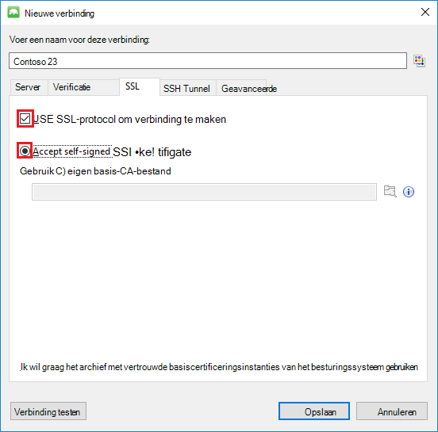

<properties 
    pageTitle="MongoChef met een DocumentDB-account met ondersteuning voor MongoDB-protocol gebruiken | Microsoft Azure" 
    description="Informatie over het gebruik van MongoChef met een DocumentDB-account met ondersteuning voor MongoDB, nu beschikbaar voor preview-protocol." 
    keywords="mongochef"
    services="documentdb" 
    authors="AndrewHoh" 
    manager="jhubbard" 
    editor="" 
    documentationCenter=""/>

<tags 
    ms.service="documentdb" 
    ms.workload="data-services" 
    ms.tgt_pltfrm="na" 
    ms.devlang="na" 
    ms.topic="article" 
    ms.date="08/25/2016" 
    ms.author="anhoh"/>

# MongoChef met een DocumentDB-account met ondersteuning voor MongoDB-protocol gebruiken

U moet een account Azure DocumentDB met ondersteuning voor MongoChef met MongoDB-protocol verbinding wordt:

- Downloaden en installeren van [MongoChef](http://3t.io/mongochef)
- Uw account DocumentDB met protocolondersteuning voor MongoDB [verbindingsreeks](documentdb-connect-mongodb-account.md) informatie

## Maak de verbinding in MongoChef  

Als u wilt uw account DocumentDB met ondersteuning voor MongoDB toevoegen aan de MongoChef connection manager, kunt u de volgende stappen uitvoeren.

1. Ophalen van uw DocumentDB met ondersteuning voor MongoDB gegevens met behulp van de instructies [hier](documentdb-connect-mongodb-account.md).

    

2. Klik op **verbinden** om de Connection Manager te openen en klik op **Nieuwe verbinding**

    
    
2. Voer in het venster **Nieuwe verbinding** op het tabblad **Server** de HOST (Fully Qualified Domain Name) van de account DocumentDB met ondersteuning voor MongoDB en de poort.
    
    

3. Kies verificatiemodus **standaard (MONGODB CR of SCARM-SHA-1)** en voer de gebruikersnaam en het wachtwoord in het venster **Nieuwe verbinding** op het tabblad **verificatie** .  Accepteer de standaard verificatie db (admin) of geef uw eigen waarde.

    

4. Controleer in het venster **Nieuwe verbinding** op het tabblad **SSL** het selectievakje **Gebruik SSL-protocol om verbinding te maken** en de **zelfondertekende SSL-certificaten accepteren** keuzerondje.

    

5. Klik op de knop **Test Connection** om de verbindingsgegevens valideren, klikt u op **OK** om terug te keren naar het venster van de nieuwe verbinding en klik vervolgens op **Opslaan**.

    

## Gebruik MongoChef voor het maken van een database, collectie en documenten  

Als u een database maakt, wilt verzamelen en documenten met MongoChef, als volgt.

1. Markeer de verbinding in **Verbindingsbeheer**en klik op **verbinden**.

    

2. Klik met de rechtermuisknop op de host en kies **Database toevoegen**.  De naam van een database en klik op **OK**.
    
    

3. Klik met de rechtermuisknop op de database en kies **Collectie toevoegen**.  De naam van een verzameling en klik op **maken**.

    

4. Klik op de opdracht van de **collectie** en klik vervolgens op **Document toevoegen**.

    

5. Plak het volgende in het dialoogvenster Document toevoegen en klik vervolgens op **Document toevoegen**.

        {
        "_id": "AndersenFamily",
        "lastName": "Andersen",
        "parents": [
            { "firstName": "Thomas" },
            { "firstName": "Mary Kay"}
        ],
        "children": [
        {
            "firstName": "Henriette Thaulow", "gender": "female", "grade": 5,
            "pets": [{ "givenName": "Fluffy" }]
        }
        ],
        "address": { "state": "WA", "county": "King", "city": "seattle" },
        "isRegistered": true
        }

    
6. Een ander document, ditmaal met de volgende inhoud toevoegen.

        {
        "_id": "WakefieldFamily",
        "parents": [
            { "familyName": "Wakefield", "givenName": "Robin" },
            { "familyName": "Miller", "givenName": "Ben" }
        ],
        "children": [
            {
                "familyName": "Merriam", 
                "givenName": "Jesse", 
                "gender": "female", "grade": 1,
                "pets": [
                    { "givenName": "Goofy" },
                    { "givenName": "Shadow" }
                ]
            },
            { 
                "familyName": "Miller", 
                "givenName": "Lisa", 
                "gender": "female", 
                "grade": 8 }
        ],
        "address": { "state": "NY", "county": "Manhattan", "city": "NY" },
        "isRegistered": false
        }

7. Een voorbeeldquery uitvoeren. Bijvoorbeeld gezinnen met de achternaam 'Andersen' zoeken en de ouders en de velden staat.

    
    

## Volgende stappen

- DocumentDB met ondersteuning voor MongoDB [monsters](documentdb-mongodb-samples.md)verkennen.

 
