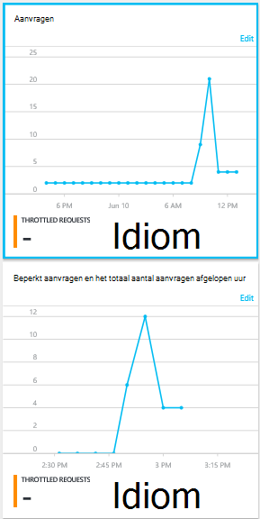

<properties
    pageTitle="Aanvragen voor DocumentDB en opslag | Microsoft Azure"
    description="Informatie over het controleren van prestatiegegevens, zoals aanvragen en serverfouten, en gebruik statistieken, zoals opslag, verbruik van uw DocumentDB rekening."
    services="documentdb"
    documentationCenter=""
    authors="mimig1"
    manager="jhubbard"
    editor="cgronlun"/>

<tags
    ms.service="documentdb"
    ms.workload="data-services"
    ms.tgt_pltfrm="na"
    ms.devlang="na"
    ms.topic="article"
    ms.date="10/17/2016"
    ms.author="mimig"/>

# DocumentDB aanvragen, het gebruik en de opslag controleren

U kunt uw rekeningen Azure DocumentDB in de [portal Azure](https://portal.azure.com/)controleren. Beide prestatiecijfers, zoals aanvragen en serverfouten en gebruik cijfers zoals verbruik, opslag, zijn beschikbaar voor elke account DocumentDB.

Statistieken kunnen worden gecontroleerd op de Account blade of op de nieuwe maatstaven blade.

## Prestatiegegevens weergeven op het blad Metrics

1. In een nieuw venster opent de [Azure portal](https://portal.azure.com/), klik op **Meer Services**klikt u op **DocumentDB (NoSQL)**en klik vervolgens op de naam van de account van de DocumentDB die u graag wilt bekijken van prestatiegegevens.
2. Klik op **parameters**in het menu bron.

De blade Metrics geopend en kunt u de collectie te bekijken. U kunt de beschikbaarheid, aanvragen, doorvoer en opslag bekijken en deze vergelijken met de DocumentDB Sla's.

## Prestatiegegevens weergeven op de account blade
1.  In een nieuw venster opent de [Azure portal](https://portal.azure.com/), klik op **Meer Services**klikt u op **DocumentDB (NoSQL)**en klik vervolgens op de naam van de account van de DocumentDB die u graag wilt bekijken van prestatiegegevens.

2.  De lens **Monitoring** worden standaard de volgende tegels weergegeven:
    *   Totaal aantal aanvragen voor de huidige dag.
    *   Opslag gebruikt.

    Zie de sectie [problemen oplossen](#troubleshooting) als u denkt dat er gegevens in uw database de tabel bevat **geen gegevens beschikbaar** .

    

3.  **Aanvragen** of **opslag** op naast elkaar Hiermee opent u een gedetailleerde **Metric** blade.
4.  De **Metric** blade ziet u details over de parameters die u hebt geselecteerd.  Aan de bovenkant van het blad is een grafiek van aanvragen per uur in kaart gebracht en onder die tabel waarin de waarden aggregatie voor beperkt en totale aanvragen.  De metrische blade ziet u ook de lijst met waarschuwingen die zijn gedefinieerd, worden de parameters die worden weergegeven op de huidige metrische blade (op deze manier hebt u een aantal waarschuwingen, alleen ziet u relevante degene die hier worden weergegeven).   

    

## Prestaties metrische weergaven aanpassen in de portal

1.  Klik op de grafiek om deze te openen in de blade **Metric** voor het aanpassen van de parameters die worden weergegeven in een bepaalde grafiek, en klik vervolgens op **grafiek bewerken**.  
    

2.  Er zijn opties voor het wijzigen van de parameters die worden weergegeven in de grafiek als het tijdsbereik van hun op de **Grafiek bewerken** -blade.  
    

3.  Ga het maatstelsel dat wordt weergegeven in het gedeelte te selecteren of wissen van de beschikbare prestatiegegevens en klikt u op **OK** onder aan het blad.  
4.  Om het tijdsbereik wijzigen, kiest u een ander bereik (bijvoorbeeld **aangepaste**) en klik op **OK** onder aan het blad.  

    

## Side-by-side-grafieken maken in de portal
De Azure-Portal kunt u naast elkaar metrische grafieken maken.  

1.  Eerst met de rechtermuisknop op de grafiek die u wilt kopiëren en selecteer **aanpassen**.

    

2.  Klikt u op **kopiëren** in het menu kopiëren van het onderdeel en klik op **Gereed aanpassen**.

      

U mag dit deel nu behandelen als andere metrische onderdeel aanpassen van de parameters en tijdbereik weergegeven in het gedeelte.  Op deze manier ziet u twee verschillende maatstaven grafiek side-by-side op hetzelfde moment.  
      

## Waarschuwingen in de portal instellen
1.  Klik op **Meer Services**in [Azure portal](https://portal.azure.com/)naar **DocumentDB (NoSQL)**en klik vervolgens op de naam van de DocumentDB-account waarvoor u wil instellen om metrische prestatiesignalen.

2.  Klik in het menu bron **Waarschuwingsregels** voor het openen van de bladeserver waarschuwingsregels.  
    

3.  Klik op **waarschuwing toevoegen**in het blad **waarschuwingsregels** .  
    

4.  Geef in het blad **een waarschuwingsregel toevoegen** :
    *   De naam van de waarschuwingsregel die u instelt.
    *   Een beschrijving van de nieuwe waarschuwingsregel.
    *   De metric voor de waarschuwingsregel.
    *   De voorwaarde, drempelwaarde en periode die bepalen wanneer de waarschuwing wordt geactiveerd. Bijvoorbeeld, een server aantal groter is dan 5 gedurende de laatste 15 minuten.
    *   Of de servicebeheerder en de coadministrators worden gestuurd wanneer de waarschuwing wordt geactiveerd.
    *   Extra e-mailadressen voor waarschuwingen.  
    

## DocumentDB programmatisch controleren
De account niveau metrische gegevens beschikbaar in de portal, zoals account opslag en de totale aanvragen, zijn niet beschikbaar via de APIs DocumentDB. U kunt echter gebruiksgegevens op het niveau van ophalen met behulp van de APIs DocumentDB. Voor het ophalen van gegevens te verzamelen op het volgende doen:

- Gebruik de REST API, [GET op de collectie uitvoeren](https://msdn.microsoft.com/library/mt489073.aspx). De informatie en het gebruik van quota voor de collectie wordt in de aangegeven x-ms-bron-quotum en x-ms-weergave Resourcegebruik in het antwoord geretourneerd.
- Gebruik de methode [DocumentClient.ReadDocumentCollectionAsync](https://msdn.microsoft.com/library/microsoft.azure.documents.client.documentclient.readdocumentcollectionasync.aspx) , die een [ResourceResponse](https://msdn.microsoft.com/library/dn799209.aspx) met een aantal eigenschappen zoals **CollectionSizeUsage**, **DatabaseUsage**, **DocumentUsage**en gebruik als resultaat gegeven voor het gebruik van de .NET SDK.

Als u extra statistieken, gebruiken de [Azure Monitor SDK](https://www.nuget.org/packages/Microsoft.Azure.Insights). Beschikbare metrische definities kunnen worden opgehaald door het aanroepen van:

    https://management.azure.com/subscriptions/{SubscriptionId}/resourceGroups/{ResourceGroup}/providers/Microsoft.DocumentDb/databaseAccounts/{DocumentDBAccountName}/metricDefinitions?api-version=2015-04-08

Query's voor het ophalen van afzonderlijke cijfers de volgende notatie gebruiken:

    https://management.azure.com/subscriptions/{SubecriptionId}/resourceGroups/{ResourceGroup}/providers/Microsoft.DocumentDb/databaseAccounts/{DocumentDBAccountName}/metrics?api-version=2015-04-08&$filter=%28name.value%20eq%20%27Total%20Requests%27%29%20and%20timeGrain%20eq%20duration%27PT5M%27%20and%20startTime%20eq%202016-06-03T03%3A26%3A00.0000000Z%20and%20endTime%20eq%202016-06-10T03%3A26%3A00.0000000Z

Zie [Resource Metrics ophalen via de Azure Monitor REST API](https://blogs.msdn.microsoft.com/cloud_solution_architect/2016/02/23/retrieving-resource-metrics-via-the-azure-insights-api/)voor meer informatie. Houd er rekening mee dat 'Azure Inights' is gewijzigd "Azure Monitor".  Dit blogbericht verwijst naar de naam van de oudere.

## Het oplossen van problemen
Als uw controle tegels weergegeven met de tekst **geen gegevens beschikbaar** en u hebt aangebracht aanvragen of gegevens toegevoegd aan de database, kunt u de tegel aan het recente gebruik.

### Een tegel om huidige gegevens te vernieuwen bewerken
1.  Om de statistieken die worden weergegeven in een bepaald gedeelte wilt aanpassen, klikt u op de grafiek om te openen de **Metric** blade en klik vervolgens op **Grafiek bewerken**.  
    

2.  Op het blad **Grafiek bewerken** in de sectie **Tijdsbereik** **afgelopen uur**op en klik vervolgens op **OK**.  
    

3.  De tegel moet nu vernieuwen met uw actuele gegevens en gebruik.  
    

## Volgende stappen
Zie voor meer informatie over de capaciteit van de DocumentDB, [capaciteit DocumentDB beheren](documentdb-manage.md).
