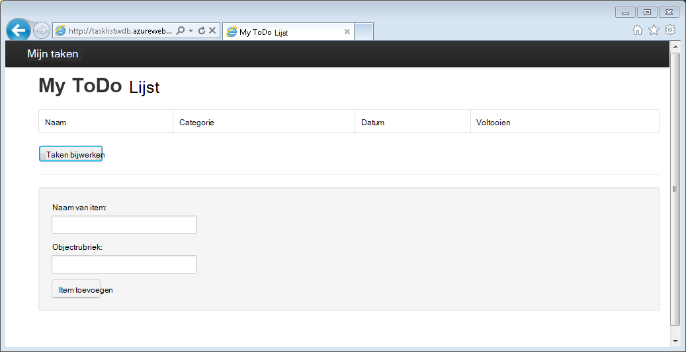
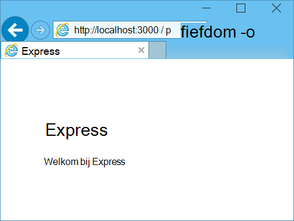
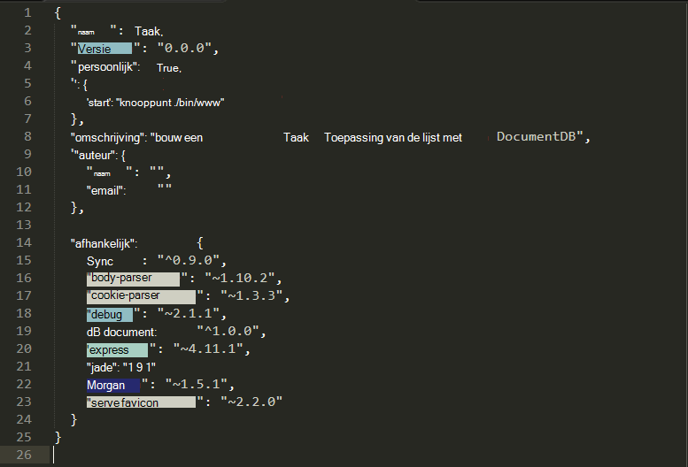
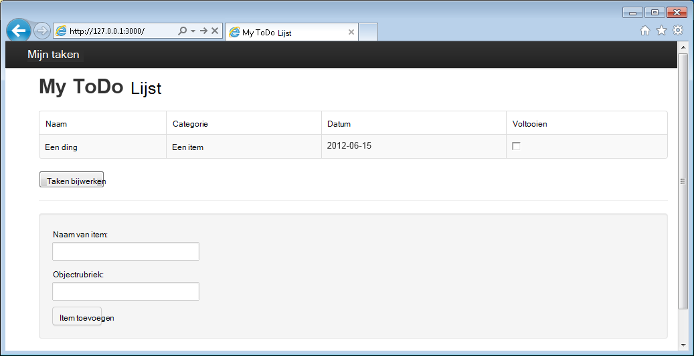

<properties 
    pageTitle="Informatie over Node.js - DocumentDB Node.js zelfstudie | Microsoft Azure" 
    description="Meer Node.js! Zelfstudie behandelt het gebruik van Microsoft Azure DocumentDB op te slaan en toegang tot gegevens uit een Node.js Express-webtoepassing op Azure Websites gehost." 
    keywords="Toepassingsontwikkeling, zelfstudie, leren node.js, node.js zelfstudie, documentdb, azure, Microsoft azure"
    services="documentdb" 
    documentationCenter="nodejs" 
    authors="syamkmsft" 
    manager="jhubbard" 
    editor="cgronlun"/>

<tags 
    ms.service="documentdb" 
    ms.workload="data-services" 
    ms.tgt_pltfrm="na" 
    ms.devlang="nodejs" 
    ms.topic="hero-article" 
    ms.date="08/25/2016" 
    ms.author="syamk"/>

# Bouwen van een webtoepassing voor Node.js met DocumentDB

> [AZURE.SELECTOR]
- [.NET](documentdb-dotnet-application.md)
- [Node.js](documentdb-nodejs-application.md)
- [Java](documentdb-java-application.md)
- [Python](documentdb-python-application.md)

Deze zelfstudie Node.js ziet u hoe de Azure DocumentDB-service gebruiken om te slaan en toegang tot gegevens uit een Node.js Express-toepassing op Azure Websites gehost.

Wij raden u aan de volgende video waarin wordt uitgelegd hoe een database Azure DocumentDB account inrichten en JSON-documenten opslaan in uw toepassing Node.js volgen aan de slag. 

> [AZURE.VIDEO azure-demo-getting-started-with-azure-documentdb-on-nodejs-in-linux]

Ga vervolgens terug naar deze zelfstudie Node.js waar u leert hoe u de antwoorden op de volgende vragen:

- Hoe werk ik met de module documentdb npm DocumentDB
- Hoe kan ik de webtoepassing naar Azure Websites implementeren?

Door deze zelfstudie te volgen, bouwt u een eenvoudige web-based-toepassing voor takenbeheer waarmee maken, ophalen en het voltooien van taken. De taken worden opgeslagen als JSON-documenten in Azure DocumentDB.

Geen tijd voor het voltooien van de zelfstudie en wilt krijgen de volledige oplossing? Geen probleem, u krijgt de volledige oplossing van [GitHub][].

## Vereisten

> [AZURE.TIP] Deze zelfstudie Node.js wordt ervan uitgegaan dat u enige voorafgaande ervaring met Node.js en Azure Websites.

Voordat u de instructies in dit artikel uitvoert, moet u ervoor zorgen dat u de volgende opties hebt:

- Een actieve account Azure. Als u geen account hebt, kunt u een gratis proefperiode account in een paar minuten. Zie voor meer informatie, [Gratis proefperiode van Azure](https://azure.microsoft.com/pricing/free-trial/).
- [Node.js][] versie v0.10.29 of hoger.
- [Express generator](http://www.expressjs.com/starter/generator.html) (u kunt dit via installeren `npm install express-generator -g`)
- [Git][].

## Stap 1: Maak een account DocumentDB database

Laten we beginnen met het maken van een account DocumentDB. Als u al een account hebt, kunt u verdergaan met [stap 2: Maak een nieuwe Node.js toepassing](#_Toc395783178).

[AZURE.INCLUDE [documentdb-create-dbaccount](../../includes/documentdb-create-dbaccount.md)]

[AZURE.INCLUDE [documentdb-keys](../../includes/documentdb-keys.md)]

## Stap 2: Leer een nieuwe Node.js-toepassing maken

Nu we weten voor het maken van een eenvoudige Hello World Node.js project met het framework [Express](http://expressjs.com/) .

1. Open uw favoriete terminal.

2. Gebruik de uitdrukkelijke generator voor het genereren van een nieuwe toepassing **todo**genoemd.

        express todo

3. Open de map van uw nieuwe **todo** en afhankelijkheden installeren.

        cd todo
        npm install

4. De nieuwe toepassing worden uitgevoerd.

        npm start

5. U kunt u uw nieuwe toepassing weergeven door de browser om [http://localhost:3000](http://localhost:3000)te navigeren.

    

## Stap 3: Installeer extra modules

Het bestand **package.json** is een van de bestanden die zijn gemaakt in de hoofdmap van het project. Dit bestand bevat een lijst met aanvullende modules die nodig voor uw toepassing Node.js zijn. Later, wanneer u deze toepassing naar de Websites van een Azure implementeert, wordt dit bestand gebruikt om te bepalen welke modules moeten worden geïnstalleerd op Azure ter ondersteuning van uw toepassing. We moeten nog twee meer pakketten installeren voor deze zelfstudie.

1. Terug in de terminal en de module **async** via npm te installeren.

        npm install async --save

1. Installeer de module **documentdb** via de npm. Dit is de module waarin alle DocumentDB-magic gebeurt.

        npm install documentdb --save

3. Een snelle controle van het **package.json** -bestand van de toepassing moet de aanvullende modules worden weergegeven. Dit bestand vertelt Azure welke pakketten downloaden en installeren wanneer uw toepassing wordt uitgevoerd. Het moet lijken op het onderstaande voorbeeld.

    

    Zo weet knooppunt (en later Azure) dat uw toepassing afhankelijk van deze extra modules is.

## Stap 4: Gebruik van de service DocumentDB in de toepassing van een knooppunt

Die zorgt voor de eerste installatie en configuratie, nu we get omlaag naar waarom we, en dat sommige Azure DocumentDB met code te schrijven is.

### Het model maken

1. Maak een nieuwe map met de naam **modellen**in de projectmap.
2. Maak een nieuw bestand met de naam **taskDao.js**in de map **modellen** . Dit bestand bevat het model voor de taken die door de toepassing gemaakt.
3. Maak in dezelfde map **modellen** , een ander nieuw bestand met de naam **docdbUtils.js**. Dit bestand bevat enkele bruikbare en herbruikbare, code die we in onze toepassing gebruiken. 
4. Kopieer de volgende code in om te **docdbUtils.js**

        var DocumentDBClient = require('documentdb').DocumentClient;
            
        var DocDBUtils = {
            getOrCreateDatabase: function (client, databaseId, callback) {
                var querySpec = {
                    query: 'SELECT * FROM root r WHERE r.id= @id',
                    parameters: [{
                        name: '@id',
                        value: databaseId
                    }]
                };
        
                client.queryDatabases(querySpec).toArray(function (err, results) {
                    if (err) {
                        callback(err);
        
                    } else {
                        if (results.length === 0) {
                            var databaseSpec = {
                                id: databaseId
                            };
        
                            client.createDatabase(databaseSpec, function (err, created) {
                                callback(null, created);
                            });
        
                        } else {
                            callback(null, results[0]);
                        }
                    }
                });
            },
        
            getOrCreateCollection: function (client, databaseLink, collectionId, callback) {
                var querySpec = {
                    query: 'SELECT * FROM root r WHERE r.id=@id',
                    parameters: [{
                        name: '@id',
                        value: collectionId
                    }]
                };             
                
                client.queryCollections(databaseLink, querySpec).toArray(function (err, results) {
                    if (err) {
                        callback(err);
        
                    } else {        
                        if (results.length === 0) {
                            var collectionSpec = {
                                id: collectionId
                            };
                            
                            client.createCollection(databaseLink, collectionSpec, function (err, created) {
                                callback(null, created);
                            });
        
                        } else {
                            callback(null, results[0]);
                        }
                    }
                });
            }
        };
                
        module.exports = DocDBUtils;

    > [AZURE.TIP] createCollection heeft een requestOptions optionele parameter die kan worden gebruikt voor het Type bieden opgeven voor de collectie. Als geen waarde voor requestOptions.offerType is opgegeven wordt de collectie gemaakt met behulp van het Type aanbieden.
    >
    > Raadpleeg voor meer informatie over DocumentDB bieden [de prestaties in DocumentDB](documentdb-performance-levels.md) 
        
3. Opslaan en sluiten van het bestand **docdbUtils.js** .

4. Aan het begin van het bestand **taskDao.js** de volgende code toevoegen om te verwijzen naar de **DocumentDBClient** en de **docdbUtils.js** die we eerder hebben gemaakt:

        var DocumentDBClient = require('documentdb').DocumentClient;
        var docdbUtils = require('./docdbUtils');

4. Vervolgens voegt u code wilt definiëren en exporteren het Task-object. Dit is verantwoordelijk voor het initialiseren van onze Task-object en het instellen van de Database en de verzameling documenten we gebruiken.

        function TaskDao(documentDBClient, databaseId, collectionId) {
          this.client = documentDBClient;
          this.databaseId = databaseId;
          this.collectionId = collectionId;
        
          this.database = null;
          this.collection = null;
        }
        
        module.exports = TaskDao;

5. Voeg vervolgens de volgende code om aanvullende methoden voor het Task-object definiëren waardoor interacties met de gegevens die zijn opgeslagen in DocumentDB.

        TaskDao.prototype = {
            init: function (callback) {
                var self = this;
        
                docdbUtils.getOrCreateDatabase(self.client, self.databaseId, function (err, db) {
                    if (err) {
                        callback(err);
                    } else {
                        self.database = db;
                        docdbUtils.getOrCreateCollection(self.client, self.database._self, self.collectionId, function (err, coll) {
                            if (err) {
                                callback(err);
        
                            } else {
                                self.collection = coll;
                            }
                        });
                    }
                });
            },
        
            find: function (querySpec, callback) {
                var self = this;
        
                self.client.queryDocuments(self.collection._self, querySpec).toArray(function (err, results) {
                    if (err) {
                        callback(err);
        
                    } else {
                        callback(null, results);
                    }
                });
            },
        
            addItem: function (item, callback) {
                var self = this;
        
                item.date = Date.now();
                item.completed = false;
        
                self.client.createDocument(self.collection._self, item, function (err, doc) {
                    if (err) {
                        callback(err);
        
                    } else {
                        callback(null, doc);
                    }
                });
            },
        
            updateItem: function (itemId, callback) {
                var self = this;
        
                self.getItem(itemId, function (err, doc) {
                    if (err) {
                        callback(err);
        
                    } else {
                        doc.completed = true;
        
                        self.client.replaceDocument(doc._self, doc, function (err, replaced) {
                            if (err) {
                                callback(err);
        
                            } else {
                                callback(null, replaced);
                            }
                        });
                    }
                });
            },
        
            getItem: function (itemId, callback) {
                var self = this;
        
                var querySpec = {
                    query: 'SELECT * FROM root r WHERE r.id = @id',
                    parameters: [{
                        name: '@id',
                        value: itemId
                    }]
                };
        
                self.client.queryDocuments(self.collection._self, querySpec).toArray(function (err, results) {
                    if (err) {
                        callback(err);
        
                    } else {
                        callback(null, results[0]);
                    }
                });
            }
        };

6. Opslaan en sluiten van het bestand **taskDao.js** . 

### De domeincontroller maakt

1. Maak een nieuw bestand met de naam **tasklist.js**in de directory **routes** van uw project. 
2. De volgende code toevoegen aan de **tasklist.js**. De DocumentDBClient en asynchrone modules, die worden gebruikt door de **tasklist.js**wordt geladen. Dit ook de functie **TaskList** , die een exemplaar van het **Task** -object dat we eerder gedefinieerd wordt doorgegeven gedefinieerd:

        var DocumentDBClient = require('documentdb').DocumentClient;
        var async = require('async');
        
        function TaskList(taskDao) {
          this.taskDao = taskDao;
        }
        
        module.exports = TaskList;

3. Blijven toevoegen aan het bestand **tasklist.js** door de gebruikte methoden voor **showTasks, addTask**en **completeTasks**toe te voegen:
        
        TaskList.prototype = {
            showTasks: function (req, res) {
                var self = this;
        
                var querySpec = {
                    query: 'SELECT * FROM root r WHERE r.completed=@completed',
                    parameters: [{
                        name: '@completed',
                        value: false
                    }]
                };
        
                self.taskDao.find(querySpec, function (err, items) {
                    if (err) {
                        throw (err);
                    }
        
                    res.render('index', {
                        title: 'My ToDo List ',
                        tasks: items
                    });
                });
            },
        
            addTask: function (req, res) {
                var self = this;
                var item = req.body;
        
                self.taskDao.addItem(item, function (err) {
                    if (err) {
                        throw (err);
                    }
        
                    res.redirect('/');
                });
            },
        
            completeTask: function (req, res) {
                var self = this;
                var completedTasks = Object.keys(req.body);
        
                async.forEach(completedTasks, function taskIterator(completedTask, callback) {
                    self.taskDao.updateItem(completedTask, function (err) {
                        if (err) {
                            callback(err);
                        } else {
                            callback(null);
                        }
                    });
                }, function goHome(err) {
                    if (err) {
                        throw err;
                    } else {
                        res.redirect('/');
                    }
                });
            }
        };

4. Opslaan en sluiten van het bestand **tasklist.js** .
 
### Config.js toevoegen

1. Maak een nieuw bestand met de naam **config.js**in de projectmap.
2. Voeg de volgende **config.js**. Hiermee wordt de configuratie-instellingen en waarden die nodig zijn voor de toepassing.

        var config = {}
        
        config.host = process.env.HOST || "[the URI value from the DocumentDB Keys blade on http://portal.azure.com]";
        config.authKey = process.env.AUTH_KEY || "[the PRIMARY KEY value from the DocumentDB Keys blade on http://portal.azure.com]";
        config.databaseId = "ToDoList";
        config.collectionId = "Items";
        
        module.exports = config;

3. Update voor de waarden van de HOST- en AUTH_KEY met behulp van de waarden in het blad toetsen van uw DocumentDB-account op de [Portal van Microsoft Azure](https://portal.azure.com)gevonden in het bestand **config.js** :

4. Opslaan en sluit het bestand **config.js** .
 
### App.js wijzigen

1. Open het bestand **app.js** in de projectmap. Dit bestand is eerder gemaakt wanneer de Express-webtoepassing is gemaakt.
2. De volgende code toevoegen aan de bovenkant van de **app.js**
    
        var DocumentDBClient = require('documentdb').DocumentClient;
        var config = require('./config');
        var TaskList = require('./routes/tasklist');
        var TaskDao = require('./models/taskDao');

3. Deze code definieert het config-bestand moet worden gebruikt en verloopt in de waarden van dit bestand in sommige variabelen we spoedig gebruiken op lezen.
4. Vervangen door de volgende twee regels in het bestand **app.js** :

        app.use('/', routes);
        app.use('/users', users); 

      met het volgende fragment:

        var docDbClient = new DocumentDBClient(config.host, {
            masterKey: config.authKey
        });
        var taskDao = new TaskDao(docDbClient, config.databaseId, config.collectionId);
        var taskList = new TaskList(taskDao);
        taskDao.init();
        
        app.get('/', taskList.showTasks.bind(taskList));
        app.post('/addtask', taskList.addTask.bind(taskList));
        app.post('/completetask', taskList.completeTask.bind(taskList));
        app.set('view engine', 'jade');

6. Deze regels definieert een nieuw exemplaar van het object **TaskDao** , initialiseren het task-object met een nieuwe verbinding met de DocumentDB (met de waarden van de **config.js**lezen), en maak vervolgens afhankelijk formulieracties methoden op onze **TaskList** -controller. 

7. Ten slotte, opslaan en sluit het bestand **app.js** , we bijna klaar bent.
 
## Stap 5: Een gebruikersinterface maken

Nu gaan we kijken naar de gebruikersinterface bouwen, zodat een gebruiker daadwerkelijk met de toepassing communiceren kan. De Express-toepassing die is gemaakt, gebruikt als de weergave-engine **Jade** . Raadpleeg [http://jade-lang.com/](http://jade-lang.com/)voor meer informatie over Jade.

1. Het bestand **layout.jade** in de map **weergaven** wordt gebruikt als een algemene sjabloon voor andere bestanden **.jade** . In deze stap wijzigt u het gebruik van [Twitter Bootstrap](https://github.com/twbs/bootstrap), namelijk een toolkit waarmee u gemakkelijk een leuk uitziende website ontwerpen. 
2. Open het bestand **layout.jade** is gevonden in de map **weergaven** en de inhoud vervangen door de volgende;
    
        doctype html
        html
          head
            title= title
            link(rel='stylesheet', href='//ajax.aspnetcdn.com/ajax/bootstrap/3.3.2/css/bootstrap.min.css')
            link(rel='stylesheet', href='/stylesheets/style.css')
          body
            nav.navbar.navbar-inverse.navbar-fixed-top
              div.navbar-header
                a.navbar-brand(href='#') My Tasks
            block content
            script(src='//ajax.aspnetcdn.com/ajax/jQuery/jquery-1.11.2.min.js')
            script(src='//ajax.aspnetcdn.com/ajax/bootstrap/3.3.2/bootstrap.min.js')

    Dit effectief vertelt de **Jade** engine HTML voor onze toepassing weergegeven en wordt een **blok** **inhoud** genoemd waarmee we de lay-out kunt leveren voor onze inhoudspagina's.
    Opslaan en sluiten van dit bestand **layout.jade** .

4. Open nu het bestand **index.jade** , de weergave die wordt gebruikt door de toepassing en de inhoud van het bestand vervangen door het volgende:

        extends layout
        
        block content
          h1 #{title}
          br
        
          form(action="/completetask", method="post")
            table.table.table-striped.table-bordered
              tr
                td Name
                td Category
                td Date
                td Complete
              if (typeof tasks === "undefined")
                tr
                  td
              else
                each task in tasks
                  tr
                    td #{task.name}
                    td #{task.category}
                    - var date  = new Date(task.date);
                    - var day   = date.getDate();
                    - var month = date.getMonth() + 1;
                    - var year  = date.getFullYear();
                    td #{month + "/" + day + "/" + year}
                    td
                      input(type="checkbox", name="#{task.id}", value="#{!task.completed}", checked=task.completed)
            button.btn(type="submit") Update tasks
          hr
          form.well(action="/addtask", method="post")
            label Item Name:
            input(name="name", type="textbox")
            label Item Category:
            input(name="category", type="textbox")
            br
            button.btn(type="submit") Add item

    Dit breidt de lay-out en inhoud biedt voor de tijdelijke aanduiding voor de **inhoud** die we eerder in het bestand **layout.jade** hebt gezien.
    
    In deze indeling maken we twee HTML-formulieren. 
    Het eerste formulier bevat een tabel voor onze gegevens en een knop waarmee wij artikelen door te boeken naar de methode **/completetask** van onze controller bijwerken.
    Het tweede formulier bevat twee invoervelden en een knop waarmee wij een nieuw item maken door te boeken naar de methode **/addtask** van onze controller.
    
    Dit moet alles wat we nodig hebben om onze toepassing uit te voeren.

5. Open het **style.css** bestand in de map **public\stylesheets** en de code vervangen door het volgende:

        body {
          padding: 50px;
          font: 14px "Lucida Grande", Helvetica, Arial, sans-serif;
        }
        a {
          color: #00B7FF;
        }
        .well label {
          display: block;
        }
        .well input {
          margin-bottom: 5px;
        }
        .btn {
          margin-top: 5px;
          border: outset 1px #C8C8C8;
        }

    Opslaan en sluiten van dit bestand **style.css** .

## Stap 6: Uw toepassing lokaal uitvoeren

1. Uitvoeren om de toepassing op uw lokale computer wilt testen, `npm start` in een terminal te starten van de toepassing en het starten van een browser met een pagina die op de onderstaande afbeelding lijkt:

    

2. Gebruik van de betreffende velden voor een Item, naam en categorie informatie op te geven en klik op **Item toevoegen**.

3. De pagina moet worden bijgewerkt om het nieuwe item in de takenlijst weer te geven.

    

4. Als u een taak wilt gewoon het selectievakje inschakelen in de volledige kolom en klik vervolgens op **taken bijwerken**.

## Stap 7: Uw application development project Azure websites implementeren

1. Als u nog niet gedaan hebt, kunt u een git repository voor uw Website Azure. Vindt u instructies over hoe u dit doet in het onderwerp [Lokale Git distributie naar Azure App-Service](../app-service-web/app-service-deploy-local-git.md) .

2. Uw Website Azure als een externe git toevoegen.

        git remote add azure https://username@your-azure-website.scm.azurewebsites.net:443/your-azure-website.git

3. Implementeren door te drukken op de afstandsbediening.

        git push azure master

4. Git zal in enkele seconden klaar bent met het publiceren van uw webtoepassing en een browser waarin u kunt zien bij de hand hebt uitgevoerd in Azure starten!

## Volgende stappen

Gefeliciteerd! U hebt zojuist uw eerste Node.js Express webtoepassing met Azure DocumentDB gebouwd en Azure websites gepubliceerd.

De broncode voor de toepassing van de volledige verwijzing kan worden gedownload van [GitHub][].

Zie [Node.js Developer Center](https://azure.microsoft.com/develop/nodejs/)voor meer informatie.

[Node.js]: http://nodejs.org/
[GIT]: http://git-scm.com/
[Github]: https://github.com/Azure-Samples/documentdb-node-todo-app
 
