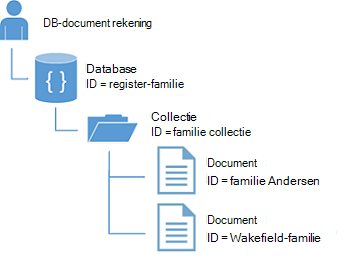
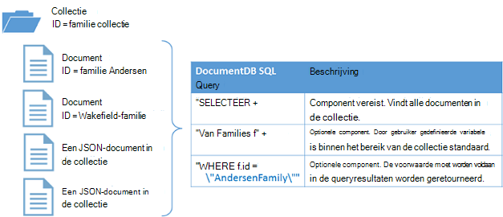

<properties
  pageTitle="Zelfstudie voor DocumentDB NoSQL Node.js | Microsoft Azure"
  description="Een zelfstudie NoSQL Node.js waarmee een knooppunt console en database-toepassing met behulp van de DocumentDB Node.js SDK. DocumentDB is een database NoSQL voor JSON."
    keywords="zelfstudie node.js, knooppunt database"
  services="documentdb"
  documentationCenter="node.js"
  authors="AndrewHoh"
  manager="jhubbard"
  editor="monicar"/>

<tags
  ms.service="documentdb"
  ms.workload="data-services"
  ms.tgt_pltfrm="na"
  ms.devlang="node"
  ms.topic="hero-article"
  ms.date="08/11/2016"
  ms.author="anhoh"/>

# <a name="nosql-nodejs-tutorial-documentdb-nodejs-console-application"></a>NoSQL Node.js zelfstudie: DocumentDB Node.js consoletoepassing  

> [AZURE.SELECTOR]
- [.NET](documentdb-get-started.md)
- [Node.js](documentdb-nodejs-get-started.md)

Welkom bij de zelfstudie Node.js voor de SDK Azure DocumentDB Node.js! Na het volgen van deze zelfstudie hebt u een consoletoepassing die wordt gemaakt en de query DocumentDB bronnen, zoals een database van het knooppunt.

Wij zullen betrekking hebben op:

- Maken en verbinding maken met een account met DocumentDB
- Instellen van uw toepassing
- Maken van een database van het knooppunt
- Een collectie maken
- JSON-documenten maken
- Bij het controleren van de collectie
- Een document vervangen
- Een document verwijderen
- De database van het knooppunt verwijderen

Geen tijd? Maak je niet druk! De volledige oplossing is beschikbaar op [GitHub](https://github.com/Azure-Samples/documentdb-node-getting-started). Zie [de volledige oplossing](#GetSolution) voor snelle instructies.

Na voltooiing van de zelfstudie Node.js, gebruik de stemknoppen boven en onder aan deze pagina om ons feedback geven. Als u wij u rechtstreeks contact opnemen met dat wilt, kunt u uw e-mailadres opnemen in uw opmerkingen.

Nu gaan we aan de slag!

## <a name="prerequisites-for-the-nodejs-tutorial"></a>Vereisten voor de zelfstudie Node.js

Zorg ervoor dat u hebt de volgende opties:

- Een actieve account Azure. Als u niet hebt, kunt u zich aanmelden voor een [Gratis proefperiode van Azure](https://azure.microsoft.com/pricing/free-trial/).
- [Node.js](https://nodejs.org/) versie v0.10.29 of hoger.

## <a name="step-1-create-a-documentdb-account"></a>Stap 1: Maak een account DocumentDB

We maken een DocumentDB account. Als u al een account die u wilt gebruiken, kunt u verder gaan voor het [instellen van uw toepassing Node.js](#SetupNode).

[AZURE.INCLUDE [documentdb-create-dbaccount](../../includes/documentdb-create-dbaccount.md)]

## <a id="SetupNode"></a>Stap 2: Stel uw toepassing Node.js

1. Open uw favoriete terminal.
2. Zoek de map of de map waar u wilt opslaan van uw toepassing Node.js.
3. Maak twee lege JavaScript-bestanden met de volgende opdrachten:
  - Windows:
      * ```fsutil file createnew app.js 0```
        * ```fsutil file createnew config.js 0```
  - Linux/OS X:
      * ```touch app.js```
        * ```touch config.js```
4. Installeer de module documentdb via de npm. Gebruik de volgende opdracht:
    * ```npm install documentdb --save```

Heel goed! Nu dat u klaar bent met het instellen, moet u eerst wat code schrijft.

## <a id="Config"></a>Stap 3: Instellen van uw app configuraties

Open ```config.js``` in uw favoriete tekstverwerker.

Vervolgens, kopiëren en plakken in het onderstaande codefragment en eigenschappen instellen ```config.endpoint``` en ```config.primaryKey``` op uw DocumentDB endpoint-uri en de primaire sleutel. Deze beide configuraties kunnen u vinden in de [Portal Azure](https://portal.azure.com).

![Zelfstudie node.js - schermafdruk van Azure Portal, een DocumentDB-account met de actieve hub gemarkeerd, de TOETSEN-knop op de account DocumentDB blade gemarkeerd en de URI, primaire en secundaire sleutel waarden op de toetsen blade - knooppunt database gemarkeerd met][keys]

    // ADD THIS PART TO YOUR CODE
    var config = {}

    config.endpoint = "~your DocumentDB endpoint uri here~";
    config.primaryKey = "~your primary key here~";

Kopieer en plak de ```database id```, ```collection id```, en ```JSON documents``` aan uw ```config``` object onder u uw ```config.endpoint``` en ```config.authKey``` eigenschappen. Als u de gegevens die u wilt opslaan in uw database al hebt, kunt u de DocumentDB [Data Migration tool](documentdb-import-data.md) in plaats van de documentdefinities toe te voegen.

    config.endpoint = "~your DocumentDB endpoint uri here~";
    config.primaryKey = "~your primary key here~";

    // ADD THIS PART TO YOUR CODE
    config.database = {
        "id": "FamilyDB"
    };

    config.collection = {
        "id": "FamilyColl"
    };

    config.documents = {
        "Andersen": {
            "id": "Anderson.1",
            "lastName": "Andersen",
            "parents": [{
                "firstName": "Thomas"
            }, {
                    "firstName": "Mary Kay"
                }],
            "children": [{
                "firstName": "Henriette Thaulow",
                "gender": "female",
                "grade": 5,
                "pets": [{
                    "givenName": "Fluffy"
                }]
            }],
            "address": {
                "state": "WA",
                "county": "King",
                "city": "Seattle"
            }
        },
        "Wakefield": {
            "id": "Wakefield.7",
            "parents": [{
                "familyName": "Wakefield",
                "firstName": "Robin"
            }, {
                    "familyName": "Miller",
                    "firstName": "Ben"
                }],
            "children": [{
                "familyName": "Merriam",
                "firstName": "Jesse",
                "gender": "female",
                "grade": 8,
                "pets": [{
                    "givenName": "Goofy"
                }, {
                        "givenName": "Shadow"
                    }]
            }, {
                    "familyName": "Miller",
                    "firstName": "Lisa",
                    "gender": "female",
                    "grade": 1
                }],
            "address": {
                "state": "NY",
                "county": "Manhattan",
                "city": "NY"
            },
            "isRegistered": false
        }
    };


De database, de collectie en de documentdefinities zal fungeren als uw DocumentDB ```database id```, ```collection id```, en documenten.

Ten slotte exporteren uw ```config``` object, zodat u kunt verwijzen naar deze binnen de ```app.js``` bestand.

            },
            "isRegistered": false
        }
    };

    // ADD THIS PART TO YOUR CODE
    module.exports = config;

##<a id="Connect"></a>Stap 4: Verbinding maken met een account met DocumentDB

Open uw lege ```app.js``` bestand in de teksteditor. Kopieer en plak de code hieronder voor het importeren van de ```documentdb``` -module en de nieuwe ```config``` module.

    // ADD THIS PART TO YOUR CODE
    "use strict";

    var documentClient = require("documentdb").DocumentClient;
    var config = require("./config");
    var url = require('url');

Kopieer en plak de code voor het gebruik van de eerder opgeslagen ```config.endpoint``` en ```config.primaryKey``` voor het maken van een nieuwe DocumentClient.

    var config = require("./config");
    var url = require('url');

    // ADD THIS PART TO YOUR CODE
    var client = new documentClient(config.endpoint, { "masterKey": config.primaryKey });

Nu dat u de code voor het initialiseren van de documentdb-client hebt, laten we in het werken met DocumentDB middelen.

## <a name="step-5-create-a-node-database"></a>Stap 5: Een knooppunt database maken
Kopieer en plak de volgende HTTP-status instellen voor niet gevonden, de url van de database en de url van de code. Deze URL's hoe de client DocumentDB, vindt u de juiste database en collectie.

    var client = new documentClient(config.endpoint, { "masterKey": config.primaryKey });

    // ADD THIS PART TO YOUR CODE
    var HttpStatusCodes = { NOTFOUND: 404 };
    var databaseUrl = `dbs/${config.database.id}`;
    var collectionUrl = `${databaseUrl}/colls/${config.collection.id}`;

Een [database](documentdb-resources.md#databases) kan worden gemaakt met behulp van de functie [createDatabase](https://azure.github.io/azure-documentdb-node/DocumentClient.html) van de klasse **DocumentClient** . Een database is de logische container van het documentopslag gepartitioneerd in collecties.

Kopieer en plak de **getDatabase** -functie voor het maken van uw nieuwe database in het bestand app.js met de ```id``` opgegeven in de ```config``` object. De functie wordt gecontroleerd als de database met dezelfde ```FamilyRegistry``` -id al bestaat niet. Als deze bestaat, Word je teruggeleid die database in plaats van een nieuwe maken.

    var collectionUrl = `${databaseUrl}/colls/${config.collection.id}`;

    // ADD THIS PART TO YOUR CODE
    function getDatabase() {
        console.log(`Getting database:\n${config.database.id}\n`);

        return new Promise((resolve, reject) => {
            client.readDatabase(databaseUrl, (err, result) => {
                if (err) {
                    if (err.code == HttpStatusCodes.NOTFOUND) {
                        client.createDatabase(config.database, (err, created) => {
                            if (err) reject(err)
                            else resolve(created);
                        });
                    } else {
                        reject(err);
                    }
                } else {
                    resolve(result);
                }
            });
        });
    }

Kopieer en plak de code hieronder waar het instellen van de functie **getDatabase** om toe te voegen de helper functie **Afsluiten** die het bericht afsluiten en het aanroepen van de functie **getDatabase** worden afgedrukt.

                } else {
                    resolve(result);
                }
            });
        });
    }

    // ADD THIS PART TO YOUR CODE
    function exit(message) {
        console.log(message);
        console.log('Press any key to exit');
        process.stdin.setRawMode(true);
        process.stdin.resume();
        process.stdin.on('data', process.exit.bind(process, 0));
    }

    getDatabase()
    .then(() => { exit(`Completed successfully`); })
    .catch((error) => { exit(`Completed with error ${JSON.stringify(error)}`) });

Zoek in de terminal, de ```app.js``` -bestand en voer de opdracht uit:```node app.js```

Gefeliciteerd! Een DocumentDB-database hebt gemaakt.

##<a id="CreateColl"></a>Stap 6: Een collectie maken  

> [AZURE.WARNING] **CreateDocumentCollectionAsync** maakt een nieuwe collectie, die prijzen implicaties heeft. Bezoek onze [prijzen pagina](https://azure.microsoft.com/pricing/details/documentdb/)voor meer details.

Een [collectie](documentdb-resources.md#collections) kan worden gemaakt met de functie [createCollection](https://azure.github.io/azure-documentdb-node/DocumentClient.html) van de klasse **DocumentClient** . Een collectie is een container van JSON-documenten en de bijbehorende JavaScript toepassingslogica.

Kopiëren en plakken van de functie **getCollection** onder de **getDatabase** -functie voor het maken van de nieuwe collectie met de ```id``` opgegeven in de ```config``` object. Controleren we opnieuw om te controleren of een verzameling met dezelfde ```FamilyCollection``` -id al bestaat niet. Als deze bestaat, Word je teruggeleid in plaats van het maken van een nieuwe collectie.

                } else {
                    resolve(result);
                }
            });
        });
    }

    // ADD THIS PART TO YOUR CODE
    function getCollection() {
        console.log(`Getting collection:\n${config.collection.id}\n`);

        return new Promise((resolve, reject) => {
            client.readCollection(collectionUrl, (err, result) => {
                if (err) {
                    if (err.code == HttpStatusCodes.NOTFOUND) {
                        client.createCollection(databaseUrl, config.collection, { offerThroughput: 400 }, (err, created) => {
                            if (err) reject(err)
                            else resolve(created);
                        });
                    } else {
                        reject(err);
                    }
                } else {
                    resolve(result);
                }
            });
        });
    }

Kopieer en plak de code hieronder de aanroep van **getDatabase** voor het uitvoeren van de functie **getCollection** .

    getDatabase()

    // ADD THIS PART TO YOUR CODE
    .then(() => getCollection())
    // ENDS HERE

    .then(() => { exit(`Completed successfully`); })
    .catch((error) => { exit(`Completed with error ${JSON.stringify(error)}`) });

Zoek in de terminal, de ```app.js``` -bestand en voer de opdracht uit:```node app.js```

Gefeliciteerd! Een collectie DocumentDB gemaakt.

##<a id="CreateDoc"></a>Stap 7: Een document maken
Een [document](documentdb-resources.md#documents) kan worden gemaakt met de functie [createDocument](https://azure.github.io/azure-documentdb-node/DocumentClient.html) van de klasse **DocumentClient** . Documenten worden door de gebruiker gedefinieerde (willekeurige) JSON-inhoud. U kunt nu een document invoegen in DocumentDB.

Kopiëren en plakken van de functie **getFamilyDocument** onder de **getCollection** -functie voor het maken van de documenten met de JSON-gegevens opgeslagen in de ```config``` object. Opnieuw, zullen we controleren om ervoor te zorgen dat een document met dezelfde id al bestaat.

                } else {
                    resolve(result);
                }
            });
        });
    }

    // ADD THIS PART TO YOUR CODE
    function getFamilyDocument(document) {
        let documentUrl = `${collectionUrl}/docs/${document.id}`;
        console.log(`Getting document:\n${document.id}\n`);

        return new Promise((resolve, reject) => {
            client.readDocument(documentUrl, { partitionKey: document.district }, (err, result) => {
                if (err) {
                    if (err.code == HttpStatusCodes.NOTFOUND) {
                        client.createDocument(collectionUrl, document, (err, created) => {
                            if (err) reject(err)
                            else resolve(created);
                        });
                    } else {
                        reject(err);
                    }
                } else {
                    resolve(result);
                }
            });
        });
    };

Kopieer en plak de code hieronder de aanroep van **getCollection** voor het uitvoeren van de functie **getFamilyDocument** .

    getDatabase()
    .then(() => getCollection())

    // ADD THIS PART TO YOUR CODE
    .then(() => getFamilyDocument(config.documents.Andersen))
    .then(() => getFamilyDocument(config.documents.Wakefield))
    // ENDS HERE

    .then(() => { exit(`Completed successfully`); })
    .catch((error) => { exit(`Completed with error ${JSON.stringify(error)}`) });

Zoek in de terminal, de ```app.js``` -bestand en voer de opdracht uit:```node app.js```

Gefeliciteerd! U hebt een DocumentDB documenten gemaakt.



##<a id="Query"></a>Stap 8: Query DocumentDB resources

DocumentDB ondersteunt [krachtige query's](documentdb-sql-query.md) tegen JSON-documenten die zijn opgeslagen in elke collectie. De volgende voorbeeldcode ziet u een query die u op de documenten in de collectie uitvoeren kunt.

Kopiëren en plakken van de functie **queryCollection** onder de **getFamilyDocument** -functie. DocumentDB ondersteunt SQL-achtige query's zoals hieronder wordt weergegeven. Bekijk de [Speelplaats van de Query](https://www.documentdb.com/sql/demo) en de [query-documentatie](documentdb-sql-query.md)voor meer informatie over het samenstellen van complexe query's.

                } else {
                    resolve(result);
                }
            });
        });
    }

    // ADD THIS PART TO YOUR CODE
    function queryCollection() {
        console.log(`Querying collection through index:\n${config.collection.id}`);

        return new Promise((resolve, reject) => {
            client.queryDocuments(
                collectionUrl,
                'SELECT VALUE r.children FROM root r WHERE r.lastName = "Andersen"'
            ).toArray((err, results) => {
                if (err) reject(err)
                else {
                    for (var queryResult of results) {
                        let resultString = JSON.stringify(queryResult);
                        console.log(`\tQuery returned ${resultString}`);
                    }
                    console.log();
                    resolve(results);
                }
            });
        });
    };


In het volgende diagram ziet u hoe de DocumentDB SQL-querysyntaxis heet tegen de collectie u gemaakt.



Het sleutelwoord [FROM](documentdb-sql-query.md#from-clause) wordt optioneel in de query omdat DocumentDB query's zijn al binnen het bereik van één collectie. Dus "Van Families f" kan worden verwisseld met "Van basis-r" of elke andere variabele naam u kiest. DocumentDB zal afleiden dat Families, het hoofd of de naam van de variabele die u hebt gekozen, verwijst naar de huidige collectie standaard.

Kopieer en plak de code hieronder de aanroep van **getFamilyDocument** voor het uitvoeren van de functie **queryCollection** .

    .then(() => getFamilyDocument(config.documents.Andersen))
    .then(() => getFamilyDocument(config.documents.Wakefield))

    // ADD THIS PART TO YOUR CODE
    .then(() => queryCollection())
    // ENDS HERE

    .then(() => { exit(`Completed successfully`); })
    .catch((error) => { exit(`Completed with error ${JSON.stringify(error)}`) });

Zoek in de terminal, de ```app.js``` -bestand en voer de opdracht uit:```node app.js```

Gefeliciteerd! U hebt met succes DocumentDB documenten opgevraagd.

##<a id="ReplaceDocument"></a>Stap 9: Een document vervangen
DocumentDB ondersteunt vervangt JSON-documenten.

Kopiëren en plakken van de functie **replaceDocument** onder de **queryCollection** -functie.

                    }
                    console.log();
                    resolve(result);
                }
            });
        });
    }

    // ADD THIS PART TO YOUR CODE
    function replaceFamilyDocument(document) {
        let documentUrl = `${collectionUrl}/docs/${document.id}`;
        console.log(`Replacing document:\n${document.id}\n`);
        document.children[0].grade = 6;

        return new Promise((resolve, reject) => {
            client.replaceDocument(documentUrl, document, (err, result) => {
                if (err) reject(err);
                else {
                    resolve(result);
                }
            });
        });
    };

Kopieer en plak de code hieronder de aanroep van **queryCollection** voor het uitvoeren van de functie **replaceDocument** . Ook de code toevoegen om te **queryCollection** opnieuw aanroept om te controleren of het document was gewijzigd.

    .then(() => getFamilyDocument(config.documents.Andersen))
    .then(() => getFamilyDocument(config.documents.Wakefield))
    .then(() => queryCollection())

    // ADD THIS PART TO YOUR CODE
    .then(() => replaceFamilyDocument(config.documents.Andersen))
    .then(() => queryCollection())
    // ENDS HERE

    .then(() => { exit(`Completed successfully`); })
    .catch((error) => { exit(`Completed with error ${JSON.stringify(error)}`) });

Zoek in de terminal, de ```app.js``` -bestand en voer de opdracht uit:```node app.js```

Gefeliciteerd! U hebt een document DocumentDB is vervangen.

##<a id="DeleteDocument"></a>Stap 10: Een document verwijderen
DocumentDB ondersteunt verwijderen JSON-documenten.

Kopiëren en plakken van de functie **deleteDocument** onder de **replaceDocument** -functie.

                else {
                    resolve(result);
                }
            });
        });
    };

    // ADD THIS PART TO YOUR CODE
    function deleteFamilyDocument(document) {
        let documentUrl = `${collectionUrl}/docs/${document.id}`;
        console.log(`Deleting document:\n${document.id}\n`);

        return new Promise((resolve, reject) => {
            client.deleteDocument(documentUrl, (err, result) => {
                if (err) reject(err);
                else {
                    resolve(result);
                }
            });
        });
    };

Kopieer en plak de code hieronder de aanroep van de tweede **queryCollection** voor het uitvoeren van de functie **deleteDocument** .

    .then(() => queryCollection())
    .then(() => replaceFamilyDocument(config.documents.Andersen))
    .then(() => queryCollection())

    // ADD THIS PART TO YOUR CODE
    .then(() => deleteFamilyDocument(config.documents.Andersen))
    // ENDS HERE

    .then(() => { exit(`Completed successfully`); })
    .catch((error) => { exit(`Completed with error ${JSON.stringify(error)}`) });

Zoek in de terminal, de ```app.js``` -bestand en voer de opdracht uit:```node app.js```

Gefeliciteerd! Een DocumentDB document verwijderd.

##<a id="DeleteDatabase"></a>Stap 11: De database van het knooppunt verwijderen

De gemaakte database verwijdert, wordt de database en alle onderliggende bronnen (verzamelingen, documenten, enz.).

Kopieer en plak het volgende stukje code (functie **cleanup**) om de database te verwijderen en alle bronnen van de kinderen.

                else {
                    resolve(result);
                }
            });
        });
    };

    // ADD THIS PART TO YOUR CODE
    function cleanup() {
        console.log(`Cleaning up by deleting database ${config.database.id}`);

        return new Promise((resolve, reject) => {
            client.deleteDatabase(databaseUrl, (err) => {
                if (err) reject(err)
                else resolve(null);
            });
        });
    }

Kopieer en plak de code hieronder de aanroep van **deleteDocument** voor het uitvoeren van de functie **Schijfopruiming** .

    .then(() => deleteFamilyDocument(config.documents.Andersen))

    // ADD THIS PART TO YOUR CODE
    .then(() => cleanup())
    // ENDS HERE

    .then(() => { exit(`Completed successfully`); })
    .catch((error) => { exit(`Completed with error ${JSON.stringify(error)}`) });

##<a id="Run"></a>Stap 12: Run uw toepassing Node.js bij elkaar!

Helemaal niet, de volgorde voor het aanroepen van de functies ziet er zo uit:

    getDatabase()
    .then(() => getCollection())
    .then(() => getFamilyDocument(config.documents.Andersen))
    .then(() => getFamilyDocument(config.documents.Wakefield))
    .then(() => queryCollection())
    .then(() => replaceFamilyDocument(config.documents.Andersen))
    .then(() => queryCollection())
    .then(() => deleteFamilyDocument(config.documents.Andersen))
    .then(() => cleanup())
    .then(() => { exit(`Completed successfully`); })
    .catch((error) => { exit(`Completed with error ${JSON.stringify(error)}`) });

Zoek in de terminal, de ```app.js``` -bestand en voer de opdracht uit:```node app.js```

Hier ziet u de uitvoer van de get gestarte app. De uitvoer moet overeenkomen met het onderstaande voorbeeldtekst.

    Getting database:
    FamilyDB

    Getting collection:
    FamilyColl

    Getting document:
    Anderson.1

    Getting document:
    Wakefield.7

    Querying collection through index:
    FamilyColl
        Query returned [{"firstName":"Henriette Thaulow","gender":"female","grade":5,"pets":[{"givenName":"Fluffy"}]}]

    Replacing document:
    Anderson.1

    Querying collection through index:
    FamilyColl
        Query returned [{"firstName":"Henriette Thaulow","gender":"female","grade":6,"pets":[{"givenName":"Fluffy"}]}]

    Deleting document:
    Anderson.1

    Cleaning up by deleting database FamilyDB
    Completed successfully
    Press any key to exit

Gefeliciteerd! U hebt gemaakt, moet u de zelfstudie Node.js hebt voltooid en hebt u uw eerste DocumentDB consoletoepassing!

## <a id="GetSolution"></a>Volledige zelfstudie Node.js oplossing
Als u de GetStarted oplossing met de voorbeelden in dit artikel, moet u het volgende:

-   [Account DocumentDB][documentdb-create-account].
-   De [GetStarted](https://github.com/Azure-Samples/documentdb-node-getting-started) oplossing beschikbaar op GitHub.

Installeer de module **documentdb** via de npm. Gebruik de volgende opdracht:
* ```npm install documentdb --save```

Volgende in de ```config.js``` bestand, de waarden config.endpoint en config.authKey werken, zoals wordt beschreven in [stap 3: instellen van configuraties van uw app](#Config).

## <a name="next-steps"></a>Volgende stappen

-   Wilt u een voorbeeld van een meer complexe Node.js? Zie [een Node.js webtoepassing met behulp van DocumentDB te bouwen](documentdb-nodejs-application.md).
-  Meer informatie over hoe u [een account DocumentDB monitor](documentdb-monitor-accounts.md).
-  Query's uitvoeren tegen onze dataset monster in de [Query Speelplaats](https://www.documentdb.com/sql/demo).
-  Meer informatie over het programmeermodel in de sectie van het opstellen van de [DocumentDB documentatiepagina](https://azure.microsoft.com/documentation/services/documentdb/).

[documentdb-create-account]: documentdb-create-account.md
[documentdb-manage]: documentdb-manage.md

[keys]: media/documentdb-nodejs-get-started/node-js-tutorial-keys.png
