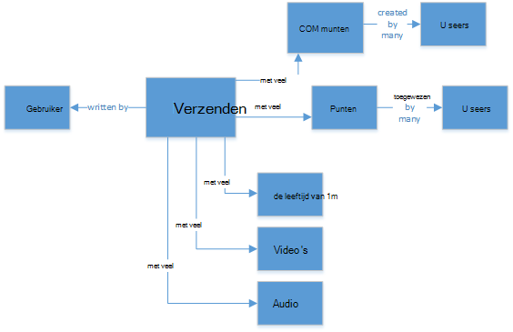

<properties
    pageTitle="Wanneer gebruikt u NoSQL versus SQL | Microsoft Azure"
    description="Vergelijk de voordelen van het gebruik van niet-relationele oplossingen NoSQL versus SQL-oplossingen. Meer informatie of een van de services van Microsoft Azure NoSQL of SQL Server best past bij uw scenario."
    keywords="nosql versus sql, NoSQL, sql versus nosql gebruiken"
    services="documentdb"
    documentationCenter=""
    authors="mimig1"
    manager="jhubbard"
    editor=""/>

<tags
    ms.service="documentdb"
    ms.workload="data-services"
    ms.tgt_pltfrm="na"
    ms.devlang="dotnet"
    ms.topic="article" 
    ms.date="06/24/2016"
    ms.author="mimig"/>

# NoSQL versus SQL

SQL Server- en relationele databases (RDBMS) zijn de go-to-databases voor meer dan 20 jaar. Meer nodig voor het verwerken van hogere volumes en rassen van gegevens in een snel tempo is echter de aard van de opslagbehoeften van gegevens voor toepassingsontwikkelaars gewijzigd. NoSQL databases kunnen slaan ongestructureerde en heterogene gegevens op schaal hebben om dit scenario, opgedaan in populariteit. 

NoSQL is een categorie van sterk uiteenlopende uit databases van SQL-databases. NoSQL wordt vaak gebruikt om te verwijzen naar gegevens beheersystemen die 'Niet SQL' of een benadering voor het beheer van 'niet alleen SQL' met. Er zijn een aantal technologieën in de categorie van NoSQL, met inbegrip van document databases, sleutelwaarde winkels kolom familie winkels en graph-databases populair bij games, sociale zijn, en IoT-toepassingen.

Het doel van dit artikel is kunt u meer informatie over de verschillen tussen NoSQL en SQL en bieden u een inleiding tot de NoSQL en SQL-aanbiedingen van Microsoft.  

## Wanneer gebruikt u NoSQL?

Bijvoorbeeld dat u bij het bouwen van een nieuwe site voor sociale betrokkenheid. Gebruikers kunnen advertenties maken en foto's, video's en muziek toevoegen aan hen. Andere gebruikers kunnen commentaar geven op de berichten en punten (positieve) om te beoordelen van de berichten geven. Een feed van advertenties die gebruikers kunnen delen en interactie met hebben de openingspagina. 

Hoe slaat u deze gegevens? Als u vertrouwd met SQL bent, kunt u beginnen met het tekenen iets dergelijks:

Dus helemaal goed, maar nu denkt over de structuur van een enkele post en het weer te geven. Als u wilt dat het bericht en de bijbehorende afbeeldingen, audio, video, opmerkingen, punten en gebruikersgegevens weergeven op een website of een toepassing, moet u voor het uitvoeren van een query met de tabel-joins acht om de inhoud ophalen. Stel nu een stroom van berichten die dynamisch worden geladen en weergegeven op het scherm en u kunt gemakkelijk voorspellen dat het gaat om duizenden van query's en veel koppelingen gebruikt om de taak te voltooien.

Nu kunt u een relationele als SQL Server-oplossing voor het opslaan van de gegevens - maar er is een andere optie, een optie voor NoSQL die de aanpak vereenvoudigt. Door het transformeren van de post in een JSON-document als volgt en in DocumentDB, een databaseservice Azure NoSQL document op te slaan kunt u de prestaties verbeteren en het hele bericht met een query en geen joins ophalen. Is het een eenvoudiger, meer eenvoudige manier en zodat meer tot gevolg hebben.

    {
        "id":"ew12-res2-234e-544f",
        "title":"post title",
        "date":"2016-01-01",
        "body":"this is an awesome post stored on NoSQL",
        "createdBy":User,
        "images":["http://myfirstimage.png","http://mysecondimage.png"],
        "videos":[
            {"url":"http://myfirstvideo.mp4", "title":"The first video"},
            {"url":"http://mysecondvideo.mp4", "title":"The second video"}
        ],
        "audios":[
            {"url":"http://myfirstaudio.mp3", "title":"The first audio"},
            {"url":"http://mysecondaudio.mp3", "title":"The second audio"}
        ]
    }

Bovendien kan deze gegevens worden gepartitioneerd door bericht-id waardoor de gegevens op natuurlijke wijze schaalt en profiteren van NoSQL schaal kenmerken. NoSQL systemen kunnen ook ontwikkelaars consistentie te versoepelen en bieden maximaal beschikbare apps.  Ten slotte, deze oplossing niet hoeft te definiëren, beheren en onderhouden van schema in de gegevenslaag voor snelle iteratie zodat ontwikkelaars.

U kunt vervolgens op deze oplossing met behulp van andere Azure services maken:

- [Azure zoeken](https://azure.microsoft.com/services/search/) kan via de web app waarmee gebruikers kunnen zoeken naar berichten worden gebruikt.
- [Azure App Services](https://azure.microsoft.com/services/app-service/) kunnen worden gebruikt als host voor toepassingen en achtergrondprocessen.
- [Azure Blob-opslag](https://azure.microsoft.com/services/storage/) kan worden gebruikt voor het opslaan van volledige gebruikersprofielen, met inbegrip van afbeeldingen.
- [Azure SQL-Database](https://azure.microsoft.com/services/sql-database/) kan worden gebruikt voor het opslaan van enorme hoeveelheden gegevens zoals aanmeldingsgegevens en gegevens voor gebruiksanalyse.
- [Azure Machine Learning](https://azure.microsoft.com/services/machine-learning/) kan maken van kennis en intelligentie die u kunt feedback geven aan het proces en de juiste inhoud bieden aan de juiste gebruikers worden gebruikt.

Deze site sociale betrokkenheid is één een scenario waarin een database NoSQL de juiste gegevens voor de taak is. Als u geïnteresseerd in het lezen meer over dit scenario en het model van uw gegevens van DocumentDB in sociale mediatoepassingen bent, Zie [sociale met DocumentDB gaan](documentdb-social-media-apps.md). 

## NoSQL versus SQL-vergelijking

De volgende tabel ziet de belangrijkste verschillen tussen NoSQL en SQL. 

Als een database NoSQL beste aan uw eisen voldoet, gaat u verder naar de volgende sectie voor meer informatie over de services NoSQL van Azure. Anders als een SQL-database beste aan uw behoeften voldoet, gaat u naar [Wat zijn de aanbiedingen van Microsoft SQL?](#what-are-the-microsoft-sql-offerings)

## Wat zijn de aanbiedingen van Microsoft Azure NoSQL?

Azure heeft vier volledig beheerd NoSQL services: 

- [Azure DocumentDB](https://azure.microsoft.com/services/documentdb/)
- [Azure tabelopslag](https://azure.microsoft.com/services/storage/)
- [Azure HBase als onderdeel van HDInsight](https://azure.microsoft.com/services/hdinsight/)
- [Cache bestand Vgx Azure.](https://azure.microsoft.com/services/cache/)

Het volgende diagram voor eigenschappenvergelijking kaarten van de belangrijkste differentiators voor elke service. Welke beste omschrijft de behoeften van uw toepassing? 

Als een of meer van deze services kan voldoen aan de behoeften van uw toepassing, weten met de volgende bronnen: 

- [DocumentDB leren pad](https://azure.microsoft.com/documentation/learning-paths/documentdb/) en [DocumentDB use-cases](documentdb-use-cases.md)
- [Aan de slag met Azure tabelopslag](../storage/storage-dotnet-how-to-use-tables.md)
- [Wat is HBase in HDInsight](../hdinsight/hdinsight-hbase-overview.md)
- [Bestand pad leren Cache Vgx.](https://azure.microsoft.com/documentation/learning-paths/redis-cache/)

Ga naar de [volgende stappen](#next-steps) voor de gratis proefperiode informatie.

## Wat zijn de aanbiedingen van Microsoft SQL?

Microsoft heeft vijf SQL-aanbiedingen: 

- [Azure SQL-Database](https://azure.microsoft.com/services/sql-database/)
- [SQL Server op Azure virtuele Machines](https://azure.microsoft.com/services/virtual-machines/sql-server/)
- [SQL Server](https://www.microsoft.com/server-cloud/products/sql-server-2016/)
- [Azure SQL datawarehouse (voorbeeld)](https://azure.microsoft.com/services/sql-data-warehouse/)
- [Analytics Platform System (toestel op ruimten)](https://www.microsoft.com/en-us/server-cloud/products/analytics-platform-system/)

Als u geïnteresseerd in SQL Server op een virtuele Machine of een SQL-Database bent, Lees [kiest u de optie SQL-Server van een wolk: Azure SQL (PaaS)-Database of SQL Server op Azure VMs (IaaS)](../sql-database/sql-database-paas-vs-sql-server-iaas.md) voor meer informatie over de verschillen tussen de twee.

Als SQL de beste optie lijkt, Ga naar [SQL Server](https://www.microsoft.com/server-cloud/products/) voor meer informatie over onze Microsoft SQL-producten en diensten hebben om aan te bieden.

Ga naar [volgende stappen](#next-steps) gratis trial en evaluatie.

## Volgende stappen

Wij nodigen u uit om meer te weten over onze producten SQL en NoSQL door ze gratis uitproberen van. 

- Voor alle Azure services, kunt u zich aanmelden voor een [gratis proefperiode van een maand](https://azure.microsoft.com/pricing/free-trial/) en ontvangen van $200 te besteden aan een van de Azure services.
    - [Azure DocumentDB](https://azure.microsoft.com/services/documentdb/)
    - [Azure HBase als onderdeel van HDInsight](https://azure.microsoft.com/services/hdinsight/)
    - [Cache bestand Vgx Azure.](https://azure.microsoft.com/services/cache/)
    - [Azure SQL datawarehouse (voorbeeld)](https://azure.microsoft.com/services/sql-data-warehouse/)
    - [Azure SQL-Database](https://azure.microsoft.com/services/sql-database/)
    - [Azure tabelopslag](https://azure.microsoft.com/services/storage/)

- Als u een [evaluatieversie van SQL Server 2016 op een virtuele machine](https://azure.microsoft.com/marketplace/partners/microsoft/sqlserver2016ctp33evaluationwindowsserver2012r2/) draaien of downloaden van een [evaluatieversie van SQL Server](https://www.microsoft.com/en-us/evalcenter/evaluate-sql-server-2016).
    - [SQL Server](https://www.microsoft.com/server-cloud/products/sql-server-2016/)
    - [SQL Server op Azure virtuele Machines](https://azure.microsoft.com/services/virtual-machines/sql-server/)

