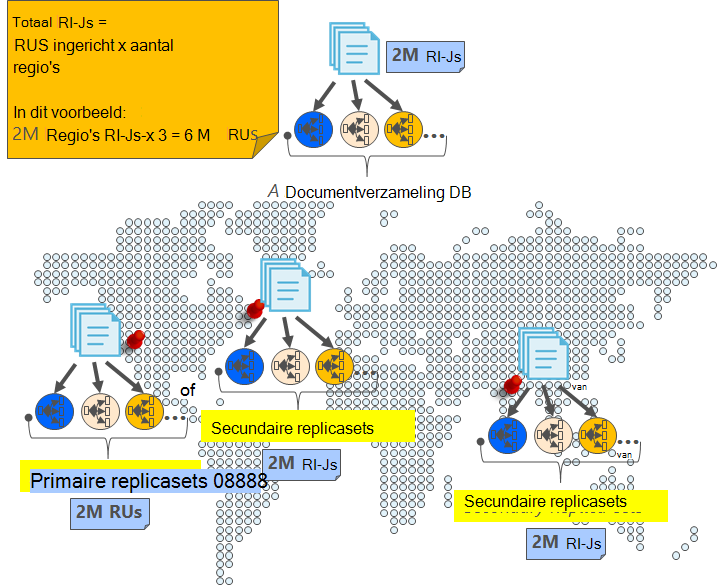

<properties
    pageTitle="Online back-up en terugzetten met DocumentDB | Microsoft Azure"
    description="Informatie over het uitvoeren van automatische back-up en het herstellen van databases met Azure DocumentDB NoSQL."
    keywords="back-up en terugzetten, online back-up"
    services="documentdb"
    documentationCenter=""
    authors="RahulPrasad16"
    manager="jhubbard"
    editor="monicar"/>

<tags
    ms.service="documentdb"
    ms.workload="data-services"
    ms.tgt_pltfrm="na"
    ms.devlang="multiple"
    ms.topic="article"
    ms.date="09/23/2016"
    ms.author="raprasa"/>

# Automatische online back-up en terugzetten met DocumentDB 

Azure DocumentDB wordt automatisch back-ups van al uw gegevens met regelmatige tussenpozen. De automatische back-ups worden genomen zonder dat de prestaties of de beschikbaarheid van uw activiteiten van NoSQL database. Uw back-ups worden afzonderlijk opgeslagen in een andere storage-service en deze back-ups wereldwijd voor een betere beveiliging tegen regionale rampen worden gerepliceerd. De automatische back-ups zijn bedoeld voor scenario's wanneer u uw verzameling DocumentDB per ongeluk verwijdert en later herstel van gegevens of een disaster recovery oplossing nodig.  

Dit artikel begint met een snelle recap van de redundantie van de gegevens en de beschikbaarheid in DocumentDB, en vervolgens back-ups. 

## Hoge beschikbaarheid met DocumentDB - een recap

DocumentDB is ontworpen om te worden [wereldwijd gedistribueerd](documentdb-distribute-data-globally.md) – u kunt schalen doorvoer via meerdere Azure gebieden met aangedreven transparant met meerdere homing API's en failover-beleid. Als een databasesysteem [99,99% beschikbaarheid Sla's](https://azure.microsoft.com/support/legal/sla/documentdb/v1_0/)bieden, zijn alle schrijfbewerkingen in DocumentDB naar lokale schijven door een quorum van replica's in een lokale datacenter nu duurzaam vastgelegd voordat de client zijn bevestigd. Houd er rekening mee dat de beschikbaarheid van de DocumentDB is afhankelijk van de lokale opslag en is niet afhankelijk van de opslagtechnologieën voor externe. Als uw databaseaccount gekoppeld aan meer dan één Azure regio is, worden uw schrijft bovendien gerepliceerd in andere regio's ook. Om de doorvoer en toegang tot gegevens op lage vertragingstijden schalen, kunt u laten zoals veel regio's die zijn gekoppeld aan de databaseaccount als u wilt lezen. In elke regio gelezen, wordt de gegevens (gerepliceerde) blijvend behouden in een replicaset.  

Zoals in het volgende diagram wordt geïllustreerd, is één DocumentDB collectie [horizontaal partitioneren](documentdb-partition-data.md). Een "partitie" wordt aangeduid met een rondje in het volgende diagram en elke partitie uiterst beschikbaar via een replicaset wordt gemaakt. Dit is de lokale distributie binnen één enkel Azure (aangeduid met de X-as). Verder, elke partitie (met de bijbehorende replicaset) vervolgens wereldwijd verdeeld is over meerdere regio's die zijn gekoppeld aan uw databaseaccount (bijvoorbeeld in deze afbeelding van de drie regio's – Oost-VS, US West en centraal-India). Deze "set" is een wereldwijd verspreide entiteit die bestaat uit meerdere exemplaren van uw gegevens in elke regio (aangeduid met de Y-as). Kunt u prioriteit toewijzen aan de regio's die zijn gekoppeld aan de databaseaccount van uw en DocumentDB zal transparant failover naar het volgende gebied in het geval van calamiteiten. U kunt ook handmatig failover de end-to-end-beschikbaarheid van uw toepassing testen als u wilt simuleren.  

De volgende afbeelding ziet u de hoge mate van redundantie met DocumentDB.

## Volledige, automatische, online back-ups

Oeps, ik heb verwijderd Mijn collectie of database! Met DocumentDB, niet alleen uw gegevens, maar de back-ups van uw gegevens zijn ook aangebracht in zeer redundante en robuuste regionale rampen. Deze geautomatiseerde back-ups zijn momenteel ongeveer elke vier uur genomen. 

De back-ups worden genomen zonder dat de prestaties of de beschikbaarheid van uw database-activiteiten. DocumentDB wordt de back-up op de achtergrond zonder uw ingerichte RUs verbruikt of de prestaties beïnvloeden en zonder dat de beschikbaarheid van de database NoSQL. 

In tegenstelling tot de gegevens die zijn opgeslagen in DocumentDB, de automatische back-ups opgeslagen in Azure Blob Storage-service. De momentopname van uw back-up te waarborgen van het lage latentie/efficiënte uploaden, is geüpload naar een exemplaar van Azure Blob-opslag in hetzelfde gebied, als het huidige gebied schrijven van uw account DocumentDB database. Voor betere beveiliging tegen regionale is elke momentopname van uw back-upgegevens in Azure Blob-opslag opnieuw gerepliceerd via geo-redundante opslag (GRS) naar een andere regio. In het volgende diagram ziet u dat de volledige DocumentDB-collectie (met alle drie primaire partities in westelijk Verenigde Staten, in dit voorbeeld) is een back-up op een externe rekening Azure Blob-opslag in West VS en GRS gerepliceerd naar Oost-VS. 

De volgende afbeelding ziet u periodieke volledige back-ups van alle entiteiten van de DocumentDB in GRS Azure opslag.

## De bewaarperiode voor een bepaalde opname

Zoals hierboven beschreven, we regelmatig momentopnamen van uw gegevens en per onze regelgeving, we blijven van de meest recente snapshot van 90 dagen voordat het uiteindelijk wordt verwijderd. Als een verzameling of een account is verwijderd, worden DocumentDB de laatste back-up opgeslagen gedurende 90 dagen.

## Database van de online back-up terugzetten

In het geval u uw gegevens per ongeluk verwijdert, kunt u [een support ticket bestand](https://portal.azure.com/?#blade/Microsoft_Azure_Support/HelpAndSupportBlade) of [Azure support bellen](https://azure.microsoft.com/support/options/) de gegevens van de laatste automatische back-up wilt terugzetten. Voor een specifieke momentopname van uw back-up wilt terugzetten, moet DocumentDB dat de gegevens ten minste beschikbaar was bij ons voor de duur van de cyclus back-up van die momentopname.

## Volgende stappen

Als u wilt uw database NoSQL in meerdere datacenters gerepliceerd, Zie [uw gegevens met de DocumentDB wereldwijd te verspreiden](documentdb-distribute-data-globally.md). 

Bestand contactpersoon Azure ondersteuning, [bestand een ticket vanaf de portal Azure](https://portal.azure.com/?#blade/Microsoft_Azure_Support/HelpAndSupportBlade).