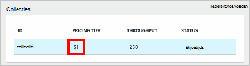
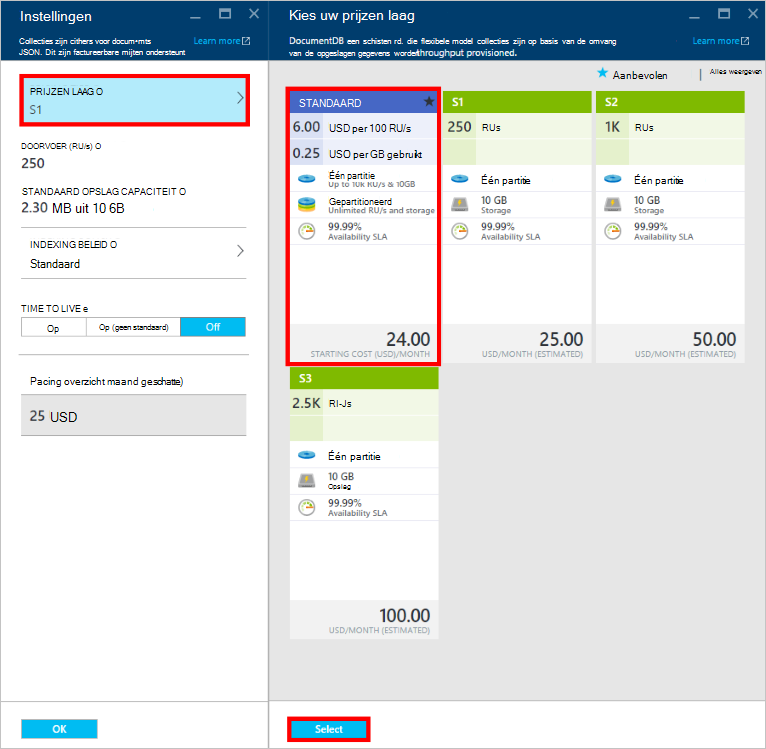
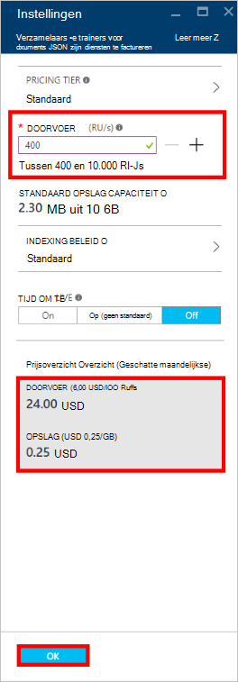
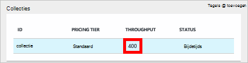

<properties
    pageTitle="Prestaties in DocumentDB | Microsoft Azure"
    description="Informatie over hoe de prestaties in DocumentDB u reserveren doorvoer op basis van per collectie."
    services="documentdb"
    authors="mimig1"
    manager="jhubbard"
    editor="monicar"
    documentationCenter=""/>

<tags
    ms.service="documentdb"
    ms.workload="data-services"
    ms.tgt_pltfrm="na"
    ms.devlang="na"
    ms.topic="article"
    ms.date="08/26/2016"
    ms.author="mimig"/>

# Prestaties in DocumentDB

Dit artikel bevat een overzicht van de prestaties in [Microsoft Azure DocumentDB](https://azure.microsoft.com/services/documentdb/).

Na het lezen van dit artikel, zult u de volgende vragen beantwoorden:  

-   Wat is een prestatieniveau?
-   Hoe is de doorvoer gereserveerd voor een databaseaccount?
-   Hoe werk ik met prestaties
-   Hoe ben ik gefactureerd voor prestaties

## Prestaties-inleiding

Elke collectie DocumentDB is gemaakt met een standaardaccount is ingericht met een bijbehorende prestatieniveau. Elke collectie in een database kunt hebben een andere prestaties zodat u meer doorvoer voor veelgebruikte collecties en minder doorvoer voor weinig gebruikte verzamelingen aanwijzen. DocumentDB ondersteunt beide prestatieniveaus door de gebruiker gedefinieerde en vooraf gedefinieerde prestaties.  

Elk prestatieniveau heeft een limiet van bijbehorende [verzoek eenheid (RU)](documentdb-request-units.md) . Dit is de doorvoer die wordt gereserveerd voor een collectie op basis van de prestaties, en is uitsluitend beschikbaar voor gebruik in die collectie.

<table border="0" cellspacing="0" cellpadding="0">
    <tbody>
        <tr>
            <td valign="top">

</td>
            <td valign="top">
Details
</td>
            <td valign="top">
Limieten voor doorvoer
</td>
            <td valign="top">
Opslagbeperkingen
</td>
            <td valign="top">
Versie
</td>
            <td valign="top">
API 's
</td>            
        </tr>
        <tr>
            <td valign="top">
Door de gebruiker gedefinieerde prestaties
</td>
            <td valign="top">
Opslag, gemeten op basis van gebruik in GB.

Doorvoer in eenheden van 100 RU/s
</td>
            <td valign="top">
Onbeperkt. 400 - 250.000 aanvragen eenheden/s-standaard (hogere op verzoek)
</td>
            <td valign="top">
Onbeperkt. 250 GB standaard (hogere op verzoek) 
</td>
            <td valign="top">
V2
</td>
            <td valign="top">
API 2015-12-16 en nieuwer
</td>  
        </tr>
        <tr>
            <td valign="top">
Vooraf gedefinieerde prestaties
</td>
            <td valign="top">
Opslag 10 GB is gereserveerd.

S1 = 250 RU/s S2 = 1000 RU/s, S3 = 2500 RU/s
</td>
            <td valign="top">
2500 RU/s
</td>
            <td valign="top">
10 GB
</td>
            <td valign="top">
V1
</td>
            <td valign="top">
Alle
</td>  
        </tr>        
    </tbody>
</table>                

DocumentDB kunnen een groot aantal databasebewerkingen, zoals query's, query's met door de gebruiker gedefinieerde functies (UDF's), opgeslagen procedures en triggers. De verwerkingskosten die is gekoppeld aan elk van deze bewerkingen wordt afhankelijk van de CPU, i/o en geheugen nodig om de bewerking te voltooien. In plaats daarvan van gedachten over en het beheer van hardwarebronnen, u kunt een aanvraag eenheid beschouwen als een enkele maateenheid voor de resources verschillende databasebewerkingen uitvoeren en vereist een aanvraag van toepassing.

Verzamelingen kunnen worden gemaakt via de [portal van Microsoft Azure](https://portal.azure.com), de [REST API](https://msdn.microsoft.com/library/azure/mt489078.aspx) of een van de [DocumentDB SDK's](https://msdn.microsoft.com/library/azure/dn781482.aspx). De APIs DocumentDB kunt u het prestatieniveau van een collectie opgeven.

> [AZURE.NOTE] Het prestatieniveau van een verzameling kan worden aangepast via de API's of op de [portal van Microsoft Azure](https://portal.azure.com/). Prestaties verandert worden naar verwachting op voltooid binnen 3 minuten.

## Prestaties van de instelling voor de collecties
Als een collectie is gemaakt, wordt de volledige toewijzing van de RUs op basis van het prestatieniveau van de van het aangewezen zijn gereserveerd voor de collectie.

Houd er rekening mee dat met beide niveaus prestaties door de gebruiker gedefinieerde en vooraf gedefinieerde DocumentDB op basis van reservering van doorvoer werkt. Als u een verzameling maakt, een toepassing is gereserveerd en wordt gefactureerd voor de gereserveerde doorvoer, ongeacht hoeveel van de doorvoer die actief wordt gebruikt. Door de gebruiker gedefinieerde prestatieniveaus opslag wordt gemeten op basis van verbruik, maar met vooraf gedefinieerde prestatieniveaus, 10 GB van opslag op het moment van het maken van een siteverzameling is gereserveerd.  

Nadat de verzamelingen worden gemaakt, kunt u het prestatieniveau van de door middel van de DocumentDB SDK's of via de klassieke Azure-Portal.

> [AZURE.IMPORTANT] DocumentDB standaard collecties worden gefactureerd tegen een uurtarief en elke collectie u maakt een rekening krijgt voor een minimaal één uur van gebruik.

Als u het prestatieniveau van een collectie binnen een uur aanpast, wordt u wordt gefactureerd voor het hoogste prestatieniveau instellen tijdens het uur. Bijvoorbeeld als u uw prestatieniveau voor een collectie om 8:53 am vergroot u brengt voor het nieuwe niveau vanaf 8:00 uur. Als u uw prestatieniveau om 8:53 am verlaagt, wordt ook het nieuwe tarief toegepast om 9:00 am.

Aanvraag eenheden zijn gereserveerd voor elke collectie op basis van de prestaties is ingesteld. Aanvraag eenheid consumptie wordt geëvalueerd als een per tweede tarief. Toepassingen die groter zijn dan het Eenheidstarief ingerichte verzoek (of de prestaties) voor een collectie wordt de snelheid totdat de snelheid lager is dan het niveau van de gereserveerde voor die collectie. Als uw toepassing een hoger niveau van doorvoer vereist, kunt u het prestatieniveau van de voor elke collectie verhogen.

> [AZURE.NOTE] Wanneer uw toepassing prestatieniveaus voor één of meerdere collecties overschrijdt, wordt de aanvragen op basis van per collectie snelheid. Dit betekent dat sommige aanvragen terwijl anderen kunnen de snelheid van de kans van slagen. Het is raadzaam om toe te voegen, een klein aantal nieuwe pogingen als de snelheid van het verwerken van pieken in het verkeer van de aanvraag.

## Werken met prestaties
DocumentDB verzamelingen kunnen u uw gegevens op basis van de patronen van de query en de prestatiebehoeften van uw toepassing. DocumentDB de automatische indexering en Queryondersteuning is vrij gebruikelijk bij heterogene documenten binnen dezelfde verzameling collocate. De belangrijke overwegingen bij de beslissing of afzonderlijke collecties moeten worden gebruikt, zijn:

- Query's – een collectie is de scope voor de uitvoering van de query. Als u over een reeks documenten opvragen, komen de meest efficiënte meer patronen van collocating documenten in één collectie.
- Transacties: alle transacties zijn binnen het bereik van binnen één collectie. Als u documenten die in één opgeslagen procedure of de trigger moeten worden bijgewerkt, moeten zij worden opgeslagen in dezelfde collectie. Meer in het bijzonder is de partitiesleutel van een binnen een collectie de rand van de transactie. Zie [partitionering in DocumentDB](documentdb-partition-data.md) voor meer informatie.
- Isolatie van prestaties – een collectie heeft een bijbehorende prestatieniveau. Dit zorgt ervoor dat elke collectie een voorspelbare prestaties door middel van gereserveerde RUs heeft. Gegevens kunnen worden toegewezen aan verschillende collecties, met verschillende prestatieniveaus, op basis van de frequentie van access.

> [AZURE.IMPORTANT] Het is belangrijk dat u begrijpt dat u volledige tarieven op basis van het aantal collecties gemaakt door uw toepassing wordt gefactureerd.

Het verdient aanbeveling dat uw toepassing maakt van een klein aantal collecties gebruiken tenzij u grote vereisten voor opslag of doorvoer. Zorg ervoor dat u hebt duidelijk patronen van toepassing voor het maken van nieuwe collecties. U kunt reserveren siteverzameling maken als management actie buiten uw toepassing verwerkt. Aanpassen van het prestatieniveau van de voor een verzameling verandert ook het uurtarief waarop de collectie wordt gefactureerd. Als uw toepassing deze dynamisch past moet u de collectie prestaties controleren.

## Wijzigen van S1, S2, S3 prestaties door de gebruiker gedefinieerde

Als volgt wijzigen met behulp van vooraf gedefinieerde doorvoer niveaus voor doorvoer door de gebruiker gedefinieerde niveaus in de portal Azure. Met behulp van de doorvoer door de gebruiker gedefinieerde niveaus kunt u de doorvoer aanpassen aan uw behoeften. En als u nog steeds een S1-account gebruikt, kunt u uw standaard doorvoersnelheid van 250 RU/s 400 RU (s) met een paar muisklikken verhogen.

Zie voor meer informatie over de prijzen met betrekking tot de door de gebruiker gedefinieerde en vooraf gedefinieerde doorvoer van wijzigingen, de blog boeken [DocumentDB: alles wat u weten moet over het gebruik van de nieuwe prijzen voor](https://azure.microsoft.com/blog/documentdb-use-the-new-pricing-options-on-your-existing-collections/).

> [AZURE.VIDEO changedocumentdbcollectionperformance]

1. Ga naar de [**Azure portal**](https://portal.azure.com)in uw browser.
2. Klik op **Bladeren** -> **DocumentDB Accounts**en selecteer vervolgens de DocumentDB-account te wijzigen.   
3. Selecteer de database te wijzigen in de lens **Databases** en in de blade **Database** selecteert u de verzameling te wijzigen. Met behulp van doorvoer vooraf gedefinieerde accounts hebben een prijzen laag van S1, S2 of S3.

      

4. Klik op **meer**, vervolgens de **Instellingen** op de bovenste balk in de blade **collecties** .   
5. In het blad **Instellingen** klikt u op **Prijzen laag** en de maandelijkse kostenraming voor elk plan in het blad **de prijzen laag kiezen** wordt weergegeven. Als u de doorvoer door de gebruiker gedefinieerde, klikt u op **standaard**en klik vervolgens op **selecteren** Sla de wijzigingen.

      

6. De **Prijzen laag** wordt gewijzigd in **standaard** terug in de blade **Instellingen** en de **doorvoer (RU/s)** wordt weergegeven met een standaardwaarde van 400. Instellen van de doorvoer tussen 400 en 10.000 [eenheden aanvragen](documentdb-request-units.md)/second (RU/s). De **Prijzen overzicht** onderaan de pagina wordt automatisch bijgewerkt met een schatting van de maandelijkse kosten. Klik op **OK** om uw wijzigingen te slaan.

    

7. U kunt controleren of de nieuwe doorvoer van de collectie weer in de **Database** -blade.

    

Als u vaststelt dat u meer doorvoer (meer dan 10.000 RU/s) of meer opslagruimte moet (groter dan 10GB) kunt u een gepartitioneerde collectie. Zie maken van een gepartitioneerde collectie [een collectie maken](documentdb-create-collection.md).

>[AZURE.NOTE] Niveau van de prestaties van een collectie wijzigen kan maximaal 2 minuten duren.

## Met de .NET SDK prestaties wijzigen

Een andere optie voor het wijzigen van de prestaties collecties is via onze SDK's. Deze sectie bevat alleen prestatieniveau van een collectie met behulp van onze [.NET SDK](https://msdn.microsoft.com/library/azure/dn948556.aspx)wijzigen, maar het proces is vergelijkbaar voor onze andere [SDK's](https://msdn.microsoft.com/library/azure/dn781482.aspx). Als u met onze .NET SDK bent, ga dan naar onze [zelfstudie aan de slag](documentdb-get-started.md).

Hier is een stukje code voor het wijzigen van de doorvoer van het voorstel tot 50.000 aanvraag eenheden per seconde:

    //Fetch the resource to be updated
    Offer offer = client.CreateOfferQuery()
                      .Where(r => r.ResourceLink == collection.SelfLink)    
                      .AsEnumerable()
                      .SingleOrDefault();

    // Set the throughput to 5000 request units per second
    offer = new OfferV2(offer, 5000);

    //Now persist these changes to the database by replacing the original resource
    await client.ReplaceOfferAsync(offer);

    // Set the throughput to S2
    offer = new Offer(offer);
    offer.OfferType = "S2";

    //Now persist these changes to the database by replacing the original resource
    await client.ReplaceOfferAsync(offer);

> [AZURE.NOTE] Collecties ingericht met onder 10.000 aanvraag eenheden per kunnen tweede worden gemigreerd tussen aanbiedingen met doorvoer door de gebruiker gedefinieerde en vooraf gedefinieerde doorvoer (S1, S2, S3) op elk gewenst moment. Verzamelingen die zijn ingericht met boven 10.000 aanvraag eenheden per kunnen niet tweede worden geconverteerd naar vooraf gedefinieerde doorvoer niveaus.

Ga naar [MSDN](https://msdn.microsoft.com/library/azure/microsoft.azure.documents.client.documentclient.aspx) meer voorbeelden bekijken en meer informatie over onze methoden bieden:

- [**ReadOfferAsync**](https://msdn.microsoft.com/library/azure/microsoft.azure.documents.client.documentclient.readofferasync.aspx)
- [**ReadOffersFeedAsync**](https://msdn.microsoft.com/library/azure/microsoft.azure.documents.client.documentclient.readoffersfeedasync.aspx)
- [**ReplaceOfferAsync**](https://msdn.microsoft.com/library/azure/microsoft.azure.documents.client.documentclient.replaceofferasync.aspx)
- [**CreateOfferQuery**](https://msdn.microsoft.com/library/azure/microsoft.azure.documents.linq.documentqueryable.createofferquery.aspx)

## De doorvoer van een collectie wijzigen

Als u al aangepaste prestaties, kunt u de doorvoer van de collectie door het volgende te doen. Als u wijzigen van een prestatieniveau S1, S2 of S3 (vooraf gedefinieerde prestaties) in door de gebruiker gedefinieerde prestaties wilt, [wijziging van S1, S2, S3 prestaties door de gebruiker gedefinieerde](#changing-performance-levels-using-the-azure-portal)zien.

1. Ga naar de [**Azure portal**](https://portal.azure.com)in uw browser.
2. Klik op **Bladeren** -> **DocumentDB Accounts**en selecteer vervolgens de DocumentDB-account te wijzigen.   
3. Selecteer de database te wijzigen op de blade **DocumentDB account** in de lens **Databases** en in de blade **Database** selecteert u de verzameling te wijzigen.
4. Klik op **Instellingen** op de bovenste balk in de blade **collecties** .   
5. Verhoog de waarde in het vak **doorvoer (RU/s)** en klik vervolgens op **OK** , sla de wijzigingen in de blade **Instellingen** . **Overzicht prijzen** onderaan in de blade-updates naar de nieuwe Geschatte maandelijkse kosten van die collectie weergeven in een bepaalde regio.

    

Als u niet zeker weet hoeveel je moet de doorvoer te verhogen, Zie [Estimating doorvoer moet](documentdb-request-units.md#estimating-throughput-needs) en [eenheid Rekenmachine aanvragen](https://www.documentdb.com/capacityplanner).

## Volgende stappen

Voor meer informatie over de prijs en het beheren van gegevens met Azure DocumentDB, Verken deze bronnen:

- [DocumentDB prijzen](https://azure.microsoft.com/pricing/details/documentdb/)
- [DocumentDB capaciteit beheren](documentdb-manage.md)
- [Modellering van gegevens in DocumentDB](documentdb-modeling-data.md)
- [Partitioneren van gegevens in DocumentDB](documentdb-partition-data.md)
- [Aanvraag eenheden](http://go.microsoft.com/fwlink/?LinkId=735027)

Zie voor meer informatie over DocumentDB, de DocumentDB Azure- [documentatie](https://azure.microsoft.com/documentation/services/documentdb/).

Zie [prestaties en schaal met Azure DocumentDB testen](documentdb-performance-testing.md)aan de slag met schaal en prestaties testen met DocumentDB.

[1]: ./media/documentdb-performance-levels/documentdb-change-collection-performance7-9.png
[2]: ./media/documentdb-performance-levels/documentdb-change-collection-performance10-11.png
