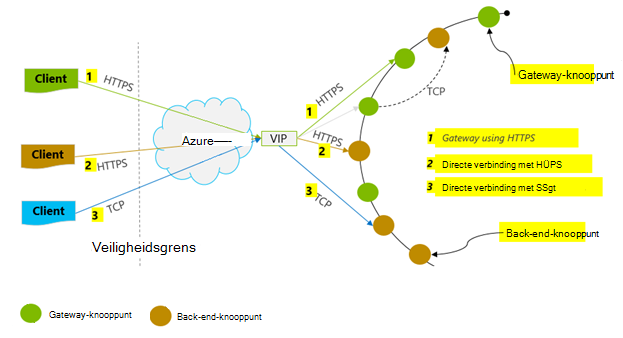
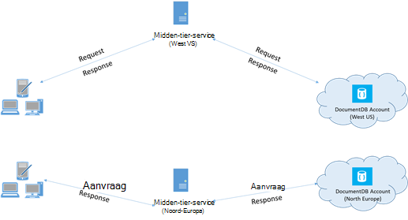

<properties 
    pageTitle="Tips voor betere prestaties van DocumentDB | Microsoft Azure" 
    description="Meer informatie over configuratieopties client Azure DocumentDB databaseprestaties te verbeteren"
    keywords="het verbeteren van de prestaties van de database"
    services="documentdb" 
    authors="mimig1" 
    manager="jhubbard" 
    editor="" 
    documentationCenter=""/>

<tags 
    ms.service="documentdb" 
    ms.workload="data-services" 
    ms.tgt_pltfrm="na" 
    ms.devlang="na" 
    ms.topic="article" 
    ms.date="10/17/2016" 
    ms.author="mimig"/>

# Tips voor betere prestaties voor DocumentDB

Azure DocumentDB is een snelle en flexibele gedistribueerde database die schaalbaar is naadloos met gegarandeerde latentie en doorvoer. U beschikt niet over grote architectuur of complexe code schrijven om te schalen, de database met DocumentDB. Omhoog en omlaag te schalen is net zo eenvoudig als het maken van een enkele API-aanroep of [SDK-methode aangeroepen](documentdb-performance-levels.md#changing-performance-levels-using-the-net-sdk). Omdat DocumentDB wordt benaderd via het netwerk oproepen zijn er echter client-side optimalisatie die kunt u optimale prestaties te bereiken.

Dus als u vraagt "Hoe verbeter ik de prestaties van de database?" Houd rekening met de volgende opties:

## Netwerken

1. **Verbindingsbeleid: directe verbinding-modus gebruiken**
    
    Hoe een client verbinding maakt met Azure DocumentDB heeft belangrijke gevolgen voor de prestaties, met name wat betreft de waargenomen vertraging van client-side. Er zijn twee belangrijke configuratie-instellingen beschikbaar voor het configureren van de client verbindingsbeleid de verbinding *modus* en de [verbinding *protocol*](#connection-protocol).  De twee modi beschikbaar zijn:

    1. Gateway-modus (standaard)
    2. Directe modus

    DocumentDB is een gedistribueerde opslagsysteem, DocumentDB bronnen zoals collecties op veel computers zijn gepartitioneerd en elke partitie wordt gerepliceerd voor hoge beschikbaarheid. De logische vertaling fysiek adres wordt bewaard in een routeringstabel ook intern als een resource beschikbaar is.

    In de modus van de Gateway uitvoeren de gateway DocumentDB machines dit bewerkingsplan, waardoor de clientcode worden eenvoudig en compact. Aanvragen voor verleent een clienttoepassing aan de DocumentDB gateway machines, de logische URI in de aanvraag voor het fysieke adres van het knooppunt backend vertalen en zendt de aanvraag op de juiste manier.  Omgekeerd, in de directe modus clients moeten onderhouden – en periodiek vernieuwen: een kopie van deze routeringstabel en vervolgens rechtstreeks verbinding maken met de back-end DocumentDB knooppunten.

    Gateway-modus wordt ondersteund op alle platforms van SDK en de geconfigureerde standaard.  Als uw toepassing wordt uitgevoerd binnen een bedrijfsnetwerk met firewall strikte beperkingen, is Gateway-modus de beste keuze, omdat de standaard-HTTPS-poort en een enkelvoudig eindpunt gebruikt. De prestatie-verhouding is echter dat Gateway modus betrekking heeft op een netwerk extra hop telkens wanneer gegevens worden gelezen of geschreven naar DocumentDB.   Daarom biedt directe modus betere prestaties omdat minder netwerk hops.

2. **Verbindingsbeleid: het TCP-protocol gebruiken**

    Bij het gebruik van directe modus, zijn er twee protocolopties beschikbaar:

    - TCP
    - HTTPS

    DocumentDB biedt een eenvoudige en open RESTful programmeermodel via HTTPS. Daarnaast biedt een efficiënte TCP-protocol, dat ook RESTful in haar mededeling model en is beschikbaar via de .NET client SDK. Zowel directe TCP als HTTPS SSL gebruiken voor eerste verificatie en codering van verkeer. Gebruik indien mogelijk het TCP-protocol voor de beste prestaties. 

    Wanneer u TCP gebruikt in de modus voor Gateway, TCP-poort 443 is de poort DocumentDB en 10250 is de poort MongoDB-API. Wanneer u TCP gebruikt in de directe modus, naast de Gateway-poorten, moet u ervoor zorgen de poort bereik tussen 10000 en 20000 is geopend, omdat DocumentDB dynamische TCP-poorten gebruikt. Als deze poorten niet geopend zijn en u probeert om TCP te gebruiken, ontvangt u een Service niet beschikbaar is 503-fout. 

    De modus verbinding is tijdens de bouw van het DocumentClient exemplaar met de parameter ConnectionPolicy geconfigureerd. Als de modus Direct wordt gebruikt, kan het Protocol ook worden ingesteld in de parameter ConnectionPolicy.

        var serviceEndpoint = new Uri("https://contoso.documents.net");
        var authKey = new "your authKey from Azure Mngt Portal";
        DocumentClient client = new DocumentClient(serviceEndpoint, authKey, 
        new ConnectionPolicy
        {
            ConnectionMode = ConnectionMode.Direct,
            ConnectionProtocol = Protocol.Tcp
        });

    Omdat TCP wordt alleen ondersteund in de directe modus als Gateway-modus wordt gebruikt, het HTTPS-protocol wordt altijd gebruikt om te communiceren met de Gateway en de waarde van het Protocol in de ConnectionPolicy wordt genegeerd.

    

3. **Bel OpenAsync om te voorkomen dat opstarten latentie op eerste verzoek**

    De eerste aanvraag wordt een hogere latentie hebben omdat deze voor het ophalen van de routeringstabel adres heeft. Om te voorkomen dat deze latentie is gestart op het eerste verzoek, moet u OpenAsync() als volgt aanroepen eenmaal tijdens de initialisatie.

        await client.OpenAsync();

4. **Collocate-clients in hetzelfde gebied van Azure voor prestaties**

    Indien mogelijk, plaats alle aanroepen van DocumentDB in hetzelfde gebied, als de database DocumentDB toepassingen. Voor een geschatte vergelijking aanroepen van DocumentDB in dezelfde regio worden voltooid binnen 1-2 ms, maar is de wachttijd tussen de oostkust van de Verenigde Staten en West > 50 ms. Deze wachttijd kan waarschijnlijk om vragen variëren afhankelijk van de route die het verzoek zoals dit wordt vanaf de client aan de grens Azure datacenter doorgegeven. De laagst mogelijke vertraging wordt bereikt door ervoor te zorgen dat de aanroepende toepassing zich bevindt binnen dezelfde Azure regio als het eindpunt in ingerichte DocumentDB. Voor een lijst van beschikbare regio's Zie [Regio's Azure](https://azure.microsoft.com/regions/#services).

    

5. **Verhoog het aantal threads/taken**

    Omdat aanroepen van DocumentDB via het netwerk worden aangebracht, moet u kan variëren van de mate van parallellisme van de aanvragen, zodat de clienttoepassing besteedt heel weinig tijd wachten tussen aanvragen. Stel dat u gebruikt. NET van [Taak parallelle bibliotheek](https://msdn.microsoft.com//library/dd460717.aspx), maakt de 100s van taken lezen of schrijven naar DocumentDB.

## Gebruik van de SDK

1. **Installeer de meest recente SDK**

    De DocumentDB SDK's worden voortdurend worden verbeterd om de beste prestaties te bieden. Zie de [SDK van DocumentDB's](documentdb-sdk-dotnet.md) bepalen de meest recente SDK en verbeteringen te bekijken. 

2. **Een singleton DocumentDB client voor de levensduur van uw toepassing gebruiken**
  
    Houd er rekening mee dat elk exemplaar DocumentClient thread-veilige en efficiënte Verbindingsbeheer en het adres in de cache opslaan in directe modus uitvoert. Als u efficiënt beheer en betere prestaties door DocumentClient, verdient het gebruik van één exemplaar van de DocumentClient per AppDomain gedurende de levensduur van de toepassing.

3. **System.Net MaxConnections per host verhogen**

    DocumentDB aanvragen via HTTPS/REST standaard worden gemaakt en worden onderworpen aan de verbindingslimiet standaard per hostnaam of het IP-adres. Wellicht moet u de MaxConnections ingesteld op een hogere waarde (100-1000) zodat de clientbibliotheek van meerdere gelijktijdige verbindingen met DocumentDB gebruikmaken kan. In de SDK voor .NET 1.8.0 en boven de standaardwaarde voor [ServicePointManager.DefaultConnectionLimit](https://msdn.microsoft.com/library/system.net.servicepointmanager.defaultconnectionlimit.aspx) is 50 en de waarde wilt wijzigen, kunt u de [Documents.Client.ConnectionPolicy.MaxConnectionLimit](https://msdn.microsoft.com/en-us/library/azure/microsoft.azure.documents.client.connectionpolicy.maxconnectionlimit.aspx) instellen op een hogere waarde.  

4. **Parallelle query's voor de gepartitioneerde collecties afstemmen**

     DocumentDB .NET SDK versie 1.9.0 en meer ondersteuning voor parallelle query's waarmee u kunt een query uitvoeren op een gepartitioneerde collectie parallel (Zie [werken met de SDK's](documentdb-partition-data.md#working-with-the-sdks) en de bijbehorende [codevoorbeelden](https://github.com/Azure/azure-documentdb-dotnet/blob/master/samples/code-samples/Queries/Program.cs) voor meer informatie). Parallelle query's zijn ontworpen voor het verbeteren van Querylatentie en doorvoer via de seriële pendant. Parallelle query's bieden twee parameters die u gebruikers afstemmen kunnen om hun behoeften, MaxDegreeOfParallelism (a) aangepast aanpassen: bepalen het maximum aantal partities dan kunnen worden opgezocht in een parallelle en (b) MaxBufferedItemCount: het aantal vooraf opgehaalde resultaten. 
    
    (a) ***afstemmen MaxDegreeOfParallelism\: *** 
    parallelle query werkt via query's in meerdere partities parallel. Gegevens van een afzonderlijke gepartitioneerde verzamelen is echter serie ten opzichte van de query opgehaald. Dus heeft de MaxDegreeOfParallelism op het aantal partities de maximale kans op de meeste query zodat, mits aan alle voorwaarden van andere systeem hetzelfde blijven. Als u het aantal partities niet weet, kunt u de MaxDegreeOfParallelism instellen op een hoge waarde en het systeem kiest de minimale (aantal partities, invoer van de gebruiker opgegeven) als de MaxDegreeOfParallelism. 
    
    Het is belangrijk te weten dat de parallelle query's de beste voordelen opleveren als de gegevens gelijkmatig wordt verdeeld over alle partities van de query. Als de gepartitioneerde collectie zodanig dat alle of een meerderheid van de gegevens die zijn geretourneerd door een query is geconcentreerd in een paar partities (één partitie in het ergste geval), dan zou de prestaties van de query door deze partities worden knelpunt is gepartitioneerd. 
    
    (b) ***afstemmen MaxBufferedItemCount\: *** 
    parallelle query is ontworpen voor het vooraf ophalen van resultaten terwijl de huidige batch van de resultaten wordt door de client verwerkt. Het vooraf ophalen kunt u in de algehele verbetering van de latentie van een query. MaxBufferedItemCount is de parameter om de hoeveelheid vooraf opgehaalde resultaten te beperken. MaxBufferedItemCount met het verwachte aantal resultaten (of een hoger nummer heeft) kan de query voor het ontvangen van kan profiteren van het vooraf ophalen. 
    
    Houd er rekening mee dat werkt op dezelfde wijze ongeacht de MaxDegreeOfParallelism vooraf ophalen en er een enkele buffer voor de gegevens op alle partities is.  

5. **Server-side GC inschakelen**
    
    Vermindering van de frequentie van de garbage collector kan in sommige gevallen helpen. Stel [gcServer](https://msdn.microsoft.com/library/ms229357.aspx) op true in .NET.

6. **Backoff tussenpozen RetryAfter implementeren**
 
    Tijdens het testen van de prestaties, moet u belasting verhogen totdat de snelheid van een klein aantal aanvragen ophalen. Als de snelheid, moet de clienttoepassing backoff op gashendel voor interval voor nieuwe pogingen server opgegeven. Met inachtneming van het backoff zorgt ervoor dat u besteedt aan het minimale bedrag van tijd wachten tussen nieuwe pogingen. Ondersteuning voor Groepsbeleid opnieuw is opgenomen in versie 1.8.0 en van de DocumentDB [.NET](documentdb-sdk-dotnet.md) , [Java](documentdb-sdk-java.md)en versie 1.9.0 en hoger van [Node.js](documentdb-sdk-node.md) en [Python](documentdb-sdk-python.md). Zie [gereserveerde doorvoer Exceeding beperkt](documentdb-request-units.md#exceeding-reserved-throughput-limits) en [RetryAfter](https://msdn.microsoft.com/library/microsoft.azure.documents.documentclientexception.retryafter.aspx)voor meer informatie.

7. **Schaal van de werkbelasting van de client**

    Als u op een hoge doorvoersnelheid niveau testen wilt (> 50.000 RU/s), de clienttoepassing het knelpunt vanwege de machine plafond dat uit op een netwerk of CPU-gebruik kan worden. Als u dit punt bereikt, kunt u blijven om de account DocumentDB verder door een geschaalde uitbreiding van uw client-toepassingen over meerdere servers.

8. **Lagere latentie voor lezen document URI's in cache**

    Document URI's zo veel mogelijk voor de beste prestaties voor het lezen in de cache.

9. **Het paginaformaat voor query's / lezen feeds voor betere prestaties afstemmen**

    Bij het uitvoeren van een bulk lezen van documenten lezen met feed-functionaliteit (bijvoorbeeld ReadDocumentFeedAsync) of bij de afgifte van een DocumentDB SQL-query, de resultaten worden weergegeven in een gesegmenteerde manier als de resultaatset te groot is. Standaard worden de resultaten weergegeven in brokken van 100 objecten of 1 MB, ongeacht welke limiet is bereikt, wordt eerst. 

    Ter vermindering van het aantal netwerk-retouren vereist om alle van toepassing zijnde resultaten te halen, kunt u het formaat van de x-ms-max-artikel-aantal aanvraagheader tot maximaal 1000 met verhogen. In gevallen waarin u moet alleen een paar resultaten bijvoorbeeld als de gebruiker interface of een toepassing de API geeft slechts 10 resultaten een keer, u kunt ook het formaat van de tot en met 10 verminderen de doorvoer verbruikt voor leesbewerkingen en query's verlagen.

    U kunt ook het formaat van de met behulp van de beschikbare DocumentDB SDK's instellen.  Bijvoorbeeld:
    
        IQueryable<dynamic> authorResults = client.CreateDocumentQuery(documentCollection.SelfLink, "SELECT p.Author FROM Pages p WHERE p.Title = 'About Seattle'", new FeedOptions { MaxItemCount = 1000 });

10. **Verhoog het aantal threads/taken**

    Zie [verhoogt u het aantal threads/taken](#increase-threads) in de sectie Networking.

## Indexering van beleid

1. **Lazy indexeren voor snellere opname tarieven van de piek tijd gebruiken**

    DocumentDB kunt u opgeven: op het niveau van – een indexing-beleid u kiezen kunt als u wilt dat de documenten in een collectie worden automatisch geïndexeerd of niet.  Daarnaast kunt u ook tussen (consistente) synchrone en asynchrone (Lazy) index-updates. De index wordt standaard synchroon bijgewerkt op elke invoegen, vervangen of verwijderen van een document aan de collectie. Synchroon kunnen modus de query's ingaan op hetzelfde [niveau van samenhang](documentdb-consistency-levels.md) als die van het document leest zonder enige vertraging voor de index ' achterhalen '.
    
    Lazy indexering kan worden overwogen voor scenario's waarin gegevens in bursts is geschreven en u wilt aflossen van de werkzaamheden die nodig zijn om de inhoud van de index over een langere periode van tijd. Lazy indexeren kunt u efficiënt gebruik van uw ingerichte doorvoer en schrijfopdrachten dienen tijdens piekuren met minimale vertraging. Het is belangrijk op te merken echter dat bij vertraagd indexeren is ingeschakeld, query-resultaten uiteindelijk consistent ongeacht het niveau consistentie is geconfigureerd voor de account DocumentDB worden.

    Daarom consistente indexing modus (IndexingPolicy.IndexingMode is ingesteld op consistente) maakt de hoogste aanvraag eenheidstoeslag per schrijven tijdens het indexeren modus (IndexingPolicy.IndexingMode is ingesteld op Lazy) en geen indexering Lazy (IndexingPolicy.Automatic is ingesteld op False) hebben nul indexing kosten op het moment van schrijven.

2. **Niet-gebruikte paden uitsluiten van het indexeren voor snellere schrijft**

    DocumentDB van de indexing-beleid kunt u opgeven welke paden van het document wilt opnemen of uitsluiten van indexering door gebruik te maken van indexering paden (IndexingPolicy.IncludedPaths en IndexingPolicy.ExcludedPaths). Het gebruik van indexing paden kunt schrijven voor betere prestaties en lagere index opslag voor scenario's waarin de query patronen tevoren bekend aanbieden als indexing kosten rechtstreeks worden gecorreleerd met het aantal unieke paden geïndexeerd.  Bijvoorbeeld ziet de volgende code u hoe een hele sectie van de documenten (ook uitsluiten een substructuur) indexeren via de "*" jokertekens.

        var collection = new DocumentCollection { Id = "excludedPathCollection" };
        collection.IndexingPolicy.IncludedPaths.Add(new IncludedPath { Path = "/*" });
        collection.IndexingPolicy.ExcludedPaths.Add(new ExcludedPath { Path = "/nonIndexedContent/*");
        collection = await client.CreateDocumentCollectionAsync(UriFactory.CreateDatabaseUri("db"), excluded);

    Zie [beleid voor het indexeren van DocumentDB](documentdb-indexing-policies.md)voor meer informatie.

## Doorvoer

1. **Meten en afstemmen voor lagere eenheden per seconde gebruik**

    DocumentDB biedt een groot aantal databasebewerkingen, waaronder relationele en hiërarchische query's met UDF's, opgeslagen procedures en triggers – alle operationele op de documenten in de collectie van een database. De kosten die verbonden zijn met elk van deze bewerkingen zijn afhankelijk van de CPU, i/o en geheugen nodig om de bewerking te voltooien. Niet na te denken over en beheer van hardwarebronnen, kunt u een aanvraag eenheid (RU) beschouwen als één maatregel voor de resources die zijn vereist voor het uitvoeren van verschillende databasebewerkingen en een aanvraag voor service.

    [Aanvraag eenheden](documentdb-request-units.md) zijn ingericht voor elke database op basis van het aantal eenheden voor capaciteit die u koopt. Aanvraag eenheid consumptie wordt geëvalueerd als een tarief per seconde. Toepassingen die hoger zijn dan het verzoek ingerichte eenheid voor hun account beperkt is tot de snelheid lager is dan het niveau van de gereserveerd voor de account. Als uw toepassing een hoger niveau van doorvoer vereist, kunt u extra capaciteitseenheden kopen.

    De complexiteit van een query heeft gevolgen voor het aantal eenheden van de aanvraag voor een bewerking worden verbruikt. Het aantal predikaten, aard van de predikaten, aantal UDF's en de grootte van de bron-gegevensset die alle van invloed zijn op de kosten van de query.

    Voor het meten van de overhead van een bewerking (maken, bijwerken of verwijderen) de header x ms-aanvraag gratis controleren (of gelijkwaardige RequestCharge in ResourceResponse<T> of FeedResponse<T> in de SDK voor .NET) voor het meten van het aantal eenheden van aanvraag worden gebruikt door deze bewerkingen.

        // Measure the performance (request units) of writes
        ResourceResponse<Document> response = await client.CreateDocumentAsync(collectionSelfLink, myDocument);
        Console.WriteLine("Insert of document consumed {0} request units", response.RequestCharge);
        // Measure the performance (request units) of queries
        IDocumentQuery<dynamic> queryable = client.CreateDocumentQuery(collectionSelfLink, queryString).AsDocumentQuery();
        while (queryable.HasMoreResults)
             {
                  FeedResponse<dynamic> queryResponse = await queryable.ExecuteNextAsync<dynamic>();
                  Console.WriteLine("Query batch consumed {0} request units", queryResponse.RequestCharge);
             }
        
    De aanvraag voor kosten die in deze header wordt geretourneerd is een deel van de ingerichte doorvoer (dat wil zeggen, de RUs 2000 / seconde). Als de bovenstaande query 1000 1KB documenten retourneert, wordt de kosten van de bewerking bijvoorbeeld 1000. Als zodanig binnen één seconde respecteert de server slechts twee dergelijke aanvragen voordat de volgende aanvragen te beperken. Zie voor meer informatie [aanvraag eenheden](documentdb-request-units.md) en de [aanvraag eenheid Rekenmachine](https://www.documentdb.com/capacityplanner).

2. **Ingang tarief te beperken/verzoek tarief te groot**

    Wanneer een client probeert om meer dan de gereserveerde doorvoer voor een account, zijn er geen vertragingen op de server en geen gebruik van doorvoercapaciteit boven gereserveerd. De server wordt preemptively beëindigen van de aanvraag met RequestRateTooLarge (HTTP-statuscode 429) en geven de x-ms-opnieuw-na-ms-header die de tijdsduur in milliseconden, die de gebruiker wachten moet alvorens nogmaals te proberen het verzoek aangeeft.
 
        HTTP Status 429,
        Status Line: RequestRateTooLarge
        x-ms-retry-after-ms :100

    De SDK's alle impliciet werkelijk dit antwoord, met inachtneming van de server opgegeven opnieuw na de kop en de aanvraag opnieuw. Tenzij uw account is gelijktijdig door meerdere clients wordt geopend, wordt de volgende poging mislukt.

    Als er meer dan één client cumulatief consistent werken boven de aanvraagsnelheid, het aantal nieuwe pogingen van standaard ingesteld op 9 intern door de client niet toereikend zijn; in dit geval genereert de client een DocumentClientException met statuscode 429 aan de toepassing. Het aantal standaard opnieuw kan worden gewijzigd door de RetryOptions op de ConnectionPolicy instantie. Standaard wordt de DocumentClientException met statuscode 429 geretourneerd na een cumulatieve wachttijd van 30 seconden als verzoek blijft werken boven de aanvraagsnelheid. Dit gebeurt zelfs wanneer het huidige aantal nieuwe pogingen kleiner is dan het aantal maximum aantal nieuwe pogingen, is dit de standaardinstelling van 9 of een door de gebruiker gedefinieerde waarde.

    Terwijl het probleem automatisch opnieuw kan worden verbeterd tolerantie en bruikbaarheid voor de meeste toepassingen, deze mogelijk geleverd in odds bij het uitvoeren van prestatiebenchmarks voor, met name bij het meten van latentie.  De client waargenomen vertraging zal oploopt als het experiment de gashendel server raakt en zorgt ervoor dat de client-SDK stil opnieuw uit te voeren. Voorkom latentie pieken tijdens experimenten prestaties meten de toeslag die wordt geretourneerd door elke bewerking en zorg ervoor aanvragen werkt onder het tarief van de gereserveerde aanvraag. Zie [eenheden aanvragen](documentdb-request-units.md)voor meer informatie.
   
3. **Ontwerp voor kleinere documenten voor hogere doorvoer**

    De aanvraag toeslag (dat wil zeggen de verwerkingskosten) van een bepaalde bewerking is direct gerelateerd aan de grootte van het document. Bewerkingen op grote documenten kosten meer dan voor kleine documenten.

## Niveaus samenhang

1. **Zwakkere consistentie niveaus gebruiken voor betere gelezen vertragingstijden**

    Een andere belangrijke factor om rekening te houden bij het afstemmen van de prestaties van toepassingen DocumentDB is consistent niveau. De keuze van de consistentie heeft gevolgen voor prestaties voor lees- en schrijfbewerkingen. Kunt u het standaardniveau voor de consistentie van de databaseaccount en het niveau van de gekozen consistentie is van toepassing op alle collecties (langs alle databases) binnen de account DocumentDB. In termen van schrijfbewerkingen, is het effect van de wijziging consistent niveau waargenomen als wachttijd van aanvraag. Sterkere coherentie niveaus worden gebruikt, verhoogt vertragingstijden schrijven. Aan de andere kant is de invloed van het niveau van de consistentie voor leesbewerkingen waargenomen in termen van doorvoer. Zwakkere consistentie van hogere niveaus niet alleen lezen doorvoersnelheid door de client worden gerealiseerd.

    Standaard worden alle leesbewerkingen en query's die worden uitgegeven tegen de door de gebruiker gedefinieerde bronnen het standaardniveau voor consistentie in de databaseaccount opgegeven gebruiken. U kunt echter het niveau van de consistentie van een aanvraag voor een specifieke lezen/query door te geven de x-ms-consistentie-niveau verzoek-header verlagen. Zie [consistentie niveaus in DocumentDB](documentdb-consistency-levels.md)voor meer informatie.

## Volgende stappen

Zie voor een voorbeeldtoepassing gebruikt voor het evalueren van DocumentDB voor krachtige scenario's op een aantal clientcomputers, [prestaties en testen met Azure DocumentDB schaal](documentdb-performance-testing.md).

Zie ook voor meer informatie over het ontwerpen van uw toepassing voor schaal en hoge prestaties, [partitionering en schaling in Azure DocumentDB](documentdb-partition-data.md).
