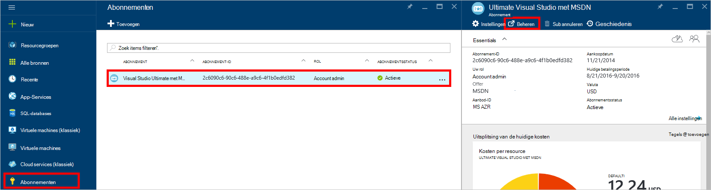
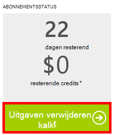

<properties
    pageTitle="Problemen met DocumentDB portal | Microsoft Azure"
    description="Informatie over oplossingen voor problemen in de portal DocumentDB Azure." 
    services="documentdb"
    documentationCenter=""
    authors="mimig1"
    manager="jhubbard"
    editor="monicar"/>

<tags
    ms.service="documentdb"
    ms.workload="data-services"
    ms.tgt_pltfrm="na"
    ms.devlang="na"
    ms.topic="article"
    ms.date="08/29/2016"
    ms.author="mimig"/>

# Azure DocumentDB portal tips voor probleemoplossing

Dit artikel wordt beschreven hoe u problemen met DocumentDB in de portal Azure. 

## Resources ontbreken.

**Symptoom**: Databases of collecties ontbreken in uw portal-blades.

**Oplossing**: gebruik van toepassingen te kunnen uitvoeren onder het quotum voor maximale doorvoer voor de collectie verlagen. 

**Toelichting**: de portal is een toepassing als een andere, roept de DocumentDB database en collectie. Als uw aanvragen zijn momenteel wordt beperkt door het oproepen van een afzonderlijke toepassing, de portal kan ook de snelheid, waardoor bronnen niet worden weergegeven in de portal. Het probleem op te lossen de oorzaak van het hoge doorvoer gebruik adres en vernieuwt u de portal blade. Informatie over het meten en lagere doorvoer gebruik vindt u in de [doorvoer](documentdb-performance-tips.md#throughput) van het artikel [tips voor betere prestaties](documentdb-performance-tips.md) .
 
## Pagina's of blades wordt niet geladen

**Symptoom**: pagina's en -blades in de portal niet weergeven.

**Oplossing**: gebruik van toepassingen te kunnen uitvoeren onder het quotum voor maximale doorvoer voor de collectie verlagen. 

**Toelichting**: de portal is een toepassing als een andere, roept de DocumentDB database en collectie. Als uw aanvragen zijn momenteel wordt beperkt door het oproepen van een afzonderlijke toepassing, de portal kan ook de snelheid, waardoor bronnen niet worden weergegeven in de portal. Het probleem op te lossen de oorzaak van het hoge doorvoer gebruik adres en vernieuwt u de portal blade. Informatie over het meten en lagere doorvoer gebruik vindt u in de [doorvoer](documentdb-performance-tips.md#throughput) van het artikel [tips voor betere prestaties](documentdb-performance-tips.md) .

## Toevoegen knop verzameling is uitgeschakeld.

**Symptoom**: op de bladeserver Database de knop **Verzameling toevoegen** is uitgeschakeld.

**Uitleg**: als uw abonnement Azure gekoppeld aan credit vergoeding, is zoals gratis credits van een MSDN-abonnement is aangeboden en u hebt alle van de kredieten voor de maand gebruikt, die niet alle aanvullende verzamelingen maken in DocumentDB.

**Oplossing**: de bestedingslimiet van uw account te verwijderen.

1. Klik op **abonnementen**in Azure portal in de Jumpbar, klikt u op het abonnement is gekoppeld aan de DocumentDB database en klikt u in het blad **abonnement** **beheren**. 
    

2. In dit venster ziet u dat er bundels. Klik op **uitgavenlimiet verwijderen** om te verwijderen van de uitgaven voor alleen de huidige betalingsperiode of voor onbepaalde tijd. Voltooi de wizard toevoegen of uw creditcardgegevens te bevestigen. 
    

 
## Explorer query is voltooid met fouten

Zie [problemen oplossen met Query Explorer](documentdb-query-collections-query-explorer.md#troubleshoot).

## Er zijn geen gegevens beschikbaar zijn bij het toezicht op tegels

Zie [problemen met tegels controleren](documentdb-monitor-accounts.md#troubleshooting).

## Er zijn geen documenten die worden geretourneerd in een Document Explorer

Zie het [Document Explorer Probleemoplossing](documentdb-view-json-document-explorer.md#troubleshoot).

## Volgende stappen

Als u nog steeds problemen in de portal ondervindt, e-mailen [askdocdb@microsoft.com](mailto:askdocdb@microsoft.com) voor hulp, of het bestand een ondersteuningsverzoek in de portal door te klikken op **Bladeren**, **Help + ondersteuning** **ondersteuningsverzoek maken**.
