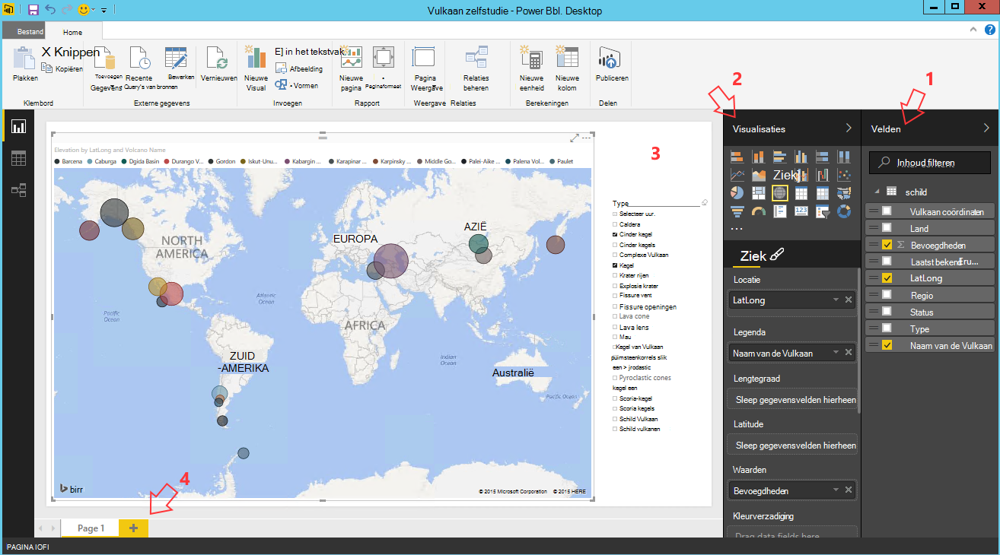
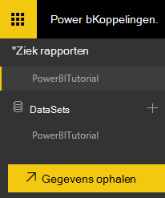
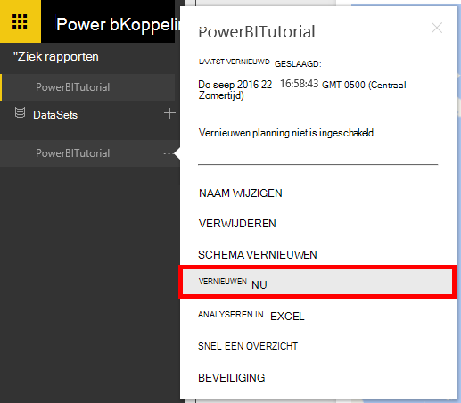

<properties
    pageTitle="Zelfstudie voor Power BI voor DocumentDB connector | Microsoft Azure"
    description="Gebruik deze zelfstudie Power BI JSON importeren, begrijpelijke manier mee rapporten maken en gegevens visualiseren met DocumentDB en Power BI-connector."
    keywords="energie-bi zelfstudie, voedingsaansluiting bi gegevens visualiseren"
    services="documentdb"
    authors="h0n"
    manager="jhubbard"
    editor="mimig"
    documentationCenter=""/>

<tags
    ms.service="documentdb"
    ms.workload="data-services"
    ms.tgt_pltfrm="na"
    ms.devlang="na"
    ms.topic="article"
    ms.date="09/22/2016"
    ms.author="hawong"/>

# Zelfstudie voor Power BI voor DocumentDB: gegevens visualiseren met de Power BI-connector

[PowerBI.com](https://powerbi.microsoft.com/) is een online service waar u kunt maken en delen van dashboards en rapporten met gegevens die belangrijk is voor u en uw organisatie.  Power BI-Desktop is een speciaal rapport ontwerpgereedschap waarmee u kunt gegevens ophalen uit verschillende gegevensbronnen samenvoegen en de gegevens transformeren, krachtige rapporten en visualisaties maken en de rapporten publiceren naar Power BI.  Met de nieuwste versie van Power BI bureaublad, kunt u nu verbinding met uw account DocumentDB via de DocumentDB-connector voor Power BI.   

In deze zelfstudie Power BI we doorlopen de stappen uit om verbinding met een account met DocumentDB in Power BI-Desktop, gaat u naar een collectie waar we willen ophalen van de gegevens met behulp van de Navigator, transformeren JSON-gegevens in tabelvorm met Power BI bureaublad Query Editor maken en een rapport publiceren naar PowerBI.com.

Na het voltooien van deze zelfstudie Power BI, zult u de volgende vragen beantwoorden:  

-   Hoe kan ik maken rapporten met gegevens uit de DocumentDB met behulp van Power BI bureaublad?
-   Hoe kan ik aan een DocumentDB in Power BI Desktop aansluiten?
-   Hoe kan ik gegevens ophalen uit een collectie in Power BI bureaublad?
-   Hoe kan ik geneste JSON-gegevens in Power BI bureaublad zetten?
-   Hoe kan ik publiceren en delen van mijn rapporten in PowerBI.com?

## Vereisten

Voordat u de instructies in deze zelfstudie Power BI, zorg ervoor dat het volgende:

- [De meest recente versie van Power BI-bureaublad](https://powerbi.microsoft.com/desktop).
- Toegang tot onze demo account of de gegevens in uw account Azure DocumentDB.
    - De demo-account is gevuld met de gegevens van de Vulkaan in deze zelfstudie wordt weergegeven. Deze demo-account is niet gebonden door de SLA's en alleen ter demonstratie is bedoeld.  We behoudt zich het recht voor wijzigingen in deze demo account met inbegrip van maar niet beperkt tot de account beëindigen, wijzigen van de sleutel, beperken van de toegang, het wijzigen en verwijderen van de gegevens op elk gewenst moment zonder voorafgaande kennisgeving of de reden.
        - URL: https://analytics.documents.azure.com
        - Alleen-lezen-sleutel: MSr6kt7Gn0YRQbjd6RbTnTt7VHc5ohaAFu7osF0HdyQmfR + YhwCH2D2jcczVIR1LNK3nMPNBD31losN7lQ/fkw ==
    - Of Zie [een DocumentDB databaseaccount maken met de Azure portal](https://azure.microsoft.com/documentation/articles/documentdb-create-account/)maken van uw eigen account. Als u monster Vulkaan gegevens die vergelijkbaar is met wat in deze zelfstudie wordt gebruikt (maar niet de GeoJSON blokken bevat), Zie de [website van NOAA](https://www.ngdc.noaa.gov/nndc/struts/form?t=102557&s=5&d=5) en importeer de gegevens met behulp van het [hulpprogramma voor migratie van DocumentDB gegevens](https://azure.microsoft.com/documentation/articles/documentdb-import-data/).

Als u wilt delen uw rapporten in PowerBI.com, moet u een account hebben in PowerBI.com.  Ga naar [https://powerbi.microsoft.com/pricing](https://powerbi.microsoft.com/pricing)voor meer informatie over Power BI voor vrije en Power BI Pro.

## De slag
In deze zelfstudie, bijvoorbeeld dat u bent een geologist studie vulkanen in de wereld.  De Vulkaan-gegevens worden opgeslagen in een DocumentDB-account en de JSON-documenten eruitzien zoals in de onderstaande.

    {
        "Volcano Name": "Rainier",
        "Country": "United States",
        "Region": "US-Washington",
        "Location": {
            "type": "Point",
            "coordinates": [
            -121.758,
            46.87
            ]
        },
        "Elevation": 4392,
        "Type": "Stratovolcano",
        "Status": "Dendrochronology",
        "Last Known Eruption": "Last known eruption from 1800-1899, inclusive"
    }

Wilt u de Vulkaan gegevens ophalen uit de DocumentDB-account en de gegevens in een interactief rapport Power BI zoals hieronder.

Wilt u eens proberen? We gaan aan de slag.

1. Power BI-bureaublad worden uitgevoerd op uw werkstation.
2. Zodra de Power BI-bureaublad wordt gestart, wordt *een welkomstscherm* weergegeven.

    

3. U kunt **Gegevens ophalen**, Zie **Recente bronnen**of **Andere rapporten openen** direct vanuit het *Welkom* -scherm.  Klik op de X in de rechterbovenhoek om te sluiten van het scherm. **De weergave van Power BI-bureaublad** wordt weergegeven.

    

4. Het lint **Start** selecteren en klik vervolgens op **Gegevens ophalen**.  De **Gegevens ophalen** venster moet worden weergegeven.

5. Klik op **Azure**, selecteer **Microsoft Azure DocumentDB (bèta)**en klik vervolgens op **verbinden**.  Het venster **Microsoft Azure DocumentDB verbinding** moet worden weergegeven.

    

6. Geef de DocumentDB rekening eindpunt-URL u wilt de gegevens ophalen, zoals hieronder wordt weergegeven en klik vervolgens op **OK**. U kunt de URL ophalen uit het vak URI van de **[sleutels](documentdb-manage-account.md#keys)** blade van de Azure portal of kunt u de demo-account, in welk geval de URL is `https://analytics.documents.azure.com`. 

    Niets op de databasenaam, de Collectienaam en de SQL-instructie zoals deze velden optioneel zijn.  In plaats daarvan gebruiken we de Navigator te selecteren van de Database en de collectie om te bepalen waar de gegevens vandaan komen.

    

7. Als u verbinding met dit eindpunt voor de eerste keer maakt, wordt u gevraagd voor de account.  U kunt de sleutel ophalen uit het vak **Primaire sleutel** in de **[alleen-lezen sleutels](documentdb-manage-account.md#keys)** blade van de Azure portal of kunt u de demo-account, in dat geval de sleutel is `RcEBrRI2xVnlWheejXncHId6QRcKdCGQSW6uSUEgroYBWVnujW3YWvgiG2ePZ0P0TppsrMgscoxsO7cf6mOpcA==`. De sleutel van de account en klik op **verbinden**.

    Wij raden aan dat u de sleutel alleen-lezen gebruiken bij het maken van rapporten.  Hiermee voorkomt u onnodige blootstelling van de hoofdsleutel instelt dat voor potentiële veiligheidsrisico's. De sleutel alleen-lezen beschikbaar is op de [toetsen](documentdb-manage-account.md#keys) blade van de Azure portal of kunt u de demo-account bovenstaande gegevens.

    

8. Wanneer de account is verbonden, wordt de **Navigator** weergegeven.  De **Navigator** wordt een lijst met databases onder de account weergegeven.
9. Klik op en vouw de database waar de gegevens voor het rapport afkomstig, als u de demo-account, selecteer **volcanodb**.   

10. Selecteer nu een collectie die u zal de gegevens ophalen. Als u de demo-account gebruikt, selecteert u **volcano1**.

    Het voorbeeldvenster ziet u een lijst met items van de **Record** .  Een Document wordt weergegeven als **een recordtype in Power BI** . Een geneste blok JSON binnen een document is op dezelfde manier ook een **Record**.

    

11. Klik op **bewerken** om de Query Editor starten zodat we kunnen de gegevens transformeren.

## Afvlakken en JSON-documenten omzetten
1. In de Power BI Query Editor ziet u een kolom **Document** in het middelste deelvenster.

2. Klik op de uitbreidingsmodule aan de rechterkant van **de kop van een kolom** .  Het contextmenu voor een lijst met velden wordt weergegeven.  Selecteer de velden die u nodig hebt voor het rapport, bijvoorbeeld Vulkaan naam, land, regio, locatie, misbruik, Type, Status en laatste weet uitbreken, en klik vervolgens op **OK**.

    

3. Het middelste deelvenster wordt een voorbeeld van het resultaat weergegeven met de geselecteerde velden.

    

4. In ons voorbeeld is de eigenschap Location een GeoJSON-blok in een document.  Zoals u ziet, wordt als een **Record** in Power BI Desktop locatie vertegenwoordigd.  
5. Klik op de uitbreidingsmodule aan de rechterkant van de kolomkop locatie.  Het contextmenu met de velden Soort en coördinaten worden weergegeven.  Laten we het veld coördinaten selecteren en klik op **OK**.

    

6. Een kolom van de coördinaten van het type **lijst** wordt nu weergegeven in het middelste deelvenster.  Zoals aan het begin van de zelfstudie wordt weergegeven, is de GeoJSON gegevens in deze zelfstudie van punttekst met breedte en lengte waarden opgenomen in de array met coördinaten.

    Het element coördinaten [0] betekent lengtegraad en coördinaten [1] Latitude.
    

7. Als u wilt afvlakken in de array van coördinaten, maken we een **Aangepaste kolom** met de naam LatLong.  Selecteer de **Kolom toevoegen** lint en klik op **Aangepaste kolom toevoegen**.  Het venster **Aangepaste kolom toevoegen** wordt weergegeven.

8. Geef een naam voor de nieuwe kolom, bijvoorbeeld LatLong.

9. Geef vervolgens de aangepaste formule voor de nieuwe kolom.  In ons voorbeeld zullen we de breedte en lengte waarden gescheiden door een komma als volgt met de volgende formule samenvoegen: `Text.From([Document.Location.coordinates]{1})&","&Text.From([Document.Location.coordinates]{0})`. Klik op **OK**.

    Voor meer informatie op Data Analysis expressies (DAX) waaronder DAX-functies, Ga naar [Basic DAX in Power BI-Desktop](https://support.powerbi.com/knowledgebase/articles/554619-dax-basics-in-power-bi-desktop).

    

10. Het middelste deelvenster ziet nu de nieuwe LatLong kolom gevuld met de breedte en lengte waarden gescheiden door een komma.

    

    Als er een fout in de nieuwe kolom, zorg dat de toegepaste stappen onder Query instellingen overeenkomen met de volgende afbeelding:

    

    Als uw werk verschillend zijn, de extra stappen uit en probeer opnieuw de aangepaste kolom toe te voegen. 

11. We hebben nu voltooid samenvoegen van de gegevens in tabelvorm.  U kunt profiteren van alle functies die beschikbaar zijn in de Query Editor aan vorm en transformatie van gegevens in de DocumentDB.  Als u de voorbeeldgegevens gebruikt, het gegevenstype wijzigen voor bevoegdheden op een **geheel getal** door het wijzigen van het **Gegevenstype** in het lint **Start** .

    

12. Klik op **sluiten en toepassen** om op te slaan het gegevensmodel.

    

## De rapporten maken
Power BI bureaublad rapportweergave is waar u kunt beginnen met het maken rapporten gegevens visualiseren.  U kunt rapporten maken door velden te verslepen in het **rapport** canvas.

In het rapport zult u:

 1. Het deelvenster **velden** , dit is waar u een lijst van gegevensmodellen met velden voor rapporten kunt u zien.

 2. Het deelvenster **Visualisaties** . Een rapport kan één of meerdere visualisaties bevatten.  Kies de visuele typen past uw behoeften vanuit het deelvenster **Visualisaties** .

 3. Het **rapport** canvas, dit is waar bouwt u de visuele effecten voor uw rapport.

 4. De pagina van het **rapport** . U kunt meerdere pagina's het rapport in Power BI bureaublad toevoegen.

Hieronder ziet u de basisstappen voor het maken van een eenvoudig rapport voor interactieve plattegrond weergeven.

1. In ons voorbeeld maken we een kaartweergave weergegeven waarmee de locatie van elke Vulkaan.  Klik op het type visuele zoals in de bovenstaande screenshot gemarkeerd in het deelvenster **Visualisaties** .  Hier ziet u het visuele type geschilderd op het canvas **rapport** .  Het deelvenster **visualisatie** moet ook een aantal eigenschappen die betrekking hebben op het type visueel weergegeven.

2. Nu slepen en neerzetten van het LatLong veld vanuit het deelvenster **velden** naar de eigenschap **Location** in deelvenster **Visualisaties** .
3. Vervolgens slepen en neerzetten van het veld naam van de Vulkaan de eigenschap **Legend** .  

4. Vervolgens slepen en neerzetten van het veld tot misbruik van bevoegdheden om de eigenschap **Size** .  

5. U ziet nu de kaart visuele met een reeks Bolletjes die de locatie van elke Vulkaan met de grootte van de bel correleren aan de bevoegdheden van de Vulkaan.

6. U hebt nu een eenvoudig rapport gemaakt.  U kunt het rapport verder aanpassen door het toevoegen van meer visualisaties.  In ons geval hebben we een vulkaan Type slicer om het interactief maken van het rapport toegevoegd.  

    

## Publiceren en delen van uw rapport
Delen van het rapport, moet u een account hebben in PowerBI.com.

1. Klik op het lint **Start** in de Power BI-Desktop.
2. Klik op **publiceren**.  U wordt gevraagd de gebruikersnaam en het wachtwoord invoeren voor uw account PowerBI.com.
3. Zodra de referentie is geverifieerd, wordt het rapport gepubliceerd naar uw bestemming die u hebt geselecteerd.
4. Klik op **Open 'PowerBITutorial.pbix' in Power BI** en delen van uw rapport over PowerBI.com.

    

## Een dashboard maken in PowerBI.com

Nu dat u een rapport hebt, kunnen delen op PowerBI.com

Wanneer u het rapport Power BI Desktop-PowerBI.com publiceert, genereert een **rapport** en een **gegevensset** in uw huurder PowerBI.com. Nadat u een rapport genaamd **PowerBITutorial** aan PowerBI.com gepubliceerd, zal u PowerBITutorial in de **rapporten** en de **Datasets** secties zien op PowerBI.com.

   

Klik op de knop **Pin Live pagina** in uw rapport PowerBI.com wilt maken van een dashboard worden gedeeld.

   

Volg de instructies in de [PIN-code een tegel van een rapport](https://powerbi.microsoft.com/documentation/powerbi-service-pin-a-tile-to-a-dashboard-from-a-report/#pin-a-tile-from-a-report) maken van een nieuw dashboard. 

U kunt ook ad-hoc-wijzigingen in het rapport doen voordat u een dashboard maakt. Het verdient echter gebruik van Power BI Desktop uit te voeren wijzigingen publiceren in de lijst wilt PowerBI.com.

## Gegevens vernieuwen in de PowerBI.com

Er zijn twee manieren om te vernieuwen, ad-hoc en gepland.

Voor een ad-hoc vernieuwen, klikt u op de eclipses (...) door de **Dataset**, bijvoorbeeld PowerBITutorial. U ziet een lijst met acties, met inbegrip van **Nu vernieuwen**. Klik op **Nu vernieuwen** om de gegevens te vernieuwen.

Voor een geplande vernieuwing door het volgende te doen.

1. Klik op **Schema vernieuwen** in de actielijst. 
    

2. Vouw in de pagina **Instellingen voor** **referenties van de gegevensbron**. 

3. Klik op **referenties bewerken**. 

    De pop-up configureren wordt weergegeven. 

4. Geef de sleutel verbinding maken met de account DocumentDB voor die set gegevens en klik op **aanmelden**. 

5. Vouw **Plannen vernieuwen** en stelt u de planning die u wilt vernieuwen van de dataset. 
  
6. Klik op **toepassen** en u klaar bent met het instellen van de geplande vernieuwing.

## Volgende stappen
- Meer informatie over Power BI, Zie [aan de slag met Power BI](https://powerbi.microsoft.com/documentation/powerbi-service-get-started/).
- Zie voor meer informatie over DocumentDB, de [DocumentDB documentatie portaalpagina](https://azure.microsoft.com/documentation/services/documentdb/).
