<properties
    pageTitle="Python kolf Web Application Development met DocumentDB | Microsoft Azure"
    description="Bekijk een zelfstudie over het gebruik van DocumentDB om te slaan en toegang tot gegevens in een kolf Python webtoepassing als host op Azure. Zoeken naar oplossingen voor het ontwikkelen van toepassingen." 
    keywords="De ontwikkeling van toepassingen, zelfstudie, python kolf, python web application, python webontwikkeling, documentdb, azure, Microsoft azure"
    services="documentdb"
    documentationCenter="python"
    authors="syamkmsft"
    manager="jhubbard"
    editor="cgronlun"/>

<tags
    ms.service="documentdb"
    ms.workload="data-management"
    ms.tgt_pltfrm="na"
    ms.devlang="python"
    ms.topic="hero-article"
    ms.date="08/25/2016"
    ms.author="syamk"/>

# <a name="python-flask-web-application-development-with-documentdb"></a>Python kolf Web Application Development met DocumentDB

> [AZURE.SELECTOR]
- [.NET](documentdb-dotnet-application.md)
- [Node.js](documentdb-nodejs-application.md)
- [Java](documentdb-java-application.md)
- [Python](documentdb-python-application.md)

In deze zelfstudie wordt u met Azure DocumentDB op te slaan en toegang tot gegevens uit een Python web application gehost op Azure en wordt ervan uitgegaan dat er enige voorafgaande ervaring met Python en Azure websites.

Deze zelfstudie heeft betrekking op:

1. Maken en inrichten van een account DocumentDB.
2. Maken van een toepassing MVC Python.
3. Verbinding maken met en Azure DocumentDB vanuit uw webtoepassing gebruiken.
4. Implementatie van de webtoepassing naar Azure Websites.

Door deze zelfstudie te volgen, bouwt u een eenvoudige stemrecht toepassing waarmee u stemmen voor een poll.

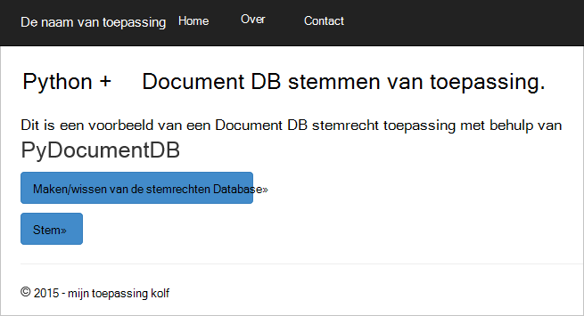


## <a name="database-tutorial-prerequisites"></a>Zelfstudie vereisten database

Voordat u de instructies in dit artikel uitvoert, moet u ervoor zorgen dat u de volgende software zijn geïnstalleerd hebt:

- Een actieve account Azure. Als u geen account hebt, kunt u een gratis proefperiode account in een paar minuten. Zie voor meer informatie, [Gratis proefperiode van Azure](https://azure.microsoft.com/pricing/free-trial/).
- [Visual Studio 2013](http://www.visualstudio.com/) of hoger, of [Visual Studio Express](), is de gratis versie. De instructies in deze handleiding zijn speciaal geschreven voor Visual Studio 2015. 
- Python-hulpprogramma's voor Visual Studio van [GitHub](http://microsoft.github.io/PTVS/). In deze zelfstudie wordt extra Python voor VS 2015. 
- Azure Python SDK voor Visual Studio versie 2.4 of hoger, verkrijgbaar op [azure.com](https://azure.microsoft.com/downloads/). We hebben Microsoft Azure SDK voor Python 2.7 gebruikt.
- Python 2.7 uit [python.org][2]. We Python 2.7.11 gebruikt. 

> [AZURE.IMPORTANT] Als u Python 2.7 voor de eerste keer installeert, moet u ervoor zorgen dat in het scherm aanpassen Python 2.7.11 u **python.exe aan een pad toevoegen**.
> 
>    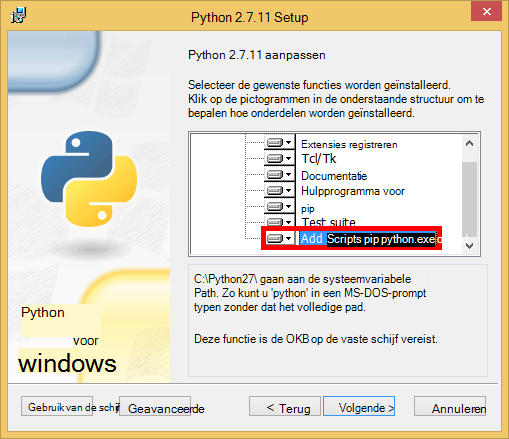

- Microsoft Visual C++ Compiler voor Python 2.7 van het [Microsoft Download Center][3].

## <a name="step-1-create-a-documentdb-database-account"></a>Stap 1: Maak een account DocumentDB database

Laten we beginnen met het maken van een account DocumentDB. Als u al een account hebt, kunt u verdergaan met [stap 2: Maak een nieuwe webtoepassing van Python kolf](#step-2:-create-a-new-python-flask-web-application).

[AZURE.INCLUDE [documentdb-create-dbaccount](../../includes/documentdb-create-dbaccount.md)]

<br/>
We nu helpt bij het maken van een nieuwe webtoepassing Python kolf uit de grond omhoog.

## <a name="step-2-create-a-new-python-flask-web-application"></a>Stap 2: Maak een nieuwe webtoepassing van Python kolf

1. In Visual Studio, klikt u in het menu **bestand** , wijs **Nieuw**aan en klik vervolgens op **Project**.

    Het dialoogvenster **Nieuw Project** wordt weergegeven.

2. Vouw **sjablonen** en **Python**in het linkerdeelvenster en klik vervolgens op **Web**. 

3. **Kolf Web Project** selecteren in het middelste deelvenster, klik vervolgens in het **naam** vak type **zelfstudie**en klik vervolgens op **OK**. Houd er rekening mee dat namen van Python pakket alleen kleine letters, worden moeten zoals beschreven in de [Handleiding voor Python Code stijl](https://www.python.org/dev/peps/pep-0008/#package-and-module-names).

    Het is een web application ontwikkelings-framework dat helpt u bij het bouwen van webtoepassingen in Python sneller die nieuwe Python kolf.

    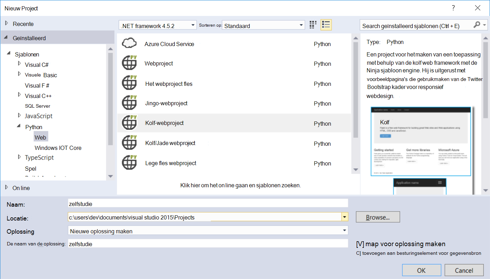

4. In het venster **Python Tools voor Visual Studio** , klikt u op **installeren in een virtuele omgeving**. 

    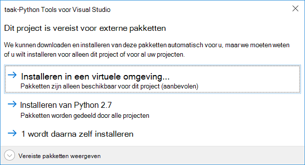

5. In het venster **Virtuele omgeving toevoegen** kunt u de standaardwaarden accepteren en Python 2.7 gebruiken als basis omgeving omdat PyDocumentDB biedt momenteel geen ondersteuning voor Python 3.x, en klik vervolgens op **maken**. Hiermee stelt u de vereiste Python virtuele omgeving voor uw project.

    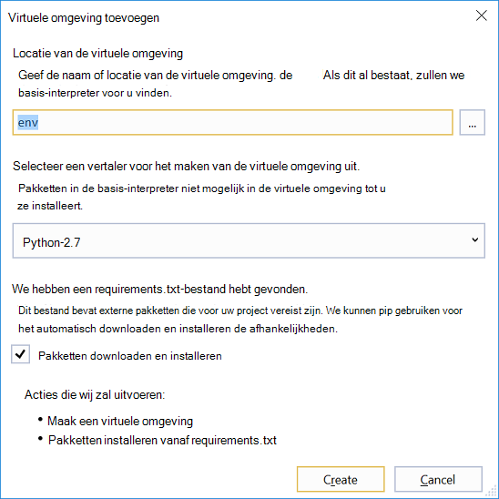

    In het uitvoervenster weergegeven `Successfully installed Flask-0.10.1 Jinja2-2.8 MarkupSafe-0.23 Werkzeug-0.11.5 itsdangerous-0.24 'requirements.txt' was installed successfully.` wanneer het milieu met succes is geïnstalleerd.

## <a name="step-3-modify-the-python-flask-web-application"></a>Stap 3: De kolf Python webtoepassing wijzigen

### <a name="add-the-python-flask-packages-to-your-project"></a>De pakketten Python kolf aan uw project toevoegen

Nadat uw project is ingesteld, moet u de vereiste kolf pakketten toevoegen aan het project, met inbegrip van pydocumentdb, het pakket Python voor DocumentDB.

1. In de Solution Explorer, open het bestand met de naam **requirements.txt** en de inhoud vervangen door de volgende:

        flask==0.9
        flask-mail==0.7.6
        sqlalchemy==0.7.9
        flask-sqlalchemy==0.16
        sqlalchemy-migrate==0.7.2
        flask-whooshalchemy==0.55a
        flask-wtf==0.8.4
        pytz==2013b
        flask-babel==0.8
        flup
        pydocumentdb>=1.0.0

2. Sla het bestand **requirements.txt** . 
3. In de Solution Explorer met de rechtermuisknop op de **Envelop** en klik op **installeren vanaf requirements.txt**.

    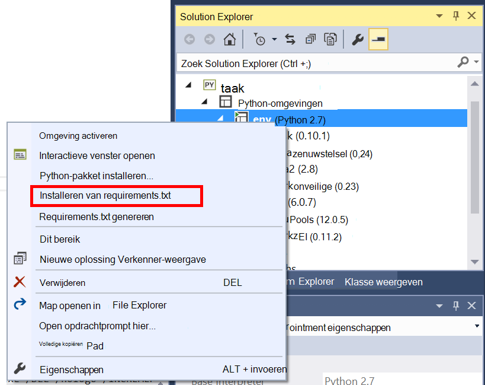

    Na de succesvolle installatie het uitvoervenster wordt het volgende weergegeven:

        Successfully installed Babel-2.3.2 Tempita-0.5.2 WTForms-2.1 Whoosh-2.7.4 blinker-1.4 decorator-4.0.9 flask-0.9 flask-babel-0.8 flask-mail-0.7.6 flask-sqlalchemy-0.16 flask-whooshalchemy-0.55a0 flask-wtf-0.8.4 flup-1.0.2 pydocumentdb-1.6.1 pytz-2013b0 speaklater-1.3 sqlalchemy-0.7.9 sqlalchemy-migrate-0.7.2

    > [AZURE.NOTE] In zeldzame gevallen ziet u een fout in het uitvoervenster. Als dit gebeurt, controleert u of de fout betrekking heeft op Schijfopruiming. Soms het opruimen mislukt, maar de installatie nog steeds succesvolle (naar boven schuiven in het uitvoervenster om dit te controleren). U kunt controleren de installatie door [te controleren of de virtuele omgeving](#verify-the-virtual-environment). Als de installatie is mislukt, maar de controle uitgevoerd is, is het OK om door te gaan.

### <a name="verify-the-virtual-environment"></a>Controleer of de virtuele omgeving

We controleren of alles correct is geïnstalleerd.

1. Maak de oplossing door op **Ctrl**te drukken+**Shift**+**B**.
2. Nadat het opbouwen is voltooid, start u de website door op **F5**te drukken. Dit start de kolf development server en start uw webbrowser. Hier ziet u de volgende pagina.

    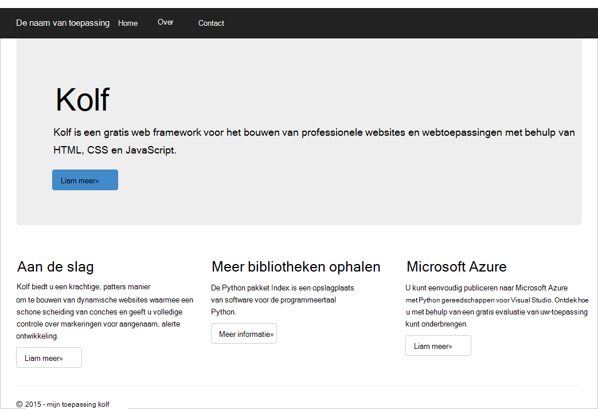

3. Stoppen met het opsporen van fouten in de website door te drukken op **Shift**+**F5** in Visual Studio.

### <a name="create-database-collection-and-document-definitions"></a>Databases, collectie en documentdefinities maken

Nu maken we de toepassing van de stemming door het toevoegen van nieuwe bestanden en anderen bij te werken.

1. In Solution Explorer met de rechtermuisknop op het project voor **zelfstudie** , klikt u op **toevoegen**en klik vervolgens op **Nieuw Item**. Selecteer **Lege Python-bestand** en de naam van het bestand **forms.py**.  
2. Voeg de volgende code in het bestand forms.py en sla het bestand.

```python
from flask.ext.wtf import Form
from wtforms import RadioField

class VoteForm(Form):
    deploy_preference  = RadioField('Deployment Preference', choices=[
        ('Web Site', 'Web Site'),
        ('Cloud Service', 'Cloud Service'),
        ('Virtual Machine', 'Virtual Machine')], default='Web Site')
```


### <a name="add-the-required-imports-to-viewspy"></a>De vereiste invoer toevoegen aan views.py

1. Vouw de map **zelfstudie** in Solution Explorer en open het bestand **views.py** . 
2. De volgende instructies aan de bovenkant van het **views.py** -bestand importeren en sla vervolgens het bestand toevoegen. Deze PythonSDK van de DocumentDB en de kolf pakketten importeren.

    ```python
    from forms import VoteForm
    import config
    import pydocumentdb.document_client as document_client
    ```


### <a name="create-database-collection-and-document"></a>Database, collectie en een document maken

- Voeg de volgende code aan het einde van het bestand in **views.py**, nog steeds. Dit zorgt voor het maken van de database die door het formulier worden gebruikt. Een van de bestaande code in **views.py**niet verwijderen. Dit gewoon toevoegen aan het einde.

```python
@app.route('/create')
def create():
    """Renders the contact page."""
    client = document_client.DocumentClient(config.DOCUMENTDB_HOST, {'masterKey': config.DOCUMENTDB_KEY})

    # Attempt to delete the database.  This allows this to be used to recreate as well as create
    try:
        db = next((data for data in client.ReadDatabases() if data['id'] == config.DOCUMENTDB_DATABASE))
        client.DeleteDatabase(db['_self'])
    except:
        pass

    # Create database
    db = client.CreateDatabase({ 'id': config.DOCUMENTDB_DATABASE })

    # Create collection
    collection = client.CreateCollection(db['_self'],{ 'id': config.DOCUMENTDB_COLLECTION })

    # Create document
    document = client.CreateDocument(collection['_self'],
        { 'id': config.DOCUMENTDB_DOCUMENT,
          'Web Site': 0,
          'Cloud Service': 0,
          'Virtual Machine': 0,
          'name': config.DOCUMENTDB_DOCUMENT 
        })

    return render_template(
       'create.html',
        title='Create Page',
        year=datetime.now().year,
        message='You just created a new database, collection, and document.  Your old votes have been deleted')
```

> [AZURE.TIP] De methode **CreateCollection** gebruikt een optioneel **RequestOptions** als de derde parameter. Dit kan worden gebruikt om op te geven het Type bieden voor de collectie. Als er geen waarde voor offerType wordt opgegeven, wordt de collectie gemaakt met behulp van het Type aanbieden. Zie voor meer informatie op DocumentDB-typen bieden [prestaties in DocumentDB](documentdb-performance-levels.md).


### <a name="read-database-collection-document-and-submit-form"></a>Database, collectie, document lezen en formulier indienen

- Voeg de volgende code aan het einde van het bestand in **views.py**, nog steeds. Dit zorgt voor het formulier, het lezen van de database, de collectie en het document instellen. Een van de bestaande code in **views.py**niet verwijderen. Dit gewoon toevoegen aan het einde.

```python
@app.route('/vote', methods=['GET', 'POST'])
def vote(): 
    form = VoteForm()
    replaced_document ={}
    if form.validate_on_submit(): # is user submitted vote  
        client = document_client.DocumentClient(config.DOCUMENTDB_HOST, {'masterKey': config.DOCUMENTDB_KEY})

        # Read databases and take first since id should not be duplicated.
        db = next((data for data in client.ReadDatabases() if data['id'] == config.DOCUMENTDB_DATABASE))

        # Read collections and take first since id should not be duplicated.
        coll = next((coll for coll in client.ReadCollections(db['_self']) if coll['id'] == config.DOCUMENTDB_COLLECTION))

        # Read documents and take first since id should not be duplicated.
        doc = next((doc for doc in client.ReadDocuments(coll['_self']) if doc['id'] == config.DOCUMENTDB_DOCUMENT))

        # Take the data from the deploy_preference and increment our database
        doc[form.deploy_preference.data] = doc[form.deploy_preference.data] + 1
        replaced_document = client.ReplaceDocument(doc['_self'], doc)

        # Create a model to pass to results.html
        class VoteObject:
            choices = dict()
            total_votes = 0

        vote_object = VoteObject()
        vote_object.choices = {
            "Web Site" : doc['Web Site'],
            "Cloud Service" : doc['Cloud Service'],
            "Virtual Machine" : doc['Virtual Machine']
        }
        vote_object.total_votes = sum(vote_object.choices.values())

        return render_template(
            'results.html', 
            year=datetime.now().year, 
            vote_object = vote_object)

    else :
        return render_template(
            'vote.html', 
            title = 'Vote',
            year=datetime.now().year,
            form = form)
```


### <a name="create-the-html-files"></a>De HTML-bestanden maken

1. De map **templates** met de rechtermuisknop op, klikt u op **toevoegen**en klikt u op **Nieuw Item**in de Solution Explorer, klikt u in de map **zelfstudie** . 
2. Selecteer **HTML-pagina**en typt u vervolgens in het naamvak van **create.html**. 
3. Herhaal stap 1 en 2 twee extra HTML-bestanden maken: results.html en vote.html.
4. De volgende code toevoegen aan de **create.html** in de `<body>` element. Er wordt een bericht weergegeven dat we een nieuwe database, de collectie en het document hebt gemaakt.

    ```html
    
    
    <h2>{{ title }}.</h2>
    <h3>{{ message }}</h3>
    <p><a href="{{ url_for('vote') }}" class="btn btn-primary btn-large">Vote &raquo;</a></p>
    
    ```

5. De volgende code toevoegen aan de **results.html** in de `<body`> element. De resultaten van de enquête wordt weergegeven.

    ```html
    
    
    <h2>Results of the vote</h2>
        <br />
        
    
    <div class="row">
        <div class="col-sm-5">{{choice}}</div>
            <div class="col-sm-5">
                <div class="progress">
                    <div class="progress-bar" role="progressbar" aria-valuenow="{{vote_object.choices[choice]}}" aria-valuemin="0" aria-valuemax="{{vote_object.total_votes}}" style="width: {{(vote_object.choices[choice]/vote_object.total_votes)*100}}%;">
                                {{vote_object.choices[choice]}}
                </div>
            </div>
            </div>
    </div>
    
    
    <br />
    <a class="btn btn-primary" href="{{ url_for('vote') }}">Vote again?</a>
    
    ```

6. De volgende code toevoegen aan de **vote.html** in de `<body`> element. Het wordt weergegeven in de peiling en de stemmen aanvaardt. Over het registreren van de stemmen, wordt het besturingselement via doorgegeven aan views.py waar we de cast van de stem te herkennen en dienovereenkomstig het document toevoegen.

    ```html
    
    
    <h2>What is your favorite way to host an application on Azure?</h2>
    <form action="" method="post" name="vote">
        {{form.hidden_tag()}}
            {{form.deploy_preference}}
            <button class="btn btn-primary" type="submit">Vote</button>
    </form>
    
    ```

7. In de map **sjablonen** vervangen door de inhoud van **index.html** de volgende. Dit dient als de portaalpagina voor uw toepassing.
    
    ```html
    
    
    <h2>Python + DocumentDB Voting Application.</h2>
    <h3>This is a sample DocumentDB voting application using PyDocumentDB</h3>
    <p><a href="{{ url_for('create') }}" class="btn btn-primary btn-large">Create/Clear the Voting Database &raquo;</a></p>
    <p><a href="{{ url_for('vote') }}" class="btn btn-primary btn-large">Vote &raquo;</a></p>
    
    ```

### <a name="add-a-configuration-file-and-change-the-initpy"></a>Voeg een configuratiebestand en wijzig de \_ \_init\_\_.py

1. In de Solution Explorer met de rechtermuisknop op het project voor **zelfstudie** , klikt u op **toevoegen**klikt u op **Nieuw Item**, selecteer **Lege Python bestand**en noem het bestand **config.py**. Deze config-bestand is vereist door de formulieren in de kolf. U kunt het ook een geheime sleutel te bieden. Deze sleutel is niet nodig voor deze zelfstudie wel.

2. Voeg de volgende code toe aan config.py, moet u voor het wijzigen van de waarden van **DOCUMENTDB\_HOST** en **DOCUMENTDB\_sleutel** in de volgende stap.

    ```python
    CSRF_ENABLED = True
    SECRET_KEY = 'you-will-never-guess'
    
    DOCUMENTDB_HOST = 'https://YOUR_DOCUMENTDB_NAME.documents.azure.com:443/'
    DOCUMENTDB_KEY = 'YOUR_SECRET_KEY_ENDING_IN_=='
    
    DOCUMENTDB_DATABASE = 'voting database'
    DOCUMENTDB_COLLECTION = 'voting collection'
    DOCUMENTDB_DOCUMENT = 'voting document'
    ```

3. In de [Azure portal](https://portal.azure.com/), gaat u naar de blade **toetsen** door te klikken op **Bladeren**, **DocumentDB, rekeningen**, dubbelklik op de naam van de account die u wilt gebruiken en klik vervolgens op de knop van de **sleutels** in het gebied **Essentials** . In het blad **toetsen** de **URI** -waarde kopiëren en plakken in het bestand **config.py** als de waarde voor de **DOCUMENTDB\_HOST** eigenschap. 
4. Terug in Azure portal in de blade **toetsen** de waarde van de **Primaire sleutel** of de **Secundaire sleutel**kopiëren en plakken in het bestand **config.py** als de waarde voor de **DOCUMENTDB\_sleutel** eigenschap.
5. In de ** \_ \_init\_\_.py** bestand, voeg de volgende regel. 

        app.config.from_object('config')

    Zodat de inhoud van het bestand:

    ```python
    from flask import Flask
    app = Flask(__name__)
    app.config.from_object('config')
    import tutorial.views
    ```

6. Na het toevoegen van alle bestanden in de Solution Explorer ziet er zo uit:

    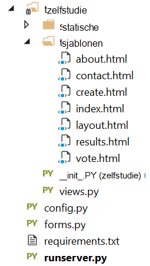


## <a name="step-4-run-your-web-application-locally"></a>Stap 4: Uw webtoepassing lokaal uitvoeren

1. Maak de oplossing door op **Ctrl**te drukken+**Shift**+**B**.
2. Nadat het opbouwen is voltooid, start u de website door op **F5**te drukken. U ziet het volgende op het scherm.

    

3. Klik op **De Database Voting maken/wissen** voor het genereren van de database.

    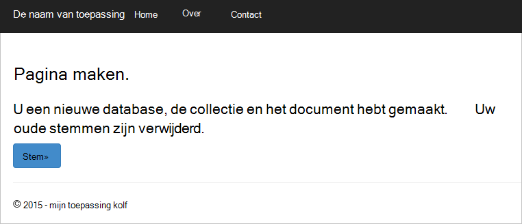

4. Vervolgens klikt u op de **stemming** en selecteer de optie.

    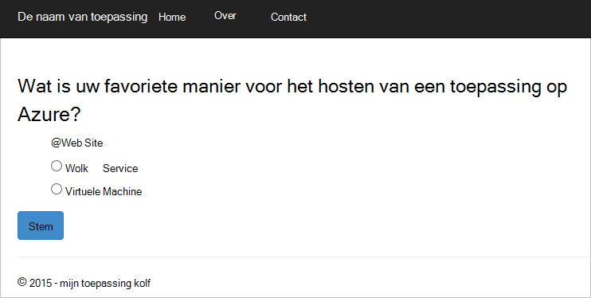

5. Voor elke stemming u, wordt het desbetreffende item verhoogd.

    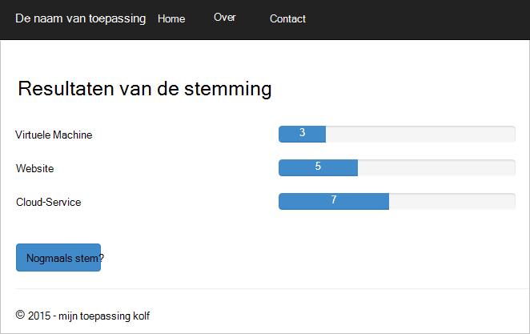

6. Stoppen met het opsporen van fouten in het project door te drukken op Shift + F5.

## <a name="step-5-deploy-the-web-application-to-azure-websites"></a>Stap 5: Implementeer de webtoepassing naar Azure Websites

Nu dat u de volledige toepassing goed werkt tegen DocumentDB hebt, gaan we distribueren naar Azure Websites.

1. Klik met de rechtermuisknop op het project in de Solution Explorer (Zorg ervoor dat u zich niet lokaal nog actief) en selecteer **publiceren**.  

    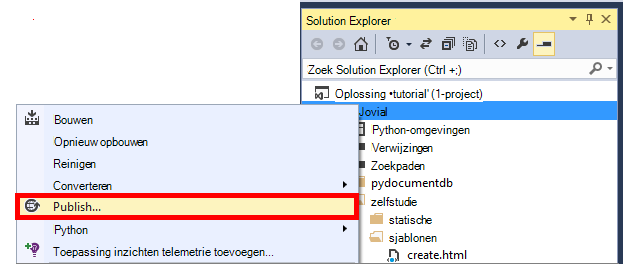

2. In het venster **Web publiceren** **Web Apps van Microsoft Azure**selecteren en klik op **volgende**.

    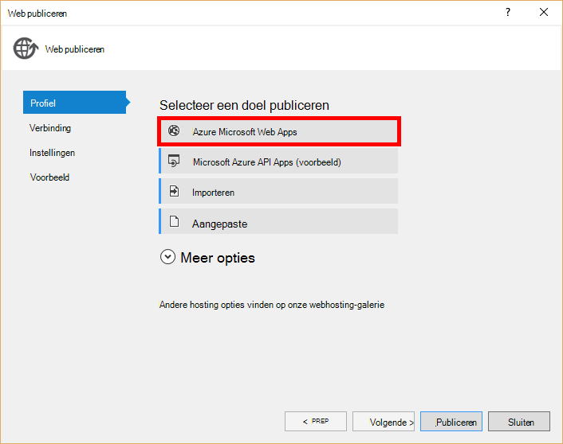

3. Klik op **Nieuw**in het venster **Microsoft Azure Web Apps-venster** .

    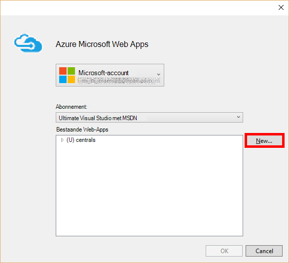

4. Voer een **Web app naam** **serviceplan App**, **resourcegroep**en **regio**in het venster **een site maken op Microsoft Azure** , vervolgens klikt u op **maken**.

    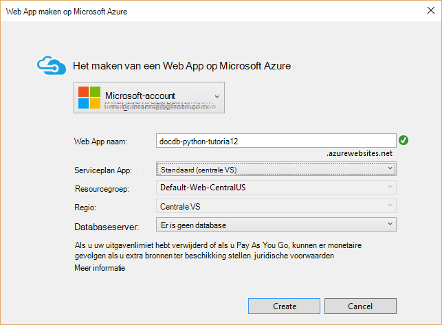

5. Klik in het venster **Web publiceren** **publiceren**.

    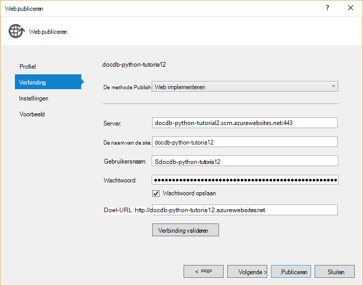

3. Visual Studio wordt binnen enkele seconden klaar bent met het publiceren van uw webtoepassing en een browser waarin u kunt zien bij de hand hebt uitgevoerd in Azure starten!

## <a name="troubleshooting"></a>Het oplossen van problemen

Als dit de eerste Python app die u op uw computer hebt uitgevoerd, moet u ervoor zorgen dat de volgende mappen (of de equivalente installatielocaties) worden opgenomen in de variabele PATH:

    C:\Python27\site-packages;C:\Python27\;C:\Python27\Scripts;

Als er een foutbericht op de pagina van uw stem, naam van uw project iets anders dan een **zelfstudie**, zorg ervoor dat ** \_ \_init\_\_.py** verwijst naar de juiste naam in de regel: `import tutorial.view`.

## <a name="next-steps"></a>Volgende stappen

Gefeliciteerd! U hebt zojuist uw eerste Python webtoepassing met Azure DocumentDB voltooid en naar Azure Websites gepubliceerd.

We werken en te verbeteren in dit onderwerp regelmatig op basis van uw feedback.  Zodra u de hele training doorlopen hebt, neem de stemknoppen gebruiken boven en onder aan deze pagina en zorg ervoor dat u uw mening over wat verbeteringen die u wilt zien die zijn aangebracht. Als u wij u rechtstreeks contact opnemen met dat wilt, kunt u uw e-mailadres opnemen in uw opmerkingen.

Om extra functionaliteit toe te voegen aan uw webtoepassing, bekijk de API's die in de [DocumentDB Python SDK](documentdb-sdk-python.md).

Zie voor meer informatie over Azure, Visual Studio en Python [Python Developer Center](https://azure.microsoft.com/develop/python/). 

Zie voor meer zelfstudies van Python, [de kolf Mega-zelfstudie, deel I: Hello, World!](http://blog.miguelgrinberg.com/post/the-flask-mega-tutorial-part-i-hello-world). 

  [Visual Studio Express]: http://www.visualstudio.com/products/visual-studio-express-vs.aspx
  [2]: https://www.python.org/downloads/windows/
  [3]: https://www.microsoft.com/download/details.aspx?id=44266
  [Microsoft Web Platform Installer]: http://www.microsoft.com/web/downloads/platform.aspx
  [Azure portal]: http://portal.azure.com
