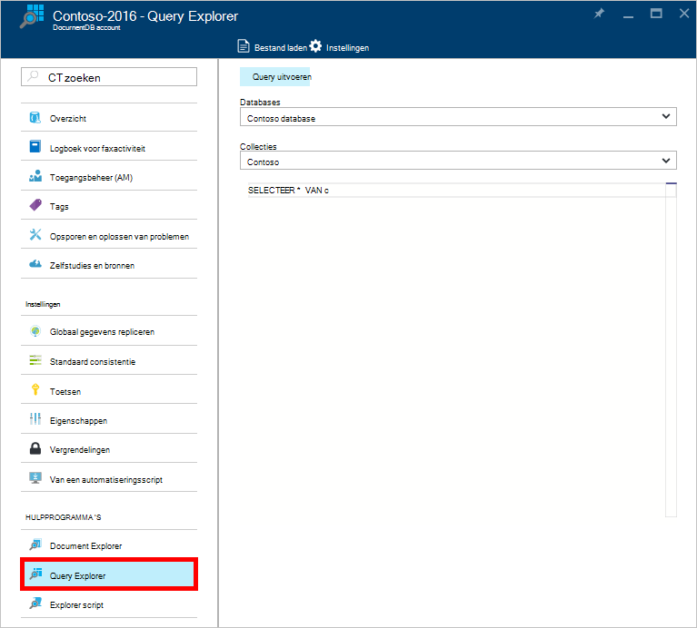

<properties
    pageTitle="Explorer DocumentDB-Query: Een SQL query editor | Microsoft Azure"
    description="Meer informatie over de DocumentDB Query Explorer, een SQL-query editor in Azure portal voor het schrijven van SQL-query's en ze op een collectie NoSQL DocumentDB uitgevoerd."
    keywords="sql-query's sql-query editor schrijven"
    services="documentdb"
    authors="kirillg"
    manager="jhubbard"
    editor="monicar"
    documentationCenter=""/>

<tags
    ms.service="documentdb"
    ms.workload="data-services"
    ms.tgt_pltfrm="na"
    ms.devlang="na"
    ms.topic="article"
    ms.date="08/30/2016"
    ms.author="kirillg"/>

# Schrijven, bewerken en uitvoeren van SQL-query's voor DocumentDB met Query Explorer 

Dit artikel biedt een overzicht van de [DocumentDB voor Microsoft Azure](https://azure.microsoft.com/services/documentdb/) Query Explorer, een Azure portal tool waarmee u kunt schrijven, bewerken en SQL-query's uitvoeren tegen een [DocumentDB-collectie](documentdb-create-collection.md).

1. Klik in de Azure portal, in de Jumpbar, **DocumentDB (NoSQL)**. Als **DocumentDB (NoSQL)** niet zichtbaar is, klikt u op **Meer Services** en klik vervolgens op **DocumentDB (NoSQL)**.

2. Klik op **Query Explorer**in het menu bron. 

    

3. **Databases** en **collecties** aan de query selecteren in de vervolgkeuzelijsten in de blade **Query Explorer** en typt u de query uit te voeren. 

    De **Databases** en **collecties** vervolgkeuzelijsten zijn vooraf ingestelde is afhankelijk van de context waarin u Query Explorer starten. 

    Een standaardquery van `SELECT TOP 100 * FROM c` wordt geleverd.  Als u de standaardquery accepteert of samenstellen van uw eigen query met behulp van de SQL-query language in de [SQL-query cheats blad](documentdb-sql-query-cheat-sheet.md) of het artikel [SQL-query en de SQL-syntaxis](documentdb-sql-query.md) beschreven.

    Klik op **query uitvoeren** om de resultaten te bekijken.

    

4. De blade **resultaten** worden weergegeven voor de uitvoer van de query. 

    

## Werken met resultaten

Standaard geeft de Query Explorer resultaten in sets van 100.  Als de query meer dan 100 resultaten oplevert, kunt u gewoon de opdrachten **volgende pagina** en **vorige pagina** om te navigeren door de resultaatset gebruiken.

Geslaagde query's, **het gegevensvenster** bevat statistieken zoals de kosten van de aanvraag, het aantal retouren de query is gemaakt, de set van de resultaten die op dat moment wordt weergegeven, en of er meer resultaten, die vervolgens kunnen worden geopend via de opdracht **volgende pagina zijn** als die hierboven zijn genoemd.

## Meerdere query's gebruiken

Als u meerdere query's gebruikt en u wilt overschakelen tussen deze, kunt u alle query's invoeren in het vak van de bladeserver **Explorer Query** query vervolgens markeren die u wilt uitvoeren en klik vervolgens op **query uitvoeren** om de resultaten te bekijken.

## Query's in SQL query editor uit een bestand toevoegen

U kunt de inhoud van een bestaand bestand met de opdracht **Bestand laden** laden.

## Problemen oplossen met

Als een query is voltooid met fouten, wordt een lijst met fouten die helpen kunnen bij het oplossen van problemen in Query Explorer weergegeven.

## DocumentDB SQL-query's buiten de portal uitvoeren

De Explorer Query in de portal Azure is slechts één manier om SQL-query's uitvoeren op DocumentDB. U kunt ook met de [REST API](https://msdn.microsoft.com/library/azure/dn781481.aspx) of de [client SDK's](documentdb-sdk-dotnet.md)SQL-query's uitvoeren. Zie voor meer informatie over het gebruik van deze andere methoden, [uitvoeren van SQL-query 's](documentdb-sql-query.md#executing-sql-queries)

## Volgende stappen

Meer informatie over de DocumentDB SQL-grammatica ondersteund in Query Explorer, raadpleegt u het artikel [SQL-query en de SQL-syntaxis](documentdb-sql-query.md) of de [SQL-query cheats vel](documentdb-sql-query-cheat-sheet.md)afdrukken.
U kunt ook profiteren van experimenteren met [Query Speelplaats](https://www.documentdb.com/sql/demo) waar u online een dataset monster met query's kunt testen.
