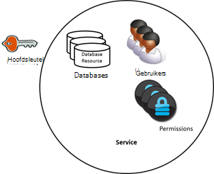
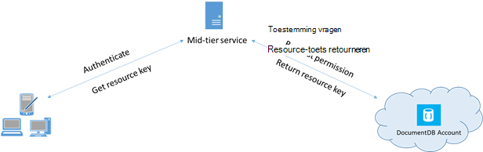

<properties 
    pageTitle="Informatie over het beveiligen van de toegang tot gegevens in DocumentDB | Microsoft Azure" 
    description="Informatie over access control concepten in DocumentDB, met inbegrip van hoofdsleutels, alleen-lezen sleutels, gebruikers en machtigingen." 
    services="documentdb" 
    authors="kiratp" 
    manager="jhubbard" 
    editor="monicar" 
    documentationCenter=""/>

<tags 
    ms.service="documentdb" 
    ms.workload="data-services" 
    ms.tgt_pltfrm="na" 
    ms.devlang="na" 
    ms.topic="article" 
    ms.date="09/19/2016" 
    ms.author="kipandya"/>

# Toegang tot de DocumentDB gegevens beveiligen

Dit artikel bevat een overzicht van de toegang tot gegevens die zijn opgeslagen in [Microsoft Azure DocumentDB](https://azure.microsoft.com/services/documentdb/).

Na het lezen van dit overzicht kun je steeds de volgende vragen te beantwoorden:  

-   Wat zijn de hoofdsleutels DocumentDB?
-   Wat zijn de sleutels alleen-lezen DocumentDB?
-   Wat zijn DocumentDB resource tokens?
-   Hoe kan ik DocumentDB gebruikers en machtigingen voor het beveiligen van toegang tot de gegevens van de DocumentDB gebruiken?

## DocumentDB access control-concepten

DocumentDB biedt eerste klas concepten om toegang tot bronnen van DocumentDB.  Voor de toepassing van dit onderwerp worden de DocumentDB resources gegroepeerd in twee categorieën:

- Administratieve bronnen.
    - Account
    - Database
    - Gebruiker
    - Machtiging
- Toepassingsbronnen
    - Collectie
    - Aanbieding
    - Document
    - Bijlage
    - Opgeslagen procedure
    - Trigger
    - Door de gebruiker gedefinieerde functie

In het kader van deze twee categorieën DocumentDB ondersteunt drie typen access control personas: beheerder, alleen-lezen-beheerder en gebruiker van account.  De rechten voor elke persona access-besturingselement zijn:
 
- Account administrator: volledige toegang tot alle bronnen (administratieve en toepassing) binnen een bepaald DocumentDB account.
- Alleen-lezen-beheerder: alleen-lezen toegang tot alle bronnen (en administratieve toepassing binnen een bepaald DocumentDB account. 
- Gebruiker: DocumentDB van de gebruiker een resource die is gekoppeld aan een specifieke set met bronnen van DocumentDB database (bijvoorbeeld collecties, documenten, scripts).  Er kan een of meer Gebruikersbronnen die zijn gekoppeld aan een bepaalde database en elke resource gebruiker wellicht een of meer machtigingen gekoppeld.

Met de bovengenoemde categorieën en bronnen in het achterhoofd definieert het toegangsbeheermodel DocumentDB drie typen constructies in access:

- Hoofdsleutels: bij het maken van een DocumentDB met twee hoofdsleutels (primaire en secundaire) worden gemaakt.  Deze sleutels kunnen volledige beheerrechten voor alle bronnen binnen de account DocumentDB.

- Alleen-lezen sleutels: bij het maken van een DocumentDB met twee alleen-lezen sleutels (primaire en secundaire) worden gemaakt.  Deze sleutels kunnen alleen-lezen toegang tot alle bronnen binnen de account DocumentDB.

- Tokens resource: een resource token is gekoppeld aan een resource DocumentDB machtiging weergegeven en wordt de relatie tussen de gebruiker van een database en de machtiging heeft voor een specifieke bron DocumentDB van toepassing (bv. verzameling, document).

## Werken met de sleutels master en alleen-lezen DocumentDB

Zoals eerder gezegd, leveren DocumentDB hoofdsleutels volledige beheerrechten voor alle bronnen binnen een DocumentDB-account, alleen-lezen sleutels leestoegang tot alle bronnen binnen de account inschakelen.  Het volgende codefragment ziet u hoe u met een DocumentDB account eindpunt en de hoofdsleutel instantiëren van een DocumentClient en een nieuwe database maken. 

    //Read the DocumentDB endpointUrl and authorization keys from config.
    //These values are available from the Azure Classic Portal on the DocumentDB Account Blade under "Keys".
    //NB > Keep these values in a safe and secure location. Together they provide Administrative access to your DocDB account.
    
    private static readonly string endpointUrl = ConfigurationManager.AppSettings["EndPointUrl"];
    private static readonly SecureString authorizationKey = ToSecureString(ConfigurationManager.AppSettings["AuthorizationKey"]);
        
    client = new DocumentClient(new Uri(endpointUrl), authorizationKey);
    
    // Create Database
    Database database = await client.CreateDatabaseAsync(
        new Database
        {
            Id = databaseName
        });

## Overzicht van DocumentDB resource tokens

U kunt een resource-token (door het maken van DocumentDB gebruikers en machtigingen) als u wilt om toegang te bieden tot bronnen in uw DocumentDB-account aan een client niet kan worden vertrouwd met de hoofdsleutel. Uw hoofdsleutels DocumentDB zijn zowel een primaire en secundaire sleutel, die elk administratieve toegang tot uw account en alle bronnen in het verleent. Uw account met de mogelijkheid van schadelijke of nalatig blootstelling van uw hoofdsleutels worden geopend. 

Ook de sleutels alleen-lezen DocumentDB leestoegang tot alle bronnen - behalve machtiging bronnen, bieden natuurlijk - binnen een DocumentDB-account en kunnen niet worden gebruikt voor meer gedetailleerde toegang tot specifieke bronnen van DocumentDB.

Resource-tokens DocumentDB bieden een veilig alternatief waarmee clients kunnen lezen, schrijven en verwijderen van bronnen in uw account DocumentDB basis van de machtigingen die u hebt verleend en zonder de noodzaak voor een master- of alleen belangrijke lezen.

Dit is een typische ontwerppatroon, waarbij bron tokens kunnen worden aangevraagd, gegenereerd en geleverd aan clients:

1. Een midden-tier-service is ingesteld voor een mobiele toepassing voor het delen van foto's van gebruiker.
2. De midden-tier-service beschikt over de hoofdsleutel van de account DocumentDB.
3. De foto-app is op mobiele apparaten eindgebruiker geïnstalleerd. 
4. De foto-app stelt op aanmelding, de identiteit van de gebruiker met de midden-tier-service. Dit mechanisme van de vaststelling van de identiteit is uitsluitend aan de toepassing.
5. Nadat de identiteit is vastgesteld, de midden-tier-service-aanvragen machtigingen op basis van de identiteit.
6. De midden-tier-service wordt een resource-token teruggestuurd naar de telefoon app.
7. De app telefoon kunt blijven gebruiken het token resource rechtstreeks toegang krijgen tot bronnen van de DocumentDB met de machtigingen die zijn gedefinieerd door het token van de resource en voor het interval dat is toegestaan door het token van de resource. 
8. Wanneer de resource-token verlopen, ontvangt de volgende aanvragen een 401-niet-toegestane uitzondering.  Op dit moment de phone app herstelt de identiteit en vraagt om een nieuwe resource-token.

## Werken met DocumentDB gebruikers en machtigingen
Een DocumentDB gebruiker een resource is gekoppeld aan een database met DocumentDB.  Elke database kan gebruikers van nul of meer DocumentDB bevatten.  Het volgende codefragment ziet u hoe een gebruiker DocumentDB bron maken.

    //Create a user.
    User docUser = new User
    {
        Id = "mobileuser"
    };

    docUser = await client.CreateUserAsync(UriFactory.CreateDatabaseUri("db"), docUser);

> [AZURE.NOTE] Elke gebruiker DocumentDB heeft een PermissionsLink-eigenschap die kan worden gebruikt voor het ophalen van de lijst met machtigingen die zijn gekoppeld aan de gebruiker.

Een DocumentDB machtiging bron is gekoppeld aan een gebruiker DocumentDB.  Elke gebruiker kan machtigingen voor nul of meer DocumentDB bevatten.  Een machtiging bron biedt toegang tot een beveiligingstoken dat door de gebruiker nodig wanneer u probeert toegang te krijgen tot de bron van een specifieke toepassing.
Er zijn twee toegangsniveaus die door een resource toestemming worden gegeven:

- Alle: De gebruiker heeft volledige machtigingen voor de bron
- Lezen: De gebruiker kan de inhoud van de resource alleen lezen maar niet schrijven, update of delete-bewerkingen op de bron uitvoeren.

> [AZURE.NOTE] Opgeslagen procedures die de gebruiker moet gemachtigd zijn de alle objecten in de collectie waarin u de opgeslagen procedure wordt uitgevoerd om te kunnen DocumentDB uitvoeren.

Het volgende stukje code laat zien hoe een machtiging bron maken, het token van de bron van de bron van de machtiging lezen en machtigingen voor het koppelen aan de gebruiker dat hierboven is gemaakt.

    // Create a permission.
    Permission docPermission = new Permission
    {
        PermissionMode = PermissionMode.Read,
        ResourceLink = documentCollection.SelfLink,
        Id = "readperm"
    };
            
  docPermission = wacht tot de client. CreatePermissionAsync (UriFactory.CreateUserUri ("db", "gebruiker"), docPermission); Console.WriteLine (docPermission.Id + "token van is:" + docPermission.Token);
  
Als u een partitiesleutel hebt opgegeven voor uw verzameling, wordt de machtiging voor het verzamelen, moeten de bronnen en de bijlage ook de ResourcePartitionKey naast de ResourceLink bevatten.

Om gemakkelijk alle machtiging resources die zijn gekoppeld aan een bepaalde gebruiker, feed DocumentDB beschikking stelt een machtiging voor elke gebruikersobject.  Het volgende stukje code laat zien hoe de machtiging die is gekoppeld aan de bovenstaande gebruiker ophalen, samenstellen van een lijst met machtigingen en exemplaar maken van een nieuwe DocumentClient voor de gebruiker.

    //Read a permission feed.
    FeedResponse<Permission> permFeed = await client.ReadPermissionFeedAsync(
      UriFactory.CreateUserUri("db", "myUser"));

    List<Permission> permList = new List<Permission>();
      
    foreach (Permission perm in permFeed)
    {
        permList.Add(perm);
    }
            
    DocumentClient userClient = new DocumentClient(new Uri(endpointUrl), permList);

> [AZURE.TIP] Tokens resource hebben een geldige timespan standaard van 1 uur.  Levensduur van tokens, echter kan worden expliciet opgegeven, met een maximum van 5 uur.

## Volgende stappen

- Voor meer informatie over DocumentDB, klik [hier](http://azure.com/docdb).
- Meer informatie over het beheren van de master-en alleen-lezen, klik [hier](documentdb-manage-account.md).
- Meer informatie over het samenstellen van DocumentDB vergunning tokens, klik [hier](https://msdn.microsoft.com/library/azure/dn783368.aspx)
 
