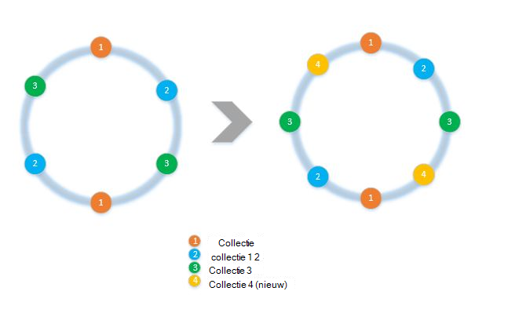
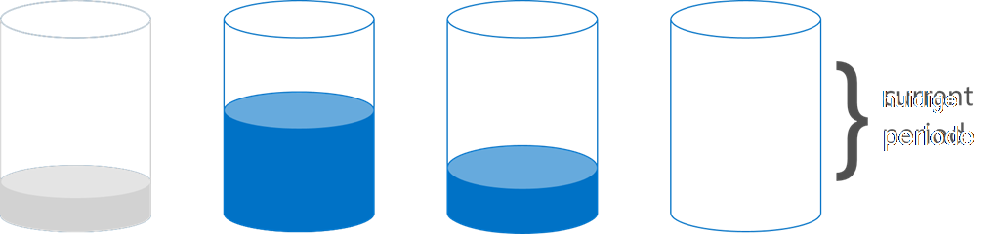

<properties 
    pageTitle="Het implementeren van client-side partitioneren met de SDK's | Microsoft Azure" 
    description="Informatie over het gebruik van de Azure DocumentDB SDK's op partitie (shard) gegevens en route-aanvragen over meerdere collecties" 
    services="documentdb" 
    authors="arramac" 
    manager="jhubbard" 
    editor="cgronlun" 
    documentationCenter=""/>

<tags 
    ms.service="documentdb" 
    ms.workload="data-services" 
    ms.tgt_pltfrm="na" 
    ms.devlang="na" 
    ms.topic="article" 
    ms.date="10/27/2016" 
    ms.author="arramac"/>

# <a name="how-to-partition-data-using-client-side-support-in-documentdb"></a>Partitioneren van gegevens met behulp van client-side support in DocumentDB

Azure DocumentDB ondersteunt [Automatische partitionering van collecties](documentdb-partition-data.md). Er zijn echter gebruik situaties waarin het nuttig is voor fijn korrelig over partitioneren werking. Ter vermindering van de ketel plaat-code vereist is voor het partitioneren van taken, hebben we extra functionaliteit in .NET, Node.js en Java-SDK's die gemakkelijker toepassingen kunnen maken die schaalvergroting in meerdere collecties.

In dit artikel, zult we Kijk eens naar de klassen en interfaces in de SDK voor .NET en hoe u ze kunt gebruiken voor het ontwikkelen van toepassingen gepartitioneerde. Andere SDK's zoals Java, Node.js en Python ondersteuning voor soortgelijke methoden en -interfaces voor het partitioneren van client-side.

## <a name="client-side-partitioning-with-the-documentdb-sdk"></a>Client-side partitioneren met de DocumentDB SDK

Voordat we dieper graven in partities recap we enkele DocumentDB basisconcepten die betrekking op partitioneren hebben. Elke account Azure DocumentDB database bestaat uit een set van databases, elk met verschillende collecties, die elk opgeslagen procedures, triggers, UDF's, documenten en bijbehorende bijlagen kan bevatten. Verzamelingen kunnen worden één partitie of gepartitioneerde zelf en hebben de volgende eigenschappen:

- Verzamelingen bieden prestaties isolatie. Het is daarom een vergoeding voor prestaties in vergelijking van soortgelijke documenten binnen dezelfde collectie. Bijvoorbeeld voor tijd reeksgegevens kunt u plaatsen voor de laatste maand, wordt vaak gevraagd, binnen een collectie met hogere ingerichte doorvoer dat oudere gegevens in collecties met lage ingerichte doorvoersnelheid is geplaatst.
- ZURE transacties dat wil zeggen van opgeslagen procedures en triggers kunnen niet een verzameling beslaan. Transacties worden binnen het bereik binnen een enkele partitie sleutelwaarde binnen een collectie.
- Collecties afdwingen niet een schema, zodat ze kunnen worden gebruikt voor JSON-documenten van hetzelfde type of verschillende typen.

Vanaf versie [1.5.x van de SDK's Azure-DocumentDB](documentdb-sdk-dotnet.md), kunt u bewerkingen document rechtstreeks met een database. Intern gebruikt de [DocumentClient](https://msdn.microsoft.com/library/azure/microsoft.azure.documents.client.documentclient.aspx) de PartitionResolver die u hebt opgegeven voor de database op route verzoeken aan de juiste verzameling.

>[AZURE.NOTE] [Server-side partitionering](documentdb-partition-data.md) geïntroduceerd in REST API 2015-12-16 en SDK's 1.6.0+ deprecates de partitie aan de clientzijde resolver benadering voor eenvoudige use-cases. Partitioneren van client-side echter is flexibeler en kunt u prestaties isolatie over partitiesleutels beheren, mate van parallellisme bepalen tijdens het lezen van de resultaten van meerdere partities en bereik/ruimtelijke partitionering benaderingen versus hash gebruikt.

In .NET, bijvoorbeeld, is elke klasse PartitionResolver een concrete implementatie van een [IPartitionResolver](https://msdn.microsoft.com/library/azure/microsoft.azure.documents.client.ipartitionresolver.aspx) -interface drie methoden - [GetPartitionKey](https://msdn.microsoft.com/library/azure/microsoft.azure.documents.client.ipartitionresolver.getpartitionkey.aspx), [ResolveForCreate](https://msdn.microsoft.com/library/azure/microsoft.azure.documents.client.ipartitionresolver.resolveforcreate.aspx) en [ResolveForRead heeft](https://msdn.microsoft.com/library/azure/microsoft.azure.documents.client.ipartitionresolver.resolveforread.aspx). LINQ-query's en iterators ReadFeed de ResolveForRead methode gebruiken intern worden herhaald voor alle collecties die overeenkomen met de partitiesleutel voor de aanvraag. Ook maakt u bewerkingen gebruikt de methode ResolveForCreate worden doorgestuurd naar de juiste partitie maakt. Er zijn geen wijzigingen vereist voor vervangen, verwijderen en lezen omdat het gebruik van documenten die reeds de verwijzing naar de bijbehorende collectie bevatten.

De SDK bevat ook twee klassen die ondersteuning bieden voor de twee canonieke partitionering technieken, hashing en bereik lookups, via een [HashPartitionResolver](https://msdn.microsoft.com/library/azure/microsoft.azure.documents.partitioning.hashpartitionresolver.aspx) en een [RangePartitionResolver](https://msdn.microsoft.com/library/azure/mt126047.aspx). Deze klassen kunt u gemakkelijk partitionering logica toevoegen aan uw toepassing.  

## <a name="add-partitioning-logic-and-register-the-partitionresolver"></a>Partitionering logica toevoegen en registreren van de PartitionResolver 

Hier is een fragment waarin wordt getoond hoe een [HashPartitionResolver](https://msdn.microsoft.com/library/azure/microsoft.azure.documents.partitioning.hashpartitionresolver.aspx) maken en registreren met de DocumentClient voor een database.

```cs
// Create some collections to partition data.
DocumentCollection collection1 = await client.CreateDocumentCollectionAsync(...);
DocumentCollection collection2 = await client.CreateDocumentCollectionAsync(...);

// Initialize a HashPartitionResolver using the "UserId" property and the two collection self-links.
HashPartitionResolver hashResolver = new HashPartitionResolver(
    u => ((UserProfile)u).UserId, 
    new string[] { collection1.SelfLink, collection2.SelfLink });

// Register the PartitionResolver with the database.
this.client.PartitionResolvers[database.SelfLink] = hashResolver;

```

## <a name="create-documents-in-a-partition"></a>Documenten maken in een partitie  

Zodra de PartitionResolver is geregistreerd, kunt u uitvoeren wordt gemaakt en de query's rechtstreeks in de database, zoals hieronder wordt weergegeven. In dit voorbeeld wordt wordt de SDK de PartitionResolver pakken de gebruikersnaam, het hash- en die waarde vervolgens gebruiken voor het routeren van de create-bewerking aan de juiste verzameling.

```cs
Document johnDocument = await this.client.CreateDocumentAsync(
    database.SelfLink, new UserProfile("J1", "@John", Region.UnitedStatesEast));
Document ryanDocument = await this.client.CreateDocumentAsync(
    database.SelfLink, new UserProfile("U4", "@Ryan", Region.AsiaPacific, UserStatus.AppearAway));
```

## <a name="create-queries-against-partitions"></a>Query's op partities maken  

U kunt zoeken met behulp van de methode [CreateDocumentQuery](https://msdn.microsoft.com/library/azure/microsoft.azure.documents.linq.documentqueryable.createdocumentquery.aspx) door doorgeven in de database en de partitiesleutel van een. De query retourneert één resultaatset via alle collecties in de database die zijn toegewezen aan de partitiesleutel.  

```cs
// Query for John's document by ID - uses PartitionResolver to restrict the query to the partitions 
// containing @John. Again the query uses the database self link, and relies on the hash resolver 
// to route the appropriate collection.
var query = this.client.CreateDocumentQuery<UserProfile>(
    database.SelfLink, null, partitionResolver.GetPartitionKey(johnProfile))
    .Where(u => u.UserName == "@John");
johnProfile = query.AsEnumerable().FirstOrDefault();
```

## <a name="create-queries-against-all-collections-in-the-database"></a>Het maken van query's voor alle collecties in de database 

U kunt ook alle collecties in de database opvragen en inventariseren van de resultaten zoals hieronder, door het overslaan van de belangrijkste argument partitie weergeven.

```cs
// Query for all "Available" users. Here since there is no partition key, the query is serially executed 
// across each partition/collection and returns a single result-set. 
query = this.client.CreateDocumentQuery<UserProfile>(database.SelfLink)
    .Where(u => u.Status == UserStatus.Available);
foreach (UserProfile activeUser in query)
{
    Console.WriteLine(activeUser);
}
```

## <a name="hash-partition-resolver"></a>Hash-partitie Resolver
Partities worden toegewezen op basis van de waarde van een hash-functie, zodat u kunt aanvragen en gegevens gelijkmatig verdelen over een aantal partities met hash-partitionering. Deze benadering wordt meestal gebruikt om de partitie gegevens geproduceerd of uit een groot aantal verschillende clients verbruikt en is handig voor het opslaan van gebruikersprofielen, catalogusitems en telemetriegegevens van IoT ("Internet van dingen"). Hash-partitionering wordt ook gebruikt door DocumentDB van partitionering serverondersteuning binnen een collectie.

**Hash-partitionering:**


Een eenvoudige hash partitieschema over collecties *N* zou berekenen *hash(d) mod N* als u wilt vaststellen welke collectie die is opgeslagen op te nemen van alle documenten zijn. Maar een probleem met deze eenvoudige techniek is dat het werkt niet goed wanneer u nieuwe collecties toevoegen of verwijderen van collecties als dit zou betekenen dat vrijwel alle gegevens op reshuffled ophalen. [Consistent hashing] (http://citeseerx.ist.psu.edu/viewdoc/summary?doi=10.1.1.23.3738) is een bekend algoritme die u dit corrigeert door het implementeren van een hash-schema dat Hiermee minimaliseert u de hoeveelheid verplaatsing van gegevens vereist tijdens het toevoegen of verwijderen van collecties.

De klasse [HashPartitionResolver](https://msdn.microsoft.com/library/azure/microsoft.azure.documents.partitioning.hashpartitionresolver.aspx) implementeert logica voor het bouwen van een consistente hash-ring via de hash-functie in de [IHashGenerator](https://msdn.microsoft.com/library/azure/microsoft.azure.documents.partitioning.ihashgenerator.aspx) -interface opgegeven. Een MD5-hash-functie maakt gebruik van de HashPartitionResolver, maar u kunt dit uit wisselen met uw eigen hash-implementatie. De HashPartitionResolver maakt intern 16 hashes of 'virtuele knooppunten' in de hash-ring voor elke collectie om te komen tot een meer uniforme verdeling van documenten over de collecties, maar u kunt dit nummer voor het handelsverkeer uit de scheefheid van de gegevens met het bedrag van de berekening van client-side variëren.

**Consistente hashing met HashPartitionResolver:**


## <a name="range-partition-resolver"></a>Bereik partitie Resolver

In het bereik partitionering, partities toegewezen op basis van de vraag of de partitiesleutel binnen een bepaald bereik is. Dit wordt vaak gebruikt voor het partitioneren van de eigenschappen van tijdstempel (bijv. eventTime tussen 1 april 2015 en 14 april 2015). De klasse [RangePartitionResolver](https://msdn.microsoft.com/library/azure/mt126047.aspx) kunt u een toewijzing tussen een reeks onderhouden\<T\> en de automatische koppeling-collectie. 

[Bereik\<T\> ](https://msdn.microsoft.com/library/azure/mt126048.aspx) is een eenvoudige klasse die het bereiken van een IComparable implementeren die u beheert\<T\> en IEquatable\<T\> , zoals tekenreeksen of getallen. Voor leest en maakt, kunt u in elke willekeurige bereik doorgeven en de resolver alle kandidaat-collecties door het bereiken van de partities die elkaar overlappen met het opgegeven bereik aanduidt. Deze functie is handig bij het uitvoeren van query's bereik tegen tijd reeksgegevens.

**Reeks partitioneren:**  

  

Een speciaal geval van het partitioneren van het bereik is als het bereik slechts één afzonderlijke waarde, ook wel genoemd "lookup partitioneren" is. Dit wordt gewoonlijk gebruikt voor het partitioneren van de regio (bv. de partitie voor Scandinavië bevat Noorwegen, Denemarken en Zweden) of voor het partitioneren van huurders in een toepassing met meerdere huurder.

## <a name="samples"></a>Voorbeelden 

Kijk eens naar het [DocumentDB partitionering monsters Github project](https://github.com/Azure/azure-documentdb-dotnet/tree/287acafef76ad223577759b0170c8f08adb45755/samples/code-samples/Partitioning) met codefragmenten voor het gebruik van deze PartitionResolvers en het uitbreiden daarvan voor het implementeren van uw eigen resolvers aanpassen aan specifieke gevallen, zoals de volgende: 

* Het opgeven van een willekeurige lambda-expressie voor GetPartitionKey en gebruiken voor het implementeren van samengestelde partitionering toetsen of om verschillende typen objecten anders.
* Het maken van een eenvoudig [LookupPartitionResolver](https://github.com/Azure/azure-documentdb-dotnet/blob/287acafef76ad223577759b0170c8f08adb45755/samples/code-samples/Partitioning/Partitioners/LookupPartitionResolver.cs) dat een handmatige opzoektabel wordt gebruikt voor het uitvoeren van partities. Dit patroon wordt meestal gebruikt voor partitionering op basis van afzonderlijke waarden zoals regio, huurder-ID of toepassing naam.
* Het maken van een [ManagedPartitionResolver](https://github.com/Azure/azure-documentdb-dotnet/blob/287acafef76ad223577759b0170c8f08adb45755/samples/code-samples/Partitioning/Partitioners/ManagedHashPartitionResolver.cs) die automatisch op basis van een sjabloon met een definitie van een schema voor naamgeving, IndexingPolicy en opgeslagen procedures die moeten worden geregistreerd ten opzichte van nieuwe collecties-collecties gemaakt.
* Het maken van een regeling minder [SpilloverPartitionResolver](https://github.com/Azure/azure-documentdb-dotnet/blob/287acafef76ad223577759b0170c8f08adb45755/samples/code-samples/Partitioning/Partitioners/SpilloverPartitionResolver.cs) die gewoon nieuwe collecties gemaakt terwijl de oude collecties opvullen.
* Het serialiseren en terugconverteren van uw PartitionResolver staat als JSON, zodat u tussen processen en verschillende afsluitingen delen kunt. U kunt deze in configuratiebestanden, of zelfs in een collectie DocumentDB aanhouden.
* Een [DocumentClientHashPartitioningManager](https://github.com/Azure/azure-documentdb-dotnet/blob/287acafef76ad223577759b0170c8f08adb45755/samples/code-samples/Partitioning/Util/DocumentClientHashPartitioningManager.cs) -klasse voor het dynamisch toevoegen en verwijderen van partities met een database gepartitioneerd gebaseerd op consistente hashing. Intern wordt gebruikt een [TransitionHashPartitionResolver](https://github.com/Azure/azure-documentdb-dotnet/blob/287acafef76ad223577759b0170c8f08adb45755/samples/code-samples/Partitioning/Partitioners/TransitionHashPartitionResolver.cs) om de route leest en schrijft tijdens de migratie met behulp van een van de vier modi - lezen van het oude partitieschema (ReadCurrent), nieuwe (ReadNext), de resultaten van beide (ReadBoth) samenvoegen of niet beschikbaar tijdens de migratie (geen).

De monsters zijn open-source en raden we u aan pull-aanvragen met de bijdragen die andere ontwikkelaars DocumentDB kon profiteren indienen. Raadpleeg de [richtlijnen van de bijdrage](https://github.com/Azure/azure-documentdb-net/blob/master/Contributing.md) voor instructies over het te dragen.  

>[AZURE.NOTE] Collectie maakt zijn snelheid beperkt door DocumentDB, zodat enkele monster methoden die hier worden weergegeven kan enkele minuten in beslag nemen.

##<a name="faq"></a>FAQ
**DocumentDB ondersteunt server-side partitioneren?**

DocumentDB Ja, ondersteunt de [server-side partitioneren](documentdb-partition-data.md). DocumentDB biedt ook ondersteuning voor client-side via resolvers voor meer geavanceerde use-cases aan de clientzijde partitie partitioneren.

**Wanneer gebruikt u server-side versus partitioneren van client-side?**
Voor de meeste gevallen gebruikt, wordt aangeraden het gebruik van server-side partitioneren aangezien de beheertaken van het partitioneren van gegevens en routering van aanvragen worden verwerkt. Echter, als u moet partitioneren variëren of een specifieke use-case voor prestaties isolatie tussen de verschillende waarden van de partitiesleutels, vervolgens partitioneren van client-side mogelijk de beste benadering.

**Hoe ik toevoegen of verwijderen van een collectie aan mijn partitieschema?**

Kijk op de implementatie van DocumentClientHashPartitioningManager in het project monsters voor een voorbeeld van hoe partitioneren implementeren.

**Hoe ik aanhouden of mijn configuratie delen met andere clients?**

U kunt de partitioner staat als JSON serialiseren en opslaan in de configuratiebestanden, of zelfs binnen DocumentDB collecties. Bekijk de methode RunSerializeDeserializeSample in het project monsters voor een voorbeeld.

**Hoe ik verschillende technieken voor partitionering keten?**

U kunt de PartitionResolvers koppelen door het implementeren van uw eigen IPartitionResolver die een of meer bestaande resolvers intern gebruikt. Bekijk de TransitionHashPartitionResolver in het project monsters voor een voorbeeld.

##<a name="references"></a>Verwijzingen
* [Server-side partitioneren in DocumentDB](documentdb-partition-data.md)
* [DocumentDB collecties en prestaties](documentdb-performance-levels.md)
* [Partitioneren van codevoorbeelden op Github](https://github.com/Azure/azure-documentdb-dotnet/tree/287acafef76ad223577759b0170c8f08adb45755/samples/code-samples/Partitioning)
* [DocumentDB .NET SDK-documentatie op MSDN](https://msdn.microsoft.com/library/azure/dn948556.aspx)
* [Monsters DocumentDB .NET](https://github.com/Azure/azure-documentdb-net)
* [Limieten voor DocumentDB](documentdb-limits.md)
* [DocumentDB-Blog over Tips voor betere prestaties](https://azure.microsoft.com/blog/2015/01/20/performance-tips-for-azure-documentdb-part-1-2/)
 
