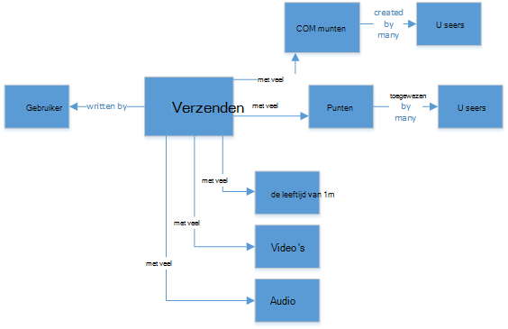
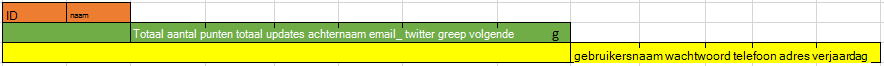
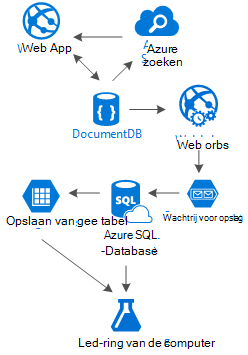

<properties 
    pageTitle="DocumentDB ontwerppatroon: sociale media apps | Microsoft Azure" 
    description="Meer informatie over een ontwerppatroon voor sociale netwerken door gebruik te maken van de flexibiliteit van de opslag van DocumentDB en andere Azure diensten." 
    keywords="sociale media apps"
    services="documentdb" 
    authors="ealsur" 
    manager="jhubbard" 
    editor="" 
    documentationCenter=""/>

<tags 
    ms.service="documentdb" 
    ms.workload="data-services" 
    ms.tgt_pltfrm="na" 
    ms.devlang="na" 
    ms.topic="article" 
    ms.date="09/27/2016" 
    ms.author="mimig"/>

# Sociale met DocumentDB gaan

Leven in een samenleving massively onderling betekent dat op een bepaald moment in het leven u deel van een **sociaal netwerk uitmaken**. Sociale netwerken gebruiken we om te communiceren met vrienden, collega's, familie of soms onze passie delen met mensen met gemeenschappelijke belangen.

Als ingenieur en ontwikkelaars we mogelijk hebben zich afgevraagd hoe deze netwerken worden opgeslagen en interconnect onze gegevens, of mogelijk hebben zelfs de taak gekregen om te maken of het bouwen van een nieuw sociaal netwerk voor een specifieke niche uzelf. Als rijst de grote vraag: hoe worden al deze gegevens opgeslagen?

Stel dat u een nieuw en glanzend sociale netwerk, waar onze gebruikers artikelen met verwante media zoals afbeeldingen, video's of zelfs muziek kunnen boeken. Gebruikers kunnen commentaar geven op berichten en punten geven voor beoordelingen. Zal er een feed van berichten die gebruikers te zien krijgen en kunnen werken met op de openingspagina van de belangrijkste website. Dit niet klinkt erg complex (in eerste), maar omwille van de eenvoud laten we het daar (we aangepaste feeds beïnvloed door relaties kan dieper, maar deze groter is dan het doel van dit artikel).

Dus, hoe we dit opslaan en waar?

Velen van u mogelijk ervaring op SQL-databases of in ieder geval begrip van [relationele gegevens modelleren](https://en.wikipedia.org/wiki/Relational_model) en u misschien geneigd om te beginnen met het tekenen iets dergelijks:

 

Een perfect genormaliseerde en mooie gegevensstructuur... die niet wordt geschaald. 

Krijg geen me verkeerd, ik heb gewerkt met SQL-databases alle mijn leven, ze zijn geweldig, maar net als elk patroon, praktijken en software platform, het is niet ideaal voor elk scenario.

Waarom niet de beste keuze in dit scenario SQL? We kijken naar de structuur van een enkel bericht als ik dat bericht weergeven in een website of toepassing wilde, dat zou er een query uitvoeren met... 8 tabel-joins (!), gewoon om één enkel, nu boeken, een stroom van berichten die dynamisch worden geladen en weergegeven op het scherm en u kunt zien waar ik ga figuur weer te geven.

We kunnen natuurlijk humongous SQL-exemplaar met voldoende oplossen duizenden van query's met te veel koppelingen gebruikt voor onze inhoud, maar echt, waarom zou doen we een eenvoudiger oplossing bestaat gebruiken?

## De weg NoSQL

Er zijn speciale grafiek databases die u [uitvoeren op Azure kunnen](http://neo4j.com/developer/guide-cloud-deployment/#_windows_azure) , maar ze zijn niet goedkoop en hoeft IaaS diensten (Infrastructure as a Service, virtuele Machines voornamelijk) en onderhoud. Ik ga dit artikel op een lagere kosten oplossing die geschikt is voor de meeste scenario's wordt uitgevoerd op de Azure NoSQL database [DocumentDB](https://azure.microsoft.com/services/documentdb/)zijn gericht. Met behulp van een [NoSQL](https://en.wikipedia.org/wiki/NoSQL) aanpak, gegevens in JSON-indeling opslaan en toepassen van [denormalization](https://en.wikipedia.org/wiki/Denormalization), worden onze eerder ingewikkelde boeken omgezet in een enkel [Document](https://en.wikipedia.org/wiki/Document-oriented_database):

    {
        "id":"ew12-res2-234e-544f",
        "title":"post title",
        "date":"2016-01-01",
        "body":"this is an awesome post stored on NoSQL",
        "createdBy":User,
        "images":["http://myfirstimage.png","http://mysecondimage.png"],
        "videos":[
            {"url":"http://myfirstvideo.mp4", "title":"The first video"},
            {"url":"http://mysecondvideo.mp4", "title":"The second video"}
        ],
        "audios":[
            {"url":"http://myfirstaudio.mp3", "title":"The first audio"},
            {"url":"http://mysecondaudio.mp3", "title":"The second audio"}
        ]
    }

En kan worden verkregen met een enkele query, en geen joins. Dit is veel meer eenvoudig en ongecompliceerd en budget-wise, er minder bronnen om een beter resultaat te bereiken.

Azure DocumentDB zorgt ervoor dat de eigenschappen worden geïndexeerd met de [automatische indexering](documentdb-indexing.md)die zelfs kan [aangepast worden](documentdb-indexing-policies.md). De schema-vrije benadering kan we het opslaan van documenten met verschillende en dynamische structuren, morgen misschien die we bijdragen willen aan een lijst met categorieën of hashtags gekoppeld, DocumentDB de nieuwe documenten met de toegevoegde kenmerken zonder extra werk nodig is door ons worden verwerkt.

Reacties op een bericht kunnen worden behandeld als gewoon andere advertenties met een bovenliggende eigenschap (vereenvoudigt de toewijzing van het object). 

    {
        "id":"1234-asd3-54ts-199a",
        "title":"Awesome post!",
        "date":"2016-01-02",
        "createdBy":User2,
        "parent":"ew12-res2-234e-544f"
    }

    {
        "id":"asd2-fee4-23gc-jh67",
        "title":"Ditto!",
        "date":"2016-01-03",
        "createdBy":User3,
        "parent":"ew12-res2-234e-544f"
    }

En alle sociale interacties kunnen worden opgeslagen op een afzonderlijk object als items:

    {
        "id":"dfe3-thf5-232s-dse4",
        "post":"ew12-res2-234e-544f",
        "comments":2,
        "likes":10,
        "points":200
    }

Maken van feeds is gewoon een kwestie van het maken van documenten waarin een lijst met id's boeken met een bepaalde relevantie volgorde:

    [
        {"relevance":9, "post":"ew12-res2-234e-544f"},
        {"relevance":8, "post":"fer7-mnb6-fgh9-2344"},
        {"relevance":7, "post":"w34r-qeg6-ref6-8565"}
    ]

We wellicht een "recente" stroom berichten gesorteerd op aanmaakdatum, die advertenties met 'populairste' stream graag meer in de laatste 24 uur en we zelfs een aangepaste stroom voor elke gebruiker op basis van de logica zoals hobbyisten en belangen kan implementeren is nog een lijst met berichten. Het is een kwestie van hoe u deze lijsten, maar de prestaties lezen blijft vervuld. Als we een van deze lijsten aanschaffen, geven we één query aan DocumentDB met de [IN-operator](documentdb-sql-query.md#where-clause) voor pagina's met advertenties tegelijk.

De feed streams kunnen worden opgebouwd met behulp van achtergrondprocessen [Azure App Services](https://azure.microsoft.com/services/app-service/) : [Webjobs](../app-service-web/web-sites-create-web-jobs.md). Zodra een bericht is gemaakt, kan achtergrondverwerking met [Azure opslag](https://azure.microsoft.com/services/storage/) [wachtrijen](../storage/storage-dotnet-how-to-use-queues.md) en geactiveerd met behulp van de [SDK van Azure Webjobs](../app-service-web/websites-dotnet-webjobs-sdk.md), het doorgeven van de post binnen stromen op basis van onze eigen aangepaste logica implementeren van Webjobs worden geactiveerd. 

Punten en positieve via een advertentie worden op een uitgestelde wijze met behulp van deze techniek voor het maken van een uiteindelijk consistente omgeving verwerkt.

Hobbyisten zijn lastiger. DocumentDB heeft een Documentlimiet van 512Kb, zodat u denkt misschien over pc-gebruikers op te slaan als een document met deze structuur:

    {
        "id":"234d-sd23-rrf2-552d",
        "followersOf": "dse4-qwe2-ert4-aad2",
        "followers":[
            "ewr5-232d-tyrg-iuo2",
            "qejh-2345-sdf1-ytg5",
            //...
            "uie0-4tyg-3456-rwjh"
        ]
    }

Dit kan werken voor een gebruiker met een paar duizend Volgers, maar als sommige beroemdheden toegevoegd aan onze rangen, in deze benadering wordt uiteindelijk het GLB document grootte bereikt.

U verhelpt dit, gebruiken we een gemengde aanpak. We kunnen het aantal hobbyisten worden opgeslagen als onderdeel van het document gebruikersstatistieken:

    {
        "id":"234d-sd23-rrf2-552d",
        "user": "dse4-qwe2-ert4-aad2",
        "followers":55230,
        "totalPosts":452,
        "totalPoints":11342
    }

En de werkelijke grafiek van hobbyisten kan worden opgeslagen op Azure opslag tabellen met een andere [extensie](https://github.com/richorama/AzureStorageExtensions#azuregraphstore) waarmee eenvoudige "Volgt-A-B" opslaan en ophalen. Op deze manier kunnen we het proces voor het ophalen van de exacte hobbyisten lijst (als we dit nodig is) naar Azure opslag tabellen, maar voor het opzoeken van een verkorte nummers delegeren, blijven we DocumentDB gebruiken.

## Het dupliceren van gegevens en het patroon "Ladder"

Zoals u wellicht hebt opgemerkt in de JSON-document die verwijst naar een bericht, zijn er meerdere exemplaren van een gebruiker. En u zou hebben geraden rechts, dat dit betekent dat de gegevens waarmee een gebruiker, deze denormalization, die mogelijk aanwezig in meer dan één plaats.

Wij maken bij duplicatie van gegevens teneinde voor snellere query's. Het probleem met dit neveneffect is dat als door een bepaalde gebruiker worden gewijzigd, moeten we alle activiteiten zoeken hij ooit heeft en deze allemaal bijgewerkt. Geen geluid zeer praktische, rechts?

Grafiek databases los deze op hun eigen manier, gaan we dit oplossen door het identificeren van de kenmerken van de sleutel van een gebruiker die we in onze toepassing voor elke activiteit zien. Als wij visueel weergeven van een bericht in de toepassing en alleen de maker van de naam en afbeelding tonen, Waarom slaat u alle gegevens van de gebruiker in het kenmerk "createdBy"? Voor elke opmerking we alleen de afbeelding van de gebruiker weergeven, moeten we niet echt de rest van zijn informatie. Dat is waar iets dat ik bellen 'Ladder patroon' komt in beeld.

Laten we de gebruikersinformatie als voorbeeld:

    {
        "id":"dse4-qwe2-ert4-aad2",
        "name":"John",
        "surname":"Doe",
        "address":"742 Evergreen Terrace",
        "birthday":"1983-05-07",
        "email":"john@doe.com",
        "twitterHandle":"@john",
        "username":"johndoe",
        "password":"some_encrypted_phrase",
        "totalPoints":100,
        "totalPosts":24
    }
    
Door te kijken op deze informatie, kunnen we snel opsporen die essentiële informatie en welke niet, waardoor er een "Ladder":

De kleinste stap heet een UserChunk, de minimale stukje informatie dat een gebruiker wordt geïdentificeerd en wordt gebruikt voor het kopiëren van gegevens. Vermindert de grootte van de dubbele gegevens alleen de informatie "zien,", verminderen we de mogelijkheid van enorme updates.

De middelste stap wordt de gebruiker genoemd, is de volledige gegevens die worden gebruikt op de meeste afhankelijk van de prestaties van query's op DocumentDB, de meest gebruikte en kritiek. Deze bevat de informatie die wordt vertegenwoordigd door een UserChunk.

De grootste waarde is van de gebruiker uitgebreid. Bevat alle essentiële informatie en andere gegevens die niet echt noodzakelijk is om snel worden gelezen of gebruik de uiteindelijke (net als bij de aanmelding) is. Deze gegevens kan buiten de DocumentDB in Azure SQL-Database of Azure opslag tabellen worden opgeslagen.

Waarom zouden we de gebruiker splitsen en deze informatie ook opslaan op verschillende plaatsen? Omdat opslagruimte in DocumentDB is [niet oneindig](documentdb-limits.md) en van de prestaties van een punt van het beeld, hoe groter de documenten, de costlier de query's. Documenten, met de juiste informatie te doen alle afhankelijk van de prestaties van query's voor het sociale netwerk en de andere extra informatie opgeslagen voor eventuele scenario's zoals volledig profiel bewerkt, aanmeldingen, datamining voor gebruiksanalyse en Big Data initiatieven, zelfs dunne houden. Wij echt niet van belang als de gegevens verzamelen voor datamining langzamer omdat Azure SQL-Database wordt uitgevoerd, wij hebben betrekking hebben op al onze gebruikers een snelle en compacte ervaring hebben. Een gebruiker opgeslagen op DocumentDB, eruit als volgt:

    {
        "id":"dse4-qwe2-ert4-aad2",
        "name":"John",
        "surname":"Doe",
        "username":"johndoe"
        "email":"john@doe.com",
        "twitterHandle":"@john"
    }

En een Post zou er als volgt uitzien:

    {
        "id":"1234-asd3-54ts-199a",
        "title":"Awesome post!",
        "date":"2016-01-02",
        "createdBy":{
            "id":"dse4-qwe2-ert4-aad2",
            "username":"johndoe"
        }
    }

En wanneer een bewerking wanneer een van de kenmerken van het segment wordt beïnvloed ontstaat, is het gemakkelijk te vinden van de betrokken documenten met behulp van query's die naar de geïndexeerde kenmerken verwijzen (Selecteer * FROM boekt p waar p.createdBy.id == "edited_user_id") en vervolgens de stukken bij te werken.

## Het zoekvak

Gebruikers wordt gegenereerd, gelukkig veel inhoud. We moeten kunnen bieden de mogelijkheid om te zoeken en te zoeken naar inhoud die mogelijk niet direct in hun inhoudsstromen misschien omdat we de makers niet volgen en misschien we alleen wilt zoeken dat oude boeken we 6 maanden geleden hebben.

Gelukkig is en omdat we Azure DocumentDB we kunt op eenvoudige wijze een zoekmachine met [Azure zoeken](https://azure.microsoft.com/services/search/) in een paar minuten en zonder één regel code (andere dan uiteraard de zoekactie en UI) te typen.

Waarom is dit zo makkelijk?

Azure Search implementeert wat ze [indexeerfuncties](https://msdn.microsoft.com/library/azure/dn946891.aspx), achtergrondprocessen die in uw gegevensopslaglocaties hook aanroepen en automagically toevoegen, bijwerken of verwijderen van uw objecten in de indexen. Ze ondersteunen een [indexeerfuncties Azure SQL-Database](https://blogs.msdn.microsoft.com/kaevans/2015/03/06/indexing-azure-sql-database-with-azure-search/), [Azure BLOB's indexeerfuncties](../search/search-howto-indexing-azure-blob-storage.md) en gelukkig [Azure DocumentDB indexeerfuncties](../documentdb/documentdb-search-indexer.md). De overgang van de gegevens van DocumentDB naar Azure zoeken is eenvoudig, als beide winkelgegevens in JSON-indeling, moeten we gewoon onze Index te [maken](../search/search-create-index-portal.md) en geïndexeerd overzicht welke kenmerken van onze documenten die we willen en dat is, binnen een paar minuten (afhankelijk van de grootte van onze gegevens), alle onze inhoud moet worden gezocht bij de, door de beste oplossing zoeken als een Service in de cloud infrastructuur beschikbaar zijn. 

Voor meer informatie over Azure Search kunt u de [handleiding van Hitchhiker zoeken](https://blogs.msdn.microsoft.com/mvpawardprogram/2016/02/02/a-hitchhikers-guide-to-search/)bezoeken.

## De onderliggende kennis

Na deze inhoud die groeit en groeit elke dag op te slaan, kunnen we vinden onszelf denkt: wat kan ik doen met deze stroom van informatie van mijn gebruikers?

Het antwoord is eenvoudig: om te werken en te leren van deze plaatsen.

Maar wat kunnen we leren? Een paar eenvoudige voorbeelden zijn [sentiment analyse](https://en.wikipedia.org/wiki/Sentiment_analysis)inhoud aanbevelingen op basis van de voorkeuren van de gebruiker of zelfs een geautomatiseerde inhoud toezichthouder die ervoor zorgt dat alle inhoud gepubliceerd door onze sociale netwerk is veilig voor de familie.

Nu dat ik heb u aangesloten, zult u waarschijnlijk denkt moet u sommige PhD in wiskundige wetenschap deze patronen en informatie niet eenvoudig databases en bestanden uitpakken, maar u zou het probleem kunnen zijn.

[Azure Machine Learning](https://azure.microsoft.com/services/machine-learning/), onderdeel van de [Cortana Intelligence Suite](https://www.microsoft.com/en/server-cloud/cortana-analytics-suite/overview.aspx)is het een volledig beheerde cloud-service waarmee u werkstromen met algoritmen in een eenvoudige interface voor het slepen en neerzetten maken uw eigen algoritmen in de [R](https://en.wikipedia.org/wiki/R_(programming_language)) -code of gebruik enkele al ingebouwd en klaar voor gebruik van API's, zoals: [Analytics tekst](https://gallery.cortanaanalytics.com/MachineLearningAPI/Text-Analytics-2), [Inhoud toezichthouder](https://www.microsoft.com/moderator) of [aanbevelingen](https://gallery.cortanaanalytics.com/MachineLearningAPI/Recommendations-2).

We kunnen voor elk van deze scenario's van Machine Learning, [Azure gegevens Lake](https://azure.microsoft.com/services/data-lake-store/) te nemen van de gegevens uit verschillende bronnen gebruiken en [U SQL](https://azure.microsoft.com/documentation/videos/data-lake-u-sql-query-execution/) gebruiken voor het verwerken van de informatie en een uitvoer genereren die kan worden verwerkt door Azure Machine Learning.

Een andere optie is het gebruik van [Cognitieve Microsoft-Services](https://www.microsoft.com/cognitive-services) voor het analyseren van de inhoud van onze gebruikers; niet alleen kunnen wij begrijpen ze beter (door middel van analyse van wat zij schrijven met [Tekst Analytics API](https://www.microsoft.com/cognitive-services/en-us/text-analytics-api)), maar we kunnen ook detecteren ongewenste of volwassen inhoud en overeenkomstig kunnen handelen met [Computer Vision API](https://www.microsoft.com/cognitive-services/en-us/computer-vision-api). Cognitieve Services omvatten een groot aantal oplossingen voor out-of-the-box is niet vereist voor elk type Machine Learning kennis te gebruiken.

## Conclusie

Dit artikel probeert te verderhelpen in de alternatieven van sociale netwerken volledig op Azure maken met lage kosten diensten en prachtige resultaten die door het bevorderen van het gebruik van een meerlaagse opslag oplossing en gegevens verdeling "Ladder" genoemd.

De waarheid is dat er geen wondermiddel voor dit soort scenario's, is de synergie die is gemaakt door een combinatie van uitstekende diensten waarmee wij de geweldige ervaringen maken: de snelheid en de vrijheid van Azure DocumentDB een geweldige sociale toepassing intelligentie achter een zoekoplossing voor eersteklas zoals Azure Search, de flexibiliteit van Azure App Services host niet zelfs taal agnostic toepassingen maar krachtige achtergrondprocessen en het uitbreidbare Azure opslag en Azure SQL-Database voor opslaan van enorme hoeveelheden gegevens en de analytische mogelijkheden van Azure Machine Learning maken kennis en intelligentie die u kunt uw feedback op onze processen en help ons de juiste inhoud op de juiste gebruikers bezorgen.

## Volgende stappen

Meer informatie over het lezen van het artikel [gegevens modelleren in DocumentDB](documentdb-modeling-data.md) modellering van gegevens. Als u geïnteresseerd in andere gevallen gebruikt voor DocumentDB bent, Zie [algemene DocumentDB use-cases](documentdb-use-cases.md).

Of meer informatie over DocumentDB door het [DocumentDB leren pad](https://azure.microsoft.com/documentation/learning-paths/documentdb/)te volgen.
