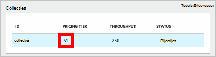
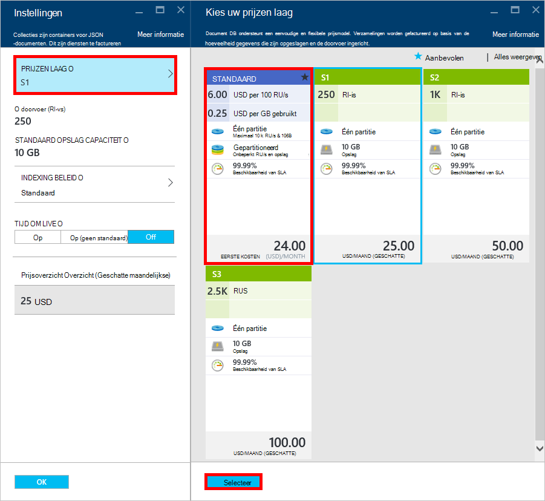
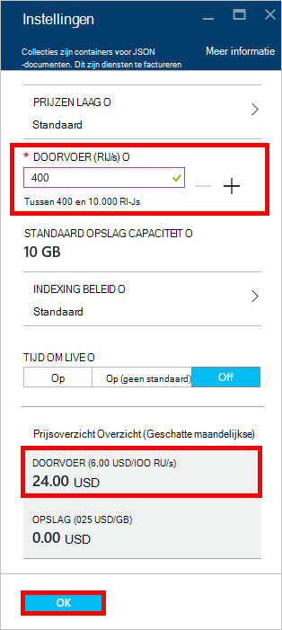
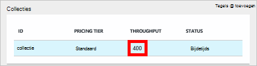

<properties 
    pageTitle="Geef uw account DocumentDB S1 boost | Microsoft Azure" 
    description="Profiteren van de grotere gegevensdoorvoer in uw account DocumentDB S1 door enkele eenvoudige wijzigingen in de portal Azure." 
    services="documentdb" 
    authors="mimig1" 
    manager="jhubbard" 
    editor="monicar" 
    documentationCenter=""/>

<tags 
    ms.service="documentdb" 
    ms.workload="data-services" 
    ms.tgt_pltfrm="na" 
    ms.devlang="na" 
    ms.topic="article" 
    ms.date="08/25/2016" 
    ms.author="mimig"/>

# Geef een boost uw account DocumentDB

Volg deze stappen om te profiteren van de grotere gegevensdoorvoer voor uw account Azure DocumentDB S1. U kunt de doorvoer van uw bestaande account van S1 van 250 [RU/s](documentdb-request-units.md) met 400 RU/s of meer verhogen met weinig tot geen extra kosten!  

> [AZURE.VIDEO changedocumentdbcollectionperformance]

## Door de gebruiker gedefinieerde prestaties in Azure portal wijzigen

1. Ga naar de [**Azure portal**](https://portal.azure.com)in uw browser. 
2. Klik op **Bladeren** -> **DocumentDB (NoSQL)**en selecteer vervolgens de DocumentDB-account te wijzigen.   
3. Selecteer de database te wijzigen in de lens **Databases** en vervolgens selecteert u de collectie met de prijzen laag S1 in de blade **Database** .

      

4. In de **collectie** blade, klikt u op **meer**en klik vervolgens op **Instellingen**.   
5. In het blad **Instellingen** op **Prijzen laag** en de maandelijkse kostenraming voor elk plan wordt weergegeven. Klik op **standaard**en klik op **Selecteer** Sla de wijzigingen in de blade **kiezen de prijzen laag** .

      

6. De **Prijzen laag** wordt gewijzigd in **standaard** terug in de blade **Instellingen** en de **doorvoer (RU/s)** wordt weergegeven met een standaardwaarde van 400. Klik op **OK** om uw wijzigingen te slaan. 

    > [AZURE.NOTE] U kunt instellen dat de doorvoer tussen 400 en 10.000 [eenheden aanvragen](../articles/documentdb/documentdb-request-units.md)/second (RU/s). De **Prijzen overzicht** onderaan de pagina wordt automatisch bijgewerkt met een schatting van de maandelijkse kosten.
    
    

8. U kunt controleren of de drukvulling doorvoer van de collectie weer in de **Database** -blade. 

    

Zie de blog boeken voor meer informatie over de wijzigingen die betrekking hebben op de doorvoer door de gebruiker gedefinieerde en vooraf gedefinieerde [DocumentDB: alles wat u weten moet over het gebruik van de nieuwe prijzen voor](https://azure.microsoft.com/blog/documentdb-use-the-new-pricing-options-on-your-existing-collections/).

## Volgende stappen

Als u vaststelt dat u meer doorvoer (meer dan 10.000 RU/s) of meer opslagruimte moet (groter dan 10GB) kunt u een gepartitioneerde collectie. Zie maken van een gepartitioneerde collectie [een collectie maken](documentdb-create-collection.md).