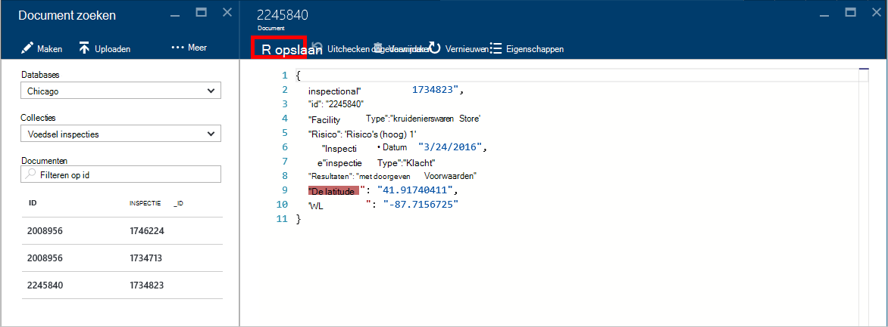

<properties
    pageTitle="DocumentDB Document Explorer JSON bekijken | Microsoft Azure"
    description="Meer informatie over de DocumentDB Document Explorer, een hulpprogramma voor Azure Portal JSON weergeven, bewerken, maken en JSON-documenten met DocumentDB, een database NoSQL document uploaden."
        keywords="json weergeven"
    services="documentdb"
    authors="kirillg"
    manager="jhubbard"
    editor="monicar"
    documentationCenter=""/>

<tags
    ms.service="documentdb"
    ms.workload="data-services"
    ms.tgt_pltfrm="na"
    ms.devlang="na"
    ms.topic="article"
    ms.date="08/30/2016"
    ms.author="kirillg"/>

# Weergeven, bewerken, maken en met DocumentDB Document Explorer JSON-documenten uploaden

Dit artikel bevat een overzicht van de [DocumentDB voor Microsoft Azure](https://azure.microsoft.com/services/documentdb/) -documentverkenner een Azure portal tool waarmee u kunt bekijken, bewerken, maken, uploaden en filteren van JSON met DocumentDB. 

Opmerking Document Explorer is niet ingeschakeld op de rekeningen van de DocumentDB met ondersteuning voor MongoDB-protocol. Deze pagina wordt bijgewerkt wanneer deze functie is ingeschakeld.

## Document Explorer starten

1. Klik in de Azure portal, in de Jumpbar, **DocumentDB (NoSQL)**. Als **DocumentDB (NoSQL)** niet zichtbaar is, klikt u op **Meer Services** en klik vervolgens op **DocumentDB (NoSQL)**.

2. Selecteer de accountnaam. 

3. Klik in het menu bron **Documentverkenner**. 
 
    

    De **Databases** en **collecties** vervolgkeuzelijsten worden vooraf in de blade **-Documentverkenner** gevuld afhankelijk van de context waarin u Document Explorer gestart. 

## Een document maken

1. [Document Explorer starten](#launch-document-explorer).

2. Klik op **Document maken**in de blade **-Documentverkenner** . 

    Een minimale JSON-fragment is beschikbaar in het **Document** blade.

    

2. In de blade **Document** typt of plakt u de inhoud van de JSON-document dat u wilt maken en klik op **Opslaan** om uw document doorvoeren in de database en de verzameling is opgegeven in de blade **-Documentverkenner** .

    

    > [AZURE.NOTE] Als u geen eigenschap van een 'id', vervolgens Document Explorer automatisch toegevoegd een eigenschap id en genereert een GUID als de id-waarde.

    Als u al gegevens van JSON bestanden, MongoDB, SQL Server, CSV-bestanden, Azure tabel opslag, Amazon, DynamoDB, HBase, of uit andere collecties DocumentDB kunt u DocumentDB van [migreren](documentdb-import-data.md) kunt u snel uw gegevens importeren.

## Een document bewerken

1. [Document Explorer starten](#launch-document-explorer).

2. Bewerken van een bestaand document, selecteert u deze in het **Document Explorer** blade, bewerken van het document in het **Document** blade en klik vervolgens op **Opslaan**.

    

    Als u een document bewerkt en besluit dat u wilt de huidige set wijzigingen negeren, gewoon **negeren** klikt u in het **Document** blade, bevestig de actie Uitchecken ongedaan maken en de status van het document opnieuw wordt geladen.

    

## Een document verwijderen

1. [Document Explorer starten](#launch-document-explorer).

2. Selecteer het document in **Document Explorer**, klikt u op **verwijderen**en vervolgens het verwijderen te bevestigen. Nadat u hebt bevestigd, wordt het document onmiddellijk verwijderd uit de lijst Document Explorer.

    

## Werken met JSON-documenten

Document Explorer worden gevalideerd dat elke nieuwe of bewerkte document geldig JSON bevat.  U kunt zelfs fouten weergeven JSON aanwijzen van de verkeerde sectie meer informatie over het foutbericht voor gegevensvalidatie.

Bovendien Document Explorer voorkomt dat u een document opslaat met ongeldige JSON-inhoud.

Document Explorer ten slotte kunt u gemakkelijk de Systeemeigenschappen van de momenteel geladen document bekijken door te klikken op de opdracht **Eigenschappen** .

> [AZURE.NOTE] De eigenschap timestamp (_ts) wordt intern aangegeven als epoch tijd maar Document Explorer wordt de waarde in een menselijke leesbare indeling op GMT.

## Documenten filter
Document Explorer ondersteunt een aantal Navigatieopties voor en geavanceerde instellingen.

Standaard Document wordt geladen boven de eerste 100 documenten in de geselecteerde verzameling, door hun gemaakte datum van eerste tot de laatste.  U kunt aanvullende documenten (in batches van 100) laden door de optie **meer laden** onder in het Document Explorer blade. U kunt kiezen welke documenten laden via de opdracht **Filter** .

1. [Document Explorer starten](#launch-document-explorer).

2. Klik op **Filter**aan de bovenkant van de blade **-Documentverkenner** .  

    
  
3.  De filterinstellingen worden weergegeven onder de opdrachtbalk. Een WHERE-component en/of een ORDER BY-component in de instellingen voor het filter en klik op **Filter**.

    

    Document Explorer worden de resultaten automatisch vernieuwd met documenten die overeenkomen met de filterquery. Lees meer over de DocumentDB SQL-grammatica door in de [SQL-query en de SQL-syntaxis](documentdb-sql-query.md) artikel of een kopie van de [SQL-query cheats vel](documentdb-sql-query-cheat-sheet.md)afdrukken.

    De vervolgkeuzelijst ** **Database** - en** vakken kunnen worden gebruikt de collectie waaruit documenten momenteel bekijkt zonder te sluiten en opnieuw starten Explorer Document eenvoudig wijzigen.  

    Document Explorer ondersteunt ook de momenteel geladen set documenten te filteren door de eigenschap id.  Typ in de documenten filteren op id in.

    

    De resultaten in de lijst worden gefilterd documentverkenner op basis van de opgegeven criteria.

    

    > [AZURE.IMPORTANT] Document Explorer filter functionaliteit alleen filters uit de ***momenteel*** geladen set documenten en voert een query op de momenteel geselecteerde collectie niet uit.

4. U vernieuwt de lijst van documenten door Document Explorer is geladen, klikt u op **vernieuwen** op de bovenkant van het blad.

    

## Grote hoeveelheden documenten toevoegen

Document Explorer ondersteunt bulk opname van een of meer bestaande JSON-documenten, maximaal 100 JSON bestanden per uploaden.  

1. [Document Explorer starten](#launch-document-explorer).

2. Het uploadproces starten, klikt u op **Document uploaden**.

    

    Hiermee opent u het **Document uploaden** blade. 

2. Klik op de bladerknop om een bestand Verkenner-venster te openen, selecteert u een of meer JSON-documenten te uploaden en klik op **openen**.

    

    > [AZURE.NOTE] Document Explorer ondersteunt momenteel maximaal 100 JSON-documenten per afzonderlijk uploaden.

3. Als u tevreden met uw selectie bent, klikt u op de knop **uploaden** .  De documenten worden automatisch toegevoegd aan het raster Document Explorer en de Uploadresultaten worden weergegeven als de voortgang van de bewerking. Importeren fouten worden gerapporteerd voor afzonderlijke bestanden.

    

4. Zodra de bewerking voltooid is, kunt u naar een andere 100 documenten te uploaden.

## Werken met JSON-documenten buiten de portal

De Explorer-Document in de portal Azure is slechts één manier om te werken met documenten in DocumentDB. U kunt ook werken met documenten met behulp van de [REST API](https://msdn.microsoft.com/library/azure/mt489082.aspx) of de [client SDK's](documentdb-sdk-dotnet.md). Bijvoorbeeld code, Zie de [voorbeelden van .NET SDK-document](documentdb-dotnet-samples.md#document-examples) en de [SDK Node.js document voorbeelden](documentdb-nodejs-samples.md#document-examples).

Als u wilt importeren of migreren van bestanden van een andere bron (JSON bestanden, MongoDB, SQL Server, CSV-bestanden, Azure tabel opslag, Amazon DynamoDB of HBase), kunt u het DocumentDB [migreren](documentdb-import-data.md) kunt u snel uw gegevens importeren in DocumentDB.

## Problemen oplossen met

**Symptoom**: Document Explorer geeft **geen documenten gevonden**.

**Oplossing**: Zorg ervoor dat u de juiste abonnement, database en waarin de documenten zijn ingevoegd collectie hebt geselecteerd. Controleer ook om ervoor te zorgen dat u binnen de quota van de doorvoer werkt. Als u werkt op vertraagde de maximale doorvoer niveau en ophalen, lagere gebruik van toepassingen te kunnen uitvoeren onder het quotum voor maximale doorvoer voor de collectie.

**Toelichting**: de portal is een toepassing als een andere, roept de DocumentDB database en collectie. Als uw aanvragen zijn momenteel wordt beperkt door het oproepen van een afzonderlijke toepassing, de portal kan ook de snelheid, waardoor bronnen niet worden weergegeven in de portal. Het probleem op te lossen de oorzaak van het hoge doorvoer gebruik adres en vernieuwt u de portal blade. Informatie over het meten en lagere doorvoer gebruik vindt u in de [doorvoer](documentdb-performance-tips.md#throughput) van het artikel [tips voor betere prestaties](documentdb-performance-tips.md) .

## Volgende stappen

Meer informatie over de DocumentDB SQL-grammatica in Document Explorer ondersteund, raadpleegt u het artikel [SQL-query en de SQL-syntaxis](documentdb-sql-query.md) of de [SQL-query cheats vel](documentdb-sql-query-cheat-sheet.md)afdrukken.

Het [pad van leren](https://azure.microsoft.com/documentation/learning-paths/documentdb/) is ook een nuttig middel om u te helpen als u meer informatie over DocumentDB. 
