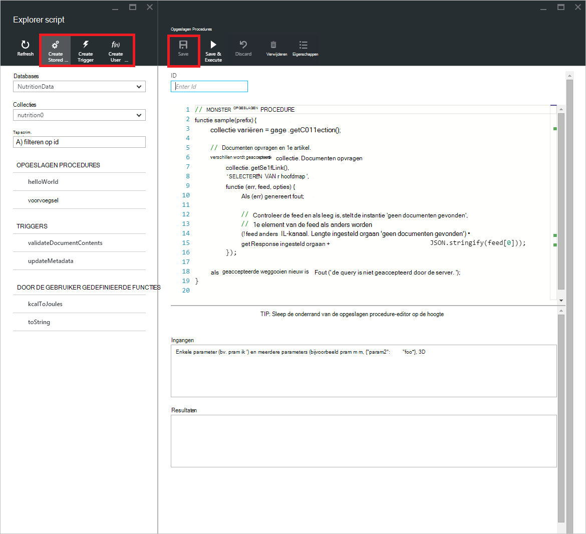
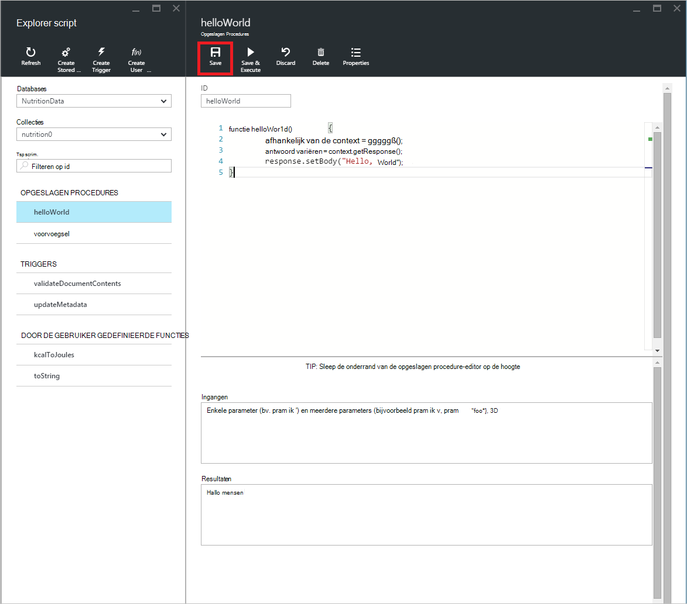
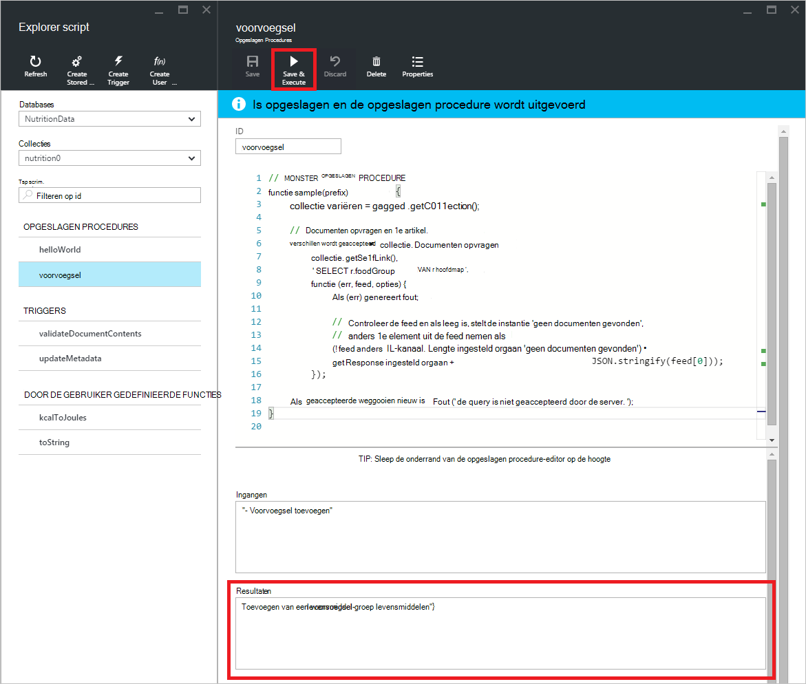

<properties
    pageTitle="DocumentDB Script Explorer, een JavaScript-editor | Microsoft Azure"
    description="Meer informatie over de DocumentDB Script Explorer een Azure Portal-hulpprogramma voor het beheer van DocumentDB server-side programming artefacten waaronder opgeslagen procedures, triggers en door de gebruiker gedefinieerde functies."
    keywords="JavaScript-editor"
    services="documentdb"
    authors="kirillg"
    manager="jhubbard"
    editor="monicar"
    documentationCenter=""/>

<tags
    ms.service="documentdb"
    ms.workload="data-services"
    ms.tgt_pltfrm="na"
    ms.devlang="na"
    ms.topic="article"
    ms.date="08/30/2016"
    ms.author="kirillg"/>

# Maken en uitvoeren van opgeslagen procedures, triggers en door de gebruiker gedefinieerde functies met het Script DocumentDB Explorer

Dit artikel bevat een overzicht van de [DocumentDB voor Microsoft Azure](https://azure.microsoft.com/services/documentdb/) Script Explorer, een JavaScript-editor in de Azure portal kunt u bekijken en DocumentDB server-side programming artefacten waaronder opgeslagen procedures, triggers en door de gebruiker gedefinieerde functies uitvoeren. Lees meer over DocumentDB server-side programmeren in het artikel [opgeslagen procedures, databasetriggers, en UDF's](documentdb-programming.md) .

## Explorer Script starten

1. Klik in de Azure portal, in de Jumpbar, **DocumentDB (NoSQL)**. Als de **Rekeningen van de DocumentDB** niet zichtbaar is, klikt u op **Meer Services** en klik vervolgens op **DocumentDB (NoSQL)**.

2. Klik in het menu resources **Explorer Script**.

    
 
    De vervolgkeuzelijst ** **Database** - en** vakken zijn vooraf gevuld afhankelijk van de context waarin u Explorer Script starten.  Bijvoorbeeld, als u uit een database blade start, is de huidige database vooraf ingestelde.  Als u uit een collectie blade start, zijn de huidige collectie is vooraf ingestelde.

4.  De vervolgkeuzelijst **en de **collectie** ** uit de collectie van waaruit scripts op dat moment bekijkt zonder te sluiten en opnieuw starten Explorer Script eenvoudig wijzigen gebruiken.  

5. Script Explorer ondersteunt ook de momenteel geladen verzameling scripts filteren door de eigenschap id.  Typ in het filtervak en de resultaten in de lijst met Explorer Script worden gefilterd op basis van de opgegeven criteria.

    

    > [AZURE.IMPORTANT] De Explorer Script functionaliteit alleen filters uit de ***momenteel*** geladen scripts filteren en de momenteel geselecteerde collectie niet automatisch vernieuwd.

5. Als u wilt vernieuwen in de lijst met scripts die door Script Explorer is geladen, klikt u op de opdracht **vernieuwen** op de bovenkant van het blad.

    

## Maken, weergeven en bewerken van opgeslagen procedures, triggers en door de gebruiker gedefinieerde functies

Script Explorer kunt u gemakkelijk CRUD bewerkingen uitvoeren op DocumentDB server-side programming artefacten.  

- Om een script te maken, klikt u op de toepasselijke opdracht Explorer script te maken, bieden een id invoeren van de inhoud van het script en klikt u op **Opslaan**.

    

- Wanneer u een trigger maakt, moet u ook de trigger-type en trigger bewerking opgeven

    

- Als u wilt weergeven in een script, klikt u op het script waarin u geïnteresseerd bent.

    

- Als u een script wilt bewerken, breng de gewenste wijzigingen aan in de JavaScript editor en klik op **Opslaan**.

    

- Als u de wachtende wijzigingen aan een script, klikt u op de opdracht **verwijderen** .

    

- Script Explorer kunt u gemakkelijk de Systeemeigenschappen van de geladen script weergeven door te klikken op de opdracht **Eigenschappen** .

    

    > [AZURE.NOTE] De eigenschap timestamp (_ts) wordt intern aangegeven als epoch tijd maar Explorer Script geeft de waarde in een menselijke leesbare indeling op GMT.

- Om een script verwijderen, selecteert u deze in de Explorer Script en klikt u op de opdracht **verwijderen** .

    

- Bevestig de verwijderactie door op **Ja** te klikken of de delete-bewerking annuleren door op **Nee**te klikken.

    

## Een opgeslagen procedure uitvoeren

> [AZURE.WARNING] Opgeslagen procedures uitvoeren in Explorer Script is nog niet ondersteund voor server-side gepartitioneerd collecties. Ga naar de [partitionering en schaling in DocumentDB](documentdb-partition-data.md)voor meer informatie.

Explorer script kunt u server-side opgeslagen procedures uitvoeren vanaf de portal Azure.

- Bij het openen van een nieuwe maken opgeslagen procedure blade, een Standaardscript (*voorvoegsel*) al krijgt. Toevoegen om de *prefix* -script of een eigen script uitvoeren, een *id* en *ingangen*. Voor opgeslagen procedures die meerdere parameters accepteren, moeten alle invoer in een matrix (bijvoorbeeld *["foo", "bar"]*).

    

- Om een opgeslagen procedure wilt uitvoeren, klikt u op de opdracht **Opslaan en uitvoeren** in de script editor-venster.

    > [AZURE.NOTE] De opdracht **Opslaan & uitvoeren** slaat de opgeslagen procedure wordt uitgevoerd, wat betekent dat de laatst opgeslagen versie van de opgeslagen procedure worden overschreven.

- Succesvolle uitvoeringen van de opgeslagen procedure heeft een status *is opgeslagen en de opgeslagen procedure wordt uitgevoerd* en de resultaten in het deelvenster *resultaten* wordt gevuld.

    

- Als de uitvoering een fout aantreft, wordt de fout in het deelvenster *resultaten* worden gevuld.

    

## Werken met scripts buiten de portal

De Explorer Script in de portal Azure is slechts één manier om te werken met opgeslagen procedures, triggers en door de gebruiker gedefinieerde functies in DocumentDB. U kunt ook werken met scripts met behulp van de de [client-SDK's](documentdb-sdk-dotnet.md)en de REST-API. De REST API-documentatie bevat voorbeelden voor het werken met [opgeslagen procedures met de REST](https://msdn.microsoft.com/library/azure/mt489092.aspx), [door de gebruiker gedefinieerde functies met REST](https://msdn.microsoft.com/library/azure/dn781481.aspx)en [triggers gebruiken REST](https://msdn.microsoft.com/library/azure/mt489116.aspx). Voorbeelden zijn ook beschikbaar waarin het [werken met behulp van C# scripts](documentdb-dotnet-samples.md#server-side-programming-examples) en [werken met scripts met Node.js](documentdb-nodejs-samples.md#server-side-programming-examples).

## Volgende stappen

Meer informatie over het programmeren van server-side DocumentDB in het artikel [opgeslagen procedures, databasetriggers, en UDF's](documentdb-programming.md) .

Het [pad van leren](https://azure.microsoft.com/documentation/learning-paths/documentdb/) is ook een nuttig middel om u te helpen als u meer informatie over DocumentDB.  
