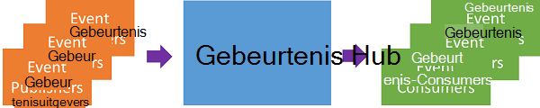
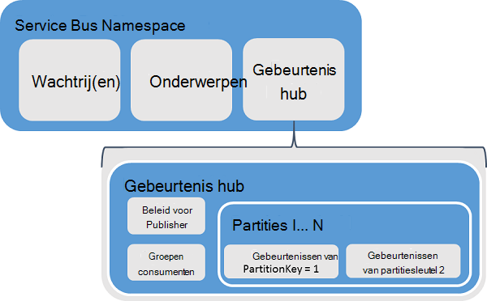
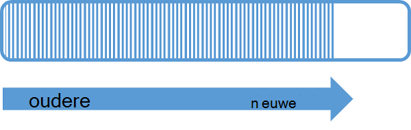
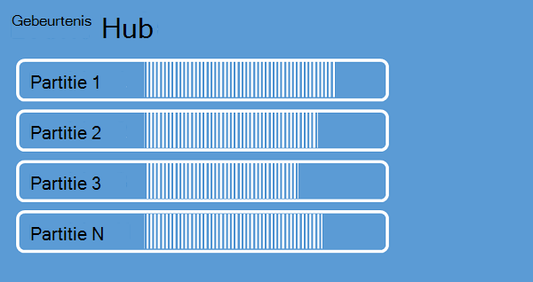
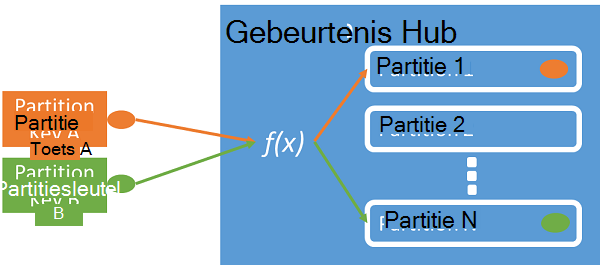
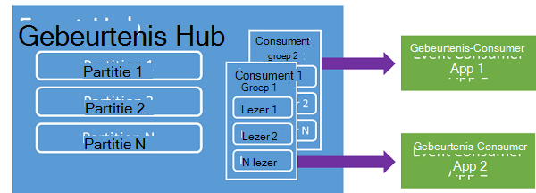
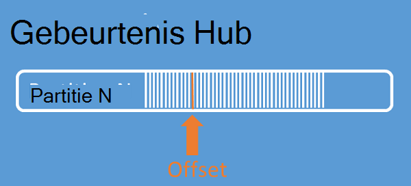
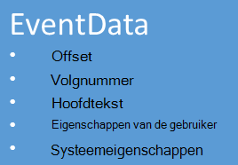

<properties 
    pageTitle="Overzicht van Hubs Azure-gebeurtenis | Microsoft Azure"
    description="Introductie en overzicht van Azure gebeurtenis Hubs."
    services="event-hubs"
    documentationCenter="na"
    authors="sethmanheim"
    manager="timlt"
    editor="" />
<tags 
    ms.service="event-hubs"
    ms.devlang="na"
    ms.topic="get-started-article"
    ms.tgt_pltfrm="na"
    ms.workload="na"
    ms.date="08/16/2016"
    ms.author="sethm" />

# Azure gebeurtenis Hubs-overzicht

Veel moderne oplossingen van adaptieve klantervaringen of verbeteren van producten door middel van continue feedback en geautomatiseerde telemetrie plan. Deze oplossingen worden geconfronteerd met de uitdaging van het veilige en betrouwbare manier verwerken van grote hoeveelheden gegevens uit een groot aantal gelijktijdige uitgevers. Microsoft Azure gebeurtenis Hubs is een platform voor beheerde service een basis voor grootschalige gegevens inname in verschillende scenario's biedt. Voorbeelden van dergelijke scenario's zijn volgen in mobiele toepassingen, verkeersinformatie van webfarms, spel gebeurtenis vastleggen in de console spellen, gedrag of telemetriegegevens verzameld van industriële machines of voertuigen aangesloten. De algemene functie die gebeurtenis Hubs in de architectuur van de oplossing speelt is dat het fungeert als de "voordeur" voor een gebeurtenis pipeline, vaak aangeduid als een *gebeurtenis ingestor*. Een gebeurtenis ingestor is een onderdeel of service die bevindt zich tussen de gebeurtenisuitgevers en gebeurtenis-consumers loskoppelen van de productie van een gebeurtenis stroom van de consumptie van deze gebeurtenissen.

Hubs met Azure gebeurtenis is een gebeurtenis verwerken waarmee de gebeurtenis en telemetrie ingress naar de cloud op grote schaal, met lage latentie en hoge betrouwbaarheid. Deze service, gebruikt in combinatie met andere downstream services is vooral nuttig in de toepassing instrumentation gebruiker ervaring of workflow verwerking en scenario's Internet dingen (IoT). Hubs gebeurtenis biedt een mogelijkheid verwerken berichtenstroom en al een gebeurtenis Hub een entiteit die vergelijkbaar is met wachtrijen en onderwerpen is, heeft kenmerken die heel anders dan een traditionele enterprise messaging zijn. Berichtverzending onderneming vereist vaak geavanceerde mogelijkheden zoals de toekenning van reeksnummers, dode letters, transactie-ondersteuning en levering van sterke garanties, terwijl de dominante bekommernis voor gebeurtenis inname is hoge doorvoer en flexibiliteit voor het stromen van de gebeurtenis te verwerken. Gebeurtenis Hubs mogelijkheden verschillen daarom van Service Bus onderwerpen in dat ze sterk zijn gericht op hoge doorvoer en scenario's voor verwerking van gebeurtenissen. Als zodanig implementeert Hubs gebeurtenis niet op sommige van de messaging-mogelijkheden die beschikbaar voor onderwerpen zijn. Als u deze functionaliteit nodig hebt, blijven onderwerpen de optimale keuze.

Een Hub gebeurtenis wordt op niveau gebeurtenis Hubs Service Bus wachtrijen en onderwerpen naamruimte gemaakt. Hubs gebeurtenis maakt gebruik van AMQP en HTTP als haar primaire API's. In het volgende diagram wordt de relatie tussen de gebeurtenis Hubs en Service Bus.

## Conceptueel overzicht

Gebeurtenis Hubs biedt streaming via een gepartitioneerde consument patroon weergegeven. Gebruik een [Consument concurrerende](https://msdn.microsoft.com/library/dn568101.aspx) model elke consument wordt geprobeerd te lezen van de wachtrij of de resource wachtrijen en onderwerpen. Deze competitie voor resources resulteert uiteindelijk in complexiteit en schaal limieten voor stroom toepassingen verwerken. Hubs gebeurtenis maakt gebruik van een gepartitioneerde consument patroon waarin de consument alleen leest een specifieke subset of een partitie van de berichtenstroom. Dit patroon kunt horizontale schaal voor de verwerking van de gebeurtenis en andere stream gerichte functies die niet beschikbaar in de wachtrijen en onderwerpen zijn.

### Partities

Een partitie is een geordende reeks gebeurtenissen die in de Hub van een gebeurtenis wordt bewaard. Als nieuwe gebeurtenissen worden afgeleverd, wordt deze toegevoegd aan het einde van deze reeks. Een partitie kan worden beschouwd als een 'commit log'.

Partities bewaren gegevens voor een geconfigureerde retentietijd die is ingesteld op het niveau van de gebeurtenis Hub. Deze instelling geldt voor alle partities in de gebeurtenis Hub. Gebeurtenissen verloopt op basis van; niet verwijderen expliciet. Een gebeurtenis Hub bevat meerdere partities. Elke partitie is onafhankelijk en bevat een eigen reeks gegevens. Partities groter hierdoor vaak op verschillende tarieven.

Het aantal partities moet is opgegeven toen de gebeurtenis Hub maken en tussen 2 en 32 (de standaardwaarde is 4). Partities zijn een mechanisme van de organisatie gegevens en meer betrekking hebben op de mate van downstream parallellisme vereist in doorvoer Hubs gebeurtenis toepassingen dan verbruikt. Hierdoor is de keuze van het aantal partities in een gebeurtenis Hub rechtstreeks verband houden met het aantal gelijktijdige lezers die u verwacht te hebben. Na het maken van Hub gebeurtenis is het aantal partities niet mag worden gewijzigd; u kunt dit nummer in op de lange termijn verwachte schaal. De limiet van 32 partitie kunt u contact opnemen met het team Bus Service verhogen.

Terwijl de partities zijn en rechtstreeks naar kunnen worden verzonden, is het beter om te voorkomen dat gegevens worden verzonden naar specifieke partities. In plaats daarvan kunt u hogere niveau constructies die zijn geïntroduceerd in de secties van de [uitgever van de gebeurtenis](#event-publisher) en het [Beleid van de uitgever](#capacity-and-security) .

In de context van de gebeurtenis Hubs worden berichten zijn *gebeurtenisgegevens*genoemd. Laad de hoofdtekst van de gebeurtenis, een zelfgedefinieerde eigenschap zak en diverse metagegevens over de gebeurtenis, zoals de verschuiving in de partitie en het nummer in de reeks stream. Partities zijn gevuld met een reeks gegevens.

## Uitgever van de gebeurtenis

Een entiteit die gebeurtenissen of gegevens naar een Hub gebeurtenis verzendt is een *gebeurtenis publisher*. Gebeurtenisuitgevers kunnen publiceren met behulp van HTTPS of AMQP 1.0 gebeurtenissen. Gebeurtenisuitgevers met een token gedeelde toegang handtekening (SAS) kunt identificeren zichzelf een Hub gebeurtenis en een unieke identiteit, of u gebruikt een gemeenschappelijke SAS-token, afhankelijk van de vereisten van het scenario.

Zie voor meer informatie over het werken met SAS [-Handtekening verificatie met Bus Service gedeeld](../service-bus-messaging/service-bus-shared-access-signature-authentication.md).

### Publisher-taken

In deze sectie worden algemene taken beschreven voor gebeurtenisuitgevers van.

#### Een SAS-token verkrijgen

Gedeelde toegang handtekening (SAS) is het verificatiemechanisme voor gebeurtenis Hubs. Service Bus biedt SAS-beleid op de naamruimte en de Hub van de gebeurtenis. Een SAS-token wordt gegenereerd vanuit een SAS-sleutel en een SHA-hash van een URL, gecodeerd in een specifieke indeling is. Met de naam van de sleutel (beleid) en het token, Bus Service opnieuw de hash te genereren en dus de afzender wilt verifiëren. SAS tokens voor gebeurtenisuitgevers worden normaal gesproken gemaakt met alleen **verzenden** bevoegdheden op een bepaalde gebeurtenis Hub. Dit mechanisme van SAS token URL vormt de basis voor de identificatie van publisher geïntroduceerd in het beleid van de uitgever. Zie voor meer informatie over het werken met SAS [-Handtekening verificatie met Bus Service gedeeld](../service-bus-messaging/service-bus-shared-access-signature-authentication.md).

#### Publiceren van een gebeurtenis

U kunt een gebeurtenis via AMQP 1.0 of HTTPS publiceren. Bus service voorziet in een [EventHubClient](https://msdn.microsoft.com/library/microsoft.servicebus.messaging.eventhubclient.aspx) -klasse publishing gebeurtenissen op een gebeurtenis Hub van .NET-clients. Voor andere runtimes en platforms, kunt u elke client AMQP 1.0, zoals [Apache Qpid](http://qpid.apache.org/). Als u gebeurtenissen kunt afzonderlijk publiceren of batch verwerkt. Een publicatie (gebeurtenis gegevens exemplaar) heeft een limiet van 256KB, ongeacht of het een enkele gebeurtenis of een batch. Publiceren van gebeurtenissen die groter is dan dit in een fout resulteert. Het is een best practice voor uitgevers niet bewust van de partities in de gebeurtenis Hub en een *partitie sleutel* (geïntroduceerd in de volgende sectie), of hun identiteit via hun SAS token alleen op te geven.

De keuze met AMQP of HTTPS is specifiek voor de gebruiksscenario. AMQP is vereist voor de totstandbrenging van een permanente bidirectionele socket naast transport level security (TLS) of SSL/TLS. Dit kan een kostbare bewerking netwerkverkeer, maar alleen aan het begin van een sessie AMQP gebeurt. HTTPS is een lagere initiële overhead, maar SSL extra overhead nodig is voor elke aanvraag. Uitgevers regelmatig gebeurtenissen publiceren, biedt AMQP aanzienlijke besparingen van prestaties, de latentie en de doorvoer.

### Partitiesleutel

Een partitiesleutel is een waarde die wordt gebruikt voor binnenkomende gegevens toewijzen aan specifieke partities voor de toepassing van de organisatie van de gegevens. De partitiesleutel is een afzender opgegeven waarde doorgegeven aan de Hub van een gebeurtenis. Deze wordt verwerkt door een statische hash-functie, het resultaat van die de toewijzing van de partitie wordt gemaakt. Als u niet de partitiesleutel voor een opgeeft bij het publiceren van een gebeurtenis, wordt de toewijzing van een round robin gebruikt. Wanneer u de partitiesleutels, is de uitgever van de gebeurtenis alleen op de hoogte van de partitiesleutel, niet de partitie waarop de gebeurtenissen worden gepubliceerd. Deze ontkoppeling van de sleutel en de partitie schermt de afzender van hoeft te weten te veel over de downstream-verwerkingen en de opslag van gebeurtenissen. Partitie toetsen zijn belangrijk voor het ordenen van gegevens voor downstream-verwerkingen, maar fundamenteel niet gerelateerd zijn aan partities zelf. Een per apparaat of gebruiker unieke identiteit maakt een goede partitiesleutel, maar andere kenmerken zoals Geografie kunnen ook worden gebruikt om verwante gebeurtenissen groeperen in één partitie. De volgende afbeelding toont een gebeurtenis afzenders met partitiesleutels partities vastmaken.

Gebeurtenis Hubs zorgt ervoor dat alle gebeurtenissen delen dezelfde partitie sleutelwaarde worden afgeleverd in volgorde en op dezelfde partitie. Belangrijker is, als partitiesleutels worden gebruikt met publisher-beleid dat wordt beschreven in de volgende sectie, overeenkomen vervolgens de identiteit van de uitgever en de waarde van de partitiesleutel. Anders treedt er een fout op.

### Gebeurtenis-consumer

Een entiteit die gegevens van een Hub gebeurtenis is een gebeurtenis-consumer. Alle consumenten van de gebeurtenis lezen de gebeurtenis stream via partities in een groep consumenten. Elke partitie mag slechts één actieve lezer tegelijk hebben. Alle Hubs gebeurtenis consumenten-verbinding via de AMQP 1.0-sessie waarin gebeurtenissen worden bezorgd zodra deze beschikbaar. De client hoeft niet te controleren op de beschikbaarheid van gegevens.

#### Groepen consumenten

Het mechanisme van gebeurtenis Hubs voor publiceren/abonneren is ingeschakeld via de consumentenorganisaties. Een groep consumenten is een weergave van een hele gebeurtenis Hub (status, positie of offset). Consumenten groepen inschakelen meerdere beslag toepassingen aan elk hebben een aparte weergave van de stroom van de gebeurtenis en de stroom onafhankelijk van elkaar in hun eigen tempo en met hun eigen offsets lezen. In een stream processing architectuur, is elke toepassing downstream gelijk aan een groep consumenten. Als u wilt dat gegevens schrijven naar opslag op lange termijn, wordt die toepassing opslag schrijver een groep consumenten. Verwerking van de complexe gebeurtenis wordt uitgevoerd door een andere, afzonderlijke consument groep. U kunt partities alleen toegang tot een groep consumenten. Er is altijd een standaardgroep consument in een Hub gebeurtenis en kunt u maximaal 20 groepen consumenten voor een standaard laag gebeurtenis Hub.

Hier volgen enkele voorbeelden van de consument groep URI-overeenkomst:

    //<my namespace>.servicebus.windows.net/<event hub name>/<Consumer Group #1>
    //<my namespace>.servicebus.windows.net/<event hub name>/<Consumer Group #2>

De volgende afbeelding ziet u de gebeurtenis-consumers binnen groepen consumenten.

#### Stream verschuivingen

Een offset is de positie van een gebeurtenis in een partitie. U kunt een verschuiving beschouwen als een cursor aan de clientzijde. De offset is een byte nummering van de gebeurtenis. Hiermee kunt een gebeurtenis-consumer (lezer) op te geven op een punt in de gebeurtenis streamen waaruit ze willen beginnen met gebeurtenissen. Kunt u de verschuiving als een tijdstempel of als een waarde. Consumenten zijn verantwoordelijk voor hun eigen verschuivingswaarden andere gebeurtenis Hubs services op te slaan.

Binnen een partitie bevat elke gebeurtenis een verschuiving. Deze tegenrekening wordt gebruikt door gebruikers de locatie weergeven in de Gebeurtenisvolgorde van de voor een bepaalde partitie. Verschuivingen kunnen worden doorgegeven aan de gebeurtenis Hub als een getal of als een tijdstempel waarde wanneer een lezer verbinding maakt.

#### Controlepuntbeheer

*Controlepuntbeheer* is een proces waarmee lezers markeren of hun positie binnen de volgorde van een partitie gebeurtenis vast te leggen. Controlepuntbeheer is de verantwoordelijkheid van de consument en vindt plaats op basis van per partitie binnen een groep consumenten. Dit betekent dat voor elke groep consumenten elke partitie reader moet bijhouden van de huidige positie in de gebeurtenis streamen en kan de service op de hoogte wanneer zij de gegevensstroom voltooid denkt. Als u een partitie van een lezer verbreken wanneer dat verbinding wordt gemaakt begint met het lezen op het controlepunt die eerder is ingediend door de laatste lezer van die partitie in die groep consumenten. Wanneer de lezer verbinding maakt, wordt deze verschuiving doorgegeven aan de Hub gebeurtenis en geef de locatie op waar u wilt beginnen met lezen. Op deze manier kunt u controlepuntbeheer voor beide gebeurtenissen markeren als 'voltooid' door downstream-toepassingen en het bieden van tolerantie bij failover tussen lezers op verschillende computers worden uitgevoerd. Omdat gegevens voor de inhouding interval dat is opgegeven op het moment dat de gebeurtenis Hub wordt gemaakt behouden blijft, is het mogelijk terug te keren naar de oudere gegevens door te geven van een lagere offset van dit controleproces. Controlepuntbeheer kan via dit mechanisme, dat zowel failover-tolerantie en gecontroleerde gebeurtenis stream replay.

#### Algemene taken van de consument

In deze sectie worden algemene taken beschreven voor gebeurtenisverwerkers gebeurtenis Hubs of lezers. Alle Hubs gebeurtenis consumenten verbinding via AMQP 1.0. AMQP 1.0 is een sessie en staat bewust bidirectionele communicatiekanaal. Elke partitie heeft een sessie van AMQP 1.0 koppeling die het vervoer van de gebeurtenissen die worden gescheiden door een partitie wordt vergemakkelijkt.

##### Verbinding maken met een partitie

Controle van gebeurtenissen uit een gebeurtenis Hub, moet een consument verbinding maken met een partitie. Zoals eerder vermeld, u altijd toegang tot partities door een groep consumenten. Als onderdeel van het model gepartitioneerde consument moet één lezer actief zijn op een partitie op een willekeurig moment binnen een groep consumenten. Wanneer u rechtstreeks verbinding maken met partities voor gebruik van een mechanisme voor leasing lezer verbindingen met specifieke partities coördinatie is gebruikelijk. Op deze manier is het mogelijk voor elke partitie van een groep consumenten hebben slechts één actieve lezer. De positie in de volgorde voor de lezer te beheren is een belangrijke taak die wordt bereikt via controlepuntbeheer. Deze functionaliteit is vereenvoudigd met behulp van de klasse [EventProcessorHost](https://msdn.microsoft.com/library/microsoft.servicebus.messaging.eventprocessorhost.aspx) voor .NET-clients. [EventProcessorHost](https://msdn.microsoft.com/library/microsoft.servicebus.messaging.eventprocessorhost.aspx) is een intelligente consument agent en in de volgende sectie wordt beschreven.

##### Alleen gebeurtenissen

Nadat een sessie AMQP 1.0 en een koppeling voor een specifieke partitie wordt geopend, worden de gebeurtenissen naar de AMQP 1.0-client door de gebeurtenis Hubs-service bezorgd. Dit mechanisme levering kan hogere doorvoer en lagere latentie dan pull gebaseerde mechanismen, zoals HTTP GET. Gebeurtenissen op de client wordt verzonden, bevat elke instantie gebeurtenis gegevens belangrijke metagegevens, zoals het nummer van de tegenrekening en de volgorde die worden gebruikt voor het vergemakkelijken van controlepuntbeheer op de Gebeurtenisvolgorde.

Het is uw verantwoordelijkheid om deze verschuiving op een manier dat beste beheren voortgang bij de verwerking van de stroom kunt beheren.

## Capaciteit en beveiliging

Gebeurtenis Hubs is een zeer schaalbare parallelle architectuur voor stream ingress. Er zijn dus verschillende essentiële aspecten rekening te houden wanneer u de schaal van een oplossing op basis van de gebeurtenis Hubs. De eerste van deze besturingselementen capaciteit, *doorvoer-eenheden*, zoals beschreven in de volgende sectie wordt genoemd.

### Doorvoer van eenheden

De doorvoercapaciteit van Hubs gebeurtenis wordt bepaald door de doorvoer eenheden. Doorvoer eenheden zijn eenheden van capaciteit vooraf gekocht. Een doorvoer van één eenheid omvat het volgende:

- Ingress: Maximaal 1 MB per 1000 tweede gebeurtenissen per seconde.

- Egress: Maximaal 2 MB per seconde.

Ingress verminderd tot het bedrag van de capaciteit die door het aantal gekochte eenheden van doorvoer. Verzenden van gegevens boven deze waarde resulteert in een 'quotum overschreden' uitzondering. Dit bedrag is een 1 MB per 1000 tweede gebeurtenissen per seconde, afhankelijk van wat zich eerst. Egress levert geen bandbreedteregeling uitzonderingen, maar is beperkt tot het bedrag van de overdracht van gegevens voorziet de doorvoer van gekochte eenheden: 2 MB per seconde per eenheid van doorvoer. Als u publishing tarief uitzonderingen ontvangen of worden verwacht te zien van hogere egress Controleer hoeveel doorvoer-eenheden die u hebt gekocht voor de naamruimte waarin de Hub gebeurtenis is gemaakt. Als u meer doorvoer eenheden, kunt u de instelling op de pagina **naamruimten** op het tabblad **schaal** in [Azure klassieke portal][]aanpassen. Ook kunt u deze instelling met behulp van de API's van Azure.

Partities zijn een concept van de organisatie gegevens, zijn doorvoer-eenheden louter een concept van de capaciteit. Doorvoer eenheden per uur worden gefactureerd en worden vooraf gekocht. Zodra u hebt gekocht, worden gedurende ten minste één uur doorvoer eenheden gefactureerd. Tot 20 doorvoer eenheden kunnen worden aangeschaft voor een naamruimte gebeurtenis Hubs en er is een Azure limiet van 20 eenheden van doorvoer. Deze eenheden doorvoer worden gedeeld door alle Hubs van de gebeurtenis in een bepaalde naamruimte.

Doorvoer eenheden worden ingericht op basis van beste inspanning en kunnen niet altijd beschikbaar zijn voor directe aankoop. Als u nodig hebt voor een bepaalde capaciteit, is het raadzaam dat u deze eenheden doorvoer van tevoren kopen. Als u meer dan 20 eenheden van doorvoer, kunt u contact opnemen met Azure support kopen meer doorvoer eenheden op basis van de verbintenis in blokken van 20 tot en met de eerste doorvoer 100 eenheden. Verder kunt u blokken van 100 eenheden van doorvoer kopen.

Het verdient zorgvuldig doorvoer eenheden en partities te bereiken optimale schaal met Hubs gebeurtenis te verdelen. Een enkele partitie heeft een maximale schaal van doorvoer van één eenheid. Het aantal eenheden van de doorvoer moet kleiner zijn dan of gelijk is aan het aantal partities in een gebeurtenis-Hub.

Zie voor gedetailleerde prijsinformatie, [Gebeurtenis Hubs prijzen](https://azure.microsoft.com/pricing/details/event-hubs/).

### Beleid voor Publisher

Gebeurtenis Hubs kunnen gedetailleerde controle over de gebeurtenisuitgevers via het *beleid van de uitgever*. Publisher-beleid is een set van runtime-functies ter ondersteuning van een groot aantal onafhankelijke gebeurtenisuitgevers. Elke uitgever gebruikt een eigen unieke id met publisher beleid bij het publiceren van gebeurtenissen op een gebeurtenis Hub, met de volgende mechanisme:

    //<my namespace>.servicebus.windows.net/<event hub name>/publishers/<my publisher name>

U hoeft te maken van de namen van uitgevers tijdig, maar ze moeten overeenkomen met de SAS-token gebruikt bij het publiceren van een gebeurtenis, met het oog op een onafhankelijke uitgever identiteiten. Zie voor meer informatie over SAS [-Handtekening verificatie met Bus Service gedeeld](../service-bus-messaging/service-bus-shared-access-signature-authentication.md). Wanneer u publisher-beleid, wordt de waarde **PartitionKey** is ingesteld op de naam van de uitgever. Werkt alleen goed als moeten deze waarden overeenkomen.

## Samenvatting

Azure gebeurtenis Hubs biedt een hyperscale '-gebeurtenis en telemetrie service die kan worden gebruikt voor algemene workflow voor toepassings- en controle op een schaal te verwerken. Publicatie-abonnementen mogelijkheden met lage latentie en op grote schaal gebeurtenis Hubs fungeren als het "op"platform voor grote gegevens de mogelijkheid te bieden. Met publisher gebaseerde identiteit en lijsten met ingetrokken, zijn deze mogelijkheden uitgebreid in algemene scenario's voor het Internet van dingen. Zie de [gebeurtenis Hubs programming guide](event-hubs-programming-guide.md)voor meer informatie over het ontwikkelen van toepassingen voor gebeurtenis Hubs.

## Volgende stappen

U hebt geleerd over begrippen Hubs gebeurtenis, kunt u op verplaatsen naar de volgende scenario's:

- Aan de slag met een [gebeurtenis Hubs zelfstudie].
- Een volledig [voorbeeldtoepassing die gebruikmaakt van gebeurtenis Hubs].

[Azure klassieke portal]: http://manage.windowsazure.com
[Gebeurtenis Hubs zelfstudie]: event-hubs-csharp-ephcs-getstarted.md
[de voorbeeldtoepassing met gebeurtenis-Hubs]: https://code.msdn.microsoft.com/windowsazure/Service-Bus-Event-Hub-286fd097
