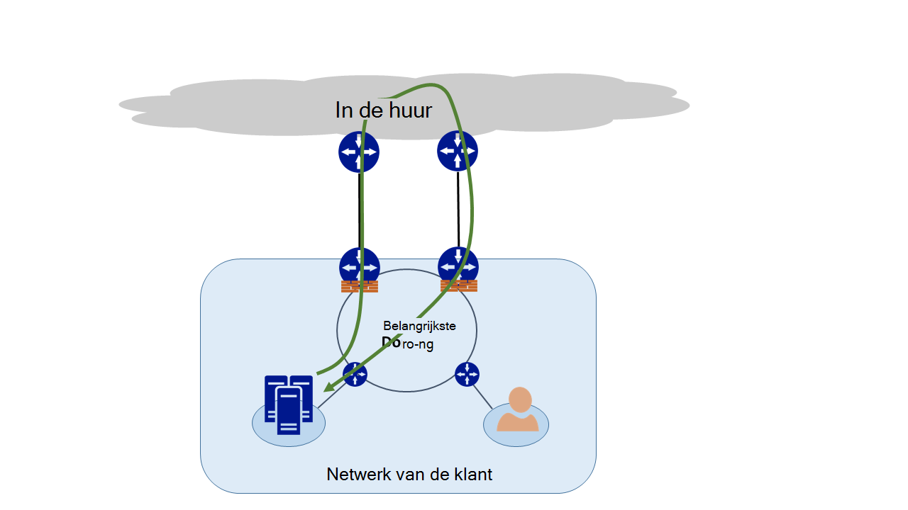

<properties
   pageTitle="Asymmetrische routering | Microsoft Azure"
   description="Dit artikel begeleidt u bij de problemen die een klant kan worden geconfronteerd met asymmetrische routering in een netwerk met meerdere koppelingen naar een bestemming."
   documentationCenter="na"
   services="expressroute"
   authors="osamazia"
   manager="carmonm"
   editor=""/>
<tags
   ms.service="expressroute"
   ms.devlang="na"
   ms.topic="get-started-article"
   ms.tgt_pltfrm="na"
   ms.workload="infrastructure-services"
   ms.date="10/10/2016"
   ms.author="osamazia"/>

# Asymmetrische routering met meerdere paden

In dit artikel wordt uitgelegd hoe vooruit en terug te keren netwerkverkeer kan verschillende routes duren wanneer meerdere paden beschikbaar tussen netwerkbron en doel.

Het is belangrijk om te weten twee concepten te begrijpen asymmetrische routering. Een is het effect van meerdere paden. De andere is hoe apparaten, zoals een firewall, dat in staat. Dergelijke apparaten worden stateful apparaten genoemd. Een combinatie van deze twee factoren maakt scenario's waarvoor verkeer door een stateful apparaat is weggehaald omdat de stateful-apparaat niet detecteren dat verkeer afkomstig van het apparaat zelf is.

## Meerdere paden

Wanneer een bedrijfsnetwerk slechts één verbinding met het Internet via de Internet-aanbieder heeft, reist alle verkeer van en naar het Internet hetzelfde pad. Bedrijven kopen vaak meerdere circuits, als redundante paden, netwerk uptime te verbeteren. Als dit gebeurt, is het mogelijk dat verkeer die elektroplaat buiten het netwerk, op het Internet, via een koppeling loopt en het terugkerende verkeer via een andere koppeling gaat. Dit wordt ook wel genoemd asymmetrische routering. Reverse netwerkverkeer wordt asymmetrische routering een ander pad van de oorspronkelijke overdracht.

Hoewel deze voornamelijk op het Internet optreedt, geldt asymmetrische routering ook voor andere combinaties van meerdere paden. Van toepassing, bijvoorbeeld zowel een internetpad en een persoonlijk pad naar dezelfde bestemming en aan meerdere particuliere paden naar dezelfde bestemming.

Elke router langs de manier, van bron tot bestemming, berekent het beste pad om een bestemming te bereiken. Bepaling van de router van de beste route is gebaseerd op twee belangrijke factoren:

-   Routeren tussen externe netwerken is gebaseerd op een routeringsprotocol, Border Gateway Protocol (BGP). BGP advertenties neemt van de buren en doorloopt een reeks stappen om te bepalen het beste pad naar de bestemming. Het beste pad wordt opgeslagen in de routeringstabel.
-   Routeringspaden correct is van invloed op de lengte van het subnetmasker die zijn gekoppeld aan een route. Als een router meerdere advertenties voor hetzelfde IP-adres, maar met verschillende subnetmaskers ontvangt, de router geeft de voorkeur aan de advertentie met een subnetmasker langer omdat er geen specifiekere route nieuwsbrief.

## Stateful-apparaten

Routers, bekijk de IP-header van een pakket voor de routering. Sommige apparaten zoeken zelfs dieper in het pakket. Meestal deze apparaten bekijken Layer4 (Transmission Control Protocol of TCP; of User Datagram Protocol of UDP), of zelfs Layer7 headers (Application Layer). Dit soort apparaten zijn de beveiligingsapparatuur of optimalisatie van bandbreedte apparaten. 

Een firewall is een stateful apparaat bijvoorbeeld. Een firewall toestaat of weigert een pakket via de interfaces op basis van verschillende velden zoals protocol, TCP/UDP-poort en headers van de URL. Dit niveau van packet inspectie levert een zware belasting van het apparaat worden verwerkt. De firewall inspecteert om prestaties te verbeteren, het eerste pakket van een stroom. Als u het pakket om verder te gaan kunt, wordt de stroomgegevens bijgehouden in de tabel staat. Alle volgende pakketten die verband houden met deze overdracht zijn toegestaan op basis van de oorspronkelijke bepaling. Een pakket dat deel uitmaakt van een bestaande stroom zou bij de firewall aankomen. Als de firewall geen vorige status-informatie heeft, daalt de firewall het pakket.

## Asymmetrische routering met ExpressRoute

Wanneer u verbinding via Azure ExpressRoute aan Microsoft maakt, wordt uw wijzigingen in het netwerk als volgt:

-   U hebt meerdere koppelingen naar Microsoft. Koppeling met een bestaande Internet-verbinding is, en de andere via ExpressRoute. Sommige verkeer naar Microsoft kan via het Internet, maar kom terug via ExpressRoute of vice versa.
-   U ontvangt meer specifieke IP-adressen via ExpressRoute. Dus voor verkeer vanaf het netwerk naar Microsoft voor diensten die worden aangeboden via ExpressRoute, routers altijd de voorkeur aan ExpressRoute.

Om te begrijpen welke invloed die deze twee wijzigingen op een netwerk hebben, laten we eens enkele scenario's. Als u bijvoorbeeld hebt u slechts één circuit met Internet en u alle Microsoft-services via het Internet verbruiken. Het verkeer van uw netwerk naar Microsoft en weer dezelfde Internet-verbinding worden doorlopen en wordt doorgegeven via de firewall. De firewall records de gegevensstroom, zoals het eerste pakket ziet en geretourneerde pakketten zijn toegestaan, omdat de stroom in de tabel staat bestaat.

Vervolgens zet ExpressRoute en diensten die door Microsoft worden aangeboden via ExpressRoute in beslag nemen. Alle services van Microsoft worden via het Internet verbruikt. U implementeren een afzonderlijk firewall aan de grens die is verbonden met ExpressRoute. Microsoft worden meer specifieke prefixen aan uw netwerk via ExpressRoute voor specifieke services. ExpressRoute kiest de routeringsinfrastructuur als het gewenste pad voor de prefixen. Als u bent niet uw openbare IP-adressen naar Microsoft reclame via ExpressRoute, wordt Microsoft communiceert met uw openbare IP-adressen via het Internet. Verkeer vanaf het netwerk doorsturen naar Microsoft ExpressRoute gebruikt en reverse verkeer van Microsoft via het Internet. Wanneer de firewall op de rand een antwoordpakket voor een stroom die niet in de tabel staat gevonden, methode met deze wordt het terugkerende verkeer.

Als u dezelfde netwerk-netwerkadresomzetting (NAT)-adresgroep voor ExpressRoute en voor het Internet gebruiken, ziet u gelijksoortige problemen met de clients in uw netwerk op particuliere IP-adressen. Aanvragen voor services, zoals Windows Update gaan via het Internet omdat IP-adressen voor deze services niet worden geadverteerd via ExpressRoute. Het terugkerende verkeer komt echter terug via ExpressRoute. Als u een IP-adres met subnetmasker hetzelfde Microsoft ontvangt van het Internet en ExpressRoute, prefereert ExpressRoute via het Internet. Als een firewall of een ander stateful apparaat dat op de rand van het netwerk en de tegenoverliggende ExpressRoute geen voorafgaande informatie over de stroom heeft, methode met deze wordt de pakketten die deel uitmaken van deze gegevensstroom.

## Asymmetrische routeringsoplossingen

U hebt twee mogelijkheden voor het oplossen van het probleem van de asymmetrische routering. Een is via Routering en de andere met behulp van NAT op basis van een bron (SNAT) is.

### Routering

Zorg ervoor dat uw openbare IP-adressen worden geadverteerd naar koppelingen passende wide area network (WAN). Bijvoorbeeld, als u wilt op het Internet te gebruiken voor verificatieverkeer en ExpressRoute voor uw e-mail verkeer, moet u niet adverteren uw openbare IP-adressen van Active Directory Federation Services (AD FS) via ExpressRoute. Zorg er tevens niet te openbaren een ruimten op AD FS-server IP-adressen die door de router via ExpressRoute ontvangt. Routes ontvangen via ExpressRoute zijn meer specifieke zodat ze ExpressRoute het gewenste pad voor verificatieverkeer naar Microsoft. Dit zorgt ervoor dat asymmetrische routering.

Als u ExpressRoute gebruiken voor verificatie wilt, moet u adverteren van AD FS openbare IP-adressen via ExpressRoute zonder NAT. Op deze manier verkeer dat afkomstig is van Microsoft en gaat naar een locatie in AD FS-server gaat over ExpressRoute. Verkeer van klant terug naar Microsoft met ExpressRoute omdat dit de beste route via het Internet.

### NAT op basis van bron

Er is een andere manier voor het oplossen van problemen met asymmetrische routing via SNAT. U hebt bijvoorbeeld niet het openbare IP-adres van een server op locatie Simple Mail Transfer Protocol (SMTP) geadverteerd via ExpressRoute omdat u van plan bent Internet te gebruiken voor dit type communicatie. Een aanvraag die afkomstig is met Microsoft en wordt vervolgens met de SMTP-server op locatie surft. U hebt de inkomende aanvraag voor een intern IP-adres SNAT. Reverse-verkeer van de SMTP-server gaat u naar de rand firewall (die u gebruikt voor NAT) in plaats van via ExpressRoute. Het terugkerende verkeer terug via het Internet.

## Asymmetrische routering detectie

Traceroute is de beste manier om ervoor te zorgen dat het netwerkverkeer via de verwachte pad. Als u verwacht verkeer van de SMTP-server op het bedrijf aan het pad van het Internet dat, is de verwachte traceroute uit de SMTP-server en Office 365. Het resultaat wordt gevalideerd dat verkeer uw netwerk naar het Internet en niet naar ExpressRoute inderdaad verlaat.
