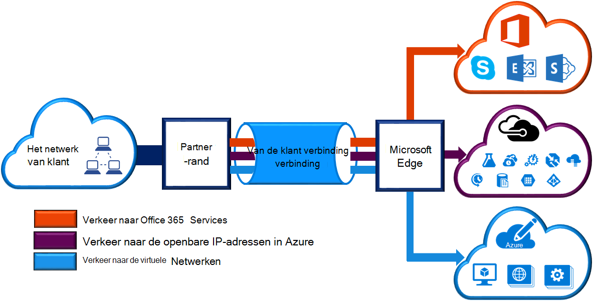
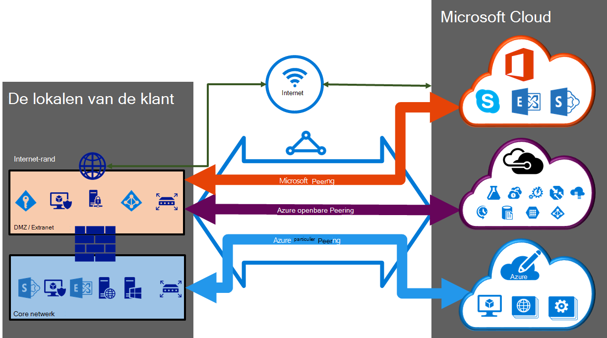

<properties 
   pageTitle="ExpressRoute circuits en routering domeinen | Microsoft Azure"
   description="Deze pagina bevat een overzicht van circuits ExpressRoute en de routering domeinen."
   documentationCenter="na"
   services="expressroute"
   authors="cherylmc"
   manager="carmonm"
   editor=""/>
<tags 
   ms.service="expressroute"
   ms.devlang="na"
   ms.topic="article" 
   ms.tgt_pltfrm="na"
   ms.workload="infrastructure-services" 
   ms.date="10/10/2016"
   ms.author="cherylmc"/>

# ExpressRoute circuits en routering domeinen

 U moet een *ExpressRoute circuit* voor uw infrastructuur op locatie verbinding te maken met Microsoft via een provider van connectivity bestellen. In de volgende afbeelding bevat een logische weergave van connectiviteit tussen uw WAN en van Microsoft.

## ExpressRoute circuits

Een *circuit ExpressRoute* vertegenwoordigt een logische verbinding tussen uw infrastructuur op gebouwen en Microsoft cloud services via een provider connectiviteit. U kunt meerdere ExpressRoute circuits bestellen. Elk circuit kan in dezelfde of een andere regio's, en tot hun gebouwen door leveranciers van andere verbindingen kan worden aangesloten. 

ExpressRoute circuits wijzen niet naar een fysieke entiteiten. Een circuit wordt aangeduid met een van de standaard een die GUID als een sleutel (key s) genoemd. De sleutel is de enige informatie die wordt uitgewisseld tussen Microsoft en de provider connectiviteit. De s-toets is niet om veiligheidsredenen geheim. Er is een 1:1 toewijzing tussen een ExpressRoute circuit en de s-toets.

Een circuit ExpressRoute kan maximaal drie onafhankelijke peerings hebben: Azure openbare, Azure private en Microsoft. Elke peering is een onafhankelijke BGP sessies van hen toch toe voor maximale beschikbaarheid worden geconfigureerd. Er is een 1: n (1 < = N < = 3) toewijzing tussen een ExpressRoute schakeling en routering van domeinen. Een circuit ExpressRoute kan hebben een, twee of alle drie peerings per ExpressRoute circuit ingeschakeld.
 
Elk circuit heeft een vaste bandbreedte (50 Mbps, 100 Mbps, 200 Mbps, 500 Mbps, 1 Gbps, 10 Gbps) en is toegewezen aan een provider connectiviteit en een peering locatie. De bandbreedte die u selecteert in de peerings voor het circuit worden gedeeld. 

### Quota, grenzen en beperkingen

Standaard quota's en beperkingen van toepassing voor elke ExpressRoute circuit. Ga naar de pagina [abonnement Azure Service grenzen, quota's en beperkingen](../azure-subscription-service-limits.md) voor de nieuwste informatie over quota.

## ExpressRoute routering domeinen

Een circuit ExpressRoute beschikt over meerdere Routering domeinen gekoppeld: Azure openbare, Azure private en Microsoft. Elk van de domeinen van het bewerkingsplan is identiek geconfigureerd op twee routers (in actieve of delen van belasting configuratie) voor hoge beschikbaarheid. Azure services zijn onderverdeeld in *Azure openbare* en *particuliere Azure* voor het weergeven van de IP-adresschema's.

### Private peering

Azure services, namelijk virtuele machines (IaaS) berekenen en cloud services (PaaS), die worden geïmplementeerd in een virtueel netwerk kunnen worden aangesloten via de private peering domein. De private peering domein wordt beschouwd als een vertrouwde uitbreiding van uw core netwerk in Microsoft Azure. U kunt een bidirectionele verbinding tussen uw core netwerk en Azure virtuele netwerken (VNets) instellen. Deze peering kunt u verbinding maken met virtuele machines en cloud services rechtstreeks op de particuliere IP-adressen.  

De private peering domein kunt u meerdere virtuele netwerken. Bekijk de [FAQ-pagina](expressroute-faqs.md) voor meer informatie over de grenzen en beperkingen. U kunt de pagina [abonnement Azure Service grenzen, quota's en beperkingen](../azure-subscription-service-limits.md) voor de nieuwste informatie over grenzen bezoeken.  Ga naar de pagina [Routering](expressroute-routing.md) voor meer informatie over de configuratie van routering.

### Openbare peering

Diensten zoals opslag Azure SQL-databases en Websites worden aangeboden op het openbare IP-adressen. U kunt privé verbinding maken met services op het openbare IP-adressen, met inbegrip van de VIP's van de cloud-services, via het openbare peering routering domein. U kunt verbinding maken met het openbare domein peering de DMZ en alle Azure services op de openbare IP-adressen van uw WAN verbinding zonder dat u verbinding maakt via het internet. 

Connectiviteit is altijd afkomstig van uw WAN Services Microsoft Azure. Microsoft Azure services worden niet kunnen initiëren van verbindingen in uw netwerk via dit bewerkingsplan domein. Als openbare peering is ingeschakeld, worden u verbinding maken met alle Azure services. We staan geen u selectief services waarvoor we adverteren van routes te kiezen. U kunt de lijst met prefixen die we aan u adverteren via deze peering op de pagina [Microsoft Azure Datacenter IP-adresbereiken](http://www.microsoft.com/download/details.aspx?id=41653) bekijken. De pagina wordt wekelijks bijgewerkt.

Binnen uw netwerk gebruiken alleen de routes die u nodig hebt, kunt u aangepaste routefilters definiëren. Ga naar de pagina [Routering](expressroute-routing.md) voor meer informatie over de configuratie van routering. Binnen uw netwerk gebruiken alleen de routes die u nodig hebt, kunt u aangepaste routefilters definiëren. 

Zie de [pagina Veelgestelde vragen](expressroute-faqs.md) voor meer informatie over services ondersteund via het openbare peering routering domein. 
 
### Microsoft peering

[AZURE.INCLUDE [expressroute-office365-include](../../includes/expressroute-office365-include.md)]

De verbinding met alle andere Microsoft online services (zoals Office 365 services) worden via de peering van Microsoft. We inschakelen bidirectionele verbinding tussen uw WAN- en Microsoft cloud services via het domein Microsoft peering routering. U moet verbinding maken met Microsoft cloud services alleen via openbare IP-adressen die eigendom zijn van u of uw provider verbinding en u moet voldoen aan de gedefinieerde regels. Zie de pagina [ExpressRoute vereisten](expressroute-prerequisites.md) voor meer informatie.

Zie de [pagina Veelgestelde vragen](expressroute-faqs.md) voor meer informatie over services ondersteund, kosten en configuratiegegevens. Zie de pagina [ExpressRoute locaties](expressroute-locations.md) voor meer informatie op de lijst met providers van connectiviteit biedt peering ondersteuning van Microsoft.

## Vergelijking met routering domein

In de onderstaande tabel vergelijkt de drie domeinen omleiden.

||**Private Peering**|**Openbare Peering**|**Microsoft Peering**|
|---|---|---|---|
|**Max. # voorvoegsels ondersteund per peering**|4000 standaard 10.000 met ExpressRoute Premium|200|200|
|**IP-adresbereiken ondersteund**|Elke geldige IPv4-adres in uw WAN.|Openbare IPv4-adressen die eigendom zijn van u of uw provider verbinding.|Openbare IPv4-adressen die eigendom zijn van u of uw provider verbinding.|
|**Als getal vereisten**|Particuliere en openbare als getallen. U moet de eigenaar van het publiek als getal als u kiest voor een. | Particuliere en openbare als getallen. U kunt echter moet bewijzen dat hij eigenaar van openbare IP-adressen.| Particuliere en openbare als getallen. U kunt echter moet bewijzen dat hij eigenaar van openbare IP-adressen.|
|**Routering Interface IP-adressen**|RFC1918 openbare IP-adressen en|Openbare IP-adressen geregistreerd bij u in de registers van routering.| Openbare IP-adressen geregistreerd bij u in de registers van routering.|
|**Ondersteuning van MD5-Hash**| Ja|Ja|Ja|

U kunt een of meer van de domeinen routering inschakelen als onderdeel van hun ExpressRoute circuit. U kunt de routering domeinen op het VPN dezelfde plaatsen als u wilt samenvoegen tot één domein routering. U kunt ze ook op verschillende routering domeinen vergelijkbaar met het diagram plaatsen. De aanbevolen configuratie is dat particuliere peering rechtstreeks is verbonden met de core-netwerk en het publiek en Microsoft peering koppelingen zijn verbonden met de DMZ.
 
Als u ervoor alle drie peering sessies kiest, hebt u drie paar BGP sessies (één paar voor elk type peering). De paren BGP sessies bieden een hoge beschikbaarheid koppeling. Als u verbinding via laag 2-connectiviteit providers maakt, kunt u zijn verantwoordelijk voor het configureren en beheren van routering. U kunt meer informatie aan de hand van de [werkstromen](expressroute-workflows.md) voor het instellen van ExpressRoute.

## Volgende stappen

- Zoeken naar een Internet-provider. Zie [ExpressRoute serviceproviders en locaties](expressroute-locations.md).
- Zorg ervoor dat aan alle vereisten is voldaan. Zie [ExpressRoute vereisten](expressroute-prerequisites.md).
- Configureer uw verbinding ExpressRoute.
    - [ExpressRoute circuits maken](expressroute-howto-circuit-classic.md)
    - [Configureren, routering (circuit peerings)](expressroute-howto-routing-classic.md)
    - [Een VNet koppelen aan een ExpressRoute circuit](expressroute-howto-linkvnet-classic.md)
