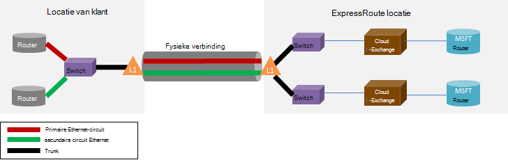

<properties
   pageTitle="Veelgestelde vragen over ExpressRoute"
   description="Veelgestelde vragen over het ExpressRoute bevat informatie over Azure Services ondersteund, kosten, gegevens en verbindingen, SLA, Providers en locaties, bandbreedte en aanvullende technische Details."
   documentationCenter="na"
   services="expressroute"
   authors="cherylmc"
   manager="carmonm"
   editor=""/>
<tags
   ms.service="expressroute"
   ms.devlang="na"
   ms.topic="article" 
   ms.tgt_pltfrm="na"
   ms.workload="infrastructure-services"
   ms.date="10/10/2016"
   ms.author="cherylmc"/>

# Veelgestelde vragen over ExpressRoute

## Wat is ExpressRoute?
ExpressRoute is een Azure service waarmee u persoonlijke verbindingen maken tussen Microsoft datacenters en infrastructuren die op uw locatie of in een faciliteit voor het onderbrengen. ExpressRoute verbindingen niet via het openbare Internet gaan en bieden betere beveiliging, betrouwbaarheid en snelheid met een lagere vertragingstijden dan normale verbindingen via het Internet.

### Wat zijn de voordelen van het gebruik van ExpressRoute en particuliere netwerkverbindingen?
ExpressRoute verbindingen niet via het openbare Internet gaan en bieden betere beveiliging, betrouwbaarheid en snelheid met een lagere en consistente vertragingstijden dan normale verbindingen via het Internet. In sommige gevallen ExpressRoute verbindingen gebruiken voor gegevensoverdracht tussen-lokale apparaten en Azure aanzienlijke kostenvoordelen kan opleveren.

### Wat Microsoft cloud-services worden ondersteund via ExpressRoute?
ExpressRoute ondersteunt de meeste Microsoft Azure services vandaag waaronder Office 365.  Snel zoeken naar updates op de algemene beschikbaarheid.

### Waar is de service beschikbaar?
Zie deze pagina voor de locatie en beschikbaarheid: [ExpressRoute partners en locaties](expressroute-locations.md).

### Hoe kan ik verbinding maken met Microsoft als er geen partnerschappen met een van de partners ExpressRoute vervoerder ExpressRoute gebruiken?
U kunt een regionale vervoerder selecteren en Ethernet-verbindingen naar een van de ondersteunde exchange provider locaties terechtkomen. U kunt vervolgens peer met Microsoft op de locatie van de provider. Controleer de laatste sectie van [ExpressRoute partners en locaties](expressroute-locations.md) om te zien als uw serviceprovider aanwezig in de exchange-locaties is. U kunt vervolgens een circuit ExpressRoute via de serviceprovider om verbinding met Azure te bestellen.

### Wat kost ExpressRoute?
Controleer de [prijsdetails](https://azure.microsoft.com/pricing/details/expressroute/) voor prijsinformatie.

### Als ik voor een ExpressRoute circuit van een bepaalde bandbreedte betalen, de VPN-verbinding die is het voordeel van de netwerkprovider heeft op dezelfde snelheid worden?
Nr. U kunt een VPN-verbinding met een snelheid van uw serviceprovider aanschaffen. De verbinding met Azure is beperkt tot de ExpressRoute circuit bandbreedte die u koopt.

### Als ik voor een ExpressRoute circuit van een bepaalde bandbreedte betalen, heb ik de mogelijkheid om een burst tot hogere snelheden indien nodig?
Ja. ExpressRoute circuits zijn geconfigureerd voor ondersteuning van gevallen waarin u kunt burst maximaal twee keer de limiet voor bandbreedte die u zonder extra kosten hebt aangeschaft. Neem contact op met uw serviceprovider als deze functie wordt ondersteund.

### Kan ik tegelijkertijd de particuliere netwerkverbinding met een virtueel netwerk en andere Azure diensten gebruiken?
Ja. Een circuit ExpressRoute eenmaal setup kunt u gelijktijdig kan in een virtueel netwerk en andere Azure diensten. U maakt verbinding met virtuele netwerken via de private peering pad en andere services op de openbare peering pad.

### ExpressRoute de mogelijkheid biedt een Service niveau overeenkomst (SLA)?
Raadpleeg de [ExpressRoute SLA pagina](https://azure.microsoft.com/support/legal/sla/) voor meer informatie.

## Ondersteunde services
Meest Azure services worden ondersteund via ExpressRoute.

- Verbindingen met virtuele machines en cloud services geïmplementeerd in virtuele netwerken via het private peering pad worden ondersteund.
- Azure Websites worden ondersteund via het openbare peering pad.
- IoT Hub wordt ondersteund via het openbare peering pad.
- Office 365 wordt ondersteund via het Microsoft peering pad.
- Alle andere diensten zijn toegankelijk via het openbare peering pad. De uitzonderingen zijn als volgt.

    **De volgende services worden niet ondersteund:**

    - CDN
    - Visual Studio Team Services Load testen
    - Meerledige verificatie
    - Beheer van netwerkverkeer

## Gegevens en verbindingen

### Zijn er beperkingen op de hoeveelheid gegevens die ik met behulp van ExpressRoute kunt overbrengen?
Wij doen niet een limiet instellen voor het bedrag van de overdracht van gegevens. Raadpleeg de [prijsdetails](https://azure.microsoft.com/pricing/details/expressroute/) voor meer informatie over de tarieven van de bandbreedte.

### Welke snelheden worden ondersteund door ExpressRoute?
Ondersteunde bandbreedte biedt:

| 50 Mbps, 100 Mbps, 200 Mbps, 500 Mbps, 1Gbps, 2 Gbps, 5 Gbps, 10Gbps |

### Welke aanbieders zijn er beschikbaar?
Zie [ExpressRoute partners en locaties](expressroute-locations.md) voor de lijst met serviceproviders en locaties.

## Technische details

### Wat zijn de technische voorschriften voor de verbinding met mijn locatie in lokalen Azure?
Raadpleeg [ExpressRoute voorwaarden pagina](expressroute-prerequisites.md) vereisten.

### Wilt u verbindingen ExpressRoute overbodig?
Ja. Elke Route Express circuit heeft een redundante paar cross-verbindingen die zijn geconfigureerd voor maximale beschikbaarheid.

### Ik verbinding kwijt als een van Mijn koppelingen ExpressRoute niet?
U verliest verbinding als een van de cross-verbindingen mislukt. Een redundante verbinding is beschikbaar ter ondersteuning van de belasting van het netwerk. Bovendien kunt u meerdere circuits maken in een andere peering locatie storing veerkracht te bereiken.

### Als ik niet naast elkaar bevinden op een wolk exchange en mijn serviceprovider biedt een point-to-point-verbinding, moet ik twee fysieke verbindingen tussen mijn netwerk op gebouwen en Microsoft bestellen? 
Nee, hoeft u slechts één fysieke verbinding als uw serviceprovider twee Ethernet-virtuele circuits over de fysieke verbinding kunt maken. De fysieke verbinding (bv. een optische vezel) wordt beëindigd op een laag 1 (L1)-apparaat (Zie onderstaande afbeelding). De twee Ethernet-virtuele circuits zijn gelabeld met verschillende VLAN-id's, één voor het primaire circuit en één voor de secundaire. De VLAN-id's zijn in de buitenste 802.1Q Ethernet-header. De binnenste 802.1Q Ethernet-header (niet weergegeven) wordt toegewezen aan een bepaald [bewerkingsplan domein ExpressRoute](expressroute-circuit-peerings.md). 

### Kan ik uitbreiden een van mijn VLAN's naar Azure ExpressRoute gebruiken?
Nr. We ondersteunen geen laag 2-connectiviteit extensies in Azure.

### Kan ik meer dan één ExpressRoute circuit hebben in mijn abonnement?
Ja. U kunt meer dan één ExpressRoute circuit hebben in uw abonnement. De standaardlimiet voor het aantal gespecialiseerde circuits is ingesteld op 10. Neem contact op met Microsoft Support de limiet te verhogen indien nodig.

### Kan ik ExpressRoute circuits van verschillende dienstverleners hebben?
Ja. U kunt ExpressRoute circuits hebben met veel serviceproviders. Elk circuit ExpressRoute worden gekoppeld aan een serviceprovider.

### Hoe kan ik mijn virtuele netwerken verbinden met een circuit ExpressRoute
De basisstappen worden hieronder nader belicht.

- U moet een ExpressRoute circuit tot stand brengen en de dienstverlener dit inschakelen.
- U of de provider moet het BGP peering (s) configureren.
- U moet het virtuele netwerk koppelen aan het circuit ExpressRoute.

Zie [ExpressRoute workflows voor circuit inrichten en Staten circuit](expressroute-workflows.md) voor meer informatie.

### Zijn er grenzen connectiviteit voor mijn ExpressRoute circuit?
Ja. [ExpressRoute partners en locaties](expressroute-locations.md) pagina biedt een overzicht van de grenzen van de verbinding voor een ExpressRoute circuit. Verbinding voor een ExpressRoute circuit is beperkt tot één geopolitieke regio. Connectiviteit kan cross geopolitieke regio's door het inschakelen van de functie ExpressRoute premie worden uitgebreid.

### Kan ik koppelen met meer dan één virtueel netwerk naar een ExpressRoute circuit
Ja. U kunt maximaal 10 virtuele netwerken koppelen aan een ExpressRoute circuit.

### Ik heb meerdere Azure abonnementen met virtuele netwerken. Kan ik een virtuele netwerken die op aparte abonnementen op een enkele ExpressRoute circuit aansluiten?
Ja. U kunt maximaal 10 andere Azure abonnementen gebruiken een enkel ExpressRoute circuit machtigen. Deze limiet kan worden verhoogd door het inschakelen van de functie ExpressRoute premium.

Zie [delen van een schakeling ExpressRoute over meerdere abonnementen](expressroute-howto-linkvnet-arm.md)voor meer informatie.

### Virtuele netwerken verbonden bent met hetzelfde circuit geïsoleerd van elkaar?
Nr. Alle virtuele netwerken die zijn gekoppeld aan hetzelfde circuit ExpressRoute deel uitmaken van hetzelfde domein omleiden en niet van een bewerkingsplan perspectief van elkaar gescheiden. Als u route isolatie, moet u een apart ExpressRoute circuit te maken.

### Kan ik een virtueel netwerk aangesloten op meer dan één ExpressRoute circuit hebben?
Ja. U kunt één virtueel netwerk met maximaal 4 ExpressRoute circuits koppelen. Zij moeten worden besteld via 4 verschillende [locaties ExpressRoute](expressroute-locations.md).

### Kan ik toegang tot het internet vanuit Mijn virtuele netwerken verbonden met ExpressRoute circuits?
Ja. Als u hebben geen standaardroutes (0.0.0.0/0) of internet route voorvoegsels via de sessie BGP aangekondigd, worden u verbinding kunnen maken met het internet vanaf een virtueel netwerk is gekoppeld aan een ExpressRoute circuit.

### Kan ik internet-verbinding met virtuele netwerken verbonden met ExpressRoute circuits blokkeren?
Ja. U kunt adverteren standaardroutes (0.0.0.0/0) voor het blokkeren van alle internet-connectiviteit met virtuele machines die in een virtueel netwerk en alle verkeer uit via het circuit ExpressRoute leiden. Opmerking Als u standaardroutes adverteren, wij verkeer naar services die worden aangeboden via openbare peering (zoals Azure opslag en SQL DB) terug naar uw locatie dwingen zullen. U hebt om uw routers verkeer terug naar Azure, het pad naar de openbare peering of via het internet te configureren.

### Kunnen virtuele netwerken die zijn gekoppeld aan hetzelfde circuit ExpressRoute met elkaar praten?
Ja. Virtuele machines in de virtuele netwerken die zijn verbonden met hetzelfde circuit ExpressRoute geïmplementeerd kunnen met elkaar communiceren.

### Kan ik verbinding van site naar site voor virtuele netwerken in combinatie met ExpressRoute gebruiken?
Ja. ExpressRoute van site naar site VPN's naast elkaar kunnen bestaan.

### Kan ik een virtueel netwerk verplaatsen van site naar site / punt-naar-site configuratie ExpressRoute gebruiken?
Ja. U moet een gateway ExpressRoute binnen het virtuele netwerk maken. Er is een kleine uitvaltijd gekoppeld aan het proces.

### Wat moet ik verbinding maken met Azure opslag via ExpressRoute
Als u een ExpressRoute circuit tot stand brengen en routes configureren voor openbare peering.

### Zijn er beperkingen op het aantal routes dat ik kan adverteren?
Ja. We accepteren maximaal 4000 route voorvoegsels voor private peering en 200 voor openbare peering en peering van Microsoft. U kunt deze verhogen tot 10.000 routes voor private peering als u de functie ExpressRoute premium inschakelen.

### Zijn er beperkingen voor IP-adresbereiken die ik via het BGP-sessie kunt adverteren?
We accepteren geen persoonlijke voorvoegsels (RFC1918) in de openbare en Microsoft peering BGP-sessie.

### Wat gebeurt er als ik meer dan het BGP beperkt?
BGP sessies worden weggehaald. Ze worden opnieuw ingesteld nadat de telling voorvoegsel onder de limiet komt.

### Wat is de bedrijfsduur ExpressRoute BGP? U kunt deze aanpassen?
De wachtruimte is 180. De keep alive-berichten worden elke 60 seconden. Deze worden instellingen opgelost aan de kant van Microsoft die niet kan worden gewijzigd.

### Nadat ik de standaardroute (0.0.0.0/0) voor mijn virtuele netwerken adverteren, kan ik mijn VMs Azure waarop Windows niet activeren. Hoe om ik dit oplossen?
De volgende stappen kunt herkennen de activeringsaanvraag Azure:

1. Tot stand brengen openbare peering voor uw ExpressRoute circuit.
2. Een DNS-zoekopdracht uitvoeren en zoeken naar het IP-adres van de **kms.core.windows.net**
3. Ga op een van de volgende twee items zodat de Key Management Service herkent dat de activeringsaanvraag Azure vandaan en wordt het verzoek gehonoreerd.
    - Route het verkeer dat bestemd is voor het IP-adres (in stap 2 verkregen) terug naar Azure via openbare peering op uw netwerk op gebouwen.
    - Uw haar provider NSP-pins het verkeer terug naar Azure via openbare peering hebben.

### Kan ik de bandbreedte van een circuit ExpressRoute wijzigen?
Ja. U kunt de bandbreedte van een circuit ExpressRoute verhogen zonder het verwijderen. U moet Neem contact op met uw provider verbinding om ervoor te zorgen dat zij de throttles binnen hun netwerken ter ondersteuning van de toename van bandbreedte bijwerken. U wordt echter niet mogelijk te beperken van de bandbreedte van een ExpressRoute circuit. Lager die de bandbreedte een tear naar beneden dat betekent en recreatie van een circuit ExpressRoute gelet.

### Hoe wijzig ik de bandbreedte van een circuit ExpressRoute
U kunt de bandbreedte van de ExpressRoute circuit met de update speciaal circuit API en PowerShell-cmdlet bijwerken.

## ExpressRoute Premium

### Wat is ExpressRoute premium?
ExpressRoute premium is een verzameling van onderstaande functies.

 - Verhoogde routing tabel maximaal uit 4000 routes naar 10.000 routes voor private peering.
 - Verhoogd aantal VNets die kunnen worden aangesloten op het circuit ExpressRoute (de standaardwaarde is 10). Zie onderstaande tabel voor meer informatie.
 - Globale connectiviteit via het netwerk van Microsoft core. Nu mogelijk een VNet in een geopolitieke regio met een circuit ExpressRoute in een ander gebied te koppelen. **Voorbeeld:** U kunt een VNet gemaakt in West-Europa naar een ExpressRoute circuit gemaakt in Silicon Valley koppelen.
 - Verbindingen met services voor Office 365 en CRM Online.

### Hoeveel VNets kan ik koppelen aan een ExpressRoute circuit als ik ExpressRoute premium ingeschakeld?
De onderstaande tabellen geven de grenzen ExpressRoute en het aantal VNets per ExpressRoute circuit.

[AZURE.INCLUDE [expressroute-limits](../../includes/expressroute-limits.md)]

### Hoe schakel ik ExpressRoute premium
ExpressRoute premium-functies kunnen worden ingeschakeld wanneer de functie is ingeschakeld en kan worden afgesloten door het bijwerken van de status van het circuit. U kunt ExpressRoute premium bij het circuit maken of bel het circuit uitsluitend update API / PowerShell-cmdlet ExpressRoute premium inschakelen.

### Hoe schakel ik ExpressRoute premium
ExpressRoute premium is uitgeschakeld door het aanroepen van de update speciaal circuit API / PowerShell-cmdlet moet u ervoor zorgen dat u de verbinding hebt aangepast moet voldoen aan de standaardlimiet voordat u ExpressRoute premium uitschakelt. We mislukt verzoek ExpressRoute premium uitschakelen als uw gebruik buiten de grenzen van de standaard geschaald.

### Kan ik Kies de gewenste functie uit de premium-functies?
Nr. Niet mogelijk de functies die u moet kiezen. We inschakelen alle functies wanneer u premium ExpressRoute inschakelt.

### Wat kost ExpressRoute premium?
Raadpleeg de [prijsdetails](https://azure.microsoft.com/pricing/details/expressroute/) voor kosten.

### Ik betalen voor ExpressRoute premie bovenop de standaard ExpressRoute toeslagen?
Ja. ExpressRoute premium kosten van toepassing op ExpressRoute circuit toeslagen en kosten die door de provider verbinding vereist.

## ExpressRoute en Services van Office 365 en CRM Online

[AZURE.INCLUDE [expressroute-office365-include](../../includes/expressroute-office365-include.md)]

### Hoe maak ik een verbinding maken met services voor Office 365 en CRM Online ExpressRoute-circuit

1. Bekijk de pagina [ExpressRoute voorwaarden](expressroute-prerequisites.md) om ervoor te zorgen dat u voldoet aan de vereisten.
2. Bekijk de lijst met serviceproviders en locaties bij [ExpressRoute partners en locaties](expressroute-locations.md) om ervoor te zorgen dat de verbinding moet worden voldaan.
3. Plan uw capaciteitsvereisten aan de hand van de [planning van het netwerk en het afstemmen van prestaties voor Office 365](http://aka.ms/tune/).
4. Volg de stappen in de onderstaande instellen verbinding [ExpressRoute workflows voor circuit inrichten en Staten circuit](expressroute-workflows.md)werkstromen.

>[AZURE.IMPORTANT] Zorg ervoor dat u ExpressRoute premium invoegtoepassing hebt ingeschakeld bij het configureren van verbindingen met services voor Office 365 en CRM Online.

### Moet ik openbare Peering van Azure verbinding maken met services voor Office 365 en CRM Online inschakelen?
Nee, u hoeft Microsoft Peering inschakelen. Via Microsoft Peering worden verificatieverkeer naar Azure AD verzonden. 

### Mijn bestaande ExpressRoute circuits kunnen ondersteuning voor verbindingen met services voor Office 365 en CRM Online?
Ja. Uw bestaande ExpressRoute circuit kan worden geconfigureerd voor de ondersteuning van verbindingen met services voor Office 365. Zorg ervoor dat u beschikt over voldoende capaciteit om verbinding maken met services voor Office 365 en zorg ervoor dat u premium invoegtoepassing hebt ingeschakeld. [Planning van het netwerk en het afstemmen van prestaties voor Office 365](http://aka.ms/tune/) kunt u van plan bent uw connectiviteit wensen. Zie ook [maken en wijzigen van een circuit ExpressRoute](expressroute-howto-circuit-classic.md).

### Welke Office 365 toegankelijk via een verbinding ExpressRoute?

Raadpleeg de [Office 365-URL's en IP-adresbereiken](http://aka.ms/o365endpoints) pagina voor een actueel overzicht van de services ondersteund via ExpressRoute.

### Wat kost ExpressRoute voor services van Office 365 en CRM Online kosten?
Services voor Office 365 en CRM Online vereist premium-invoegtoepassing is ingeschakeld. De [prijzen van de detailpagina](https://azure.microsoft.com/pricing/details/expressroute/) bevat details van de kosten voor ExpressRoute.

### Welke regio is ExpressRoute voor Office 365 ondersteund?
Raadpleeg [ExpressRoute partners en locaties](expressroute-locations.md) voor meer informatie over de lijst van partners en locaties waar ExpressRoute wordt ondersteund.

### Kan ik toegang tot Office 365 via het internet ook als ExpressRoute is geconfigureerd voor mijn organisatie?
Ja. Office 365 eindpunten zijn bereikbaar via het internet, hoewel ExpressRoute is geconfigureerd voor het netwerk. Als u op een locatie die is geconfigureerd voor verbinding met Office 365 diensten via ExpressRoute, maakt u verbinding via ExpressRoute.

### Dynamics AX Online toegankelijk is via een verbinding ExpressRoute?
Nee, wordt niet ondersteund.
