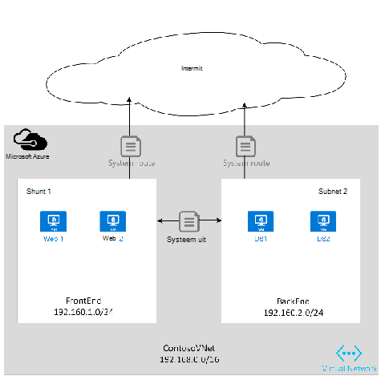
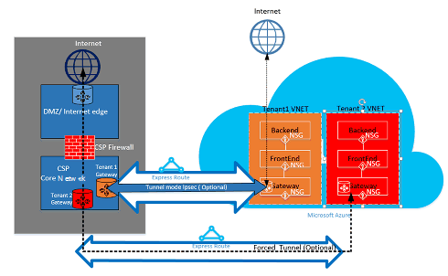

<properties
   pageTitle="Azure ExpressRoute voor Cloud Solution Providers | Microsoft Azure"
   description="Dit artikel bevat informatie voor Cloud-Providers die Azure services opnemen en ExpressRoute in hun aanbiedingen."
   documentationCenter="na"
   services="expressroute"
   authors="richcar"
   manager="carmonm"
   editor=""/>
<tags
   ms.service="expressroute"
   ms.devlang="na"
   ms.topic="get-started-article"
   ms.tgt_pltfrm="na"
   ms.workload="infrastructure-services"
   ms.date="10/10/2016"
   ms.author="richcar"/>

# ExpressRoute voor Cloud Solution Providers (CSP)

Microsoft biedt services voor Hyper-schaal voor traditionele leveranciers en distributeurs (CSP) kunnen snel creëren nieuwe services en oplossingen voor uw klanten zonder de noodzaak om te investeren in de ontwikkeling van deze nieuwe diensten. Microsoft biedt zodat de Cloud Solution Provider (CSP) de mogelijkheid om deze nieuwe diensten rechtstreeks te beheren, programma's en API's waarmee de CSP is Microsoft Azure om bronnen te beheren voor uw klanten. Een van deze bronnen is ExpressRoute. ExpressRoute kunt de CSP bestaande klant bronnen verbinden met Azure services. ExpressRoute is een koppeling van de hoge snelheid private communications Services in Azure. 

ExpresRoute bestaat uit twee circuits voor hoge beschikbaarheid die zijn gekoppeld aan een abonnement voor één klant en kan niet worden gedeeld door meerdere klanten. Elk circuit moet worden beëindigd in een andere router te handhaven van de hoge beschikbaarheid.

>[AZURE.NOTE] ExpressRoute, wat betekent dat grote/complexe implementaties voor één klant meerdere ExpressRoute circuits nodig zijn caps bandbreedte en verbinding.

Microsoft Azure biedt een groeiend aantal services die u aan uw klanten aanbieden kunt.  Beste stappen gebruikmaken van deze services houdt in dat ExpressRoute verbindingen met hoge snelheid bieden een lage latentie toegang tot de Microsoft Azure-omgeving.

## Microsoft Azure management
Microsoft biedt CSP's met API's voor het beheren van de abonnementen Azure klant doordat programmatische integratie met uw eigen service management systems. Ondersteunde mogelijkheden vindt u [hier](https://msdn.microsoft.com/library/partnercenter/dn974944.aspx).

## Microsoft Azure Resourcemanagement
Afhankelijk van het contract met uw klant bepaalt hoe u het abonnement wordt beheerd. Maken van de rechtstreeks door de Cryptografieprovider kunt beheren en onderhoud van bronnen of de klant kan beheer van het abonnement op Microsoft Azure en de Azure resources maken als ze nodig hebben. Als de klant het maken van de bronnen van hun abonnement op Microsoft Azure beheert gebruiken ze een van de twee modellen: 'Verbinding maken via' model, of 'Direct naar'. Deze modellen worden in de volgende secties gedetailleerd beschreven.  

### Verbinding maken via model

  

De CSP maakt in het model verbinden via een directe verbinding tussen uw datacenter en Azure abonnement van de klant. De directe verbinding wordt gemaakt met behulp van ExpressRoute, verbinding maken met uw netwerk met Azure. Vervolgens verbindt de klant met het netwerk. In dit scenario vereist dat de klant wordt doorgegeven via de CSP netwerk toegang krijgen tot Azure services. 

Als uw klant andere Azure abonnementen niet door u worden beheerd heeft, gebruiken ze het openbare Internet of hun eigen persoonlijke verbinding verbinding maken met deze diensten onder het abonnement niet CSP ingericht. 

CSP Azure services beheren, wordt aangenomen dat de Cryptografieprovider heeft een klant eerder vastgestelde identiteit winkel die zou vervolgens gerepliceerd naar Azure Active Directory voor het beheer van hun CSP-abonnement via Administrate-On-Behalf-Of (AOBO). Belangrijkste stuurprogramma's voor dit scenario bevatten waar een bepaalde partner of serviceprovider een vaste relatie met de klant heeft, de klant services provider op dat moment verbruikt of de partner een behoefte aan een combinatie van de provider wordt gehost en Azure gehoste oplossingen voor flexibiliteit en adres klant uitdagingen die niet kunnen worden voldaan door alleen CSP. Dit model wordt geïllustreerd in **figuur**hieronder.

### Verbinding maken met model

In het model verbinding maken met de serviceprovider maakt een directe verbinding tussen het datacenter van de klant en de CSP ingericht Azure abonnement met ExpressRoute via de klant (klant) netwerk.

>[AZURE.NOTE] De klant moet maken en onderhouden van het circuit ExpressRoute voor ExpressRoute.  

In dit scenario verbinding moet de klant verbindt rechtstreeks via een netwerk van de klant CSP beheerd Azure-abonnement toegang krijgen tot een directe netwerkverbinding die is gemaakt, eigendom van en beheerd geheel of gedeeltelijk door de klant. Voor deze klanten die wordt ervan uitgegaan dat de provider heeft momenteel geen een winkel klant identiteit tot stand gebracht en de provider kan hulp bieden bij het repliceren van hun huidige identiteit winkel in Azure Active Directory voor het beheer van hun abonnement via AOBO. Belangrijkste stuurprogramma's voor dit scenario bevatten waar een bepaalde partner of serviceprovider een vaste relatie met de klant heeft, de klant services provider op dat moment verbruikt, of de partner heeft een behoefte aan diensten die uitsluitend op Azure gehoste oplossingen zonder de noodzaak van een bestaande provider datacenter of infrastructuur zijn gebaseerd.

De keuze tussen deze twee opties zijn gebaseerd op de behoeften van uw klant en uw huidige behoefte Azure diensten. De details van deze modellen en de bijbehorende toegang op basis van rollen beheren, netwerken en identiteit ontwerppatronen vallen in details in de volgende koppelingen:
-   **Rol op basis van Access Control (RBAC)** – RBAC is gebaseerd op Azure Active Directory.  Zie voor meer informatie over Azure RBAC [hier](../active-directory/role-based-access-control-configure.md).
-   **Networking** – heeft betrekking op de verschillende onderwerpen van netwerken in Microsoft Azure.
-   **Azure Active Directory (AAD)** – AAD biedt de identity management for Microsoft Azure en 3de partij SaaS-toepassingen. Voor meer informatie over AD Azure Zie [hier](https://azure.microsoft.com/documentation/services/active-directory/).  

## Snelheid netwerk
ExpressRoute ondersteunt netwerksnelheden van 50 Mb/s naar 10Gb/s. Zo kunnen klanten kopen de hoeveelheid netwerkbandbreedte die nodig zijn voor hun unieke omgeving.

>[AZURE.NOTE] Bandbreedte van het netwerk kan worden verhoogd indien nodig zonder de communicatie verstoren, maar om het netwerk snelheid scheurt af van het circuit en op lagere netwerksnelheid opnieuw is vereist.  

ExpressRoute ondersteunt de aansluiting van meerdere vNets voor een enkel ExpressRoute circuit voor een betere benutting van de verbindingen van de hogere snelheid. Een enkele ExpressRoute circuit kan worden gedeeld met meerdere Azure abonnementen die eigendom zijn van dezelfde klant.

## ExpressRoute configureren
ExpressRoute kan worden geconfigureerd voor de ondersteuning van de drie soorten verkeer ([routing domeinen](#ExpressRoute-routing-domains)) via een enkele ExpressRoute circuit. Het verkeer wordt gescheiden in Microsoft peering, peering van Azure openbare en private peering. U kunt één of alle typen verkeer via een enkele ExpressRoute circuit worden verzonden of het gebruik van meerdere ExpressRoute circuits, afhankelijk van de grootte van de ExpressRoute circuit en isolatie vereist door uw klant. De houding van de beveiliging van uw klant mogelijk niet toegestaan verkeer in openbare en particuliere verkeer doorlopen via hetzelfde circuit.

### Verbinding maken via model
In een configuratie verbinding maken via de u verantwoordelijk voor alle van de fundering netwerk verbinding maken met uw datacenter klanten middelen de abonnementen in Azure gehost worden. Elk van uw klant gewenste Azure mogelijkheden moet hun eigen ExpressRoute-verbinding worden beheerd door de u. Het zal u de klant gebruiken zou om aan te schaffen het circuit ExpressRoute dezelfde methoden. Het zal u dezelfde stappen in het artikel [ExpressRoute werkstromen](./expressroute-workflows.md) voor circuit inrichten en circuit Staten. Vervolgens wordt de u de Border Gateway Protocol (BGP) routes om te regelen het verkeer dat tussen het netwerk van lokalen en Azure vNet configureren.

### Verbinding maken met model
In een configuratie verbinding maken met uw klant al een bestaande verbinding met Azure of initiëren een verbinding met de internet-provider ExpressRoute koppelen vanuit uw datacenter van klant rechtstreeks naar Azure, in plaats van uw datacenter. Om te beginnen met het inrichten, zal de klant de stappen zoals hierboven wordt beschreven in het model verbinden via. Zodra het circuit tot stand is gebracht moet de klant de routers op het bedrijf om toegang tot uw netwerk en de Azure vNets te kunnen configureren.

U kunt helpen bij de verbinding instellen en configureren van de routes kunnen de resources in uw datacenter(s) om te communiceren met de client resources in uw datacenter of met de bronnen die worden gehost in Azure.

## ExpressRoute routering domeinen
ExpressRoute biedt drie domeinen voor routering: openbare, persoonlijke en peering van Microsoft. Elk van de domeinen omleiden met identieke routers in de actieve configuratie voor maximale beschikbaarheid worden geconfigureerd. Voor meer informatie over ExpressRoute routering domeinen zoeken [hier](./expressroute-circuit-peerings.md).

Hier kunt u aangepaste routes filters, zodat alleen de gewenste toe te staan of moet dienen. Voor meer informatie of om te zien hoe u deze wijzigingen Zie artikel: [maken en pas bewerkingsplan voor een ExpressRoute circuit met PowerShell](./expressroute-howto-routing-classic.md) voor meer informatie over routering filters.

>[AZURE.NOTE] Microsoft en openbare Peering connectiviteit via een openbaar IP-adres is eigendom van de klant of de CSP moet zijn en moet voldoen aan alle gedefinieerde regels. Zie voor meer informatie de pagina [ExpressRoute vereisten](expressroute-prerequisites.md) .  

## Routering
ExpressRoute verbindt met de Azure netwerken via de Gateway van Azure Virtual Network. Netwerkgateways bieden routering voor Azure virtuele netwerken.

Azure virtuele netwerken maken maakt ook een standaard-routeringstabel voor de vNet aan het verkeer van de subnetten van de vNet. Als de standaardroutetabel onvoldoende voor de aangepaste oplossing is worden routes voor het routeren van uitgaand verkeer blokkeren routes naar specifieke subnetten of externe netwerken of aangepaste toestellen gemaakt.

### Standaard routering
De standaardroutetabel omvat de volgende routes:

- Binnen een subnet-routering
- Subnet voor subnet binnen het virtuele netwerk
- Met het Internet
- Virtueel netwerk voor virtuele netwerk met behulp van VPN-gateway
- Virtueel netwerk-naar-on-premises-netwerk via een VPN- of ExpressRoute gateway

  

### Door de gebruiker gedefinieerde routering (UDR)
Door de gebruiker gedefinieerde routes kunnen besturen verkeer uitgaande van het subnet toegewezen aan andere subnetten in het virtuele netwerk of op een van de andere vooraf gedefinieerde gateways (ExpressRoute; internet of VPN). De routeringstabel van standaard-systeem kan worden vervangen door een door de gebruiker gedefinieerde routeringstabel is die de standaardrouteringstabel vervangen door aangepaste routes. Met door de gebruiker gedefinieerde routering, klanten specifieke routes aan apparaten zoals firewalls of intrusion detection toestellen maken, of toegang tot specifieke subnetten van het subnet waarop de route door de gebruiker gedefinieerde blokkeren. Kijk voor een overzicht van de gebruiker gedefinieerde Routes [hier](../virtual-network/virtual-networks-udr-overview.md). 

## Beveiliging
Afhankelijk van welk model gebruikt, verbinding maken met of verbinden via wordt, de klant wordt het beveiligingsbeleid gedefinieerd in hun vNet of biedt de beveiliging vereisten voor de Cryptografieprovider voor het definiëren van hun vNets. De volgende criteria voor beveiliging kunnen worden gedefinieerd:

1.  **Isolatie van de klant** , de Azure-platform biedt isolatie van de klant door de klant-ID en vNet informatie op te slaan in een beveiligde database die wordt gebruikt voor het inkapselen van verkeer van de klant in een tunnel GRE.
2.  **Network Security Group (NSG)** regels zijn voor het definiëren van verkeer toegestaan naar en vanaf de subnetten binnen vNets in Azure. De NSG bevat regels blokkeren verkeer vanaf het Internet naar de vNet blokkeren en toestaan dat de regels voor verkeer binnen een vNet. Kijk voor meer informatie over beveiligingsgroepen netwerk [hier](https://azure.microsoft.com/blog/network-security-groups/).
3.  **Force tunneling** , dit is een optie om de gebonden internetverkeer van oorsprong in Azure wordt omgeleid via de verbinding ExpressRoute naar datacentra in gebouwen. Kijk voor meer informatie over de geforceerde tunneling [hier](./expressroute-routing.md#advertising-default-routes).  

4.  **Codering** , hoewel de ExpressRoute circuits zijn toegewezen aan een specifieke klant, er is de mogelijkheid dat de netwerkprovider kan worden nagekomen, zodat een indringer pakket verkeer te controleren. Om dit potentieel, een klant of een Cryptografieprovider kunt coderen verkeer via de verbinding door het definiëren van IPSec-tunnelmodus beleid voor alle verkeer dat tussen de bronnen van lokalen en Azure resources (verwijzen naar de optionele IPSec-tunnelmodus voor klant 1 in afbeelding 5: ExpressRoute beveiliging, hierboven). De tweede optie zou zijn gebruik van een firewall toestel op elk het eindpunt van het circuit ExpressRoute. Dit houdt in dat extra 3e partij firewall VMs/uitrustingsstukken die worden geïnstalleerd aan beide uiteinden voor het coderen van het verkeer via de ExpressRoute circuit.

  

## Volgende stappen
De service Cloud Solution Provider biedt een manier om een hogere waarde op voor uw klanten zonder de noodzaak voor dure infrastructuur en capaciteit aankopen, terwijl uw positie als de primaire uitbesteding. Naadloze integratie met Microsoft Azure kan worden bereikt via de API CSP, zodat u kunt het beheer van Microsoft Azure binnen uw bestaande beheerkaders integreren.  

Meer informatie vindt op de volgende koppelingen:

[Microsoft Cloud Solution Provider programma](https://partner.microsoft.com/en-US/Solutions/cloud-reseller-overview).  
[Voorbereiden om af te handelen als een Cloud Solution Provider](https://partner.microsoft.com/en-us/solutions/cloud-reseller-pre-launch).  
[Bronnen voor Microsoft Cloud Solution Provider](https://partner.microsoft.com/en-us/solutions/cloud-reseller-resources).
