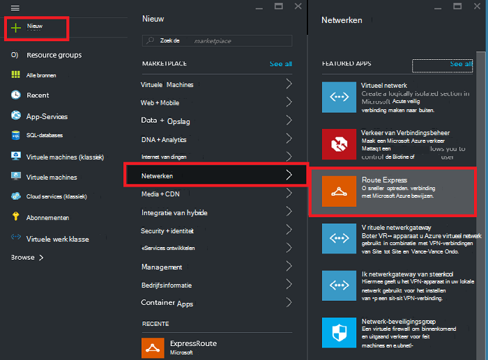

<properties
   pageTitle="Maken en wijzigen van een ExpressRoute circuit met behulp van bronbeheer en de Azure portal | Microsoft Azure"
   description="In dit artikel wordt beschreven hoe maken, inrichten, controleren, bijwerken, verwijderen en een circuit ExpressRoute deprovision."
   documentationCenter="na"
   services="expressroute"
   authors="cherylmc"
   manager="carmonm"
   editor=""
   tags="azure-resource-manager"/>
<tags
   ms.service="expressroute"
   ms.devlang="na"
   ms.topic="article"
   ms.tgt_pltfrm="na"
   ms.workload="infrastructure-services"
   ms.date="10/10/2016"
   ms.author="cherylmc"/>

# Maken en wijzigen van een circuit ExpressRoute

> [AZURE.SELECTOR]
[Azure Portal - Resource Manager](expressroute-howto-circuit-portal-resource-manager.md)
[PowerShell - Resource Manager](expressroute-howto-circuit-arm.md)
[PowerShell - klassiek](expressroute-howto-circuit-classic.md)

In dit artikel wordt beschreven hoe een circuit Azure ExpressRoute maken met behulp van de portal Azure en het implementatiemodel Azure Resource Manager. De volgende stappen ook hoe u de status van het circuit, bijwerken of verwijderen en het deprovision.

**Over de Azure-implementatie**

[AZURE.INCLUDE [vpn-gateway-clasic-rm](../../includes/vpn-gateway-classic-rm-include.md)] 

## Voordat u begint

- De [vereisten](expressroute-prerequisites.md) en [werkstromen](expressroute-workflows.md) bekijken voordat u configuratie.
- Zorg ervoor dat u toegang tot de [Azure portal hebt](https://portal.azure.com).
- Controleer of u machtigingen voor het maken van nieuwe bronnen van netwerken hebben. Neem contact op met de accountbeheerder van uw als u niet de juiste machtigingen hebt.

## Maken en inrichten van een circuit ExpressRoute

### 1. Meld u aan bij de Azure portal

Vanuit een browser, Ga naar de [Azure portal](http://portal.azure.com) en meld u aan met uw account Azure.

### 2. Maak een nieuwe ExpressRoute circuit

>[AZURE.IMPORTANT] Uw ExpressRoute circuit wordt afgeschreven vanaf het moment dat een sleutel wordt uitgegeven. Zorg ervoor dat u deze bewerking niet uitvoeren wanneer de provider connectiviteit gereed is voor het inrichten van het circuit.

1. U kunt een circuit ExpressRoute maken door de optie een nieuwe bron maken. Klik op **Nieuw** > **netwerk** > **ExpressRoute**, zoals in de volgende afbeelding wordt getoond:

    

2. Nadat u op **ExpressRoute**, ziet u de blade **circuit ExpressRoute maken** . Wanneer u tijdens het invullen van de waarden op deze blade, zorg dat u de juiste SKU-niveau en de meting van de gegevens opgeeft.

    - **Laag** bepaalt of een standaard ExpressRoute of een ExpressRoute premium-invoegtoepassing is ingeschakeld. U kunt **standaard** als u de standaard SKU of de **premie** voor de premium-invoegtoepassing opgeven.

    - **Meting gegevens** bepaalt het factuuradres. Voor een gemeten gegevens plan en **onbeperkt** kunt u **Metered** opgeven voor onbeperkt. Houd er rekening mee dat kunt u het type van de facturering van **Metered** op **ongelimiteerd**, maar u kunt het type niet van **onbeperkt** op **Metered wijzigen**.

    

>[AZURE.IMPORTANT] Zorg ervoor dat de locatie Peering geeft de [fysieke locatie](expressroute-locations.md) waar u peering met Microsoft. Dit is **niet** gekoppeld aan de eigenschap 'Locatie', die verwijst naar de wereld waar de Azure-netwerkprovider bron zich bevindt. Terwijl ze niet zijn gekoppeld, is het verstandig om te kiezen een netwerkprovider Resource geografisch dicht bij de locatie Peering van het circuit. 

### 3. de circuits en eigenschappen weergeven

**Alle circuits weergeven**

U kunt alle circuits die u hebt gemaakt door het selecteren van **alle resources** in het menu links weergeven.
    

**De eigenschappen weergeven**

    You can view the properties of the circuit by selecting it. On this blade, note the service key for the circuit. You must copy the circuit key for your circuit and pass it down to the service provider to complete the provisioning process. The circuit key is specific to your circuit.

### 4. de sleutel naar uw provider verbinding verzenden voor de inrichting

Op deze blade vindt **status van providers** u informatie over de huidige status van het aanbod aan de kant van de service provider. **Status circuit** biedt de staat aan de kant van Microsoft. Zie het artikel [werkstromen](expressroute-workflows.md#expressroute-circuit-provisioning-states) voor meer informatie over het inrichten van Staten circuit.

Wanneer u een nieuw ExpressRoute circuit maakt, is het circuit in de volgende status:

Status van providers: niet ingericht 
Circuit status: ingeschakeld

Wanneer de provider verbinding wordt ingeschakeld voor u verandert het circuit in het volgende staat:

Status van providers: inrichten 
Circuit status: ingeschakeld

U kunt een ExpressRoute circuit gebruiken, zich in de volgende status:

Status van providers: ingericht 
Circuit status: ingeschakeld

### 5. regelmatig controleren van de status en de status van de toets circuit

Hier ziet u de eigenschappen van het circuit dat u geïnteresseerd bent in door deze te selecteren. Controleer de **status van providers** en ervoor te zorgen dat deze is verplaatst naar **Provisioned** voordat u doorgaat.

### 6. Maak uw configuratie van de routering

Raadpleeg het artikel [ExpressRoute circuit routeringsconfiguratie](expressroute-howto-routing-portal-resource-manager.md) maken en wijzigen van peerings circuit voor stapsgewijze instructies.

>[AZURE.IMPORTANT] Deze instructies zijn alleen van toepassing op circuits die zijn gemaakt met serviceproviders die laag 2-connectiviteit diensten aanbieden. Als u een serviceprovider die beheerde layer 3-diensten (meestal een IP VPN, zoals MPLS), uw provider verbinding configureren en beheren met routering voor u.

### 7. een virtueel netwerk koppelen aan een ExpressRoute circuit

Vervolgens wordt een virtueel netwerk een koppeling naar uw ExpressRoute circuit. Het artikel [virtuele netwerken koppelen aan ExpressRoute circuits](expressroute-howto-linkvnet-arm.md) gebruiken wanneer u met het implementatiemodel Resource Manager werkt.

## Opvragen van de status van een circuit ExpressRoute

U kunt de status van een circuit weergeven door deze te selecteren. 

## Een circuit ExpressRoute wijzigen

U kunt bepaalde eigenschappen van een circuit ExpressRoute zonder invloed op verbindingen wijzigen. Op dit moment kunt u ExpressRoute circuit eigenschappen niet wijzigen met behulp van de portal Azure. U kunt echter PowerShell circuit eigenschappen wijzigen. Zie de sectie [een circuit ExpressRoute met PowerShell wijzigen](expressroute-howto-circuit-arm.md#modify)voor meer informatie.

U kunt het volgende doen met geen uitvaltijd:

- In- of uitschakelen van een invoegtoepassing ExpressRoute premie voor uw ExpressRoute circuit.

- Vergroot de bandbreedte van uw ExpressRoute circuit. Houd er rekening mee dat u uw abonnement beperkt de bandbreedte van een circuit wordt niet ondersteund. 

- De meetmethode plan onbeperkt gegevens van de gemeten gegevens wijzigen. Houd er rekening mee dat wijzigt de meetmethode plan gegevens worden gemeten met behulp van onbeperkte gegevens wordt niet ondersteund.

-  U kunt inschakelen en uitschakelen van de **Klassieke bewerkingen toestaan**.

Raadpleeg de [Veelgestelde vragen over ExpressRoute](expressroute-faqs.md)voor meer informatie over de grenzen en beperkingen.

## Deprovisioning en een circuit ExpressRoute verwijderen

U kunt uw ExpressRoute circuit verwijderen door het pictogram **verwijderen** te selecteren. Let op het volgende:

- U moet alle virtuele netwerken van het circuit ExpressRoute ontkoppelen. Als deze bewerking mislukt, controleert u of alle virtuele netwerken zijn gekoppeld aan het circuit.

- Als de ExpressRoute circuit serviceprovider provisioning staat **creëren** of **Provisioned** moet u werken met uw serviceprovider naar het circuit op hun kant deprovision. We blijven resources reserveren en u in rekening brengen totdat de serviceprovider is voltooid het circuit deprovisioning en ons meldt.

- U kunt de provider heeft het circuit (de status van serviceprovider inrichten is ingesteld op **niet ingericht**) deprovisioned dan het circuit te verwijderen. Hiermee stopt u de factuur voor het circuit

## Volgende stappen

Nadat u uw circuit hebt gemaakt, moet u het volgende doen:

- [Maken en wijzigen voor uw ExpressRoute circuit routering](expressroute-howto-routing-portal-resource-manager.md)
- [Het virtuele netwerk koppelen aan uw ExpressRoute circuit](expressroute-howto-linkvnet-arm.md)
